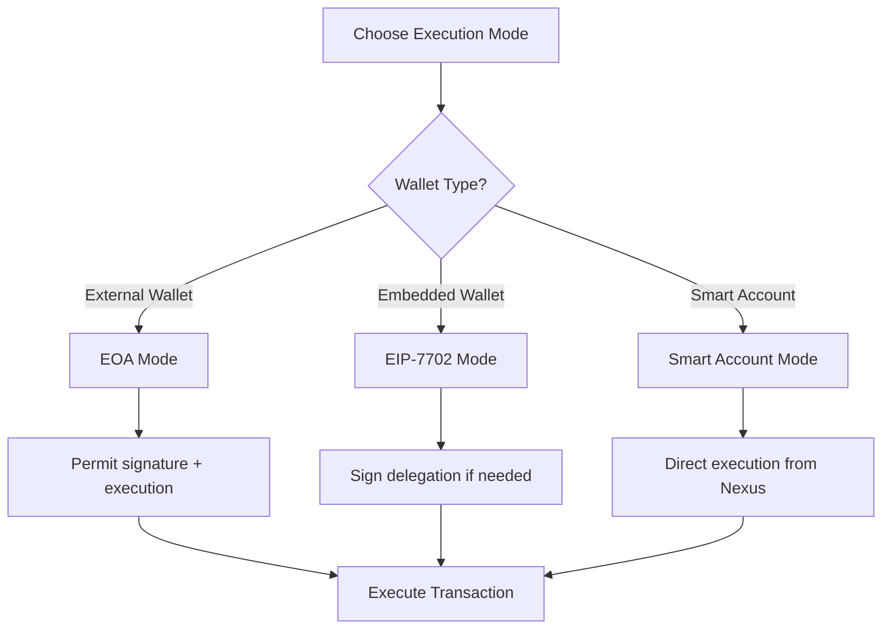

# Build CCIP token bridge instructions
Source: https://docs.biconomy.io/api-reference/instructions/build-ccip-token-bridge-instructions

supertransaction-api/openapi.yaml post /v1/instructions/build-ccip
Build CCIP token bridge instructions for your supertransaction


# Build Hyperliquid deposit instructions
Source: https://docs.biconomy.io/api-reference/instructions/build-hyperliquid-deposit-instructions

supertransaction-api/openapi.yaml post /v1/instructions/hyperliquid/deposit
Build instructions for depositing USDC from Arbitrum to Hyperliquid


# Get orchestrator addresses
Source: https://docs.biconomy.io/api-reference/mee/get-orchestrator-addresses

supertransaction-api/openapi.yaml post /v1/mee/orchestrator
Get orchestrator addresses for the specified owner on requested chains


# Compose instructions and generate a quote
Source: https://docs.biconomy.io/api-reference/root/compose-instructions-and-generate-a-quote

supertransaction-api/openapi.yaml post /v1/quote
Compose instructions and retrieve a MEE quote in a single request.


# Submit the supertransaction for execution
Source: https://docs.biconomy.io/api-reference/root/submit-the-supertransaction-for-execution

supertransaction-api/openapi.yaml post /v1/execute
Submit the signed supertransaction quote for the execution where multichain composable and async execution happens via MEE nodes


# Contracts & Audits
Source: https://docs.biconomy.io/contracts-and-audits/index

Verified smart contract addresses and security audit reports for MEE protocol

<Note>
  Always verify contract addresses from official sources before interacting with them
</Note>

## Contract Suite

Biconomy is versioning our smart contracts by groups. One "Suite" version contains many different versioned contracts
within itself.

The contracts being versioned are:

* Nexus Account
* Modular Execution Environment (MEE) K1 Validator (ERC-7579 Module)
* Nexus Boostrap & Factory
* Composability & Fusion Utils (Composable Storage, ETH Forwarder)

## Versions

<Accordion title="MEE Contracts Suite v2.2.1 (latest)">
  <Info>
    **What's New:**

    * New composability version - enables native token runtime injection
    * Sign EIP-712 Data Struct instead of blind Stx hash for the `smart-account` mode
    * New ERC-7702 Nexus accounts can be initialized via relayers
    * Gas optimizations
  </Info>

  ### Nexus & MEE Validator

  | Contract Name               | Contract Address                             |
  | --------------------------- | -------------------------------------------- |
  | Nexus Implementation v1.3.1 | `0x0000000020fe2F30453074aD916eDeB653eC7E9D` |
  | MEE K1 Validator v1.1.0     | `0x0000000002d3cC5642A748B6783F32C032616E03` |
  | Nexus Bootstrap v1.3.0      | `0x000000007BfEdA33ac982cb38eAaEf5D7bCC954c` |
  | Nexus Account Factory       | `0x000000002c9A405a196f2dc766F2476B731693c3` |

  ### Composability & Utility

  | Contract Name                | Contract Address                             |
  | ---------------------------- | -------------------------------------------- |
  | Comoposable Execution Module | `0x00000000f61636C0CA71d21a004318502283aB2d` |
  | Composable Storage           | `0x0000000078994c6ef6A4596BE53A728b255352c2` |
  | ETH Forwarder                | `0x000000C48Cdf2b46bEc062483dBD27046dfE3b8d` |
</Accordion>

<Accordion title="MEE Contracts Suite v2.1.0 (Current Default)">
  <Info>
    **What's New:** K1 MEE module introduced - enables ERC-7702-delegated EOAs to own Nexus accounts
  </Info>

  ### Nexus & MEE Validator

  | Contract Name               | Contract Address                             |
  | --------------------------- | -------------------------------------------- |
  | Nexus Implementation v1.2.0 | `0x00000000383e8cBe298514674Ea60Ee1d1de50ac` |
  | MEE K1 Validator v1.0.3     | `0x0000000031ef4155C978d48a8A7d4EDba03b04fE` |
  | Nexus Bootstrap v1.2.1      | `0x0000003eDf18913c01cBc482C978bBD3D6E8ffA3` |
  | Nexus Account Factory       | `0x0000006648ED9B2B842552BE63Af870bC74af837` |

  ### Composability & Utility

  | Contract Name      | Contract Address                             |
  | ------------------ | -------------------------------------------- |
  | Composable Storage | `0x0000000671eb337E12fe5dB0e788F32e1D71B183` |
  | ETH Forwarder      | `0x000000Afe527A978Ecb761008Af475cfF04132a1` |
</Accordion>

<Accordion title="MEE Contracts Suite v2.0.0">
  <Info>
    Major release with Nexus 1.2.0, ERC-7702 support, and native composability
  </Info>

  ### Nexus & MEE

  | Contract Name               | Contract Address                             |
  | --------------------------- | -------------------------------------------- |
  | Nexus Implementation v1.2.0 | `0x000000004F43C49e93C970E84001853a70923B03` |
  | MEE K1 Validator v1.0.1     | `0x00000000d12897DDAdC2044614A9677B191A2d95` |
  | Nexus Bootstrap v1.2.1      | `0x00000000D3254452a909E4eeD47455Af7E27C289` |
  | Nexus Account Factory       | `0x000000001D1D5004a02bAfAb9de2D6CE5b7B13de` |
  | MEE EntryPoint & Paymaster  | `0xE854C84cD68fC434cB3B0042c29235D452cAD977` |

  ### Composability & Utility

  | Contract Name      | Contract Address                             |
  | ------------------ | -------------------------------------------- |
  | Composable Storage | `0x0000000671eb337E12fe5dB0e788F32e1D71B183` |
  | ETH Forwarder      | `0x000000Afe527A978Ecb761008Af475cfF04132a1` |
</Accordion>

<Accordion title="MEE Contracts Suite v2.0.0 Pre-cancun">
  <Info>
    Compiled for **EVM Paris** (No PUSH0, no MCOPY, no TSTORE)
  </Info>

  ### Nexus & MEE

  | Contract Name               | Contract Address                             |
  | --------------------------- | -------------------------------------------- |
  | Nexus Implementation v1.0.2 | `0x000000001964d23C59962Fc7A912872EE8fB3b6A` |
  | MEE K1 Validator v1.0.3     | `0x00000000E894100bEcFc7c934Ab7aC8FBA08A44c` |
  | Nexus Bootstrap v1.0.0      | `0x000000c4781Be3349F81d341027fd7A4EdFa4Dd2` |
  | Nexus Account Factory       | `0x0000000C8B6b3329cEa5d15C9d8C15F1f254ec3C` |

  ### Composability & Utility

  | Contract Name        | Contract Address                             |
  | -------------------- | -------------------------------------------- |
  | Composability Module | `0x000000eff5C221A6bdB12381868307c9Db5eB462` |
  | Composable Storage   | `0x0000002C2A3b6DA7dfa38AAcdD950097B30B108d` |
  | ETH Forwarder        | `0x000000001f1c68bD5bF69aa1cCc1d429700D41Da` |
</Accordion>

<Accordion title="MEE Contracts Suite v1.0.1">
  <Info>
    Added Nexus Account Factory at `0x000000903887EA36EBe051038287f49fD4A07733`
  </Info>
</Accordion>

<Accordion title="MEE Contracts Suite v1.0.0">
  <Info>
    Initial release - Requires manual installation of MEE K1 validator and Composability module
  </Info>

  [GitHub Release →](https://github.com/bcnmy/nexus/releases/tag/v1.0.2)

  ### Nexus & MEE

  | Contract Name               | Contract Address                             |
  | --------------------------- | -------------------------------------------- |
  | Nexus Implementation v1.0.2 | `0x000000aC74357BFEa72BBD0781833631F732cf19` |
  | MEE K1 Validator v1.0.1     | `0x00000000d12897DDAdC2044614A9677B191A2d95` |
  | Nexus Bootstrap v1.0.0      | `0x879fa30248eeb693dcCE3eA94a743622170a3658` |
  | Nexus Account Factory       | `0x000000c3A93d2c5E02Cb053AC675665b1c4217F9` |
  | MEE EntryPoint & Paymaster  | `0xE854C84cD68fC434cB3B0042c29235D452cAD977` |

  ### Composability & Utility

  | Contract Name        | Contract Address                             |
  | -------------------- | -------------------------------------------- |
  | Composability Module | `0x00000004430bB055dB66eBef6Fe5Ee1DA9668B10` |
  | Composable Storage   | `0x0000000671eb337E12fe5dB0e788F32e1D71B183` |
  | ETH Forwarder        | `0x000000Afe527A978Ecb761008Af475cfF04132a1` |
</Accordion>

### Nexus Audits

<CardGroup cols={4}>
  <Card title="Cyfrin" icon="shield" href="https://github.com/bcnmy/nexus/blob/main/audits/CodeHawks-Cyfrin-Competition-170924.pdf">
    Competition Audit
  </Card>

  <Card title="Spearbit" icon="shield">
    * [Core audit](https://github.com/bcnmy/nexus/blob/main/audits/report-cantinacode-biconomy-0708-updated.pdf)
    * [ERC-7739](https://github.com/bcnmy/nexus/blob/main/audits/report-cantinacode-biconomy-erc7739-addon-final.pdf)
  </Card>

  <Card title="Zenith" icon="shield" href="https://github.com/bcnmy/nexus/blob/main/audits/Biconomy-Nexus_Zenith-Audit-Report.pdf">
    Full Review
  </Card>

  <Card title="Pashov" icon="shield" href="https://github.com/bcnmy/nexus/blob/main/audits/Nexus-Pashov-Review_2025-03.pdf">
    2025 Review
  </Card>
</CardGroup>

### MEE Stack Audits

<CardGroup cols={2}>
  <Card title="MEE Stack" icon="layer-group" href="https://github.com/bcnmy/mee-contracts/tree/main/audit">
    **Audited by Zenith**

    * MEE EntryPoint
    * Node Paymaster
    * MEEK1 Validator
  </Card>

  <Card title="Composability Stack" icon="puzzle">
    **Multiple Auditors**

    * [Zenith Report](https://github.com/bcnmy/composability/blob/main/audits/2025-03-Composability_Zenith-Audit-Report.pdf)
    * [Pashov Report](https://github.com/bcnmy/composability/blob/main/audits/2025-03-Composability-Pashov-Review.pdf)
  </Card>
</CardGroup>

***

## Legacy Contracts

<Warning>
  These contracts are deprecated. Use the latest version for new deployments.
</Warning>

<Accordion title="Nexus v1.0.1 Production">
  | Contract Name        | Contract Address                             |
  | -------------------- | -------------------------------------------- |
  | Nexus Implementation | `0x000000008761E87F023f65c49DC9cb1C7EdFEaaf` |
  | K1 Validator         | `0x0000002D6DB27c52E3C11c1Cf24072004AC75cBa` |
  | K1 Validator Factory | `0x00000024115AA990F0bAE0B6b0D5B8F68b684cd6` |
  | Account Factory      | `0x000000226cada0d8b36034F5D5c06855F59F6F3A` |
  | Bootstrap            | `0x000000F5b753Fdd20C5CA2D7c1210b3Ab1EA5903` |
  | EntryPoint V7        | `0x0000000071727de22e5e9d8baf0edac6f37da032` |
</Accordion>

<Accordion title="Paymaster Contracts">
  ### Base & Optimism

  | Contract Name         | Contract Address                             |
  | --------------------- | -------------------------------------------- |
  | Sponsorship Paymaster | `0x0000006087310897e0BFfcb3f0Ed3704f7146852` |
  | Token Paymaster       | `0x00000000301515A5410e0d768aF4f53c416edf19` |

  ### Other Chains

  | Contract Name         | Contract Address                             |
  | --------------------- | -------------------------------------------- |
  | Sponsorship Paymaster | `0x00000072a5F551D6E80b2f6ad4fB256A27841Bbc` |
  | Token Paymaster       | `0x00000000301515A5410e0d768aF4f53c416edf19` |
</Accordion>

***

<Card title="Integration Support" icon="code" href="/integration">
  Need help integrating these contracts? Check our integration guide for detailed instructions and code examples.
</Card>


# Supported chains
Source: https://docs.biconomy.io/contracts-and-audits/supported-chains

The list of chains that have Biconomy stack deployed with supported versions

## 🚀 MEE Contracts and versions

The Modular Execution Environment (MEE) is Biconomy's Smart Account and Execution infrastructure (which is compliant with and built on ERC 4337) that enables gasless transactions and modular execution flows. Below is a comprehensive list of supported chains and their corresponding MEE versions. On the Biconomy Dashboard, set up a project on the Supertransaction tab, get an API key and you will have full access to all chains with just one API key.

For detailed information about contract addresses and audit reports for each version, please check our [contracts and audits page](https://docs.biconomy.io/contracts-and-audits).

| Network                 | Supported | [MEE version](https://docs.biconomy.io/contracts-and-audits) (includes Biconomy Nexus Smart Account, and Execution infrastructure such as Bundlers and Paymasters) |
| ----------------------- | --------- | ------------------------------------------------------------------------------------------------------------------------------------------------------------------ |
| Ethereum Mainnet        | ✅         | 2.2.1, 2.1.0, 2.0.0, 1.1.0, 1.0.0                                                                                                                                  |
| Ethereum Sepolia        | ✅         | 2.2.1, 2.1.0, 2.0.0, 1.1.0, 1.0.0                                                                                                                                  |
| Base Mainnet            | ✅         | 2.2.1, 2.1.0, 2.0.0, 1.1.0, 1.0.0                                                                                                                                  |
| Base Sepolia            | ✅         | 2.2.1, 2.1.0, 2.0.0, 1.1.0, 1.0.0                                                                                                                                  |
| Polygon Mainnet         | ✅         | 2.2.1, 2.1.0, 2.0.0, 1.1.0, 1.0.0                                                                                                                                  |
| Polygon Amoy Testnet    | ✅         | 2.2.1, 2.1.0, 2.0.0, 1.1.0, 1.0.0                                                                                                                                  |
| Arbitrum Mainnet        | ✅         | 2.2.1, 2.1.0, 2.0.0, 1.1.0, 1.0.0                                                                                                                                  |
| Arbitrum Sepolia        | ✅         | 2.2.1, 2.1.0, 2.0.0, 1.1.0, 1.0.0                                                                                                                                  |
| OP Mainnet              | ✅         | 2.2.1, 2.1.0, 2.0.0, 1.1.0, 1.0.0                                                                                                                                  |
| OP Sepolia Testnet      | ✅         | 2.2.1, 2.1.0, 2.0.0, 1.1.0, 1.0.0                                                                                                                                  |
| BSC Mainnet             | ✅         | 2.2.1, 2.1.0, 2.0.0, 1.1.0, 1.0.0                                                                                                                                  |
| BSC Testnet             | ✅         | 2.2.1, 2.1.0, 2.0.0, 1.1.0, 1.0.0                                                                                                                                  |
| Sonic Mainnet           | ✅         | 2.2.1, 2.1.0, 2.0.0, 1.1.0, 1.0.0                                                                                                                                  |
| Sonic Testnet           | ✅         | 2.2.1, 2.1.0                                                                                                                                                       |
| Scroll Mainnet          | ✅         | 2.2.1, 2.1.0, 2.0.0, 1.1.0, 1.0.0                                                                                                                                  |
| Scroll Sepolia Testnet  | ✅         | 2.2.1, 2.1.0, 2.0.0, 1.1.0, 1.0.0                                                                                                                                  |
| Gnosis Mainnet          | ✅         | 2.2.1, 2.1.0, 2.0.0, 1.1.0, 1.0.0                                                                                                                                  |
| Gnosis Chiado Testnet   | ✅         | 2.2.1, 2.1.0, 2.0.0, 1.1.0, 1.0.0                                                                                                                                  |
| Avalanche Mainnet       | ✅         | 2.2.1, 2.1.0, 2.0.0, 1.1.0                                                                                                                                         |
| Avalanche Fuji Testnet  | ✅         | 2.2.1, 2.1.0, 2.0.0, 1.1.0                                                                                                                                         |
| Apechain                | ✅         | 2.2.1, 2.1.0, 2.0.0, 1.1.0                                                                                                                                         |
| Apechain Curtis Testnet | ✅         | 2.2.1, 2.1.0, 2.0.0, 1.1.0                                                                                                                                         |
| Hyper EVM               | ✅         | 2.2.1, 2.1.0, 2.0.0, 1.1.0                                                                                                                                         |
| Core DAO Testnet        | ✅         | 2.2.1, 2.1.0, 2.0.0, 1.1.0                                                                                                                                         |
| Neura Testnet           | ✅         | 2.2.1, 2.1.0, 1.1.0                                                                                                                                                |
| Sei Mainnet             | ✅         | 2.2.1, 2.1.0, 2.0.0, 1.1.0                                                                                                                                         |
| Sei Testnet             | ✅         | 2.2.1, 2.1.0, 2.0.0, 1.1.0                                                                                                                                         |
| Unichain Mainnet        | ✅         | 2.2.1, 2.1.0, 1.1.0                                                                                                                                                |
| Unichain Testnet        | ✅         | 2.2.1, 2.1.0, 1.1.0                                                                                                                                                |
| Katana Mainnet          | ✅         | 2.2.1, 2.1.0, 1.1.0                                                                                                                                                |
| Lisk Mainnet            | ✅         | 2.2.1, 2.1.0, 1.1.0                                                                                                                                                |
| Worldchain Mainnet      | ✅         | 2.2.1, 2.1.0, 1.1.0                                                                                                                                                |
| Worldchain Testnet      | ✅         | 2.2.1, 2.1.0, 1.1.0                                                                                                                                                |
| Fluent Testnet          | ✅         | 2.1.0, 1.1.0                                                                                                                                                       |
| Chiliz Spicy Testnet    | ✅         | 2.0.0 Pre-cancun                                                                                                                                                   |
| Monad Mainnet           | ✅         | 2.2.1, 2.1.0                                                                                                                                                       |
| Monad Testnet           | ✅         | 2.2.1, 2.1.0                                                                                                                                                       |
| Plasma Mainnet          | ✅         | 2.2.1, 2.1.0                                                                                                                                                       |
| Plasma Testnet          | ✅         | 2.2.1, 2.1.0                                                                                                                                                       |
| Arc Testnet             | ✅         | 2.2.1, 2.1.0                                                                                                                                                       |
| Sophon Zk Testnet       | ✅         | 2.2.1, 2.1.0                                                                                                                                                       |

***

## 🔧 ERC-4337 Infra Support

#### EntryPoint v0.7.0 – Nexus Smart Account (v1.0.2)

> Please note, we are not suppporting new chains with this infrastructure. Any new chains we support will utilise our newer and advanced MEE stack, and thus the newer chain support are added to the above MEE Contracts and Services list.
>
> If you are a new developer, or starting a new project to find the chains we support, do not reference this list.

<Info>
  Why did we move to MEE in favour of ERC 4337? You can learn more [here](https://docs.biconomy.io/new/learn-about-biconomy/mee-vs-4337).
</Info>

| Network                     | Bundler | Sponsorship PM | Token PM | Sponsorship PM Contract | Token PM Contract | Nexus Version |
| --------------------------- | ------- | -------------- | -------- | ----------------------- | ----------------- | ------------- |
| Ethereum Mainnet            | ✅       | ✅              | ✅        | ✅                       | ✅                 | ✅ (v1.0.2)    |
| Ethereum Sepolia            | ✅       | ✅              | ✅        | ✅                       | ✅                 | ✅ (v1.0.2)    |
| Base Mainnet                | ✅       | ✅              | ✅        | ✅                       | ✅                 | ✅ (v1.0.2)    |
| Base Sepolia                | ✅       | ✅              | ✅        | ✅                       | ✅                 | ✅ (v1.0.2)    |
| OP Mainnet                  | ✅       | ✅              | ✅        | ✅                       | ✅                 | ✅ (v1.0.2)    |
| OP Sepolia Testnet          | ✅       | ✅              | ✅        | ✅                       | ✅                 | ✅ (v1.0.2)    |
| Scroll Mainnet              | ✅       | ✅              | ✅        | ✅                       | ✅                 | ✅ (v1.0.2)    |
| Scroll Sepolia Testnet      | ✅       | ✅              | ✅        | ✅                       | ✅                 | ✅ (v1.0.2)    |
| Arbitrum Mainnet            | ✅       | ✅              | ✅        | ✅                       | ✅                 | ✅ (v1.0.2)    |
| Arbitrum Sepolia Testnet    | ✅       | ✅              | ✅        | ✅                       | ✅                 | ✅ (v1.0.2)    |
| Binance Smart Chain Mainnet | ✅       | ✅              | ✅        | ✅                       | ✅                 | ✅ (v1.0.2)    |
| Binance Smart Chain Testnet | ✅       | ✅              | ✅        | ✅                       | ✅                 | ✅ (v1.0.2)    |
| Polygon Mainnet             | ✅       | ✅              | ✅        | ✅                       | ✅                 | ✅ (v1.0.2)    |
| Polygon Amoy Testnet        | ✅       | ✅              | ❌        | ✅                       | ❌                 | ✅ (v1.0.2)    |
| Gnosis Mainnet              | ✅       | ✅              | ✅        | ✅                       | ✅                 | ✅ (v1.0.2)    |
| Gnosis Chiado Testnet       | ✅       | ✅              | ❌        | ✅                       | ❌                 | ✅ (v1.0.2)    |
| Sonic Mainnet               | ✅       | ✅              | ✅        | ✅                       | ✅                 | ✅ (v1.0.2)    |
| Sonic Blaze Testnet         | ✅       | ✅              | ❌        | ✅                       | ❌                 | ✅ (v1.0.2)    |
| Blast Mainnet               | ✅       | ✅              | ✅        | ✅                       | ✅                 | ✅ (v1.0.2)    |
| Blast Sepolia               | ✅       | ✅              | ❌        | ✅                       | ❌                 | ✅ (v1.0.2)    |
| IOTA Mainnet                | ⏳       | ⏳              | ⏳        | ✅                       | ✅                 | ✅ (v1.0.2)    |
| Monad Testnet               | ✅       | ✅              | ❌        | ✅                       | ❌                 | ✅ (v1.0.2)    |
| Soneium Mainnet             | ✅       | ✅              | ❌        | ✅                       | ✅                 | ✅ (v1.0.2)    |
| Soneium Testnet             | ✅       | ✅              | ❌        | ✅                       | ❌                 | ✅ (v1.0.2)    |

#### Sponsorship Paymaster Contracts:

* Base & OP: [0x0000006087310897e0BFfcb3f0Ed3704f7146852](https://contractscan.xyz/contract/0x0000006087310897e0BFfcb3f0Ed3704f7146852)
* Other chains: [0x00000072a5F551D6E80b2f6ad4fB256A27841Bbc](https://contractscan.xyz/contract/0x00000072a5F551D6E80b2f6ad4fB256A27841Bbc)

***

### ⚙️ EntryPoint v0.6.0 – V2 Smart Accounts

| Network            | Testnet | Mainnet |
| ------------------ | ------- | ------- |
| Ethereum           | ✅       | ✅       |
| Polygon            | ✅       | ✅       |
| BSC                | ✅       | ✅       |
| Polygon zkEVM      | ✅       | ✅       |
| Arbitrum One       | ✅       | ✅       |
| Arbitrum Nova      | ✅       | ✅       |
| Optimism (Sepolia) | ✅       | ✅       |
| Avalanche          | ✅       | ✅       |
| Base               | ✅       | ✅       |
| Linea              | ✅       | ✅       |
| Chiliz             | ✅       | ✅       |
| Astar              | ✅       | ✅       |
| opBNB              | ✅       | ✅       |
| Manta              | ✅       | ✅       |
| Core               | ✅       | ✅       |
| Combo              | ✅       | ✅       |
| Mantle (Sepolia)   | ✅       | ✅       |
| Blast              | ✅       | ✅       |
| Zeroone            | ✅       | ✅       |
| Scroll             | ✅       | ✅       |
| Zetachain          | ✅       | ✅       |
| Gnosis             | ✅       | ✅       |
| X Layer            | ✅       | ✅       |
| Tangle             | ✅       | ✅       |
| Taiko              |         | ✅       |
| Morph              | ✅       | ✅       |
| Sei (Devnet)       | ✅       | ✅       |
| Boba               | ✅       | ✅       |
| 5irechain          | ✅       | ✅       |
| Metal L2           | ✅       | ✅       |
| Lisk               | ✅       | ✅       |

***


# Biconomy Introduction
Source: https://docs.biconomy.io/index

Welcome to the documentation for Biconomy - the infrastructure powering seamless Web3 experiences at scale. 

## Products

<CardGroup>
  <Card title="Supertransaction API" icon="globe" href="/supertransaction-api">
    Build and gaslessly execute DeFi and Stablecoin workflows which span multiple chains through simple API Calls.

    No custom contract interactions, deployments or audits. Ship in minutes.
  </Card>

  <Card title="AbstractJS SDK" icon="code" href="/new/getting-started/getting-started">
    The most comprehensive account and chain abstraction SDK on the market.

    Use if you need fine-grained control over the execution of your single and multi
    chain flows.
  </Card>

  <Card title="Nexus Smart Account" icon="wallet" href="/new/learn-about-biconomy/nexus">
    Gas-efficient, secure and modular smart account solution with 4M+ deployed accounts.
  </Card>
</CardGroup>

## Proven at Scale

Biconomy has established itself as the trusted infrastructure choice for Web3, with impressive metrics that speak to our reliability:

* **70+ Million** transactions processed
* **4.5+ Million** smart accounts deployed
* **10+ Million** total users served
* **\$3+ Billion** in transaction volume

It's the only single-vendor full-stack solution on the market, offering

* Smart Account (Nexus)
* Account & Chain Abstraction SDK (AbstractJS)
* DeFi & Stablecoin API (Supertransaction API)


# Self-Hosted Sponsorship
Source: https://docs.biconomy.io/new/advanced/self-hosted-sponsorship


# Self Hosted Sponsorships

The self-hosted sponsorship feature allows you to operate your own backend service to sponsor gas fees on multiple chains. This is ideal for teams that want full control over sponsorship logic, authentication, and rate limits.

We’ve provided a ready-to-use starter kit to help you get started:

<Info>
  **Starter Kit**

  You can fork the starter kit project to get a quick start on implementing your own sponsorship service

  [mee-self-hosted-sponsorship-starter-kit](https://github.com/bcnmy/mee-self-hosted-sponsorship-starter-kit/tree/main)
</Info>

## 🤔 Why Use Self-Hosted Sponsorship?

Self-hosting gives you:

* **Programmable Control:** Define custom logic to determine **when**, and **under what conditions** users are eligible for gas sponsorship.
* **Full Key Ownership:** Manage your own private keys for gas tanks and service accounts.
* **On-Premise Hosting:** Deploy the sponsorship backend in your own secure environment—no dependency on third-party infrastructure.

This is particularly useful for enterprise use cases, partner platforms, or gated dApps requiring more than a one-size-fits-all sponsorship logic.

## 🏗️ Architecture Overview

There are two main components where you'll use the AbstractJS SDK:

1. **Frontend/App Integration** – Use the SDK within your application to connect to your sponsorship backend when sending supertransactions.
2. **Backend Implementation** – Use the SDK in your self-hosted backend to manage gas tank accounts, check balances, deploy contracts, and fulfill sponsorship logic.

<Info>
  Your backend can be written in **any language**. The AbstractJS SDK is provided as a convenience layer, but what really matters is that your backend exposes the correct HTTP API endpoints as defined in the [starter kit](https://github.com/bcnmy/mee-self-hosted-sponsorship-starter-kit/tree/main).
</Info>

## 🎒 Sponsorship Backend API Reference

In order for MEE sponsorships to work, your backend should expose the following HTTP endpoints:

### `GET /v1/sponsorship/info`

Returns available gas tanks and their balances.

### `GET /v1/sponsorship/nonce/:chainId/:gasTankAddress`

Returns the current nonce and nonce key for a given gas tank.

### `GET /v1/sponsorship/receipt/:chainId/:hash`

Returns the transaction receipt for a sponsorship transaction.

### `POST /v1/sponsorship/sign/:chainId/:gasTankAddress`

Signs a sponsorship quote using a specific gas tank account.

* **Body:** `GetQuotePayload` as defined in AbstractJS.
* Perform project-specific logic here (e.g., rate limits, auth).

## ⌨️ Using Self-Hosted Sponsorship in AbstractJS

To integrate your own backend, pass `sponsorshipOptions` when calling `getFusionQuote`. Your backend should expose a compatible API to fetch sponsorship data.

### ⚙️ Configuration

* `url`: URL of your sponsorship backend
* `customHeaders`: Optional custom headers (e.g. for authentication)
* `gasTank`: Configuration for the gas tank account

### 💡 Example

```ts  theme={null}
const meeClient = await createMeeClient({
  account: mcNexus,
  apiKey: "YOUR_MEE_API_KEY"
})

const quote = await meeClient.getFusionQuote({
  trigger: {
    tokenAddress: testnetMcUSDC.addressOn(baseSepolia.id),
    chainId: baseSepolia.id,
    amount: 1n
  },
  sponsorship: true,
  sponsorshipOptions: {
    url: "https://your-backend.com/sponsorship",
    customHeaders: {
      sponsorshipApiKey: "your-api-key",
      otherHeader: "custom-value"
    },
    gasTank: {
      address: "0xC2461985dE59CcA97eBAcBBF1eDBe904ea859c84",
      token: "0x036cbd53842c5426634e7929541ec2318f3dcf7e",
      chainId: baseSepolia.id
    }
  },
  instructions: [
    {
      calls: [
        {
          to: eoaAccount.address,
          value: 1n
        }
      ],
      chainId: baseSepolia.id
    }
  ]
})

const { hash } = await meeClient.executeFusionQuote({ fusionQuote: quote })
const { transactionStatus } = await meeClient.waitForSupertransactionReceipt({ hash })
```

## ⛽️ Utilities for Sponsorship Gas Tanks

The following utility functions are primarily intended for backend developers managing a gas tank account.

### Create a Gas Tank Account

```ts  theme={null}
const gasTankAccount = await toGasTankAccount({
  chainConfiguration: {
    chain: baseSepolia,
    transport: http(),
    version: getMEEVersion(MEEVersion.V2_1_0)
  },
  privateKey: "YOUR_PRIVATE_KEY",
  options: {
    mee: {
      apiKey: "mee_3ZLvzYAmZa89WLGa3gmMH8JJ"
    }
  }
})
```

### Get Gas Tank Address

```ts  theme={null}
const { address: gasTankAddress } = await gasTankAccount.getAddress()
```

### Get Gas Tank Balance

```ts  theme={null}
const { balance, decimals } = await gasTankAccount.getBalance({
  tokenAddress: testnetMcUSDC.addressOn(baseSepolia.id)
})
```

### Check Deployment Status

```ts  theme={null}
const isDeployed = await gasTankAccount.isDeployed()
```

### Deploy and Fund Gas Tank

```ts  theme={null}
const { isDeployed, address } = await gasTankAccount.deploy({
  tokenAddress: testnetMcUSDC.addressOn(chain.id),
  amount: parseUnits("0.1", 6)
})
```

### Withdraw Funds

```ts  theme={null}
await gasTankAccount.withdraw({
  tokenAddress: testnetMcUSDC.addressOn(baseSepolia.id),
  recipient: eoaAccount.address,
  amount: runtimeERC20BalanceOf({
    targetAddress: gasTankAddress,
    tokenAddress: testnetMcUSDC.addressOn(baseSepolia.id)
  }),
  confirmations: 3
})
```


# Move DeFi Positions With One Signature
Source: https://docs.biconomy.io/new/examples/move-positions

Enable one-click DeFi position migration across protocols with atomic execution and runtime balance resolution

## Overview

Your users are earning yield on other DeFi protocols when they discover better rates on your protocol. Simple enough for them to move, right? In practice, position migration involves coordination challenges that often aren't worth the effort for your users.

Consider this scenario: your users are earning yield on another protocol and find better rates on yours. They have four options:

<CardGroup cols={2}>
  <Card title="Multiple manual transactions" icon="hand-dots">
    Withdraw, approve, deposit - each step requiring signatures and gas fees
  </Card>

  <Card title="Custom migration contracts" icon="code">
    Rarely built due to development complexity, audit costs, and smart contract risk
  </Card>

  <Card title="Accept the status quo" icon="pause">
    Stay put because the migration effort outweighs the benefit
  </Card>

  <Card title="Risk manual operations at scale" icon="triangle-exclamation">
    For funds managing large positions, manual multi-step processes create operational risk and require careful coordination
  </Card>
</CardGroup>

When your users scale this across chains or more complex positions, most simply don't migrate despite better opportunities on your protocol. For larger funds, the operational risk of manual coordination becomes a significant concern that keeps them locked in suboptimal positions elsewhere.

<Note>
  Biconomy Move changes this entirely. Your users can move positions from any DeFi protocols to yours with a single signature. They click once. Everything happens atomically. What required careful multi-step coordination now happens seamlessly.
</Note>

## What is Move?

Move is a feature that allows your DeFi positions to simply migrate anywhere you want, in a single operation. It solves the fundamental coordination problem that makes protocol migration so painful today.

### Use Cases

<CardGroup cols={2}>
  <Card title="Lending positions" icon="chart-line">
    Find higher yield opportunities
  </Card>

  <Card title="Borrow positions" icon="percent">
    Find cheaper borrow rates
  </Card>

  <Card title="Version migration" icon="code-branch">
    Moving between versions e.g. Moving between Aave V3 to Aave V4
  </Card>

  <Card title="Expiring positions" icon="clock">
    Moving your expiring Pendle position to a new one
  </Card>
</CardGroup>

## How Move Works

Move makes the problems associated with migrating any DeFi position a thing of the past. Instead of managing complex multi-step processes manually, users trigger intelligent migration flows that handle all the complexity automatically.

### Fusion Mode Integration

<Info>
  Works with any wallet (MetaMask, Rabby, etc.) through Biconomy's Fusion Mode - no special wallet software required.
</Info>

## Key Capabilities

### 1. Atomic Cross-Protocol Operations

Your entire position moves in one coordinated flow:

```
withdraw(entire Aave position) → approve(exact amount) → deposit(exact amount to Venus)
```

### 2. Runtime Amount Resolution

Instead of guessing balances, Move uses exact amounts at execution time:

```javascript  theme={null}
// Not this: withdraw(1.5 ETH) // Hope that's still your balance!
// But this: withdraw(runtimeBalance(aTokens)) // Exact amount including accrued interest
```

### 3. Gasless Execution

Optional gas sponsorship means users can migrate positions without holding ETH. Pay with the tokens you're already moving.

### 4. Graceful Failure Handling & Atomic Execution

If any step fails, automatic cleanup ensures funds return safely to your wallet. No partial states, no stuck funds.

<Note>
  If you're moving positions on a single chain — all execution is done atomically.
</Note>

## Example: AAVE to Venus Migration

This example demonstrates a complete migration from AAVE to Venus Protocol using Move's composable orchestration:

<Steps>
  <Step title="Transfer Accrued Interest">
    ```javascript  theme={null}
    const transferInterest = await nexusAccount.buildComposable({
      type: 'transferFrom',
      data: {
        recipient: nexusAccountAddress,  // Companion Account address
        sender: accountAddress,          // User's EOA
        tokenAddress: position.aTokenAddress,
        amount: runtimeERC20BalanceOf({
          targetAddress: accountAddress,
          tokenAddress: position.aTokenAddress,
          constraints: [greaterThanOrEqualTo(100n)],
        }),
        chainId,
        gasLimit: 100000n,
      },
    });
    ```
  </Step>

  <Step title="Withdraw Entire AAVE Position">
    ```javascript  theme={null}
    const withdrawFromAave = await nexusAccount.buildComposable({
      type: 'default',
      data: {
        to: aaveV3PoolContractAddress,
        abi: aaveV3PoolAbi,
        functionName: 'withdraw',
        args: [
          position.tokenAddress,        // Asset to withdraw
          MAX_UINT256.toFixed(),       // Amount (MAX = entire position)
          nexusAccountAddress,         // Recipient
        ],
        chainId,
        gasLimit: 100000n,
      },
    });
    ```
  </Step>

  <Step title="Approve Venus to Spend Tokens">
    ```javascript  theme={null}
    const approveVenus = await nexusAccount.buildComposable({
      type: 'approve',
      data: {
        tokenAddress: position.tokenAddress,
        spender: vToken.address,
        amount: runtimeERC20BalanceOf({
          targetAddress: nexusAccountAddress,
          tokenAddress: position.tokenAddress,
          constraints: [greaterThanOrEqualTo(100n)],
        }),
        chainId,
        gasLimit: 100000n,
      },
    });
    ```
  </Step>

  <Step title="Mint vTokens on Venus">
    ```javascript  theme={null}
    const mintVTokens = await nexusAccount.buildComposable({
      type: 'default',
      data: {
        to: vToken.address,
        abi: vBep20Abi,
        functionName: 'mintBehalf',
        args: [
          accountAddress,  // Mint on behalf of user's EOA
          runtimeERC20BalanceOf({
            targetAddress: nexusAccountAddress,
            tokenAddress: position.tokenAddress,
            constraints: [greaterThanOrEqualTo(100n)],
          }),
        ],
        chainId,
        gasLimit: 100000n,
      },
    });
    ```
  </Step>
</Steps>

### Creating the Fusion Quote

```javascript  theme={null}
// Buffer the approval amount to account for interest accrual
const approvalAmount = buffer({
  amountMantissa: position.userATokenBalanceWithInterestsMantissa,
});

const fusionQuote = await meeClient.getFusionQuote({
  trigger: {
    chainId,
    tokenAddress: position.aTokenAddress,
    amount: position.userATokenBalanceMantissa,
    approvalAmount,  // Buffered amount
    gasLimit: 500000n,
  },
  instructions: [
    transferInterest,
    withdrawFromAave,
    approveVenus,
    mintVTokens
  ],
  sponsorship: true,  // Enable gasless execution
});
```

### Key Features Demonstrated

<CardGroup cols={2}>
  <Card title="Runtime Balance Resolution" icon="clock-rotate-left">
    Uses `runtimeERC20BalanceOf` to capture exact amounts at execution time
  </Card>

  <Card title="Atomic Execution" icon="lock">
    All operations succeed together or fail together with automatic cleanup
  </Card>

  <Card title="Buffer Strategy" icon="shield">
    Accounts for interest accrual between signing and execution
  </Card>

  <Card title="Gasless Execution" icon="gas-pump">
    Optional gas sponsorship for seamless user experience
  </Card>

  <Card title="Fusion Mode" icon="wallet">
    Works with any external wallet through Companion Account mechanism
  </Card>
</CardGroup>

## Summary

Think of Move as replacing the entire manual coordination of DeFi position movements with an automated system that understands protocol dependencies, timing, and user safety.


# Single Signature Approve + Execute
Source: https://docs.biconomy.io/new/examples/single-sig-approve-execute


This example demonstrates a flow where the user uses a single signature from their
EOA wallet to execute `approve` + `execute` instructions.

```ts  theme={null}
import { 
  aave, 
  createMeeClient, 
  getMeeScanLink, 
  toMultichainNexusAccount, 
  type Trigger, 
  getMEEVersion, 
  MEEVersion 
} from "@biconomy/abstractjs";
import { erc20Abi, http, parseAbi, parseUnits, type Hex } from "viem";
import { privateKeyToAccount } from "viem/accounts";
import { base, optimism } from "viem/chains";

const eoa = privateKeyToAccount(Bun.env.PRIVATE_KEY as Hex)

const orchestrator = await toMultichainNexusAccount({
  signer: eoa,
  chainConfigurations: [
    {
      chain: optimism,
      transport: http(),
      version: getMEEVersion(MEEVersion.V2_1_0)
    },
    {
      chain: base,
      transport: http(),
      version: getMEEVersion(MEEVersion.V2_1_0)
    }
  ]
})

const meeClient = await createMeeClient({
  account: orchestrator
})

const amount = parseUnits('10', 6)
const aaveV3 = '0xUniswap'

const usdc = '0xUSDC'

const approve = await orchestrator.buildComposable({
  type: 'default',
  data: {
    abi: erc20Abi,
    chainId: optimism.id,
    to: usdc,
    functionName: 'approve',
    args: [
      aaveV3,
      amount
    ]
  }
})

const aaveV3Abi = parseAbi([
  'function supply(address asset, uint256 amount, address onBehalfOf, uint16 referralCode) external'
]);

const supply = await orchestrator.buildComposable({
  type: 'default',
  data: {
    abi: aaveV3Abi,
    to: aaveV3,
    chainId: optimism.id,
    functionName: 'supply',
    args: [
      usdc,
      amount,
      eoa.address,
      0n
    ]
  }
})

const trigger: Trigger = {
  chainId: optimism.id,
  tokenAddress: usdc,
  amount: amount
}

const fusionQuote = await meeClient.getFusionQuote({
  instructions: [approve, supply],
  trigger: trigger,
  feeToken: {
    address: usdc,
    chainId: optimism.id
  }
})

const { hash } = await meeClient.executeFusionQuote({
  fusionQuote
})

console.log(`MEEScan Link: ${getMeeScanLink(hash)}`)

const receipt = await meeClient.waitForSupertransactionReceipt({ hash })
```


# Execute Composable Batch Calls
Source: https://docs.biconomy.io/new/getting-started/composable-batch-execute


This tutorial demonstrates how to execute a **fully gas-abstracted, multi-step transaction** on Base using one user signature. No bridging. No leftover tokens. Just one-click UX with **gas paid in USDC** and a guarantee that either **all instructions succeed or none do**.

Unlike regular batch execute, composable batch execution allows developers to use the output of one function call as the input for the next one. To learn more, read the [Runtime Parameter Injection](/new/getting-started/understanding-runtime-injection) guide.

<Tip>
  **Single Chain**: This guide covers single-chain batch execution. The Biconomy stack supports multi-chain batch execution with a single signature as well. Follow [this guide](/new/getting-started/orchestrate-transactions-across-chains) to learn how.
</Tip>

<Info>
  **Using EIP-7702**: This guide focuses on atomic execution from External Wallets though the usage of *Fusion Execution*. If you're working with Embedded Wallets - adapt the `toMultichainNexusAccount`, `.getQuote` and `.execute` steps to work with EIP-7702. [Follow the EIP-7702 guide here](/new/getting-started/enable-mee-eoa-7702)
</Info>

## Why Should You Care?

* **No ETH required** for gas — everything is paid in USDC.
* **Lower dropoff** in multi-step flows — users only sign once.
* **Eliminates complexity** — no frontend juggling approvals, swaps, and deposits.
* **Business win**: better UX, fewer support issues, and higher conversion.
* **Full support**: Works for all EOA users, including regular MetaMask, Rabby, Trust, etc...

<Steps>
  <Step title="Setup">
    Import all the required dependencies.

    ```ts  theme={null}
    import {
      createMeeClient,
      toMultichainNexusAccount,
      UniswapSwapRouterAbi,
      getMeeScanLink,
      runtimeERC20BalanceOf,
      greaterThanOrEqualTo,
      getMEEVersion,
      MEEVersion
    } from "@biconomy/abstractjs";

    import { http, parseUnits } from "viem";
    import { privateKeyToAccount } from "viem/accounts";
    import { base, optimism } from "viem/chains";
    import { balanceNotZeroConstraint } from "../utils/balanceNotZero.util";
    ```
  </Step>

  <Step title="Create an Orchestrator">
    An orchestrator is a smart account owned by the user. All instructions are executed on top of this account.

    ```ts  theme={null}
    const eoa = privateKeyToAccount(Bun.env.PRIVATE_KEY as `0x${string}`);

    const orchestrator = await toMultichainNexusAccount({
      chainConfigurations: [
        {
          chain: optimism,
          transport: http(),
          version: getMEEVersion(MEEVersion.V2_1_0)
        },
        {
          chain: base,
          transport: http(),
          version: getMEEVersion(MEEVersion.V2_1_0)
        }
      ],
      signer: eoa,
    });
    ```

    <Info>
      **What is Nexus?** Nexus is the engine behind composable orchestration and gasless execution. It's the most gas efficient smart account system.
    </Info>
  </Step>

  <Step title="Connect to the Modular Execution Environment (MEE)">
    Gasless multichain orchestration is enabled by connecting to the Modular Execution Environment. This is a trustless, globally distributed network of Relayer nodes executing instructions on top of smart accounts.

    ```ts  theme={null}
    const meeClient = await createMeeClient({ account: orchestrator });
    ```
  </Step>

  <Step title="Declare Constants">
    These are the contract addresses we'll need for this tutorial.

    ```ts  theme={null}
    const UNISWAP_ROUTER_BASE = "0x2626664c2603336E57B271c5C0b26F421741e481";
    const USDC_BASE           = "0x833589fCD6eDb6E08f4c7C32D4f71b54bdA02913";
    const WETH_BASE           = "0x4200000000000000000000000000000000000006";
    const MORPHO_RE7_POOL     = "0xA2Cac0023a4797b4729Db94783405189a4203AFc";

    // Change to be whatever you want the input to be.
    const inputAmount = parseUnits("10", 6);
    ```
  </Step>

  <Step title="Build Instructions">
    ### Approve Uniswap

    This will encode an `ERC-20` `approve` function which approves the Uniswap contract to spend USDC.

    ```ts  theme={null}
    const approveUniswap = await orchestrator.buildComposable({
      type: "approve",
      data: {
        spender: UNISWAP_ROUTER_BASE,
        tokenAddress: USDC_BASE,
        chainId: base.id,
        amount: inputAmount,
      },
    });
    ```

    <Info>
      **Helper Function**: This is a helper. You can always encode it manually with `type: "default"` and `erc20Abi` if needed.
    </Info>

    ### Swap USDC → WETH (Runtime Injection)

    Using the `.buildComposable` helper, we are encoding a call to the `exactInputSingle` function on the Uniswap contract. This will swap USDC for WETH.

    Note the use of `runtimeERC20BalanceOf` in the `amountIn` field of the call. This means that we're not predetermining the amount being swapped - we'll use whatever is available on the orchestrator account.

    ```ts  theme={null}
    const swapUSDCtoWeth = await orchestrator.buildComposable({
      type: "default",
      data: {
        chainId: base.id,
        abi: UniswapSwapRouterAbi,
        to: UNISWAP_ROUTER_BASE,
        functionName: "exactInputSingle",
        args: [{
          tokenIn:  USDC_BASE,
          amountIn: runtimeERC20BalanceOf({
            tokenAddress: USDC_BASE,
            targetAddress: orchestrator.addressOn(base.id, true),
            constraints: [balanceNotZeroConstraint],
          }),
          tokenOut: WETH_BASE,
          recipient: orchestrator.addressOn(base.id, true),
          fee: 100,
          amountOutMinimum: 0n,
          sqrtPriceLimitX96: 0n,
        }],
      },
    });
    ```

    <Note>
      **Runtime injection** lets you defer the exact amount to use until **execution time** — crucial when the actual balance isn't known upfront.
    </Note>

    ### Approve Morpho

    This instruction approves Morpho to spend WETH. Again, note the usage of `runtimeERC20BalanceOf` function. Since we don't know how much exactly we'll get from a swap on Uniswap due to slippage - we're working with runtime values.

    Another thing to note is the `constraints` field. It defines the minimum amount of WETH on the account before the orchestration will proceed with the approve instruction.

    ```ts  theme={null}
    const approveMorpho = await orchestrator.buildComposable({
      type: "approve",
      data: {
        spender: MORPHO_RE7_POOL,
        chainId: base.id,
        tokenAddress: WETH_BASE,
        amount: runtimeERC20BalanceOf({
          tokenAddress: WETH_BASE,
          targetAddress: orchestrator.addressOn(base.id, true),
          constraints: [ balanceNotZeroConstraint ],
        }),
      },
    });
    ```

    ### Deposit WETH into Morpho

    Deposit WETH to Morpho. Ordering for this function call depends on two factors:

    * `balanceNotZeroConstraint` defines that the instruction can't be executed until the swap has happened
    * **Implicit Ordering** works here as well. The orchestrator will wait until the approval has been set

    ```ts  theme={null}
    const supplyWeth = await orchestrator.buildComposable({
      type: "default",
      data: {
        abi: [{
          name: "deposit",
          inputs: [
            { name: "assets",   type: "uint256" },
            { name: "receiver", type: "address" },
          ],
          stateMutability: "nonpayable",
          type: "function",
        }],
        to: MORPHO_RE7_POOL,
        chainId: base.id,
        functionName: "deposit",
        args: [
          runtimeERC20BalanceOf({
            tokenAddress: WETH_BASE,
            targetAddress: orchestrator.addressOn(base.id, true),
            constraints: [balanceNotZeroConstraint],
          }),
          orchestrator.addressOn(base.id, true),
        ],
      },
    });
    ```
  </Step>

  <Step title="Quote & Execute (Fusion)">
    ### Create the Fusion trigger

    In order for the orchestrator account to "pull" the funds for orchestration, we must give it an approval to do so. This is done by the `trigger` param. It tells the orchestrator which token on which chain and which amount to approve.

    [Read more about triggers](/new/getting-started/enable-mee-eoa-users#fusion-mode-orchestration-external-wallets)

    ```ts  theme={null}
    const trigger: Trigger = {
      chainId: base.id,
      tokenAddress: USDC_BASE,
      amount: inputAmount,
    };
    ```

    ### Quote the cost

    ```ts  theme={null}
    const quote = await meeClient.getFusionQuote({
      trigger,
      feeToken: { address: USDC_BASE, chainId: base.id },
      instructions: [approveUniswap, swapUSDCtoWeth, approveMorpho, supplyWeth],
    });
    ```

    ### Execute the flow

    ```ts  theme={null}
    const { hash } = await meeClient.executeFusionQuote({ fusionQuote: quote });
    console.log(`Explorer: ${getMeeScanLink(hash)}`);
    ```
  </Step>

  <Step title="Confirm Atomic Completion">
    ```ts  theme={null}
    const receipt = await meeClient.waitForSupertransactionReceipt({ hash });
    console.log("Batch complete:", receipt);
    ```

    All instructions succeed, or none are processed. Fully atomic.
  </Step>
</Steps>

## Checklist Before Production

<Card>
  <ul>
    <li>Replace `amountOutMinimum: 0n` with real slippage.</li>
    <li>Dial in `gasLimit`s to optimize quotes.</li>
    <li>Add cleanup `transfer` if leftover tokens aren't desired.</li>
    <li>Monitor quote accuracy vs. actual gas used.</li>
  </ul>
</Card>

Enjoy full-chain composability!


# Conditional Execution
Source: https://docs.biconomy.io/new/getting-started/conditional-execution


Attach runtime conditions to any composable transaction. Transactions wait until conditions are met before execution - enabling limit orders, price-based triggers, and safe conditional operations.

## Why Use Conditional Execution?

<Warning>
  **Traditional approach**: Execute immediately and hope conditions are met, or build complex smart contracts
</Warning>

<Check>
  **With conditions**: Transactions wait intelligently until requirements are satisfied, then execute automatically
</Check>

### Key Benefits

* **Smart waiting** - Transactions stay PENDING until conditions are met (limit orders, price triggers, etc.)
* **User protection** - Only execute when safe (sufficient balance, healthy positions, etc.)
* **MEV protection** - Check price slippage before swaps execute
* **Gas efficient** - Avoid failed transactions by verifying conditions first
* **Works everywhere** - Compatible with ALL instruction types (transfer, approve, default, etc.)
* **Type-safe** - Full TypeScript support with ABI inference

### Common Use Cases

* **Limit orders** - Wait for price to reach target level before executing
* **Balance-triggered actions** - Execute when funds arrive from bridges or swaps
* **Safety checks** - Verify contract state (not paused) before execution
* **DeFi safeguards** - Ensure healthy positions before borrowing or withdrawing
* **Slippage protection** - Only execute swaps at acceptable prices

## Quick Start

<Steps>
  <Step title="Install the SDK">
    ```bash  theme={null}
    npm install @biconomy/abstractjs@latest viem
    ```
  </Step>

  <Step title="Create a Condition">
    ```typescript  theme={null}
    import { createCondition, ConditionType } from '@biconomy/abstractjs'
    import { erc20Abi, parseUnits } from 'viem'

    // Only execute if balance >= 100 USDC
    const minBalanceCondition = createCondition({
      targetContract: usdcAddress,
      functionAbi: erc20Abi,
      functionName: 'balanceOf',
      args: [userAddress],
      value: parseUnits('100', 6), // 100 USDC (6 decimals)
      type: ConditionType.GTE,
      description: 'Minimum balance: 100 USDC'
    })
    ```
  </Step>

  <Step title="Add to Any Instruction">
    ```typescript  theme={null}
    const instructions = await mcAccount.buildComposable({
      type: 'transfer',
      data: {
        tokenAddress: usdcAddress,
        recipient: recipientAddress,
        amount: transferAmount,
        chainId: base.id,
        conditions: [minBalanceCondition] // ✅ Add here
      }
    })
    ```
  </Step>

  <Step title="Execute">
    ```typescript  theme={null}
    const quote = await meeClient.getQuote({
      instructions,
      feeToken: { chainId: base.id, address: usdcAddress }
    })

    const { hash } = await meeClient.executeQuote({ quote })
    // Transaction waits (PENDING) until condition is met
    // Then executes automatically when balance >= 100 USDC
    ```
  </Step>
</Steps>

## How It Works

Conditions leverage the composability system's STATIC\_CALL mechanism with intelligent waiting:

```
User Submits Transaction with Conditions
    ↓
MEE checks: Condition 1 (STATIC_CALL) → Check constraint
    ↓
   Pass? → Continue
   Fail? → Transaction enters PENDING state
    ↓
MEE periodically rechecks conditions
    ↓
All conditions pass? → Execute main function
    ↓
Success!
```

**Two execution paths:**

1. **Immediate execution** - All conditions pass → Transaction executes immediately
2. **Waiting mode** - Conditions not met → Transaction stays PENDING, MEE periodically rechecks until conditions pass or timeout expires

<Info>
  **Under the hood**: Each condition becomes an InputParam that calls a view/pure function and validates the result against your constraint (GTE, LTE, or EQ). MEE simulates execution periodically, and once simulation succeeds (all conditions pass), the transaction executes onchain.
</Info>

## API Reference

### createCondition

Create a condition that must be satisfied for execution.

```typescript  theme={null}
createCondition({
  targetContract: Address        // Contract to call
  functionAbi: Abi              // ABI containing the function
  functionName: string          // View/pure function name
  args: Array<any>              // Function arguments (type-safe)
  value: bigint                 // Threshold or expected value
  type: ConditionType           // GTE, LTE, or EQ
  description?: string          // Optional description
})
```

### ConditionType

```typescript  theme={null}
enum ConditionType {
  GTE = "gte",  // Greater than or equal to (≥)
  LTE = "lte",  // Less than or equal to (≤)
  EQ = "eq"     // Equal to (=)
}
```

**Examples:**

```typescript  theme={null}
// Balance must be at least 1000 tokens
type: ConditionType.GTE,
value: parseUnits('1000', 18)

// Health factor must not exceed 2.0
type: ConditionType.LTE,
value: parseUnits('2.0', 18)

// Contract must be in ACTIVE state (enum value 2)
type: ConditionType.EQ,
value: 2n
```

## Common Patterns

### Minimum Balance Check

```typescript  theme={null}
const minBalance = parseUnits('50', 6) // 50 USDC

const instructions = await mcAccount.buildComposable({
  type: 'transfer',
  data: {
    tokenAddress: usdcAddress,
    recipient: recipientAddress,
    amount: runtimeERC20BalanceOf({
      targetAddress: senderAddress,
      tokenAddress: usdcAddress
    }),
    chainId: base.id,
    conditions: [
      createCondition({
        targetContract: usdcAddress,
        functionAbi: erc20Abi,
        functionName: 'balanceOf',
        args: [senderAddress],
        value: minBalance,
        type: ConditionType.GTE,
        description: 'Sender must have at least 50 USDC'
      })
    ]
  }
})
```

### Contract Not Paused

```typescript  theme={null}
const pausableAbi = [
  {
    inputs: [],
    name: 'paused',
    outputs: [{ name: '', type: 'bool' }],
    stateMutability: 'view',
    type: 'function'
  }
] as const

const instructions = await mcAccount.buildComposable({
  type: 'default',
  data: {
    to: protocolAddress,
    abi: protocolAbi,
    functionName: 'stake',
    args: [stakeAmount],
    chainId: base.id,
    conditions: [
      createCondition({
        targetContract: protocolAddress,
        functionAbi: pausableAbi,
        functionName: 'paused',
        args: [],
        value: 0n, // False = 0
        type: ConditionType.EQ,
        description: 'Protocol must not be paused'
      })
    ]
  }
})
```

### Multiple Conditions (AND Logic)

All conditions must pass for execution.

```typescript  theme={null}
const instructions = await mcAccount.buildComposable({
  type: 'default',
  data: {
    to: lendingProtocolAddress,
    abi: lendingProtocolAbi,
    functionName: 'borrow',
    args: [borrowParams],
    chainId: base.id,
    conditions: [
      // Condition 1: Sufficient collateral
      createCondition({
        targetContract: collateralTokenAddress,
        functionAbi: erc20Abi,
        functionName: 'balanceOf',
        args: [userAddress],
        value: minCollateralAmount,
        type: ConditionType.GTE
      }),

      // Condition 2: Healthy position
      createCondition({
        targetContract: lendingProtocolAddress,
        functionAbi: lendingProtocolAbi,
        functionName: 'getHealthFactor',
        args: [userAddress],
        value: parseUnits('1.5', 18),
        type: ConditionType.GTE
      }),

      // Condition 3: Protocol not paused
      createCondition({
        targetContract: lendingProtocolAddress,
        functionAbi: lendingProtocolAbi,
        functionName: 'isPaused',
        args: [],
        value: 0n,
        type: ConditionType.EQ
      })
    ]
  }
})
```

<Note>
  **All conditions must pass** - The transaction waits (PENDING) until all conditions are satisfied, or fails if timeout expires.
</Note>

<Accordion title="Limit Orders (Wait for Price)">
  Create a limit order that waits for a price target.

  ```typescript  theme={null}
  const uniswapPoolAbi = [
    {
      inputs: [],
      name: 'slot0',
      outputs: [
        { name: 'sqrtPriceX96', type: 'uint160' },
        { name: 'tick', type: 'int24' },
        // ... other fields
      ],
      stateMutability: 'view',
      type: 'function'
    }
  ] as const

  // Target price: swap only when price >= targetSqrtPriceX96
  const targetPrice = calculateSqrtPriceX96(targetPriceRatio)

  const instructions = await mcAccount.buildComposable({
    type: 'default',
    data: {
      to: uniswapRouterAddress,
      abi: uniswapRouterAbi,
      functionName: 'exactInputSingle',
      args: [swapParams],
      chainId: base.id,
      conditions: [
        createCondition({
          targetContract: poolAddress,
          functionAbi: uniswapPoolAbi,
          functionName: 'slot0',
          args: [],
          value: targetPrice,
          type: ConditionType.GTE, // Wait until price >= target
          description: 'Limit order: execute when price reaches target'
        })
      ]
    }
  })

  // Use getFusionQuote with upperBoundTimestamp to enable waiting
  const fusionQuote = await meeClient.getFusionQuote({
    trigger: { chainId: base.id, tokenAddress: usdcAddress, amount: inputAmount },
    instructions,
    feeToken: { chainId: base.id, address: usdcAddress },
    upperBoundTimestamp: Math.floor(Date.now() / 1000) + 86400 // Wait up to 24 hours
  })

  const { hash } = await meeClient.executeFusionQuote({ fusionQuote })
  // Transaction waits until price reaches target, then executes automatically
  ```
</Accordion>

<Accordion title="MEV Protection">
  Check current price before executing swaps.

  ```typescript  theme={null}
  const uniswapPoolAbi = [
    {
      inputs: [],
      name: 'slot0',
      outputs: [
        { name: 'sqrtPriceX96', type: 'uint160' },
        { name: 'tick', type: 'int24' },
        // ... other fields
      ],
      stateMutability: 'view',
      type: 'function'
    }
  ] as const

  // Calculate acceptable price range
  const currentPrice = await getSpotPrice(poolAddress)
  const maxAcceptablePrice = currentPrice * 101n / 100n // 1% slippage

  const instructions = await mcAccount.buildComposable({
    type: 'default',
    data: {
      to: uniswapRouterAddress,
      abi: uniswapRouterAbi,
      functionName: 'exactInputSingle',
      args: [swapParams],
      chainId: base.id,
      conditions: [
        createCondition({
          targetContract: poolAddress,
          functionAbi: uniswapPoolAbi,
          functionName: 'slot0',
          args: [],
          value: maxAcceptablePrice,
          type: ConditionType.LTE,
          description: 'Price slippage protection'
        })
      ]
    }
  })
  ```
</Accordion>

## Waiting for Conditions

When conditions aren't immediately met, MEE keeps the transaction in PENDING state and periodically checks until conditions pass.

```typescript  theme={null}
const minBalanceRequired = parseUnits('100', 6)

const instructions = await mcAccount.buildComposable({
  type: 'transfer',
  data: {
    tokenAddress: usdcAddress,
    recipient: recipientAddress,
    amount: transferAmount,
    chainId: base.id,
    conditions: [
      createCondition({
        targetContract: usdcAddress,
        functionAbi: erc20Abi,
        functionName: 'balanceOf',
        args: [senderAddress],
        value: minBalanceRequired,
        type: ConditionType.GTE
      })
    ]
  }
})

// Execute with timeout
const fusionQuote = await meeClient.getFusionQuote({
  trigger: { chainId: base.id, tokenAddress: usdcAddress, amount: triggerAmount },
  instructions,
  feeToken: { chainId: base.id, address: usdcAddress },
  upperBoundTimestamp: Math.floor(Date.now() / 1000) + 300 // Wait up to 5 min
})

const { hash } = await meeClient.executeFusionQuote({ fusionQuote })

// Transaction stays PENDING until condition is met
const { transactionStatus } = await meeClient.waitForSupertransactionReceipt({ hash })
```

**Lifecycle:**

1. Submit transaction with conditions
2. **PENDING** - MEE periodically checks conditions
3. **Condition satisfied** - Transaction executes automatically
4. **MINED\_SUCCESS** - Complete

<Info>
  If conditions aren't met within the timeout period, the transaction will eventually FAIL.
</Info>

## Best Practices

### 1. Always Add Descriptions

```typescript  theme={null}
// ✅ Good
createCondition({
  targetContract: usdcAddress,
  functionAbi: erc20Abi,
  functionName: 'balanceOf',
  args: [userAddress],
  value: parseUnits('100', 6),
  type: ConditionType.GTE,
  description: 'User must have at least 100 USDC' // ✅ Clear
})
```

### 2. Use Type-Safe ABIs

```typescript  theme={null}
// ✅ Good - Type-safe
const erc20Abi = [
  {
    inputs: [{ name: 'account', type: 'address' }],
    name: 'balanceOf',
    outputs: [{ name: '', type: 'uint256' }],
    stateMutability: 'view',
    type: 'function'
  }
] as const // ✅ 'as const' for type inference
```

### 3. Limit Number of Conditions

Each condition adds \~5,000-10,000 gas:

* ✅ **1-3 conditions** - Optimal
* ⚠️ **4-5 conditions** - Acceptable if necessary
* ❌ **6+ conditions** - Consider refactoring

### 4. Order by Likelihood of Failure

Place most likely to fail conditions first:

```typescript  theme={null}
conditions: [
  createCondition({ /* paused check - most likely to fail */ }),
  createCondition({ /* balance check */ }),
  createCondition({ /* complex calculation - expensive */ })
]
```

### 5. Handle Decimal Precision

```typescript  theme={null}
// ❌ Wrong - USDC has 6 decimals
value: parseUnits('100', 18)

// ✅ Correct
value: parseUnits('100', 6)
```

### 6. Use Appropriate Constraint Types

```typescript  theme={null}
// ✅ Use EQ for booleans
createCondition({
  functionName: 'paused',
  value: 0n, // false
  type: ConditionType.EQ
})

// ✅ Use GTE for minimum thresholds
createCondition({
  functionName: 'balanceOf',
  value: 1000n,
  type: ConditionType.GTE // At least 1000
})

// ✅ Use LTE for maximum limits
createCondition({
  functionName: 'getHealthFactor',
  value: parseUnits('10', 18),
  type: ConditionType.LTE // At most 10.0
})
```

## Troubleshooting

### Condition Always Fails

**Problem:** Condition consistently reverts.

**Solutions:**

* Verify decimal precision matches token (USDC = 6, WETH = 18)
* Check constraint type is correct (GTE vs LTE vs EQ)
* Test the view function directly to see actual return value
* Ensure target contract address is correct

```typescript  theme={null}
// ❌ Wrong - USDC uses 6 decimals
value: parseUnits('100', 18)

// ✅ Correct
value: parseUnits('100', 6)
```

### Transaction Stuck in PENDING

**Problem:** Transaction never executes.

**Solutions:**

* Check if condition can realistically be met
* Verify correct contract address
* Set reasonable `upperBoundTimestamp`
* Test condition function returns expected value

```typescript  theme={null}
// Add reasonable timeout
upperBoundTimestamp: Math.floor(Date.now() / 1000) + 300 // 5 minutes
```

### Type Errors with ABI

**Problem:** TypeScript complains about function name or args.

**Solutions:**

* Ensure ABI is defined with `as const`
* Check function exists in ABI
* Verify args match function signature

```typescript  theme={null}
// ✅ Correct - ABI with 'as const'
const myAbi = [
  {
    inputs: [{ name: 'account', type: 'address' }],
    name: 'balanceOf',
    outputs: [{ name: '', type: 'uint256' }],
    stateMutability: 'view',
    type: 'function'
  }
] as const // ✅ Important!
```

### Gas Estimation Fails

**Problem:** Transaction simulation fails.

**Solutions:**

* Simplify conditions or reduce count
* Verify view functions can be called successfully
* Check contract addresses are correct
* Ensure function is truly view/pure (no state changes)

## Summary

Conditional execution adds powerful runtime validation to your transactions:

* ✅ Use `createCondition()` to define conditions
* ✅ Add to any `buildComposable` call via `conditions` array
* ✅ All conditions must pass for execution
* ✅ Transactions wait intelligently until conditions are met
* ✅ Perfect for limit orders, price triggers, and safe execution
* ✅ Works with all instruction types

<Tip>
  Start with simple balance checks, then expand to limit orders and complex validations.
</Tip>


# MEE + EIP-7702 (Embedded Wallets)
Source: https://docs.biconomy.io/new/getting-started/enable-mee-eoa-7702


EIP-7702 enables smart account features to be directly installed on an EOA. This allows orchestration without the user needing to fund or interact with a separate smart account.

<Warning>
  **Only Available on Some Wallets**: As of now, installing the authorization on the EOA is only available for users of Embedded Wallets - such as Privy, Dynamic, Turnkey, ... If your users are using External wallets, such as MetaMask, Rabby, etc... - then you need to use the [Fusion Mode](/new/getting-started/enable-mee-eoa-fusion)
</Warning>

<Steps>
  <Step title="Set Up Wallet Client">
    ```ts  theme={null}
    import { createWalletClient, http } from "viem";
    import { privateKeyToAccount } from "viem/accounts";

    const eoa = privateKeyToAccount(Bun.env.PRIVATE_KEY as `0x${string}`);

    const walletClient = createWalletClient({
      transport: http(),
    });
    ```
  </Step>

  <Step title="Sign Authorization">
    ```ts  theme={null}
    const nexus120Singleton = '0x000000004F43C49e93C970E84001853a70923B03';

    const authorization = await walletClient.signAuthorization({
      account: eoa,
      contractAddress: nexus120Singleton,

      // Chain ID 0 makes it valid across all chains
      chainId: 0, 

      // Use nonce 0 for fresh embedded wallet accounts
      nonce: 0    
    });
    ```

    <Warning>
      **Note for Embedded Wallets**: Privy, Dynamic, and other embedded wallets may expose their own `signAuthorization()` helper with the same parameters. In that case you can't use the `viem` `signAuthorization` method as it'll throw an error. Our docs have integration guides for every type of embedded wallet. You can follow them.
    </Warning>
  </Step>

  <Step title="Initialize Nexus Account">
    ```ts  theme={null}
    import { toMultichainNexusAccount, getMEEVersion, MEEVersion } from "@biconomy/abstractjs";
    import { base, optimism } from "viem/chains";
    import { http } from "viem";

    const orchestrator = await toMultichainNexusAccount({
      chainConfigurations: [
        {
          chain: optimism,
          transport: http(),
          version: getMEEVersion(MEEVersion.V2_1_0),
          // Must be overridden when using EIP-7702
          accountAddress: eoa.address 
        },
        {
          chain: base,
          transport: http(),
          version: getMEEVersion(MEEVersion.V2_1_0),
          // Must be overridden when using EIP-7702
          accountAddress: eoa.address 
        }
      ],
      signer: eoa
    });
    ```
  </Step>

  <Step title="Connect to MEE Relayer">
    ```ts  theme={null}
    import { createMeeClient } from "@biconomy/abstractjs";

    const meeClient = await createMeeClient({
      account: orchestrator
    });
    ```
  </Step>

  <Step title="Quote Orchestration">
    ```ts  theme={null}
    import { zeroAddress } from "viem";
    import { usdcAddresses } from "../utils/addresses/usdc.addresses";

    const quote = await meeClient.getQuote({
      instructions: [{
        calls: [{
          to: zeroAddress,
          value: 0n
        }],
        chainId: optimism.id
      }],

      // Must be set for EIP-7702-based orchestration
      delegate: true,          
      
      // Can be passed manually or signed by the SDK
      authorization,          

      feeToken: {
        address: usdcAddresses[base.id],
        chainId: base.id
      },
    });

    console.log(quote.paymentInfo.tokenAmount);
    ```

    <Info>
      **Passing Authorizations**: We recommend passing authorizations manually as it gives you more control over signing for different chains and wallet providers. However, if you'd just like our SDK to automatically prompt users to sign authorizations, you can omit the `authorizations` field and just set `delegate: true`
    </Info>
  </Step>

  <Step title="Execute Orchestration">
    ```ts  theme={null}
    const { hash } = await meeClient.executeQuote({ quote });

    const receipt = await meeClient.waitForSupertransactionReceipt({ hash });
    ```
  </Step>
</Steps>

## Notes

* `delegate: true` is **mandatory**.
* `authorization` must be passed. You can pass it manually (recommended) or allow the SDK to prompt the user to sign.
* `accountAddress` must be **explicitly overridden** to the EOA address to signal EIP-7702 usage.
* The Nexus smart account logic will be executed directly on the EOA address.


# MEE + Fusion (External Wallets)
Source: https://docs.biconomy.io/new/getting-started/enable-mee-eoa-fusion


External wallets, such as MetaMask or Rabby, do not permit direct installation of smart account logic on EOAs. To enable MEE orchestration in this case, **Fusion Mode** is used. It relies on a passthrough mechanism involving a Companion smart account and a signed **trigger transaction**.


<Note>
  We recommend understanding Fusion Execution before executing code, but if you'd like to skip the theory - [read the code guide](/new/getting-started/pay-gas-erc20-token#-2-fusion-mode-used-with-external-wallets)
</Note>

## Fusion Mode Flow

<Steps>
  <Step title="Trigger Signature">
    The user signs a *trigger transaction* that includes the hash of all orchestration instructions. This signature authorizes the full orchestration with a single user action.
  </Step>

  <Step title="Funds Transferred to Companion Account">
    Funds are temporarily pulled into a *Companion Account* fully owned by the user. This account is non-custodial and stateless—no funds are stored there beyond execution.
  </Step>

  <Step title="Instruction Execution">
    All instructions (e.g., swaps, bridges, multicalls) are executed using the Companion Account.
  </Step>

  <Step title="Return to EOA">
    Resulting assets are sent back to the user's EOA. The Companion Account is left clean with no dust.
  </Step>

  <Step title="Optional Cleanup">
    If an orchestration step fails—especially in multichain setups—a cleanup can revert intermediate steps, returning funds or rebalancing tokens.
  </Step>
</Steps>

Fusion Mode allows orchestrated execution even without embedded wallet features, enabling advanced UX with any external wallet.

## Trigger Types

There are two kinds of Fusion triggers. They depend on which type of token you are using as the input token.

If you're working with tokens which support `ERC20Permit` then you can use the `ERC20Permit` trigger type, which makes the entire orchestration gasless. Otherwise, you must use the `Onchain Tx` trigger, which requires a bit of gas on source chain to execute the `approve` ERC20 transaction.

<Table>
  <thead>
    <tr>
      <th>Trigger Type</th>
      <th>How it Works</th>
      <th>Gas Required</th>
      <th>Token Support</th>
    </tr>
  </thead>

  <tbody>
    <tr>
      <td>**ERC20Permit**</td>
      <td>Uses ERC-2612 signature to permit spending. Orchestration hash is packed into the `deadline` field.</td>
      <td>No</td>
      <td>Only ERC-2612 tokens</td>
    </tr>

    <tr>
      <td>**Onchain Tx**</td>
      <td>Any EVM transaction that includes orchestration instructions. Most often an `approve()` call.</td>
      <td>Yes</td>
      <td>All token types</td>
    </tr>
  </tbody>
</Table>

The SDK will detect whether a token supports ERC-2612 and choose the appropriate trigger type.

## Fusion Constraints

* Can **only consume one token per user signature**.
* Token used for execution must also be used to pay for gas.
* **Transaction sponsorship** is possible and bypasses the gas requirement.

## Fusion Flow

1. **Trigger**: User signs a transaction (e.g. `approve`) that signals orchestration.
2. **Orchestrate**: MEE nodes execute function calls, bridges, or other logic.
3. **Return**: Final steps return assets to the user's EOA.

<Info>
  **Stateless UX**: Users never need to know about the orchestrator account. All resulting tokens return to the user's EOA automatically.
</Info>


# Enable MEE for EOA Users
Source: https://docs.biconomy.io/new/getting-started/enable-mee-eoa-users


Biconomy MEE supports native Externally Owned Accounts (EOAs) through two orchestration methods:

* **EIP-7702 Delegation** (embedded wallets only)
* **Fusion Mode** (external wallets)

## Wallet Type Support

Wallet compatibility depends on how much control the wallet exposes over the EOA.

* **Embedded wallets** (e.g. Privy, Dynamic, Magic) allow developers to install smart account logic directly on the user's EOA address using EIP-7702.

* **External wallets** (e.g. MetaMask, Rabby, Trust) block apps from changing code on user EOAs for security reasons. These require Fusion mode.

<Table>
  <thead>
    <tr>
      <th>Wallet Type</th>
      <th>EIP-7702 Support</th>
      <th>Requires Trigger</th>
      <th>Fusion Mode</th>
    </tr>
  </thead>

  <tbody>
    <tr>
      <td>Privy, Dynamic, Turnkey</td>
      <td>Yes</td>
      <td>No</td>
      <td>Optional</td>
    </tr>

    <tr>
      <td>MetaMask, Rabby</td>
      <td>No</td>
      <td>Yes</td>
      <td>Required</td>
    </tr>
  </tbody>
</Table>

<Info>
  **Choosing Between EIP-7702 and Fusion**: Use **EIP-7702** if your embedded wallet supports smart account installation on EOAs. Use **Fusion Mode** for external wallets where smart account delegation isn't possible.
</Info>

<CardGroup cols={2}>
  <Card title="EIP-7702 Tutorial" icon="code" href="/new/getting-started/enable-mee-eoa-7702">
    For Embedded Wallets
  </Card>

  <Card title="Fusion Tutorial" icon="link" href="/new/getting-started/enable-mee-eoa-fusion">
    For External/Extension Wallets
  </Card>
</CardGroup>

## Summary: When to Use Which

<Table>
  <thead>
    <tr>
      <th>Feature</th>
      <th>EIP-7702</th>
      <th>Fusion Mode</th>
    </tr>
  </thead>

  <tbody>
    <tr>
      <td>Wallet Type</td>
      <td>Embedded (Privy, Dynamic)</td>
      <td>External (MetaMask, Rabby)</td>
    </tr>

    <tr>
      <td>Trigger Required</td>
      <td>No</td>
      <td>Yes (`approve`, `permit`) required</td>
    </tr>

    <tr>
      <td>Direct Smart Account on EOA</td>
      <td>Yes</td>
      <td>No</td>
    </tr>

    <tr>
      <td>Sponsorship Support</td>
      <td>Yes</td>
      <td>Yes</td>
    </tr>

    <tr>
      <td>Requires Native Gas</td>
      <td>No (if sponsored)</td>
      <td>Sometimes</td>
    </tr>

    <tr>
      <td>Token Limit per Signature</td>
      <td>Multiple allowed</td>
      <td>Single-token only</td>
    </tr>

    <tr>
      <td>Authorization Requirements</td>
      <td>`delegate: true` and `authorization` required</td>
      <td>Not applicable</td>
    </tr>
  </tbody>
</Table>


# Getting Started
Source: https://docs.biconomy.io/new/getting-started/getting-started


<CardGroup cols={2}>
  <Card title="Basic Functionality Guide" icon="play" href="/new/getting-started/pay-gas-erc20-token">
    Learn how to execute single-chain (or multi-chain) batch transactions while paying for gas in ERC-20 tokens.
  </Card>

  <Card title="Composable Orchestration Guide" icon="puzzle-piece" href="/new/getting-started/composable-batch-execute">
    Execute composable batch calls where the input of one function depends on the output of the previous one.
  </Card>

  <Card title="Sponsorships Guide" icon="gift" href="/new/getting-started/sponsor-gas-for-users">
    Sponsor gas for your users using a single gas tank across all chains.
  </Card>

  <Card title="Integration Guides" icon="plug" href="#integration-guides">
    Connect with popular signers, bridges, and solvers.
  </Card>
</CardGroup>

## Composable Orchestration

Composable orchestration allows you to combine function calls, bridges and solvers into a single-signature cross-chain flow.

<CardGroup cols={2}>
  <Card title="Single-Chain Composability" icon="link" href="/new/getting-started/composable-batch-execute">
    Execute composable batch calls on a single chain
  </Card>

  <Card title="Cross-Chain Composability" icon="globe" href="/new/getting-started/orchestrate-transactions-across-chains">
    Orchestrate transactions across multiple chains
  </Card>
</CardGroup>

## Integration Guides

### Signers

<CardGroup cols={3}>
  <Card title="Privy" icon="key" href="/new/integration-guides/wallets-and-signers/privy">
    Integrate with Privy wallets
  </Card>

  <Card title="Turnkey" icon="key" href="/new/integration-guides/wallets-and-signers/turnkey">
    Integrate with Turnkey infrastructure
  </Card>

  <Card title="Para" icon="key" href="/new/integration-guides/wallets-and-signers/para">
    Integrate with Turnkey infrastructure
  </Card>
</CardGroup>

### Bridges & Solvers

<CardGroup cols={2}>
  <Card title="Across" icon="arrows-rotate" href="/new/integration-guides/bridges-and-solvers/integrate-across">
    Across
  </Card>

  <Card title="LiFi" icon="bridge" href="/new/integration-guides/bridges-and-solvers/integrate-lifi">
    LiFi
  </Card>

  <Card title="Relay" icon="arrows-rotate" href="/new/integration-guides/bridges-and-solvers/integrate-relay">
    Relay
  </Card>
</CardGroup>


# Cleanup if Instruction Fails
Source: https://docs.biconomy.io/new/getting-started/handling-partial-execution


## Handling Cross-Chain Failures Gracefully

In single-chain flows, Supertransaction execution is atomic by default—either all steps succeed or none do.

However, in **cross-chain orchestration**, there is no native atomicity guarantee. For example, a bridge transfer might succeed on the source chain, but fail on the destination chain due to unexpected conditions (e.g. protocol reverts, slippage, gas limits). In such cases, users may be left with partially executed operations and stranded tokens in intermediate smart accounts.

**Cleanup transactions** provide a partial solution to this limitation. By attaching a follow-up userOp to return leftover funds, developers can ensure users regain access to any unspent or unutilized tokens even after a failed orchestration.

This makes cleanup transactions a critical reliability feature for any multi-chain or multi-step workflow. They help preserve user trust, reduce support overhead, and ensure funds are never left behind due to unexpected cross-chain behavior.

## How It Works

1. The SDK builds a `transfer` instruction constrained by `runtimeNonceOf`.
2. Cleanup userOps stay in the mempool until all dependent instructions complete.
3. Once constraints are met, the cleanup executes.

<Info>
  **No execution if nothing to cleanup**: If the runtime balance is 0, the cleanup userOp reverts (harmlessly).
</Info>

## For Fusion Orchestration

[Learn how to set up Fusion Orchestration](/new/getting-started/enable-mee-eoa-fusion)

```ts  theme={null}
const quote = await meeClient.getFusionQuote({
  trigger,
  instructions,
  cleanUps: [
    {
      chainId,
      tokenAddress,
      recipientAddress: eoa.address
    }
  ],
  feeToken: { chainId, address: tokenAddress }
});
```

No `dependsOn` is needed—Fusion batches into a single userOp.

## For EIP-7702 & Native SCA Orchestration

```ts  theme={null}
const quote = await meeClient.getQuote({
  instructions,
  cleanUps: [
    {
      chainId,
      tokenAddress,
      recipientAddress: eoa.address,
      dependsOn: [userOp(2)],
      amount: parseUnits("0.02", 6)
    }
  ],
  feeToken: { chainId, address: tokenAddress }
});
```

* Use `dependsOn` if cleanup must wait for specific instructions.
* Otherwise, it defaults to the last executed instruction.

## Multi-Token Cleanup Example

```ts  theme={null}
cleanUps: [
  {
    tokenAddress: USDT,
    dependsOn: [userOp(1)],
    recipientAddress: eoa
  },
  {
    tokenAddress: USDC,
    dependsOn: [userOp(2)],
    recipientAddress: eoa
  }
];
```

Each cleanup executes independently after its dependency resolves.

## Developer Tips

1. Cleanup userOps **always run last**.
2. In **Fusion**, `dependsOn` is almost never needed.
3. In **Normal** flows, specify `dependsOn` for non-sequential logic or multi-token flows.

These mechanics ensure seamless recovery even in the event of failure mid-orchestration.


# Monitor Execution & Completion
Source: https://docs.biconomy.io/new/getting-started/monitor-execution-completion


After executing a supertransaction with `meeClient.executeQuote(...)`, you need a way to track whether it succeeded. Biconomy MEE provides two main tools to monitor transaction status:

## 1. `waitForSupertransactionReceipt`

This is the **recommended approach** for most use cases.

```ts  theme={null}
const { hash } = await meeClient.executeQuote({ quote });

const receipt = await meeClient.waitForSupertransactionReceipt({
  hash,
  mode: "default",
  confirmations: 2, // optional
});
```

### Parameters

* `hash` (required): The supertransaction hash returned by `executeQuote`
* `confirmations` (optional): How many confirmations to wait for after mining

### When to use

Use this method when you:

* Want a **simple blocking** workflow
* Only proceed after the transaction is complete
* Do **not** need partial updates or background monitoring

### Example

```ts  theme={null}
if (receipt.transactionStatus === "MINED_SUCCESS") {
  console.log("Transaction succeeded!");
} else {
  console.error("Failed:", receipt.transactionStatus);
}
```

## 2. `getSupertransactionReceipt`

This method gives **real-time, snapshot-based access** to the current transaction status.

```ts  theme={null}
const receipt = await meeClient.getSupertransactionReceipt({
  hash,
  mode: "fast-block",
  waitForReceipts: true, // optional
  confirmations: 2, // optional
});
```

### Parameters

* `hash` (required): The supertransaction hash
* `waitForReceipts` (optional, default: true): Wait for receipts before resolving
* `confirmations` (optional): Number of confirmations to wait for

### When to use

Use this method when you:

* Want to **check status in the background**
* Are building your own UI polling or refresh interval
* Don't want to block the app while waiting

### Example

```ts  theme={null}
if (receipt.transactionStatus === "PENDING") {
  console.log("Still waiting...");
} else if (receipt.transactionStatus === "MINED_SUCCESS") {
  console.log("Confirmed on all chains!");
} else {
  console.log("Error or failure:", receipt.transactionStatus);
}
```

You can also inspect individual user operations:

```ts  theme={null}
receipt.userOps.forEach((op) => {
  console.log(`Chain ${op.chainId} status: ${op.executionStatus}`);
});
```

## 3. Supertransaction Wait Mode

<ParamField query="mode" type="string" default="default">
  Transaction confirmation mode. Controls how many confirmations to wait for before returning a response.

  **Options:**

  * `default` - Waits for multiple confirmations (recommended for most use cases)
  * `fast-block` - Returns after 1 block confirmation for faster response times

    <Warning>
      The `fast-block` mode only waits for 1 block confirmation. In worst-case scenarios, the transaction may be reorged or replaced.
    </Warning>
</ParamField>

## 4. Generating a MEE Scan Link


To let users view their transaction on an explorer:

```ts  theme={null}
import { getMeeScanLink } from "@biconomy/abstractjs";

const link = getMeeScanLink(hash);
console.log("View your transaction:", link);
```

You can also display explorer links from the receipt:

```ts  theme={null}
receipt.explorerLinks.forEach((link) => console.log(link));
```

With these two monitoring tools, you can choose between blocking and non-blocking strategies depending on your app flow. For most users, `waitForSupertransactionReceipt` will be easiest to integrate.


# Batch Composable Cross-Chain Calls
Source: https://docs.biconomy.io/new/getting-started/orchestrate-transactions-across-chains


This tutorial shows how to:

1. **Bridge** USDC from **Arbitrum** to **Base** using Across
2. **Swap** bridged USDC → WETH on Base via Uniswap V3
3. **Supply** the WETH to Morpho RE7's WETH pool
4. **Return** the RE7 vault tokens back to the user's EOA

All steps run as **one Fusion transaction** with gas paid in USDC.

## Demo of Composable Orchestration

<div style={{ position: 'relative', paddingBottom: '56.25%', height: 0 }}>
  <iframe src="https://www.loom.com/embed/04c21d08208d4c789c6af3b4c74b1d03?sid=ddebfd28-c367-4726-82b5-c25c2eb6d3d4" frameBorder="0" allowFullScreen style={{ position: 'absolute', top: 0, left: 0, width: '100%', height: '100%' }} />
</div>

## Why this matters

With **one user signature** you can:

* Bridge, swap, stake — any multi-step flow — without asking the user to sign again.
* Pay **all gas for every step** in **one ERC-20 (USDC)** instead of native ETH on multiple chains.
* Leave **zero "dust"**: every last token that isn't needed is auto-returned to the user.
* Keep the user in a single, familiar wallet; no pop-ups, no chain switching, no scary approvals.

### Business impact

<Table>
  <thead>
    <tr>
      <th>Pain today</th>
      <th>Benefit with this flow</th>
    </tr>
  </thead>

  <tbody>
    <tr>
      <td>Users rage-quit after the 2nd confirm</td>
      <td>**Single click** → drastically lower drop-off</td>
    </tr>

    <tr>
      <td>Confusing gas settings on multiple chains</td>
      <td>**One token, one fee** shown up front</td>
    </tr>

    <tr>
      <td>Support tickets about stuck "dust"</td>
      <td>No residual balances, fewer refunds</td>
    </tr>

    <tr>
      <td>Weeks of Solidity + audits</td>
      <td>**All TypeScript**, ship in hours</td>
    </tr>
  </tbody>
</Table>

Developers get shorter build cycles; users get a smoother checkout-style experience. That's higher conversion and faster feature delivery with almost no smart-contract risk.

## Key Concepts Used

<Table>
  <thead>
    <tr>
      <th>Concept</th>
      <th>Why it's needed</th>
    </tr>
  </thead>

  <tbody>
    <tr>
      <td>**Fusion trigger**</td>
      <td>Starts orchestration from an empty EOA with one `transfer` / `permit`</td>
    </tr>

    <tr>
      <td>**`runtimeERC20BalanceOf`**</td>
      <td>Injects *whatever* tokens arrive from bridge or swap</td>
    </tr>

    <tr>
      <td>**Constraint `greaterThanOrEqualTo`**</td>
      <td>Ensures we meet minimum slippage tolerance</td>
    </tr>

    <tr>
      <td>**`balanceNotZeroConstraint`** (implicit)</td>
      <td>Used for ordering when bridged tokens haven't landed yet</td>
    </tr>
  </tbody>
</Table>

## Code Walk‑Through

Below we highlight the critical parts of `supplyToMorpho.ts`. Full file lives in your repo.

<Steps>
  <Step title="Initialise Multichain Account & MEE Client">
    ```ts  theme={null}
    const oNexus = await toMultichainNexusAccount({
      signer: walletProvider,           // Embedded or EOA signer
      chainConfigurations: [
        {
          chain: arbitrum,
          transport: http(),
          version: getMEEVersion(MEEVersion.V2_1_0)
        },
        {
          chain: base,
          transport: http(),
          version: getMEEVersion(MEEVersion.V2_1_0)
        }
      ],
    });

    const meeClient = await createMeeClient({ account: oNexus });
    ```
  </Step>

  <Step title="Define Trigger & Constraints">
    ```ts  theme={null}
    const amountConsumed = parseUnits(amount, 6);
    const minAfterSlippage = amountConsumed * 80n / 100n;  // 20 % tolerance
    const executionConstraints = [greaterThanOrEqualTo(minAfterSlippage)];

    const transferToNexusTrigger = {
      tokenAddress: mcUSDC.addressOn(arbitrum.id),
      amount: amountConsumed,
      chainId: arbitrum.id,
    };
    ```

    <Info>
      **Why**: Fusion mode starts with an empty orchestrator. A single USDC transfer funds it and reveals the amount we'll use.
    </Info>
  </Step>

  <Step title="Bridge USDC with Across">
    Follow the [Across Integration Tutorial]() to learn how to encode Across.

    ```ts  theme={null}
    const depositAcrossData = await prepareAcrossBridgeTransaction({
      depositor: oNexus.addressOn(arbitrum.id),
      recipient: oNexus.addressOn(base.id),
      inputToken: mcUSDC.addressOn(arbitrum.id),
      outputToken: mcUSDC.addressOn(base.id),
      inputAmount: amountConsumed,
      originChainId: arbitrum.id,
      destinationChainId: base.id,
    });
    ```

    Two instructions are added:

    1. **Approve** USDC to Across
    2. **Raw calldata** deposit
  </Step>

  <Step title="Swap USDC → WETH on Base">
    ```ts  theme={null}
    const swapUSDCtoWeth = await oNexus.buildComposable({
      type: "default",
      data: {
        chainId: base.id,
        abi: UniswapSwapRouterAbi,
        to: mcUniswapSwapRouter.addressOn(base.id),
        functionName: "exactInputSingle",
        args: [{
          tokenIn: mcUSDC.addressOn(base.id),
          amountIn: runtimeERC20BalanceOf({
            tokenAddress: mcUSDC.addressOn(base.id),
            targetAddress: oNexus.addressOn(base.id, true),
            constraints: executionConstraints,
          }),
          tokenOut: weth_Base,
          recipient: oNexus.addressOn(base.id, true),
          amountOutMinimum: 0n,
          fee: 100,
          sqrtPriceLimitX96: 0n,
        }],
      },
    });
    ```

    `runtimeERC20BalanceOf` waits until bridged USDC arrives and meets `executionConstraints`.
  </Step>

  <Step title="Supply WETH to Morpho & Return Vault Tokens">
    ```ts  theme={null}
    const supplyToMorpho = await oNexus.buildComposable({
      type: "default",
      data: {
        abi: MorphoPoolAbi,
        to: weth_Re7_Morpho_Pool,
        chainId: base.id,
        functionName: "deposit",
        args: [
          runtimeERC20BalanceOf({
            tokenAddress: weth_Base,
            targetAddress: oNexus.addressOn(base.id, true),
            constraints: executionConstraints,
          }),
          oNexus.addressOn(base.id, true),
        ],
      },
    });
    ```

    Then transfer RE7 vault tokens back to the user EOA.
  </Step>

  <Step title="Quote & Execute Fusion Transaction">
    ```ts  theme={null}
    const quote = await meeClient.getFusionQuote({
      trigger: transferToNexusTrigger,
      feeToken: toFeeToken({ mcToken: mcUSDC, chainId: arbitrum.id }),
      instructions: [
        approveUsdcSpendToAcross,
        depositAcross,
        approveUniswapToSpendUSDC,
        swapUSDCtoWeth,
        approveMorphoVaultToSpendWeth,
        supplyToMorpho,
        moveRe7WethBackToEOA,
      ],
    });

    const { hash } = await meeClient.executeFusionQuote({ fusionQuote: quote });
    ```
  </Step>
</Steps>

## What You Achieved

* One signature → multi‑step, cross‑chain flow
* Gas paid in USDC, no ETH needed
* Exact amounts supplied, no guesswork
* Vault tokens automatically returned to user

Extend this flow by adding staking, leverage, or any other operation—without writing Solidity.


# Pay Gas With ERC-20 Tokens
Source: https://docs.biconomy.io/new/getting-started/pay-gas-erc20-token


<Warning>
  **Prerequisites**: This tutorial assumes you've read the [Enable MEE for EOA Users](/new/getting-started/enable-mee-eoa-users) and understand EIP-7702 based execution and Fusion execution.
</Warning>

Biconomy MEE enables developers to offer **flexible, chain-agnostic gas payments using any ERC-20 token**, even across chains. Unlike older systems, such as ERC-4337, MEE supports true **cross-chain gas payments**, letting users pay for transactions on one chain using tokens from another.

This unlocks powerful UX patterns:

* Users can pay gas **without native tokens**.
* Gas can be paid with thousands of tokens, even using **lending position tokens (e.g. aUSDC), LP tokens, governance tokens, derivatives**, and more.
* Integrate with DeFi-native flows where users already hold non-native tokens.

## 1. EIP-7702 EOAs (Used With Embedded Wallets)

Smart-account logic is installed directly on the EOA. Just pass a `feeToken` when quoting. EIP-7702 supports
same-chain *and* cross-chain gas (using tokens from one chain to pay for transaction on another).

Learn how to [set up EIP-7702 on your EOA](/new/getting-started/enable-mee-eoa-7702)

```ts  theme={null}
const quote = await meeClient.getQuote({
  instructions: [{
    calls: [{ to: zeroAddress, value: 0n }],
    chainId: optimism.id
  }],

  // mandatory for 7702 orchestration
  delegate: true,  
  
  // user-signed or supplied manually
  authorization,      
  feeToken: {
    address: usdcAddresses[base.id],

    // pay gas on Base while executing on Optimism
    chainId: base.id  
  }
});
```

<Note>
  **Not just stablecoins**: Supports **any ERC-20 token** as the gas token—including wrapped assets and derivatives. Multiple tokens can be used per quote.
</Note>

## 2. Fusion Mode (Used With External Wallets)

[Learn how to set up Fusion Mode](/new/getting-started/enable-mee-eoa-fusion)

Fusion uses a **Trigger + Companion Account**. Fusion mode is used when working with External Wallets such as MetaMask, Rabby, Trust, ... Fusion mode must be used with those wallets as they *don't* allow apps to install code on EOAs through EIP-7702.

The token that funds the trigger **must also be the gas token**.

Fusion mode is limited to using only tokens on the same chain to pay for gas, but has the broadest wallet coverage (does not require EIP-7702 or Smart Account)

```ts  theme={null}
const trigger: Trigger = {
  chainId: optimism.id,
  tokenAddress: usdcAddresses[base.id],
  amount: parseUnits('2', 6)
};

const sendOneUSDCInstruction: Instruction = {
  chainId: base.id,
  calls: [{
    to: usdcAddresses[base.id],
    data: encodeFunctionData({
      abi: erc20Abi,
      functionName: 'transfer',
      args: [eoa.address, parseUnits('1', 6)]
    })
  }]
};

const feeToken: FeeTokenInfo = {
  address: trigger.tokenAddress,
  chainId: trigger.chainId
};

const { quote } = await meeClient.getFusionQuote({
  trigger,
  instructions: [sendOneUSDCInstruction],
  feeToken
});
```

**Caveats:**

* If token supports **ERC-2612 (ERC20Permit)**, trigger is gasless.
* If not, user must first send an `approve()` tx (gas is needed).
* Fusion requires **same token for trigger and gas payment**.
* Only **one token per user signature** is supported.

## 3. Native Smart Contract Accounts (SCAs)

Use MEE Nexus SCAs to execute on one chain and pay gas on another.

```ts  theme={null}
const sendOneUSDCInstruction: Instruction = {
  chainId: base.id,
  calls: [{
    to: usdcAddresses[base.id],
    data: encodeFunctionData({
      abi: erc20Abi,
      functionName: 'transfer',
      args: [eoa.address, parseUnits('1', 6)]
    })
  }]
};

const payGasWithUsdcOnOptimism: FeeTokenInfo = {
  address: usdcAddresses[optimism.id],
  chainId: base.id
};

const quote = await meeClient.getQuote({
  instructions: [sendOneUSDCInstruction],
  feeToken: payGasWithUsdcOnOptimism
});
```

Most flexible mode. Any supported ERC-20 token from any supported chain can be used to pay for gas.

Requires EOA users to deposit manually to a smart account address. Creates onboarding friction.

## Key Takeaways

* Use **any ERC-20**—not just standard tokens, but **LPs, lending receipts, governance tokens**, and more.
* Execute on one chain, pay on another.
* Choose orchestration method based on wallet type:
  * EIP-7702: simplest
  * Fusion: requires trigger
  * SCAs: most advanced, composable
* Fusion requires ERC20Permit for gasless usage.
* Consider gas sponsorship to remove all gas costs for users.

Check token compatibility, orchestration mode, and user wallet type to determine the best pattern for your app.


# Set Execution Time Bounds
Source: https://docs.biconomy.io/new/getting-started/set-execution-time-bounds


MEE supports **time-bounded execution windows** using `lowerBoundTimestamp` and `upperBoundTimestamp`. These parameters let you defer execution or enforce expiration on quotes, enabling powerful UX like scheduled actions, delayed bridging, market timing, and more.

## Why Use Time Bounds?

* **Scheduled execution** (e.g. trigger after a certain amount of time)
* **Custom expiry** (e.g. keep trying to execute for five minutes, if simulation is error still - then discard)
* **Sequential execution** (e.g. execute a transaction every five minutes)

## Setup

```ts  theme={null}
import { createMeeClient, toMultichainNexusAccount, getMEEVersion, MEEVersion } from "@biconomy/abstractjs";
import { http, type Hex } from "viem";
import { privateKeyToAccount } from "viem/accounts";
import { base, optimism } from "viem/chains";

const eoa = privateKeyToAccount(Bun.env.PRIVATE_KEY as Hex);
const orchestrator = await toMultichainNexusAccount({
  chainConfigurations: [
    {
      chain: optimism,
      transport: http(),
      version: getMEEVersion(MEEVersion.V2_1_0)
    },
    {
      chain: base,
      transport: http(),
      version: getMEEVersion(MEEVersion.V2_1_0)
    }
  ],
  signer: eoa
});

const date = new Date();

const meeClient = await createMeeClient({
  account: orchestrator
});

const minutesToSeconds = (input: number) => input * 60;
```

## Instant Execution (Default Expiry)

Executes immediately and simulates until it passes or hits a default 3-minute timeout.

```ts  theme={null}
const instantTxDefaultExpiryTime = await meeClient.getQuote({
  instructions: [],
  feeToken: {
    address: '0xYourFeeTokenAddress',
    chainId: base.id
  },
});
```

## Instant Execution with Custom Expiry

Runs immediately but expires 1 minute after quote creation if it still errors.

```ts  theme={null}
const instantTxCustomExpiry = await meeClient.getQuote({
  instructions: [],
  feeToken: {
    address: '0xYourFeeTokenAddress',
    chainId: base.id
  },
  upperBoundTimestamp: Date.now() + minutesToSeconds(1)
});
```

## Scheduled Execution

Quote won't be eligible to run until 5 minutes from now.

```ts  theme={null}
const scheduledTxQuote = await meeClient.getQuote({
  instructions: [],
  feeToken: {
    address: '0xYourFeeTokenAddress',
    chainId: base.id
  },
  lowerBoundTimestamp: Date.now() + minutesToSeconds(5)
});
```

## Bounded Window Execution

Will only attempt execution between 2 and 5 minutes from quote creation.

```ts  theme={null}
const boundedTx = await meeClient.getQuote({
  instructions: [],
  feeToken: {
    address: '0xYourFeeTokenAddress',
    chainId: base.id
  },
  lowerBoundTimestamp: Date.now() + minutesToSeconds(2),
  upperBoundTimestamp: Date.now() + minutesToSeconds(5)
});
```

## Instruction-Level Time Bounds

In addition to setting global `lowerBoundTimestamp` and `upperBoundTimestamp` for the entire quote, MEE supports **instruction-level time bounds**. With this, you can define custom timing windows for each instruction, giving you granular control across multiple user operations and chains.

### Why Use Instruction-Level Time Bounds?

* **Custom time bounds for each user operation:** Specify unique execution windows for every instruction.
* **Different windows per chain:** If your supertransaction spans multiple chains, set different timing strategies for each.
* **Flexible multi-instruction orchestration:** Chain together actions where some execute immediately, some wait, and some have stricter expiry.

### How Does It Work?

Each instruction in your `instructions: []` array can include its own `lowerBoundTimestamp` and/or `upperBoundTimestamp`. These timestamps **override** the global bounds for that instruction's userOp.

When batching instructions on the **same chain** and some of them have custom instruction-level time bounds, the **largest execution window** is used for that chain's batched user operation. This ensures that all instructions in the batch have the opportunity to execute.

### Example

Suppose you want an ETH transfer on Optimism to run any time in the next 10 minutes, but a ETH transfer on Base should run only in the next 2 minutes.

```ts  theme={null}
const quote = await meeClient.getQuote({
  instructions: [
    await mcNexus.build({
      type: "nativeTokenTransfer",
      data: {
        to: eoaAccount.address,
        chainId: optimism.id,
        value: 1n,
        lowerBoundTimestamp: Math.floor(Date.now() / 1000),
        upperBoundTimestamp: Math.floor(Date.now() / 1000) + minutesToSeconds(10)
      }
    }),
    await mcNexus.build({
      type: "nativeTokenTransfer",
      data: {
        to: eoaAccount.address,
        chainId: base.id,
        value: 1n,
        lowerBoundTimestamp: Math.floor(Date.now() / 1000),
        upperBoundTimestamp: Math.floor(Date.now() / 1000) + minutesToSeconds(2)
      }
    })
  ],
  feeToken: {
    address: '0xYourFeeTokenAddress',
    chainId: base.id
  }
});
```

### Benefits

* Fine-tuned orchestration for complex flows.
* Supports scenarios where actions on different chains require different timing guarantees.
* Enables advanced scheduling, retry, and expiry strategies on a per-instruction basis.

***

## Developer Tips

* Timestamps are expected in **seconds**, not milliseconds.
* Quotes simulate continuously within the window. If execution fails for the full duration, they will revert.
* If both `lowerBoundTimestamp` and `upperBoundTimestamp` are omitted, quotes execute immediately with a 2-minute fallback.
* Use in combination with cleanup for robust, failure-tolerant flows.

Time-bounded scheduling unlocks a whole new level of control over supertransactions—giving developers precision orchestration primitives without needing custom schedulers or off-chain cron jobs.


# Setting up AbstractJS
Source: https://docs.biconomy.io/new/getting-started/set-up-abstractjs


## Installation

```bash  theme={null}
npm install @biconomy/abstractjs viem
```

<Steps>
  <Step title="Basic Setup">
    Import the required dependencies and set up your signer:

    ```typescript  theme={null}
    import { createMeeClient, toMultichainNexusAccount, getMEEVersion, MEEVersion } from "@biconomy/abstractjs";
    import { http } from "viem";
    import { privateKeyToAccount } from "viem/accounts";
    import { base, optimism } from "viem/chains";

    const eoa = privateKeyToAccount(Bun.env.PRIVATE_KEY as `0x${string}`)
    ```
  </Step>

  <Step title="Creating a Multichain Nexus Account">
    Biconomy MEE orchestration uses the Nexus smart account system. The `toMultichainNexusAccount` method calculates addresses for the Nexus account on all specified chains.

    ```typescript  theme={null}
    const orchestrator = await toMultichainNexusAccount({
      chainConfigurations: [
        {
          chain: optimism,
          transport: http(),
          version: getMEEVersion(MEEVersion.V2_1_0)
        },
        {
          chain: base,
          transport: http(),
          version: getMEEVersion(MEEVersion.V2_1_0)
        }
      ],
      signer: eoa
    })
    ```

    <Info>
      **Lazy Deployment**

      Accounts are not deployed at this point - only their addresses are calculated. Deployment happens just-in-time when the first transaction is pushed to each chain.
    </Info>

    ### Configuration Parameters

    | Parameter        | Description                                                   | Required |
    | ---------------- | ------------------------------------------------------------- | -------- |
    | `chains`         | Array of chains your app will use                             | Yes      |
    | `transports`     | Viem-style transports (RPC URLs) in the same order as chains  | Yes      |
    | `signer`         | The user wallet authorized to perform orchestration           | Yes      |
    | `accountAddress` | Override address for EIP-7702 orchestration (use EOA address) | No       |
  </Step>
</Steps>

## EIP-7702 Enabled Orchestration

For EIP-7702 based orchestration (commonly used with embedded wallets like Privy, Dynamic, Magic), override the account address:

```typescript  theme={null}
const orchestrator7702 = await toMultichainNexusAccount({
  chainConfigurations: [
    {
      chain: optimism,
      transport: http(),
      version: getMEEVersion(MEEVersion.V2_1_0),
      accountAddress: eoa.address
    },
    {
      chain: base,
      transport: http(),
      version: getMEEVersion(MEEVersion.V2_1_0),
      accountAddress: eoa.address
    }
  ],
  signer: eoa
})
```

### Key Difference

Setting `accountAddress: eoa.address` tells the function to use the EOA address directly instead of calculating smart account deployment addresses. The MEE Relayer will call the `execute` function on the user's EOA address, which requires the user to authorize the Nexus account via EIP-7702 delegation.

## Creating an MEE Client

Orchestration, gasless execution, and all other MEE features are provided by MEE Nodes. Create an MEE client to connect to these nodes:

```typescript  theme={null}
const meeClient = await createMeeClient({
  account: orchestrator,
  apiKey: 'your-api-key',
  url: 'https://mee-node-url'
})
```

[Read the EIP-7702 Guide Here](/new/getting-started/enable-mee-eoa-7702)

### MEE Client Parameters

| Parameter | Description                                                   | Required |
| --------- | ------------------------------------------------------------- | -------- |
| `account` | The orchestrator account instance                             | Yes      |
| `apiKey`  | API key for authentication (rate limiting applied without it) | No       |
| `url`     | MEE Node URL (defaults to Biconomy Network if not specified)  | No       |

<Note>
  When no URL is provided, the client connects to the Biconomy Network - a globally distributed network of MEE Nodes run by professional operators. View operators at [https://token.biconomy.io](https://token.biconomy.io).
</Note>


# Simulation and Gas Estimation
Source: https://docs.biconomy.io/new/getting-started/simulate-and-estimate-gas


Simulation enables you to preview and test your supertransactions in a forked mainnet environment before committing them on-chain. This crucial step helps you validate transaction logic, optimize gas costs, and prevent costly execution failures.

## What is Simulation?

Simulation executes your supertransaction against a forked blockchain network to validate its behavior without broadcasting it on-chain. This allows you to:

* **Validate transaction execution** - Test if your supertransaction will execute successfully across single or multiple chains
* **Apply token overrides** - Test different token amounts and scenarios without using real assets
* **Optimize gas limits** - Get precise gas estimates to set tight, optimal gas limits for your User Operations
* **Catch failures early** - Identify and fix configuration errors before sending transactions on-chain

<Info>
  **Best Practice**: Always simulate your supertransactions before sending them on-chain. This helps you set optimal gas limits, minimize transaction fees, and catch potential failures early in the development cycle.
</Info>

## Why Simulation Matters

### Cost Optimization

Simulations provide precise gas estimates, allowing you to set tight gas limits that minimize fees while ensuring successful execution.

### Error Prevention

By testing transactions before submitting it on-chain, you can identify and fix issues such as:

* Incorrect parameter configurations
* Insufficient token allowances
* Failed cross-chain routing
* Logical errors in instruction sequencing

### Faster Development

Identify and fix bugs before submitting your supertransaction for execution. This dramatically improves the debugging experience by eliminating long orchestration wait times to discover failures, while preventing costly failed on-chain transactions.

## Simulation Examples

Simulation works for both single-chain and multi-chain supertransactions. Here are common use cases:

### Single-Chain Operations

* **Swap → Lend → Borrow → Withdraw** - Perform multiple DeFi actions in a single atomic transaction
* **Multi-step protocols** - Chain together various protocol interactions on the same chain

### Multi-Chain Operations

* **Swap → Bridge → Swap** - Exchange tokens on one chain, bridge to another, then swap again
* **Complex DeFi flows** - Execute sophisticated strategies that span multiple networks

## Simulation Overrides

Overrides allow you to customize the blockchain state during simulation, enabling you to test your supertransactions under specific conditions. There are two types of overrides available:

### Token Overrides

Token overrides let you set specific token balances for accounts during simulation. This is essential for testing multi-chain flows where tokens need to exist on destination chains.

```typescript  theme={null}
const overrides = {
  tokenOverrides: [
    {
      tokenAddress: "0xUSDC",
      chainId: base.id,
      balance: parseUnits("1000", 6),
      accountAddress: orchestrator.addressOn(base.id, true),
    },
  ],
};
```

<Note>
  **Important notes for token overrides:**

  * For native token overrides (ETH, MATIC, etc.), use the zero address (`0x0000000000000000000000000000000000000000`) as the token address
  * For funding transactions (triggers), token overrides are automatically added by the MEE node. If you explicitly configure additional token overrides for the same token, they will be summed with the trigger amount
</Note>

### Custom Overrides

Custom overrides provide advanced control over blockchain state by allowing you to modify any storage slot of a contract. This is useful for complex scenarios that go beyond simple token balance adjustments.

```typescript  theme={null}
const overrides = {
  customOverrides: [
    {
      contractAddress: "0xUSDC",
      storageSlot: "0xbalance_storage_slot_user",
      chainId: base.id,
      value: parseUnits("1000", 6),
    },
  ],
};
```

<Tip>
  Custom overrides are a general-purpose mechanism for advanced use cases. Use them when you need to simulate specific contract states that aren't achievable through token overrides alone.
</Tip>

### Complete Override Example

You can combine both token and custom overrides in a single simulation:

```typescript  theme={null}
const overrides = {
  tokenOverrides: [
    {
      tokenAddress: "0xUSDC",
      chainId: base.id,
      balance: parseUnits("1000", 6),
      accountAddress: orchestrator.addressOn(base.id, true),
    },
  ],
  customOverrides: [
    {
      contractAddress: "0xUSDC",
      storageSlot: "0xbalance_storage_slot_user",
      chainId: base.id,
      value: parseUnits("1000", 6),
    },
  ],
};
```

## Running a Simulation

<Steps>
  <Step title="Configure your supertransaction">
    Set up your supertransaction with all required parameters, including target chains, tokens, and instructions.
  </Step>

  <Step title="Execute simulation">
    Execute one of the methods that returns the quote to initiate the simulation and receive quote information along with simulation results.
  </Step>

  <Step title="Review results">
    Analyze gas estimates, and any warnings or errors returned by the simulation.
  </Step>

  <Step title="Apply adjustments">
    Make necessary changes based on simulation results, then re-simulate to verify corrections.
  </Step>
</Steps>

## Code Example

### Single-Chain Simulation

Here's how to enable simulation for a single-chain supertransaction:

```typescript  theme={null}
import { generatePrivateKey, privateKeyToAccount } from "viem/accounts";
import { base } from "viem/chains";
import { 
  toMultichainNexusAccount,
  getMEEVersion, MEEVersion,
  createMeeClient 
} from "@biconomy/abstractjs";
import { http } from "viem";

const eoaAccount = privateKeyToAccount(generatePrivateKey());

const orchestrator = await toMultichainNexusAccount({
  chainConfigurations: [
    {
      chain: base,
      transport: http(),
      version: getMEEVersion(MEEVersion.V2_1_0)
    }
  ],
  signer: eoaAccount
});

const meeClient = await createMeeClient({
  account: orchestrator,
});

const fusionQuote = await meeClient.getFusionQuote({
  // Token overrides for triggers are automatically handled by the MEE node
  trigger: {
    tokenAddress: '0xyour-token-address',
    amount: 1n,
    chainId: base.id,
  },
  // Enable simulation to validate and estimate gas
  simulation: {
    simulate: true,
  },
  instructions: [...],
  feeToken: {
    address: '0xyour-token-address',
    chainId: base.id,
  },
});
```

<Note>
  When `simulation.simulate` is set to `true`, the MEE node will execute your supertransaction against a forked blockchain network. This estimates accurate gas limits and attach it to your userOps and validates that your transaction will execute successfully before you commit it on-chain.
</Note>

### Multi-Chain Simulation with Token Overrides

For multi-chain supertransactions, you'll need to provide token overrides to simulate the expected token balances on destination chains:

```typescript  theme={null}
import { generatePrivateKey, privateKeyToAccount } from "viem/accounts";
import { base, optimism } from "viem/chains";
import {
  toMultichainNexusAccount,
  getMEEVersion,
  MEEVersion,
  createMeeClient,
} from "@biconomy/abstractjs";
import { http, parseUnits, zeroAddress } from "viem";

const eoaAccount = privateKeyToAccount(generatePrivateKey());

const orchestrator = await toMultichainNexusAccount({
  chainConfigurations: [
    {
      chain: optimism,
      transport: http(),
      version: getMEEVersion(MEEVersion.V2_1_0),
    },
    {
      chain: base,
      transport: http(),
      version: getMEEVersion(MEEVersion.V2_1_0),
    },
  ],
  signer: eoaAccount,
});

const meeClient = await createMeeClient({
  account: orchestrator,
});

// Composable Across bridge operation to move your tokens from Optimism to Base
const optimismToBaseAcrossCall = await orchestrator.buildComposable({
  type: "acrossIntent",
  data: {
    depositor: orchestrator.addressOn(optimism.id, true),
    recipient: orchestrator.addressOn(base.id, true),
    inputToken: "0xUSDC",
    outputToken: "0xDAI",
    inputAmountRuntimeParams: {
      targetAddress: orchestrator.addressOn(optimism.id, true),
      tokenAddress: "0xUSDC",
      constraints: [],
    },
    approximateExpectedInputAmount: parseUnits("2", 6), // USDC 6 decimals
    originChainId: optimism.id,
    destinationChainId: base.id,
    message: "0x",
    relayerAddress: zeroAddress,
  },
});

const fusionQuote = await meeClient.getFusionQuote({
  // Token overrides for triggers are automatically handled by the MEE node
  trigger: {
    tokenAddress: "0xyour-token-address",
    amount: 1n,
    chainId: base.id,
  },
  // For multi-chain transactions, provide token overrides to simulate 
  // expected balances on destination chains
  simulation: {
    simulate: true,
    overrides: {
      tokenOverrides: [
        {
          tokenAddress: "0xUSDC",
          chainId: base.id,
          // Simulate token balance on destination chain
          balance: parseUnits("1000", 6),
          accountAddress: orchestrator.addressOn(base.id, true),
        },
      ],
    },
  },
  // Add custom instructions after bridging
  instructions: optimismToBaseAcrossCall,
  feeToken: {
    address: "0xyour-token-address",
    chainId: base.id,
  },
});
```

<Tip>
  **Token overrides** let you simulate how your supertransaction will behave with specific token balances on destination chains. This is crucial for multi-chain operations where tokens will arrive after bridging, allowing you to test the entire flow including post-bridge instructions.
</Tip>

## Speed vs Cost Optimization

When building supertransactions, you face a fundamental tradeoff between execution speed and cost optimization. Choosing the right strategy depends on your application's priorities and user expectations.

### The Tradeoff

<AccordionGroup>
  <Accordion defaultOpen="true" title="Simulation: Optimal Cost, Slower Execution">
    **Latency:** \~250ms additional overhead

    **Benefits:**

    * Provides tight, precise gas limits that minimize user costs
    * Validates transaction execution before submission
    * Catches errors early in the development cycle
    * Eliminates guesswork in gas estimation

    **Best for:**

    * Production applications where cost optimization matters
    * Complex multi-chain flows that need validation
    * Scenarios where you're uncertain about gas requirements
    * User-facing applications where transparent pricing improves conversion
  </Accordion>

  <Accordion defaultOpen="true" title="Manual Gas Limits: Fast Execution, Manual Tuning Required">
    **Latency:** No additional overhead

    **Benefits:**

    * Immediate execution without simulation delay
    * Full control over gas parameters
    * Optimal for high-frequency or time-sensitive operations

    **Trade-offs:**

    * Requires knowledge of exact gas requirements
    * Risk of setting limits too high (inflated quotes) or too low (transaction failures)
    * No pre-execution validation

    **Best for:**

    * High-speed execution requirements
    * Well-tested transaction patterns with known gas costs
    * Applications where 250ms matters significantly
    * Teams with strong gas optimization expertise
  </Accordion>
</AccordionGroup>

### Decision Matrix

Choose your approach based on these criteria:

| Priority                      | Recommended Approach | Reasoning                                   |
| ----------------------------- | -------------------- | ------------------------------------------- |
| **Cost optimization**         | Enable simulation    | Tight gas limits = lower quotes = better UX |
| **Execution speed**           | Manual gas limits    | Skip \~250ms simulation overhead            |
| **Development/Testing**       | Enable simulation    | Catch issues early, iterate faster          |
| **Production (first launch)** | Enable simulation    | Validate behavior, optimize costs           |
| **Production (mature app)**   | Manual gas limits    | Known patterns, prioritize speed            |
| **Complex multi-chain flows** | Enable simulation    | Validation is critical                      |

<Warning>
  **Critical:** Enabling simulation will override any manually configured gas limits with optimized values calculated from simulation results. You cannot use both approaches simultaneously.
</Warning>

### Making the Choice

**Start with simulation** during development and early production. Once your transaction patterns are stable and well-understood, you can optionally switch to manual gas limits for the speed benefit—but only if the 250ms overhead is a genuine bottleneck for your use case.

## Setting Manual Gas Limits

AbstractJS assigns **generous default gas limits** to every instruction so you can prototype quickly without tweaking `gasLimit` values. Once you move to production, those defaults become sub-optimal—quotes may look expensive and confuse users.

### Why You Should Care

<Info>
  Understanding the difference between development and production gas limit strategies is crucial for user experience.
</Info>

| Stage             | Default behaviour                             | Impact                                         |
| ----------------- | --------------------------------------------- | ---------------------------------------------- |
| **PoC / testing** | High gas limits keep dev friction near-zero   | Faster iterations                              |
| **Production**    | High limits over-inflate the **quoted price** | Users see a larger "max cost" and may drop off |

### Quote vs. Actual Cost

<Note>
  The price returned by `meeClient.getQuote()` is a **maximum**. If you overshoot, MEE refunds all unspent gas to the user **on-chain**.
</Note>

Lowering `gasLimit` keeps the quote realistic and improves conversion, without risking "out of gas" as long as you size it sensibly.

### How to Set Manual Limits

Add a `gasLimit` field (in wei) to each instruction's `data` object:

```typescript  theme={null}
const instruction = await orchestrator.buildComposable({
  type: "default",
  data: {
    abi: erc20Abi,
    to: "0xUSDC_ADDRESS",
    chainId: optimism.id,
    functionName: "transfer",
    args: [
      "0xRecipient",
      parseUnits("10", 6),
    ],
    gasLimit: 35_000n, // manual limit
  },
});
```

### Recommended Workflow

<Steps>
  <Step title="Start high">
    Observe gas used in testnet with generous limits
  </Step>

  <Step title="Trim the limit">
    Set limit to \~20% above observed usage
  </Step>

  <Step title="Ship to production">
    Deploy with explicit limits so quotes stay tight
  </Step>
</Steps>

### Key Takeaways

* High defaults are fine for development, but tune gas limits before mainnet launch
* Quotes show maximum cost; unused gas is always refunded
* Tight gas limits result in accurate quotes that build user trust and reduce transaction abandonment
* Simulation provides the tightest gas estimates but adds \~250ms latency
* Manual gas limits offer faster execution when you know the requirements


# Sponsor Gas for Users
Source: https://docs.biconomy.io/new/getting-started/sponsor-gas-for-users


<Warning>
  **Prerequisites**: This tutorial assumes you've read the [Enable MEE for EOA Users](/new/getting-started/enable-mee-eoa-users) and understand EIP-7702 based execution and Fusion execution.
</Warning>

Gas sponsorship in Biconomy MEE allows developers to fully abstract gas costs from end-users—regardless of wallet type or chain. Whether you're building on embedded wallets with EIP-7702, using native smart contract accounts, or orchestrating through Fusion from EOAs like MetaMask, MEE provides a unified, scalable sponsorship model.

<Note>
  **Simplify Your Operations**: One gas tank. Many chains. Sponsorships can be powered across **all supported chains** from a single gas tank and infrastructure.
</Note>

This guide will:

* Introduce sponsorship across EIP-7702, Fusion, and native SCAs
* Help you choose the right flow for your app
* Walk you through enabling sponsorship
* Explain hosted vs self-hosted setups

## Sponsorship Basics

Biconomy's gas sponsorship abstracts the need for end-users to hold native gas. This is ideal for:

* Onboarding users unfamiliar with wallets
* Consumer apps where gas UX is a blocker
* Advanced orchestrations involving bridging or multicalls

Sponsorship is activated per-project via [dashboard.biconomy.io](https://dashboard.biconomy.io) and requires an `apiKey` in all requests.

## Choosing the Right Flow

<Table>
  <thead>
    <tr>
      <th>Wallet Type</th>
      <th>Flow</th>
      <th>Sponsorship Ready?</th>
      <th>Notes</th>
    </tr>
  </thead>

  <tbody>
    <tr>
      <td>Embedded Wallets</td>
      <td>EIP-7702</td>
      <td>Easy</td>
      <td>Best UX, full smart account delegation</td>
    </tr>

    <tr>
      <td>External EOAs</td>
      <td>Fusion</td>
      <td>Conditional</td>
      <td>Requires permit-supporting tokens or fallback gas</td>
    </tr>

    <tr>
      <td>Native SCAs</td>
      <td>SCA Orchestration</td>
      <td>Flexible</td>
      <td>Best for apps controlling deployment</td>
    </tr>
  </tbody>
</Table>

## EIP-7702 Sponsorship (Embedded Wallets)

EIP-7702 lets you install smart account logic **directly on EOAs**, enabling orchestration and sponsorship with zero user effort.

```ts  theme={null}
const quote = await meeClient.getQuote({
  sponsorship: true,
  instructions: [/* your calls here */],
  delegate: true,
  authorization // Required for 7702 accounts
});
```

<Note>
  **Full Support**: Supports all ERC-20s, multichain execution, and full transaction abstraction.
</Note>

<Info>
  **Best For**: Embedded wallets (Privy, Dynamic, Turnkey, ...)
</Info>

## Fusion Sponsorship (External Wallets)

Fusion enables orchestration from EOAs (e.g. MetaMask) via a **trigger + Companion Account** pattern. It supports sponsorship, but with caveats:

### Requirements

* Set `sponsorship: true`
* Trigger token **must support `permit()` (ERC-2612)** to be truly gasless
* Otherwise, user must have enough native gas to `approve()` token transfer

```ts  theme={null}
const quote = await meeClient.getFusionQuote({
  sponsorship: true,
  trigger: {
    amount: 1n,
    chainId: base.id,
    tokenAddress: usdcAddresses[base.id]
  },
  instructions: [/* your calls here */]
});
```

<Info>
  **Best For**: External Wallets - MetaMask, Trust, Rabby, Coinbase Wallet, Uniswap Wallet, ...
</Info>

## Native SCA Sponsorship (Deployed Accounts)

If you're orchestrating via **pre-deployed smart contract accounts**, you can sponsor transactions as long as the orchestrator account is set and you pass the `apiKey`.

```ts  theme={null}
const quote = await meeClient.getQuote({
  sponsorship: true,
  instructions: [instruction]
});
```

Works across any chain MEE supports. Best for dApps that deploy user accounts up front.

## Hosted vs Self-Hosted Sponsorship

<Tabs>
  <Tab title="Biconomy-Hosted">
    * No infra required
    * Uses Biconomy-managed gas tanks
    * Set up via dashboard
    * Supports post-paid modes with enterprise contracts or paying via credit card

    ```ts  theme={null}
    const meeClient = await createMeeClient({
      account: orchestrator,
      apiKey: "your_project_api_key"
    });
    ```
  </Tab>

  <Tab title="Self-Hosted">
    * Run your own sponsorship backend
    * Fully programmable: accept or reject transactions based on any custom logic
    * Define your own gas tank and token

    ```ts  theme={null}
    sponsorshipOptions: {
      url: "https://your-custom-backend",
      gasTank: {
        address: "0x...",
        token: "0x...",
        chainId: 84532
      }
    }
    ```

    Ideal for wallets, infra providers, or apps needing custom user-based policies.
  </Tab>
</Tabs>

## Testnet Setup

On testnets, you'll often want to use `sponsorshipOptions` to point to a testnet gas tank:

```ts  theme={null}
const quote = await meeClient.getQuote({
  sponsorship: true,
  sponsorshipOptions: {
    url: DEFAULT_PATHFINDER_URL,
    gasTank: {
      address: DEFAULT_MEE_TESTNET_SPONSORSHIP_PAYMASTER_ACCOUNT,
      token: DEFAULT_MEE_TESTNET_SPONSORSHIP_TOKEN_ADDRESS,
      chainId: DEFAULT_MEE_TESTNET_SPONSORSHIP_CHAIN_ID
    }
  },
  instructions: [instruction]
});
```

## Discover Available Gas Tanks

List available tanks using:

```http  theme={null}
GET https://network.biconomy.io/v1/sponsorship/info
```

Or point to your self-hosted sponsorship URL to list custom tanks.

## Summary

* **Use EIP-7702** for embedded wallets — simplest and most powerful
* **Use Fusion** for EOAs — ensure `permit()` or fallback gas is available
* **Use native SCAs** if deploying and managing accounts
* Start with **Biconomy-hosted sponsorship**; move to self-hosted as you scale
* Sponsorship unlocks full UX abstraction with **one gas tank** across **all chains**

<Info>
  Sponsorship is the easiest way to eliminate onboarding friction and scale user-friendly smart account experiences.
</Info>


# Supported Gas Tokens
Source: https://docs.biconomy.io/new/getting-started/supported-gas-tokens


The Biconomy MEE uses a solver based approach for accepting gas tokens. If our solvers know how to convert your token into `ETH` or `USDC` - we can accept the token as gas.

This means you can use tokens such as AAVE/Venus/Morpho Position tokens (e.g. `aUSDC`, `vUSDT`, ...), you can use Uniswap LP position tokens, staked tokens, governance tokens, etc...

This means that - for most cases - you can just deduct the token which is actually being used for the transaction to pay for some of the gas.

Beyond this - gas abstraction and gas sponsorship are multi-chain so you can use any of the thousands of gas tokens on any of the supported chains to pay for execution of a transaction on any other supported chain.

## Integrated Gas Solvers

<CardGroup cols={2}>
  <Card title="GlueX" href="https://dapp.gluex.xyz/">
    Available now
  </Card>

  <Card title="LiFi" href="https://li.fi/">
    Coming Soon
  </Card>
</CardGroup>


# Runtime Parameter Injection
Source: https://docs.biconomy.io/new/getting-started/understanding-runtime-injection


Runtime injection gives developers a powerful way to compose transactions when some values — like token amounts — aren't known until execution time. This is a major evolution beyond traditional static batching, where all parameters must be known upfront.

Instead of asking users to guess or estimate how much will arrive after a bridge or swap, AbstractJS lets you define **placeholders** — runtime values — that get resolved dynamically when the transaction is executed.


## Why It Matters

Traditional transaction batching is rigid:

* You must hardcode every parameter
* You can't adapt to bridges, swaps, or slippage
* You often over- or under-estimate received amounts

With **runtime injection**, orchestration becomes **adaptive**:

* Use actual token balances at the moment of execution
* Protect users with constraints (e.g. slippage limits)
* Compose flows across chains with fewer assumptions

This eliminates entire classes of user experience problems and makes your apps more reliable.

## Basic Usage

```ts  theme={null}
import { runtimeERC20BalanceOf } from "@biconomy/abstractjs";
import { balanceNotZeroConstraint } from "../utils/balanceNotZero.util";

const swapInstruction = await oNexus.buildComposable({
  type: "default",
  data: {
    chainId: optimism.id,
    to: "0xProtocolAddress",
    abi: protocolAbi,
    functionName: "swap",
    args: [
      runtimeERC20BalanceOf({
        tokenAddress: "0xTokenAddress",
        targetAddress: nexusAddress,
        constraints: [balanceNotZeroConstraint]
      })
    ]
  }
});
```

## Available Runtime Functions

| Function                          | Description                                                    | [Introduced in](/new/versions-and-migrations/mee-versioning) |
| --------------------------------- | -------------------------------------------------------------- | ------------------------------------------------------------ |
| `runtimeERC20BalanceOf`           | Inject the ERC20 balance of a target address at runtime        | MEE v1.0.0                                                   |
| `runtimeNativeBalanceOf`          | Inject the native token balance of a target address at runtime | MEE v2.2.0                                                   |
| `runtimeERC20AllowanceOf`         | Inject the ERC20 token allowance                               | MEE v1.0.0                                                   |
| `runtimeParamViaCustomStaticCall` | Inject any return data (up to 32 bytes in size) at runtime     | MEE v2.2.0                                                   |

⚠️ To access latest functions, please use according MEE Version as described [here](new/getting-started/set-up-abstractjs).

Please refer to the [Supported Chains](contracts-and-audits/supported-chains) page to learn where MEE 2.2.0 is currently supported.

### runtimeERC20BalanceOf

Inject the token balance of an address — most often your orchestrator address — at the time of execution.

```ts  theme={null}
import { balanceNotZeroConstraint } from "../utils/balanceNotZero.util";

const transferAll = await mcNexus.buildComposable({
  type: "default",
  data: {
    to: tokenContract,
    abi: erc20Abi,
    functionName: "transfer",
    args: [
      recipient,
      runtimeERC20BalanceOf({
        tokenAddress: tokenAddress,
        targetAddress: mcNexus.addressOn(chain.id),
        constraints: [balanceNotZeroConstraint]
      })
    ],
    chainId: chain.id
  }
});
```

### runtimeNativeBalanceOf

Inject the native token balance of an address — most often your orchestrator address — at the time of execution.

```ts  theme={null}
import { balanceNotZeroConstraint } from "../utils/balanceNotZero.util";

const transferAll = await mcNexus.buildComposable({
  type: "nativeTokenTransfer",
  data: {
    to: receiverAddress,
    value: runtimeNativeBalanceOf({
            targetAddress: orchestratorAddress
          }),
    chainId: chain.id
  }
});
```

### runtimeERC20AllowanceOf

Inject the ERC20 token allowance between two addresses at the time of execution. This is useful when you need to check or use allowances dynamically.

```ts  theme={null}
const transferAll = await mcNexus.buildComposable({
  type: "default",
  data: {
    to: tokenContract,
    abi: erc20Abi,
    functionName: "transferFrom",
    args: [
      owner,
      recipient,
      runtimeERC20AllowanceOf({
        owner,
        spender: orchestratorAddress,
        tokenAddress: tokenAddress,
        constraints: []
      })
    ],
    chainId: chain.id
  }
});
```

### runtimeParamViaCustomStaticCall

Allows to execute an arbitrary READ (static) call on-chain, and use the return of this call as an input argument.
Return data should be up to 32 bytes: `address`, `bytes32`, `uintXXX` Solidity types are expected.

```ts  theme={null}
const runtimeReceiver = runtimeParamViaCustomStaticCall({
  targetContractAddress,
  functionAbi: targetAbi,
  functionName: "pauser",
  args: []
})

const transferInstruction = await mcNexus.buildComposable({
  type: "nativeTokenTransfer",
  data: {
    to: runtimeReceiver,
    value: amount,
    chainId: chain.id
  }
})

```

## Constraints = Execution Control

Constraints ensure that runtime-injected values meet specific criteria. If constraints are not met, the instruction will not execute.

But even more importantly — they determine **when** instructions will execute. This is key for cross-chain orchestration.

### Transaction Ordering

When a runtime value is used, the orchestration system will **wait until all constraints are satisfied** before executing. This means constraints enforce dependency:

```ts  theme={null}
await oNexus.buildComposable({
  chainId: optimism.id,
  args: [
    runtimeERC20BalanceOf({
      tokenAddress: usdcOnOptimism,
      targetAddress: nexusAddress,
      constraints: [balanceNotZeroConstraint]
    })
  ]
});
```

This instruction won't execute until `nexusAddress` has a non-zero balance of USDC.

In multi-chain orchestration, this is the mechanism that controls execution sequencing.

### Handling Slippage

```ts  theme={null}
constraints: [
  greaterThanOrEqualTo((expectedAmount * 90n) / 100n)
]
```

Use constraints to ensure execution only proceeds under acceptable conditions.

### Safety Nets

Constraints act like assert statements. If the value isn't good — don't execute.

## Cross-Chain Example

```ts  theme={null}
import { balanceNotZeroConstraint } from "../utils/balanceNotZero.util";

// Step 1: Bridge
const bridgeInstruction = await oNexus.buildComposable({
  // bridging config
});

// Step 2: Wait for funds, then swap
const swapInstruction = await oNexus.buildComposable({
  type: "default",
  data: {
    chainId: optimism.id,
    to: "0xSwapProtocol",
    abi: swapAbi,
    functionName: "swapExactTokensForTokens",
    args: [
      runtimeERC20BalanceOf({
        tokenAddress: usdcOnOptimism,
        targetAddress: nexusAddress,
        constraints: [balanceNotZeroConstraint]
      })
    ]
  }
});
```

**How this works:**

1. MEE simulates the swap instruction
2. Simulation fails (no tokens yet)
3. MEE waits and retries
4. Bridge completes
5. Constraints satisfied → transaction proceeds

## Best Practices

<Check>
  Use runtime injection when values are unknown ahead of time
</Check>

<Check>
  Always apply constraints to protect users and define execution rules
</Check>

<Check>
  Use with transfer instructions to sweep remaining balances
</Check>

<Check>
  Design for graceful failure if constraints aren't met
</Check>

## How It Works

AbstractJS builds orchestration callData with **placeholders**. During execution:

1. The smart account receives `executeComposable()`
2. The fallback handler reads blockchain state
3. Runtime values are injected into calldata
4. The final transaction executes with those resolved parameters

This eliminates the need for custom smart contracts or multi-step user flows.


## Summary

Runtime injection turns your orchestration flows into **state-aware, auto-sequencing logic** that adapts to bridge results, swap outputs, slippage conditions, and more.

Use it when:

* You're building cross-chain workflows
* You can't predict output values
* You want fewer failures and better UX


# Across Protocol Usage
Source: https://docs.biconomy.io/new/integration-guides/bridges-and-solvers/integrate-across


## Cross-Chain USDC Supply to AAVE with Gasless Fusion Orchestration

This guide demonstrates how to use Across Protocol together with Biconomy's Modular Execution Environment (MEE) to perform a cross-chain supply of USDC into AAVE, completely gasless using Fusion Orchestration.
With Biconomy, you can leverage [runtime value injection](/new/getting-started/understanding-runtime-injection) for Across as well. Bridge with no dust left!

## Overview

The integration showcases:

* **Cross-chain bridging** from Optimism to Base using Across Protocol
* **Automated AAVE supply** on the destination chain
* **Gasless execution** through Fusion Orchestration
* **Single signature UX** for the entire flow
* **Ultra-fast bridging** with Across's optimistic design

## Architecture

### Key Components

1. **Across Protocol**: Ultra-fast optimistic bridge with capital-efficient design
2. **Biconomy MEE**: Orchestrates the entire transaction flow
3. **Fusion Mode**: Enables gasless execution with external wallets
4. **Companion Account**: Temporary smart account for orchestration

### Flow Diagram

```
User EOA (Optimism)
    ↓ [Sign Trigger]
Companion Account
    ↓ [Bridge via Across]
Base Network
    ↓ [Supply to AAVE]
aUSDC → User EOA (Base)
```

## Implementation Guide

### 1. Setup and Dependencies

First, make sure you are using the latest `abstractjs` version. Update it via your favourite package manager.

### 2. Configure Token and Protocol Addresses

```typescript  theme={null}
// AAVE Pool addresses
const aavePoolAddresses = createChainAddressMap([
  [base.id, '0xA238Dd80C259a72e81d7e4664a9801593F98d1c5'],
  [optimism.id, '0x794a61358D6845594F94dc1DB02A252b5b4814aD']
])

// aUSDC (AAVE interest-bearing USDC)
const aUSDCAddresses = createChainAddressMap([
  [base.id, '0x4e65fE4DbA92790696d040ac24Aa414708F5c0AB'],
  [optimism.id, '0x625E7708f30cA75bfd92586e17077590C60eb4cD']
])
```

### 3. Initialize MEE Client and Orchestrator

```typescript  theme={null}
// Create orchestrator account
const eoa = privateKeyToAccount(PRIVATE_KEY)
const orchestrator = await toMultichainNexusAccount({
  chainConfigurations: [
    {
      chain: optimism,
      transport: http(),
      version: getMEEVersion(MEEVersion.V2_1_0)
    },
    {
      chain: base,
      transport: http(),
      version: getMEEVersion(MEEVersion.V2_1_0)
    }
  ],
  signer: eoa
})

// Initialize MEE client
const meeClient = await createMeeClient({
  account: orchestrator,
  apiKey: 'your_mee_api_key'
})
```

### 4. Build Orchestration Instructions

#### Step 1: Define Trigger

The trigger initiates the orchestration by pulling tokens from the EOA. This given trigger will send inputAmount + required orchestration fees from EOA to the orchestrator account.

```typescript  theme={null}
const trigger: Trigger = {
  chainId: optimism.id,
  tokenAddress: usdcAddresses[optimism.id],
  amount: inputAmount,
}
```

#### Step 2: Build a composable Across instruction

It will bridge the full USDC balance of the orchestrator account.

```typescript  theme={null}
// see comment below the code
const benchmarkInputAmount = inputAmount

const callAcrossInstruction = await orchestrator.buildComposable({
        type: "acrossIntent",
        data: {
          depositor: orchestrator.addressOn(optimism.id)!,
          recipient: orchestrator.addressOn(base.id)!,
          inputToken: mcUSDC.addressOn(optimism.id),
          outputToken: mcUSDC.addressOn(base.id),
          inputAmountRuntimeParams: {
            targetAddress: orchestrator.addressOn(optimism.id)!,
            tokenAddress: mcUSDC.addressOn(optimism.id),
            constraints: []
          },
          approximateExpectedInputAmount: benchmarkInputAmount,
          originChainId: optimism.id,
          destinationChainId: base.id,
          message: "0x",
          relayerAddress: zeroAddress
        }
      })
```

* **`approximateExpectedInputAmount`** this the amount that is going to be used as a benchmark to calculate the input/output bridge ratio. It is recommended that this amount is close to the runtime balance that is expected to be fetched using the params above.
  * For example, if you swap 1 eth to usdc prior to bridging usdc, and the eth/usdc rate at the timeof bridging is 5000, you may end up receiving from 4999 to 5001 usdc. Composable helper will allow you to bridge the exact amount, leaving no dust. In this case you should use \$5000 as the `approximateExpectedInputAmount` .
* **`inputAmountRuntimeParams`** this is the replacement of the `inputAmount`. Instead specifying the amount itself, one sets the params that define how to obtain the amount at the runtime. Those params include the
  * `targetAddress` - the address of the account which erc20 balance is going to be used as the input amount
  * `tokenAddress` - the erc20 token. balance of this token is used as the input amount
  * `constraints` - the array of arithmetical constraints to make sure the fetched amount will be satisfying certain conditions. [More about constraints](/new/getting-started/understanding-runtime-injection#constraints-%3D-execution-control).

#### Step 3: Approve AAVE (with runtime balance)

Using runtime balance ensures we approve exactly what arrived:

```typescript  theme={null}
const approveAAVEInstruction = await orchestrator.buildComposable({
  type: 'approve',
  data: {
    amount: runtimeERC20BalanceOf({
      targetAddress: orchestrator.addressOn(base.id)!,
      tokenAddress: usdcAddresses[base.id],
      constraints: [greaterThanOrEqualTo(1n)]
    }),
    chainId: base.id,
    spender: aavePoolAddresses[base.id],
    tokenAddress: usdcAddresses[base.id]
  }
})
```

#### Step 4: Supply to AAVE

```typescript  theme={null}
const aaveSupplyAbi = parseAbi([
  'function supply(address asset, uint256 amount, address onBehalfOf, uint16 referralCode)'
])

const callAAVEInstruction = await orchestrator.buildComposable({
  type: 'default',
  data: {
    abi: aaveSupplyAbi,
    chainId: base.id,
    functionName: 'supply',
    to: aavePoolAddresses[base.id],
    args: [
      usdcAddresses[base.id],
      runtimeERC20BalanceOf({
        targetAddress: orchestrator.addressOn(base.id)!,
        tokenAddress: usdcAddresses[base.id],
        constraints: [greaterThanOrEqualTo(1n)]
      }),
      orchestrator.addressOn(base.id)!,
      0
    ]
  }
})
```

#### Step 5: Withdraw aUSDC to EOA

```typescript  theme={null}
const withdrawInstruction = await orchestrator.buildComposable({
  type: 'withdrawal',
  data: {
    amount: runtimeERC20BalanceOf({
      targetAddress: orchestrator.addressOn(base.id)!,
      tokenAddress: aUSDCAddresses[base.id],
      constraints: [greaterThanOrEqualTo(1n)]
    }),
    chainId: base.id,
    tokenAddress: aUSDCAddresses[base.id],
  }
})
```

### 6. Execute Fusion Orchestration

```typescript  theme={null}
const fusionQuote = await meeClient.getFusionQuote({
  trigger,
  instructions: [
    callAcrossInstruction,
    approveAAVEInstruction,
    callAAVEInstruction,
    withdrawInstruction
  ],
  cleanUps: [{
    chainId: base.id,
    recipientAddress: eoa.address,
    tokenAddress: usdcAddresses[base.id]
  }],
  feeToken: { 
    address: usdcAddresses[optimism.id], 
    chainId: optimism.id 
  },
  lowerBoundTimestamp: nowInSeconds,
  upperBoundTimestamp: nowInSeconds + 60
})

const { hash } = await meeClient.executeFusionQuote({ fusionQuote })
console.log(getMeeScanLink(hash))
```

## Key Concepts

### Across Optimistic Design

Across uses an optimistic architecture that:

* **Lightning fast**: Relayers front capital for instant fills
* **Capital efficient**: Uses a single liquidity pool across all chains
* **Secure**: UMA's optimistic oracle validates all transfers

### Runtime Balance Constraints

The `runtimeERC20BalanceOf` function ensures instructions use the exact amount that arrives:

* Handles bridge fees automatically
* Ensures proper sequencing
* Avoids failed transactions

### Constraints and Execution Order

Instructions execute only when their constraints are met:

1. AAVE approval waits for bridged funds
2. AAVE supply waits for approval
3. Withdrawal waits for aUSDC

### Cleanup Mechanism

If any step fails, cleanup instructions ensure funds are returned:

```typescript  theme={null}
cleanUps: [{
  chainId: base.id,
  recipientAddress: eoa.address,
  tokenAddress: usdcAddresses[base.id]
}]
```

### Gas Payment

The orchestration is gasless because:

* Gas paid using bridged USDC
* MEE handles gas abstraction
* Users only sign once

## Across Quote Service

### Quote Parameters

```typescript  theme={null}
interface SuggestedFeesParameters {
  inputToken: Address           // Source token address
  outputToken: Address         // Destination token address
  originChainId: number       // Source chain ID
  destinationChainId: number  // Destination chain ID
  inputAmountRuntimeParams: object // Runtime injection parameters, explained above
  approximateExpectedInputAmount: bigint // The benchmark number that is used to calculate expected outcome
  
  // Optional parameters
  depositor?: Address        // Override depositor address
  recipient?: Address        // Override recipient address
  message?: Hex             // Cross-chain message
  referrer?: Address        // For referral tracking
}
```

## Best Practices

<Info>
  1. **Always use runtime balances** for cross-chain operations
  2. **Include cleanup instructions** for failure scenarios
  3. **Set reasonable time bounds** (60 seconds recommended)
  4. **Test on testnets first** before mainnet deployment
  5. **Monitor transactions** using MEE Scan
  6. **Check deposit limits** before bridging large amounts
  7. **Secure your API keys** in environment variables
  8. **Validate fee amounts** to ensure they're reasonable
</Info>

## Advanced Features

### Cross-Chain Messaging

Include messages with your bridge:

```typescript  theme={null}
const callAcrossInstruction = await orchestrator.buildComposable({
  // ... other params
  message: '0x1234...', // Encoded message
})
```

### Referral Tracking

Track referrals for analytics:

```typescript  theme={null}
const callAcrossInstruction = await orchestrator.buildComposable({
  // ... other params
  referrer: '0xYourReferrerAddress',
})
```

### Exclusive Relayers

Specify exclusive relayers for priority fills:

```typescript  theme={null}
const callAcrossInstruction = await orchestrator.buildComposable({
  // .. other params
  relayerAddress: '0xYourRelayerAddress'
```

### Multi-Chain Cleanups

```typescript  theme={null}
cleanUps: [
  { 
    chainId: optimism.id, 
    recipientAddress: eoa.address, 
    tokenAddress: usdcOptimism 
  },
  { 
    chainId: base.id, 
    recipientAddress: eoa.address, 
    tokenAddress: usdcBase 
  }
]
```

### Fee Analysis

```typescript  theme={null}
// Format fees for display
import { formatAcrossFeePercentage } from './across-quote-service'

console.log(`
  Total Fee: ${formatAcrossFeePercentage(fees.totalRelayFee.pct)}%
  Gas Fee: ${formatAcrossFeePercentage(fees.relayerGasFee.pct)}%
  LP Fee: ${formatAcrossFeePercentage(fees.lpFee.pct)}%
`)
```

## Monitoring & Analytics

Track your orchestrations:

```typescript  theme={null}
const meeScanUrl = getMeeScanLink(hash)
console.log(`Track transaction: ${meeScanUrl}`)
```

Monitor Across fills:

```typescript  theme={null}
// Check fill status on Across Explorer
const acrossExplorerUrl = `https://app.across.to/transactions?deposit=${transactionHash}`
console.log(`Track on Across: ${acrossExplorerUrl}`)
```

## Supported Chains & Features

Across supports ultra-fast bridging across major chains:

* **Chains**: Ethereum, Arbitrum, Optimism, Base, Polygon, and more
* **Features**: Optimistic filling, single liquidity pool, UMA oracle validation
* **Speed**: Usually completes in under 2 minutes
* **Capital Efficiency**: Best rates due to unified liquidity

## Conclusion

This integration combines Across's ultra-fast optimistic bridging with Biconomy MEE's orchestration capabilities to deliver:

* Lightning-fast cross-chain transfers (under 2 minutes)
* Completely gasless experience
* Single signature for complex flows
* Built-in failure protection
* Capital-efficient pricing

The result is a seamless DeFi experience that abstracts away all the complexity of cross-chain operations while providing the fastest possible bridging.

## Resources

* [Across Protocol Documentation](https://docs.across.to)
* [Across API Reference](https://docs.across.to/reference/api)
* [Across Discord](https://discord.gg/across)
* [Across Explorer](https://app.across.to/transactions)


# LiFi Protocol Integration
Source: https://docs.biconomy.io/new/integration-guides/bridges-and-solvers/integrate-lifi


## Cross-Chain USDC Supply to AAVE with Gasless Fusion Orchestration

This guide demonstrates how to use LiFi Protocol together with Biconomy's Modular Execution Environment (MEE) to perform a cross-chain supply of USDC into AAVE, completely gasless using Fusion Orchestration.

## Overview

The integration enables:

* **Cross-chain bridging** from Optimism to Base using LiFi Protocol
* **Automated AAVE supply** on the destination chain
* **Gasless execution** through Fusion Orchestration
* **Single signature UX** for the entire flow
* **Optimized routing** with FASTEST or CHEAPEST options

## Architecture

### Key Components

1. **LiFi Protocol**: Smart routing aggregator for cross-chain swaps and bridges
2. **Biconomy MEE**: Orchestrates the entire transaction flow
3. **Fusion Mode**: Enables gasless execution with external wallets
4. **Companion Account**: Temporary smart account for orchestration

### Flow Diagram

```
User EOA (Optimism)
    ↓ [Sign Trigger]
Companion Account
    ↓ [Bridge via LiFi]
Base Network
    ↓ [Supply to AAVE]
aUSDC → User EOA (Base)
```

## Implementation Guide

### 1. Setup and Dependencies

First, create the LiFi Quote Service file. **Copy and paste this entire code block** into a new file called `lifi-quote-service.ts`:

<CodeGroup>
  ```typescript lifi-quote-service.ts theme={null}
  // lifi-quote-service.ts
  import type { Address, Hex } from 'viem';

  /**
   * -------------------------------------------------------------
   *  LI.FI Quote Service — typed with viem
   * -------------------------------------------------------------
   */

  export interface TokenInfo {
    address: Address;
    symbol: string;
    decimals: number;
    chainId: number;
    name: string;
    coinKey: string;
    priceUSD?: string;
    logoURI: string;
  }

  export interface GasCost {
    type: string;
    price: string;
    estimate: string;
    limit: string;
    amount: string;
    amountUSD: string;
    token: TokenInfo;
  }

  export interface ProtocolStep {
    name: string;
    part: number;
    fromTokenAddress: Address;
    toTokenAddress: Address;
  }

  export interface EstimateData {
    fromToken: TokenInfo;
    toToken: TokenInfo;
    toTokenAmount: string;
    fromTokenAmount: string;
    protocols: ProtocolStep[][][];
    estimatedGas: number;
  }

  export interface FeeCost {
    name: string;
    description: string;
    percentage: string;
    token: TokenInfo;
    amount: string;
    amountUSD: string;
    included: boolean;
  }

  export interface Action {
    fromChainId: number;
    toChainId: number;
    fromToken: TokenInfo;
    toToken: TokenInfo;
    fromAmount: string;
    slippage: number;
    fromAddress: Address;
    toAddress: Address;
  }

  export interface Estimate {
    fromAmount: string;
    toAmount: string;
    toAmountMin: string;
    approvalAddress: Address;
    feeCosts: FeeCost[];
    gasCosts: GasCost[];
    data: EstimateData;
  }

  export interface ToolDetails {
    key: string;
    logoURI: string;
    name: string;
  }

  export interface TransactionRequest {
    from: Address;
    to: Address;
    chainId: number;
    data: Hex;
    value: Hex;
    gasPrice: Hex;
    gasLimit: Hex;
  }

  export interface Step {
    id: string;
    type: string;
    tool: string;
    toolDetails: ToolDetails;
    action: Action;
    estimate: Estimate;
  }

  export interface QuoteRequest {
    fromChain: string;
    toChain: string;
    fromToken: Address;
    toToken: Address;
    fromAddress: Address;
    toAddress?: Address;
    fromAmount: string;
    order?: 'FASTEST' | 'CHEAPEST';
    slippage?: number;
    integrator?: string;
    fee?: number;
    referrer?: string;
  }

  export interface QuoteResponse {
    id: string;
    type: string;
    tool: string;
    toolDetails: ToolDetails;
    action: Action;
    estimate: Estimate;
    transactionRequest: TransactionRequest;
    includedSteps: Step[];
    integrator?: string;
    referrer?: string;
    execution?: unknown;
  }

  const BASE_URL = 'https://li.quest/v1/quote';

  function buildQuery(params: QuoteRequest): string {
    const qs = new URLSearchParams();
    qs.set('fromChain', params.fromChain);
    qs.set('toChain', params.toChain);
    qs.set('fromToken', params.fromToken);
    qs.set('toToken', params.toToken);
    qs.set('fromAddress', params.fromAddress);
    qs.set('toAddress', params.toAddress ?? params.fromAddress);
    qs.set('fromAmount', params.fromAmount);
    if (params.order) qs.set('order', params.order);
    qs.set('slippage', (params.slippage ?? 0.005).toString());
    if (params.integrator) qs.set('integrator', params.integrator);
    if (params.fee !== undefined) qs.set('fee', params.fee.toString());
    if (params.referrer) qs.set('referrer', params.referrer);
    return qs.toString();
  }

  export async function getLifiQuote(params: QuoteRequest): Promise<QuoteResponse> {
    const query = buildQuery(params);
    const resp = await fetch(`${BASE_URL}?${query}`, {
      method: 'GET',
      headers: {
        // Optional: Add your LiFi API key if you have one
        // 'x-lifi-api-key': process.env.LIFI_API_KEY,
      },
    });

    if (!resp.ok) {
      const errorText = await resp.text();
      throw new Error(`LI.FI quote failed: ${errorText}`);
    }

    return await resp.json() as QuoteResponse;
  }
  ```
</CodeGroup>

Now, import the dependencies in your main file:

```typescript  theme={null}
import { 
  createMeeClient, 
  toMultichainNexusAccount,
  createChainAddressMap,
  runtimeERC20BalanceOf,
  greaterThanOrEqualTo,
  type Trigger,
  getMEEVersion,
  MEEVersion
} from "@biconomy/abstractjs"
import { getLifiQuote } from "./lifi-quote-service" // Import the service you just created
import { base, optimism } from "viem/chains"
import { privateKeyToAccount } from "viem/accounts"
import { http, parseAbi, parseUnits } from "viem"
```

### 2. Configure Token and Protocol Addresses

```typescript  theme={null}
// USDC addresses on different chains
const usdcAddresses = createChainAddressMap([
  [base.id, '0x833589fCD6eDb6E08f4c7C32D4f71b54bdA02913'],
  [optimism.id, '0x0b2C639c533813f4Aa9D7837CAf62653d097Ff85']
])

// AAVE Pool addresses
const aavePoolAddresses = createChainAddressMap([
  [base.id, '0xA238Dd80C259a72e81d7e4664a9801593F98d1c5'],
  [optimism.id, '0x794a61358D6845594F94dc1DB02A252b5b4814aD']
])

// aUSDC (AAVE interest-bearing USDC)
const aUSDCAddresses = createChainAddressMap([
  [base.id, '0x4e65fE4DbA92790696d040ac24Aa414708F5c0AB'],
  [optimism.id, '0x625E7708f30cA75bfd92586e17077590C60eb4cD']
])
```

### 3. Initialize MEE Client and Orchestrator

```typescript  theme={null}
// Create orchestrator account
const eoa = privateKeyToAccount(PRIVATE_KEY)
const orchestrator = await toMultichainNexusAccount({
  chainConfigurations: [
    {
      chain: optimism,
      transport: http(),
      version: getMEEVersion(MEEVersion.V2_1_0)
    },
    {
      chain: base,
      transport: http(),
      version: getMEEVersion(MEEVersion.V2_1_0)
    }
  ],
  signer: eoa
})

// Initialize MEE client
const meeClient = await createMeeClient({
  account: orchestrator,
  apiKey: 'your_mee_api_key'
})
```

### 4. Get LiFi Bridge Quote

<Warning>
  Make sure you've created the `lifi-quote-service.ts` file from Step 1 before proceeding!
</Warning>

LiFi provides smart routing across multiple bridges and DEXs:

```typescript  theme={null}
const { transactionRequest } = await getLifiQuote({
  fromAddress: orchestrator.addressOn(optimism.id, true),
  toAddress: orchestrator.addressOn(base.id, true),
  fromAmount: inputAmount.toString(),
  fromChain: optimism.id.toString(),
  fromToken: usdcAddresses[optimism.id],
  toChain: base.id.toString(),
  toToken: usdcAddresses[base.id],
  order: 'FASTEST' // or 'CHEAPEST' for cost optimization
})
```

### 5. Build Orchestration Instructions

#### Step 1: Define Trigger

The trigger initiates the orchestration by pulling tokens from the EOA:

```typescript  theme={null}
const trigger: Trigger = {
  chainId: optimism.id,
  tokenAddress: usdcAddresses[optimism.id],
  amount: inputAmount,
}
```

#### Step 2: Approve LiFi

```typescript  theme={null}
const approveLiFi = await orchestrator.buildComposable({
  type: 'approve',
  data: {
    amount: inputAmount,
    chainId: optimism.id,
    spender: transactionRequest.to,
    tokenAddress: usdcAddresses[optimism.id]
  }
})
```

#### Step 3: Execute Bridge Transaction

```typescript  theme={null}
const callLiFiInstruction = await orchestrator.buildComposable({
  type: 'rawCalldata',
  data: {
    to: transactionRequest.to,
    calldata: transactionRequest.data,
    chainId: transactionRequest.chainId,
    gasLimit: BigInt(transactionRequest.gasLimit),
    value: BigInt(transactionRequest.value)
  }
})
```

#### Step 4: Approve AAVE (with runtime balance)

Using runtime balance ensures we approve exactly what arrived:

```typescript  theme={null}
const approveAAVEInstruction = await orchestrator.buildComposable({
  type: 'approve',
  data: {
    amount: runtimeERC20BalanceOf({
      targetAddress: orchestrator.addressOn(base.id),
      tokenAddress: usdcAddresses[base.id],
      constraints: [greaterThanOrEqualTo(1n)]
    }),
    chainId: base.id,
    spender: aavePoolAddresses[base.id],
    tokenAddress: usdcAddresses[base.id]
  }
})
```

#### Step 5: Supply to AAVE

```typescript  theme={null}
const aaveSupplyAbi = parseAbi([
  'function supply(address asset, uint256 amount, address onBehalfOf, uint16 referralCode)'
])

const callAAVEInstruction = await orchestrator.buildComposable({
  type: 'default',
  data: {
    abi: aaveSupplyAbi,
    chainId: base.id,
    functionName: 'supply',
    to: aavePoolAddresses[base.id],
    args: [
      usdcAddresses[base.id],
      runtimeERC20BalanceOf({
        targetAddress: orchestrator.addressOn(base.id),
        tokenAddress: usdcAddresses[base.id],
        constraints: [greaterThanOrEqualTo(1n)]
      }),
      orchestrator.addressOn(base.id),
      0
    ]
  }
})
```

#### Step 6: Withdraw aUSDC to EOA

```typescript  theme={null}
const withdrawInstruction = await orchestrator.buildComposable({
  type: 'withdrawal',
  data: {
    amount: runtimeERC20BalanceOf({
      targetAddress: orchestrator.addressOn(base.id),
      tokenAddress: aUSDCAddresses[base.id],
      constraints: [greaterThanOrEqualTo(1n)]
    }),
    chainId: base.id,
    tokenAddress: aUSDCAddresses[base.id],
  }
})
```

### 6. Execute Fusion Orchestration

```typescript  theme={null}
const fusionQuote = await meeClient.getFusionQuote({
  trigger,
  instructions: [
    approveLiFi, 
    callLiFiInstruction,
    approveAAVEInstruction,
    callAAVEInstruction,
    withdrawInstruction
  ],
  cleanUps: [{
    chainId: base.id,
    recipientAddress: eoa.address,
    tokenAddress: usdcAddresses[base.id]
  }],
  feeToken: { 
    address: usdcAddresses[optimism.id], 
    chainId: optimism.id 
  },
  lowerBoundTimestamp: nowInSeconds,
  upperBoundTimestamp: nowInSeconds + 60
})

const { hash } = await meeClient.executeFusionQuote({ fusionQuote })
console.log(getMeeScanLink(hash))
```

## Key Concepts

### LiFi Smart Routing

LiFi aggregates multiple bridges and DEXs to find the best route:

* **FASTEST**: Optimizes for speed
* **CHEAPEST**: Optimizes for lowest cost
* **Multi-hop**: Can route through multiple chains if needed

### Runtime Balance Constraints

The `runtimeERC20BalanceOf` function ensures instructions use the exact amount that arrives:

* Handles bridge slippage automatically
* Ensures proper sequencing
* Avoids failed transactions

### Constraints and Execution Order

Instructions execute only when their constraints are met:

1. AAVE approval waits for bridged funds
2. AAVE supply waits for approval
3. Withdrawal waits for aUSDC

### Cleanup Mechanism

If any step fails, cleanup instructions ensure funds are returned:

```typescript  theme={null}
cleanUps: [{
  chainId: base.id,
  recipientAddress: eoa.address,
  tokenAddress: usdcAddresses[base.id]
}]
```

### Gas Payment

The orchestration is gasless because:

* Gas paid using bridged USDC
* MEE handles gas abstraction
* Users only sign once

## LiFi Quote Service

### Quote Parameters

```typescript  theme={null}
interface QuoteRequest {
  fromChain: string;        // Source chain ID
  toChain: string;          // Destination chain ID
  fromToken: Address;       // Source token address
  toToken: Address;         // Destination token address
  fromAddress: Address;     // Sender address
  toAddress?: Address;      // Receiver (optional)
  fromAmount: string;       // Amount to bridge
  order?: 'FASTEST' | 'CHEAPEST';  // Routing preference
  slippage?: number;        // Max slippage (default: 0.5%)
  integrator?: string;      // Your app name
  fee?: number;            // Revenue share fee
  referrer?: string;       // Referrer address
}
```

### Response Structure

```typescript  theme={null}
interface QuoteResponse {
  id: string;                    // Quote ID
  transactionRequest: {          // Ready-to-send transaction
    to: Address;
    data: Hex;
    value: Hex;
    gasLimit: Hex;
  };
  estimate: {                    // Cost breakdown
    fromAmount: string;
    toAmount: string;
    toAmountMin: string;
    gasCosts: GasCost[];
    feeCosts: FeeCost[];
  };
  toolDetails: {                 // Bridge/DEX used
    name: string;
    logoURI: string;
  };
}
```

## Best Practices

<Info>
  1. **Always use runtime balances** for cross-chain operations
  2. **Include cleanup instructions** for failure scenarios
  3. **Set reasonable time bounds** (60 seconds recommended)
  4. **Test on testnets first** before mainnet deployment
  5. **Monitor transactions** using MEE Scan
  6. **Choose appropriate routing**:
     * Use `FASTEST` for time-sensitive operations
     * Use `CHEAPEST` for cost optimization
  7. **Secure your API keys** in environment variables
</Info>

## Error Handling

```typescript  theme={null}
try {
  const { transactionRequest } = await getLifiQuote(params)
  // ... orchestration logic
} catch (error) {
  if (error.message.includes('LI.FI quote failed')) {
    console.error('Bridge route not available')
    // Try alternative routes or notify user
  }
  console.error('Orchestration failed:', error)
}
```

## Advanced Features

### Custom Slippage

```typescript  theme={null}
const quote = await getLifiQuote({
  // ... other params
  slippage: 0.01, // 1% slippage tolerance
})
```

### Revenue Sharing

Earn fees by setting integrator params:

```typescript  theme={null}
const quote = await getLifiQuote({
  // ... other params
  integrator: 'YourAppName',
  fee: 0.003, // 0.3% fee
  referrer: '0xYourAddress'
})
```

### Multi-Chain Cleanups

```typescript  theme={null}
cleanUps: [
  { 
    chainId: optimism.id, 
    recipientAddress: eoa.address, 
    tokenAddress: usdcOptimism 
  },
  { 
    chainId: base.id, 
    recipientAddress: eoa.address, 
    tokenAddress: usdcBase 
  }
]
```

### Supported Chains & Bridges

LiFi aggregates 30+ bridges across 20+ chains including:

* **Bridges**: Stargate, Across, Hop, Connext, etc.
* **DEXs**: Uniswap, SushiSwap, Curve, etc.
* **Chains**: Ethereum, Arbitrum, Optimism, Base, Polygon, etc.

## Monitoring & Analytics

Track your orchestrations:

```typescript  theme={null}
const meeScanUrl = getMeeScanLink(hash)
console.log(`Track transaction: ${meeScanUrl}`)
```

## Optional: Using LiFi API Key

If you have high volume or need priority access, you can get a LiFi API key:

1. Visit [LiFi Developer Portal](https://developers.li.fi)
2. Sign up and get your API key
3. Update the `lifi-quote-service.ts` file:

```typescript  theme={null}
// In lifi-quote-service.ts, update the headers:
headers: {
  'x-lifi-api-key': process.env.LIFI_API_KEY!, // Add your API key
}
```

4. Set your environment variable:

```bash  theme={null}
LIFI_API_KEY=your_api_key_here
```

## Conclusion

This integration combines LiFi's powerful routing engine with Biconomy MEE's orchestration capabilities to deliver:

* Access to the best cross-chain routes
* Completely gasless experience
* Single signature for complex flows
* Built-in failure protection

The result is a seamless DeFi experience that abstracts away all the complexity of cross-chain operations.


# Relay Protocol Integration
Source: https://docs.biconomy.io/new/integration-guides/bridges-and-solvers/integrate-relay


## Cross-Chain USDC Supply to AAVE with Gasless Fusion Orchestration

This guide demonstrates how to use Relay Protocol together with Biconomy's Modular Execution Environment (MEE) to perform a cross-chain supply of USDC into AAVE, completely gasless using Fusion Orchestration.

## Overview

The integration enables:

* **Cross-chain bridging** from Optimism to Base using Relay Protocol
* **Automated AAVE supply** on the destination chain
* **Gasless execution** through Fusion Orchestration
* **Single signature UX** for the entire flow
* **Fast and reliable bridging** with Relay's optimized routes

## Architecture

### Key Components

1. **Relay Protocol**: Fast cross-chain bridging with intent-based architecture
2. **Biconomy MEE**: Orchestrates the entire transaction flow
3. **Fusion Mode**: Enables gasless execution with external wallets
4. **Companion Account**: Temporary smart account for orchestration

### Flow Diagram

```
User EOA (Optimism)
    ↓ [Sign Trigger]
Companion Account
    ↓ [Bridge via Relay]
Base Network
    ↓ [Supply to AAVE]
aUSDC → User EOA (Base)
```

## Implementation Guide

### 1. Setup and Dependencies

First, create the Relay Service file. **Copy and paste this entire code block** into a new file called `relay-service.ts`:

<CodeGroup>
  ```typescript relay-service.ts theme={null}
  // relay-service.ts
  import type { Address, Hex } from 'viem'

  /**
   * -------------------------------------------------------------
   *  Relay Protocol Service — typed with viem
   * -------------------------------------------------------------
   */

  export type TradeType = 'EXACT_INPUT' | 'EXACT_OUTPUT'

  export type Transaction = {
    to: Address
    value: string
    data: Hex
  }

  export type AppFee = {
    recipient: Address
    fee: string
  }

  export type GetQuoteParameters = {
    user: Address
    recipient: Address
    originChainId: number
    destinationChainId: number
    originCurrency: Address
    destinationCurrency: Address
    amount: string
    tradeType: TradeType
    txs?: Transaction[]
    txsGasLimit?: number
    referrer?: string
    referrerAddress?: Address
    refundTo?: Address
    refundOnOrigin?: boolean
    topupGas?: boolean
    useReceiver?: boolean
    useProtocol?: boolean
    useExternalLiquidity?: boolean
    usePermit?: boolean
    useDepositAddress?: boolean
    slippageTolerance?: string
    appFees?: AppFee[]
    gasLimitForDepositSpecifiedTxs?: number
    userOperationGasOverhead?: number
    forceSolverExecution?: boolean
    includedSwapSources?: string[]
    excludedSwapSources?: string[]
  }

  export type Currency = {
    chainId: number
    address: Address
    symbol: string
    name: string
    decimals: number
    metadata: {
      logoURI: string
      verified: boolean
      isNative: boolean
    }
  }

  export type CurrencyAmount = {
    currency: Currency
    amount: string
    amountFormatted: string
    amountUsd: string
    minimumAmount: string
  }

  export type TransactionData = {
    from: Address
    to: Address
    data: Hex
    value: string
    maxFeePerGas: string
    maxPriorityFeePerGas: string
    chainId: number
  }

  export type CheckEndpoint = {
    endpoint: string
    method: 'GET' | 'POST' | 'PUT' | 'DELETE'
  }

  export type StepItem = {
    status: 'incomplete' | 'complete' | 'failed'
    data: TransactionData
    check: CheckEndpoint
  }

  export type Step = {
    id: string
    action: string
    description: string
    kind: 'transaction' | 'signature' | 'permit'
    requestId: Hex
    items: StepItem[]
  }

  export type Fees = {
    gas: CurrencyAmount
    relayer: CurrencyAmount
    relayerGas: CurrencyAmount
    relayerService: CurrencyAmount
    app: CurrencyAmount
  }

  export type Impact = {
    usd: string
    percent: string
  }

  export type SlippageTolerance = {
    origin: {
      usd: string
      value: string
      percent: string
    }
    destination: {
      usd: string
      value: string
      percent: string
    }
  }

  export type Details = {
    operation: string
    sender: string
    recipient: string
    currencyIn: CurrencyAmount
    currencyOut: CurrencyAmount
    currencyGasTopup: CurrencyAmount
    totalImpact: Impact
    swapImpact: Impact
    rate: string
    slippageTolerance: SlippageTolerance
    timeEstimate: number
    userBalance: string
  }

  export type RelayerTransaction = {
    steps: Step[]
    fees: Fees
    details: Details
  }

  export type GetQuoteReturnType = RelayerTransaction
  export type GetQuoteErrorType = Error

  export async function getRelayQuote(
    parameters: GetQuoteParameters
  ): Promise<GetQuoteReturnType> {
    const response = await fetch('https://api.relay.link/quote', {
      method: 'POST',
      headers: {
        'Content-Type': 'application/json',
      },
      body: JSON.stringify(parameters),
    })

    if (!response.ok) {
      const error = await response.text()
      throw new Error(`Relayer API error: ${response.status} - ${error}`)
    }

    return response.json() as Promise<GetQuoteReturnType>
  }
  ```
</CodeGroup>

Now, import the dependencies in your main file:

```typescript  theme={null}
import { 
  createMeeClient, 
  toMultichainNexusAccount,
  createChainAddressMap,
  runtimeERC20BalanceOf,
  greaterThanOrEqualTo,
  type Trigger,
  getMEEVersion,
  MEEVersion
} from "@biconomy/abstractjs"
import { getRelayQuote } from "./relay-service" // Import the service you just created
import { base, optimism } from "viem/chains"
import { privateKeyToAccount } from "viem/accounts"
import { http, parseAbi, parseUnits } from "viem"
```

### 2. Configure Token and Protocol Addresses

```typescript  theme={null}
// USDC addresses on different chains
const usdcAddresses = createChainAddressMap([
  [base.id, '0x833589fCD6eDb6E08f4c7C32D4f71b54bdA02913'],
  [optimism.id, '0x0b2C639c533813f4Aa9D7837CAf62653d097Ff85']
])

// AAVE Pool addresses
const aavePoolAddresses = createChainAddressMap([
  [base.id, '0xA238Dd80C259a72e81d7e4664a9801593F98d1c5'],
  [optimism.id, '0x794a61358D6845594F94dc1DB02A252b5b4814aD']
])

// aUSDC (AAVE interest-bearing USDC)
const aUSDCAddresses = createChainAddressMap([
  [base.id, '0x4e65fE4DbA92790696d040ac24Aa414708F5c0AB'],
  [optimism.id, '0x625E7708f30cA75bfd92586e17077590C60eb4cD']
])
```

### 3. Initialize MEE Client and Orchestrator

```typescript  theme={null}
// Create orchestrator account
const eoa = privateKeyToAccount(PRIVATE_KEY)
const orchestrator = await toMultichainNexusAccount({
  chainConfigurations: [
    {
      chain: optimism,
      transport: http(),
      version: getMEEVersion(MEEVersion.V2_1_0)
    },
    {
      chain: base,
      transport: http(),
      version: getMEEVersion(MEEVersion.V2_1_0)
    }
  ],
  signer: eoa
})

// Initialize MEE client
const meeClient = await createMeeClient({
  account: orchestrator,
  apiKey: 'your_mee_api_key'
})
```

### 4. Get Relay Bridge Quote

<Warning>
  Make sure you've created the `relay-service.ts` file from Step 1 before proceeding!
</Warning>

Relay provides fast, intent-based bridging:

```typescript  theme={null}
const relayQuote = await getRelayQuote({
  amount: inputAmount.toString(),
  originChainId: optimism.id,
  originCurrency: usdcAddresses[optimism.id],
  destinationChainId: base.id,
  destinationCurrency: usdcAddresses[base.id],
  recipient: orchestrator.addressOn(base.id)!,
  tradeType: 'EXACT_INPUT',
  user: orchestrator.addressOn(optimism.id)!
})

// Extract transaction data from Relay quote
const txStep = relayQuote.steps.find(step => step.kind === 'transaction')
const transactionRequest = txStep?.items.at(0)?.data

if (!transactionRequest) {
  throw Error("No transaction parsed from Relay")
}
```

### 5. Build Orchestration Instructions

#### Step 1: Define Trigger

The trigger initiates the orchestration by pulling tokens from the EOA:

```typescript  theme={null}
const trigger: Trigger = {
  chainId: optimism.id,
  tokenAddress: usdcAddresses[optimism.id],
  amount: inputAmount,
}
```

#### Step 2: Approve Relay Protocol

```typescript  theme={null}
const approveRelay = await orchestrator.buildComposable({
  type: 'approve',
  data: {
    amount: inputAmount,
    chainId: optimism.id,
    spender: transactionRequest.to,
    tokenAddress: usdcAddresses[optimism.id]
  }
})
```

#### Step 3: Execute Bridge Transaction

```typescript  theme={null}
const callRelayInstruction = await orchestrator.buildComposable({
  type: 'rawCalldata',
  data: {
    to: transactionRequest.to,
    calldata: transactionRequest.data,
    chainId: transactionRequest.chainId,
    value: BigInt(transactionRequest.value)
  }
})
```

#### Step 4: Approve AAVE (with runtime balance)

Using runtime balance ensures we approve exactly what arrived:

```typescript  theme={null}
const approveAAVEInstruction = await orchestrator.buildComposable({
  type: 'approve',
  data: {
    amount: runtimeERC20BalanceOf({
      targetAddress: orchestrator.addressOn(base.id)!,
      tokenAddress: usdcAddresses[base.id],
      constraints: [greaterThanOrEqualTo(1n)]
    }),
    chainId: base.id,
    spender: aavePoolAddresses[base.id],
    tokenAddress: usdcAddresses[base.id]
  }
})
```

#### Step 5: Supply to AAVE

```typescript  theme={null}
const aaveSupplyAbi = parseAbi([
  'function supply(address asset, uint256 amount, address onBehalfOf, uint16 referralCode)'
])

const callAAVEInstruction = await orchestrator.buildComposable({
  type: 'default',
  data: {
    abi: aaveSupplyAbi,
    chainId: base.id,
    functionName: 'supply',
    to: aavePoolAddresses[base.id],
    args: [
      usdcAddresses[base.id],
      runtimeERC20BalanceOf({
        targetAddress: orchestrator.addressOn(base.id)!,
        tokenAddress: usdcAddresses[base.id],
        constraints: [greaterThanOrEqualTo(1n)]
      }),
      orchestrator.addressOn(base.id)!,
      0
    ]
  }
})
```

#### Step 6: Withdraw aUSDC to EOA

```typescript  theme={null}
const withdrawInstruction = await orchestrator.buildComposable({
  type: 'withdrawal',
  data: {
    amount: runtimeERC20BalanceOf({
      targetAddress: orchestrator.addressOn(base.id)!,
      tokenAddress: aUSDCAddresses[base.id],
      constraints: [greaterThanOrEqualTo(1n)]
    }),
    chainId: base.id,
    tokenAddress: aUSDCAddresses[base.id],
  }
})
```

### 6. Execute Fusion Orchestration

```typescript  theme={null}
const fusionQuote = await meeClient.getFusionQuote({
  trigger,
  instructions: [
    approveRelay, 
    callRelayInstruction,
    approveAAVEInstruction,
    callAAVEInstruction,
    withdrawInstruction
  ],
  cleanUps: [{
    chainId: base.id,
    recipientAddress: eoa.address,
    tokenAddress: usdcAddresses[base.id]
  }],
  feeToken: { 
    address: usdcAddresses[optimism.id], 
    chainId: optimism.id 
  },
  lowerBoundTimestamp: nowInSeconds,
  upperBoundTimestamp: nowInSeconds + 60
})

const { hash } = await meeClient.executeFusionQuote({ fusionQuote })
console.log(getMeeScanLink(hash))
```

## Key Concepts

### Relay Intent-Based Architecture

Relay uses an intent-based system that:

* **Fast execution**: Intents are fulfilled by relayers instantly
* **Competitive pricing**: Relayers compete to fill your intent
* **Guaranteed delivery**: Funds are secured until successful completion

### Runtime Balance Constraints

The `runtimeERC20BalanceOf` function ensures instructions use the exact amount that arrives:

* Handles any bridge fees automatically
* Ensures proper sequencing
* Avoids failed transactions

### Constraints and Execution Order

Instructions execute only when their constraints are met:

1. AAVE approval waits for bridged funds
2. AAVE supply waits for approval
3. Withdrawal waits for aUSDC

### Cleanup Mechanism

If any step fails, cleanup instructions ensure funds are returned:

```typescript  theme={null}
cleanUps: [{
  chainId: base.id,
  recipientAddress: eoa.address,
  tokenAddress: usdcAddresses[base.id]
}]
```

### Gas Payment

The orchestration is gasless because:

* Gas paid using bridged USDC
* MEE handles gas abstraction
* Users only sign once

## Relay Quote Service

### Quote Parameters

```typescript  theme={null}
interface GetQuoteParameters {
  user: Address                // Sender address
  recipient: Address           // Receiver address
  originChainId: number       // Source chain ID
  destinationChainId: number  // Destination chain ID
  originCurrency: Address     // Source token
  destinationCurrency: Address // Destination token
  amount: string              // Amount to bridge
  tradeType: TradeType        // 'EXACT_INPUT' or 'EXACT_OUTPUT'
  
  // Optional parameters
  slippageTolerance?: string  // Max slippage (e.g., "0.005" for 0.5%)
  referrerAddress?: Address   // For revenue sharing
  appFees?: AppFee[]         // Custom fees
  usePermit?: boolean        // Use permit for gasless approvals
}
```

### Response Structure

```typescript  theme={null}
interface RelayerTransaction {
  steps: Step[]              // Execution steps
  fees: {                    // Fee breakdown
    gas: CurrencyAmount
    relayer: CurrencyAmount
    relayerService: CurrencyAmount
    app: CurrencyAmount
  }
  details: {                 // Transaction details
    currencyIn: CurrencyAmount
    currencyOut: CurrencyAmount
    rate: string
    timeEstimate: number
    slippageTolerance: SlippageTolerance
  }
}
```

## Best Practices

<Info>
  1. **Always use runtime balances** for cross-chain operations
  2. **Include cleanup instructions** for failure scenarios
  3. **Set reasonable time bounds** (60 seconds recommended)
  4. **Test on testnets first** before mainnet deployment
  5. **Monitor transactions** using MEE Scan
  6. **Consider slippage tolerance** for volatile assets
  7. **Secure your API keys** in environment variables
</Info>

## Error Handling

```typescript  theme={null}
try {
  const relayQuote = await getRelayQuote(parameters)
  const txStep = relayQuote.steps.find(step => step.kind === 'transaction')
  
  if (!txStep?.items.at(0)?.data) {
    throw new Error('No valid transaction in Relay quote')
  }
  // ... orchestration logic
} catch (error) {
  if (error.message.includes('Relayer API error')) {
    console.error('Bridge route not available')
    // Handle specific Relay errors
  }
  console.error('Orchestration failed:', error)
}
```

## Advanced Features

### Revenue Sharing

Earn fees by setting referrer address:

```typescript  theme={null}
const quote = await getRelayQuote({
  // ... other params
  referrerAddress: '0xYourAddress',
  appFees: [{
    recipient: '0xYourAddress',
    fee: '30' // 0.3% in basis points
  }]
})
```

### Exact Output Bridging

Bridge to receive exact amount on destination:

```typescript  theme={null}
const quote = await getRelayQuote({
  // ... other params
  tradeType: 'EXACT_OUTPUT',
  amount: desiredOutputAmount.toString()
})
```

### Multi-Chain Cleanups

```typescript  theme={null}
cleanUps: [
  { 
    chainId: optimism.id, 
    recipientAddress: eoa.address, 
    tokenAddress: usdcOptimism 
  },
  { 
    chainId: base.id, 
    recipientAddress: eoa.address, 
    tokenAddress: usdcBase 
  }
]
```

### Gas Optimization Options

```typescript  theme={null}
const quote = await getRelayQuote({
  // ... other params
  topupGas: true,              // Top up gas on destination
  usePermit: true,             // Use permit for gasless approval
  useExternalLiquidity: true,  // Access external liquidity sources
})
```

## Monitoring & Analytics

Track your orchestrations:

```typescript  theme={null}
const meeScanUrl = getMeeScanLink(hash)
console.log(`Track transaction: ${meeScanUrl}`)
```

Monitor Relay bridge status:

```typescript  theme={null}
// Check step status using the check endpoint
const checkUrl = txStep.items[0].check.endpoint
const status = await fetch(checkUrl).then(r => r.json())
```

## Supported Chains & Features

Relay supports fast bridging across major chains:

* **Chains**: Ethereum, Arbitrum, Optimism, Base, Polygon, etc.
* **Features**: Intent-based filling, MEV protection, guaranteed delivery
* **Speed**: Usually completes in under 60 seconds

## Conclusion

This integration combines Relay's fast intent-based bridging with Biconomy MEE's orchestration capabilities to deliver:

* Lightning-fast cross-chain transfers
* Completely gasless experience
* Single signature for complex flows
* Built-in failure protection

The result is a seamless DeFi experience that abstracts away all the complexity of cross-chain operations while maintaining speed and reliability.

## Resources

* [Relay Protocol Documentation](https://docs.relay.link)
* [Relay API Reference](https://docs.relay.link/api-reference)
* [Relay Discord](https://discord.gg/relay)


# Para with Biconomy MEE and EIP-7702
Source: https://docs.biconomy.io/new/integration-guides/wallets-and-signers/para


## Overview

This guide demonstrates how to combine **Para's session-based authentication** with **Biconomy's MEE (Modular Execution Environment)** and **Nexus smart accounts** to enable EIP-7702 gas abstracted transactions.

You'll learn how to:

* Create smart accounts using EIP-7702 delegation
* Execute batched transactions with gas abstraction
* Use Para sessions for seamless user experience
* Handle cross-chain operations

<Info>
  **What is EIP-7702?**
  EIP-7702 allows EOAs (Externally Owned Accounts) to temporarily delegate their execution to smart contract code, enabling smart account features without deploying a separate contract.
</Info>

## Prerequisites

* Node.js 18+ installed
* Basic understanding of Ethereum and smart contracts
* Express.js server setup
* Para API key
* RPC endpoint for Arbitrum Sepolia

## Installation

Install the required dependencies:

<CodeGroup>
  ```bash npm theme={null}
  npm install @biconomy/abstractjs @getpara/server-sdk @getpara/viem-v2-integration viem express
  ```

  ```bash yarn theme={null}
  yarn add @biconomy/abstractjs @getpara/server-sdk @getpara/viem-v2-integration viem express
  ```

  ```bash pnpm theme={null}
  pnpm add @biconomy/abstractjs @getpara/server-sdk @getpara/viem-v2-integration viem express
  ```
</CodeGroup>

## Environment Setup

Create a `.env` file with the following variables:

```bash .env theme={null}
PARA_API_KEY=your_para_api_key
PARA_ENVIRONMENT=BETA
BICONOMY_ARBITRUM_SEPOLIA_RPC=https://arbitrum-sepolia.infura.io/v3/YOUR_INFURA_KEY
NODE_ENV=development
```

<Warning>
  Keep your API keys secure and never commit them to version control.
</Warning>

## Implementation

### Step 1: Import Dependencies

Create your handler file and import the necessary packages:

```typescript handler.ts theme={null}
import type { Request, Response } from "express";

import { 
  createMeeClient, 
  toMultichainNexusAccount,
  getMEEVersion,
  MEEVersion
} from "@biconomy/abstractjs";

import { Para as ParaServer, Environment } from "@getpara/server-sdk";
import { createParaAccount } from "@getpara/viem-v2-integration";

import { arbitrumSepolia } from "viem/chains";
import { 
  createPublicClient, 
  createWalletClient,
  encodeFunctionData, 
  http, 
  type LocalAccount,
  type WalletClient
} from "viem";

import Example from "../../artifacts/Example.json";
import { customSignAuthorization, customSignMessage } from "../../utils/signature-utils.js";
```

### Step 2: Define Constants

Set up your contract details and Nexus implementation:

```typescript constants.ts theme={null}
const EXAMPLE_CONTRACT_ADDRESS = "0x7920b6d8b07f0b9a3b96f238c64e022278db1419";
const EXAMPLE_ABI = Example["contracts"]["contracts/Example.sol:Example"]["abi"];

// Biconomy Nexus implementation address
const NEXUS_IMPLEMENTATION = "0x000000004F43C49e93C970E84001853a70923B03";
```

<Tip>
  The Nexus implementation address is the same across all chains. This is the smart contract code that will be delegated to your EOA.
</Tip>

### Step 3: Create the Handler Function

```typescript handler.ts theme={null}
export async function biconomyEip7702SignHandler(req: Request, res: Response): Promise<void> {
  try {
    const session = req.body.session as string | undefined;

    if (!session) {
      res.status(400).json({
        error: "Missing session",
        message: "Provide `session` in the request body.",
      });
      return;
    }

    // Environment variable validation
    const paraApiKey = process.env.PARA_API_KEY;
    const rpcUrl = process.env.BICONOMY_ARBITRUM_SEPOLIA_RPC;
    const env = (process.env.PARA_ENVIRONMENT as Environment) || Environment.BETA;

    if (!paraApiKey || !rpcUrl) {
      res.status(500).json({
        error: "Missing environment variables",
        message: "Missing required environment variables (PARA_API_KEY, BICONOMY_ARBITRUM_SEPOLIA_RPC).",
      });
      return;
    }
```

### Step 4: Initialize Para and Create Account

```typescript para-setup.ts theme={null}
    // Initialize Para server and import session
    const para = new ParaServer(env, paraApiKey);
    await para.importSession(session);

    // Create Para account with custom signature methods
    const viemParaAccount: LocalAccount = createParaAccount(para);
    viemParaAccount.signMessage = async ({ message }) => customSignMessage(para, message);
    viemParaAccount.signAuthorization = async (authorization) => customSignAuthorization(para, authorization);
```

### Step 5: Set Up Clients

```typescript clients.ts theme={null}
    // Create public client
    const publicClient = createPublicClient({
      chain: arbitrumSepolia,
      transport: http(rpcUrl),
    });

    // Create wallet client for signing authorization
    const walletClient: WalletClient = createWalletClient({
      account: viemParaAccount,
      chain: arbitrumSepolia,
      transport: http(rpcUrl),
    });
```

### Step 6: Sign EIP-7702 Authorization

This is the key step that enables EIP-7702 functionality:

```typescript authorization.ts theme={null}
    // Sign EIP-7702 authorization to delegate to Nexus implementation
    const authorization = await walletClient.signAuthorization({
      contractAddress: NEXUS_IMPLEMENTATION,
      chainId: 0, // 0 means any chain
    });
```

<Info>
  Setting `chainId: 0` allows the authorization to work across any chain, providing maximum flexibility.
</Info>

### Step 7: Create Nexus Account

```typescript nexus-account.ts theme={null}
    // Create multichain Nexus account with EIP-7702 delegation
    // Use the EOA address as accountAddress to enable EIP-7702 flow
    const nexusAccount = await toMultichainNexusAccount({
      chainConfigurations: [
        {
          chain: arbitrumSepolia,
          transport: http(rpcUrl),
          version: getMEEVersion(MEEVersion.V2_1_0),
          accountAddress: viemParaAccount.address, // Use EOA address for EIP-7702
        }
      ],
      signer: walletClient
    });
```

<Warning>
  **Critical**: Set `accountAddress` to the EOA address (not undefined) to enable EIP-7702 delegation mode.
</Warning>

### Step 8: Create MEE Client and Execute Transaction

```typescript execution.ts theme={null}
    // Create MEE client for gasless execution
    const meeClient = await createMeeClient({
      account: nexusAccount,
    });

    // Prepare batched calls
    const calls = Array.from({ length: 5 }, (_, i) => i + 1).map((x) => ({
      to: EXAMPLE_CONTRACT_ADDRESS as `0x${string}`,
      value: 0n,
      data: encodeFunctionData({
        abi: EXAMPLE_ABI,
        functionName: "changeX",
        args: [x],
      }),
    }));

    // Execute the transaction using MEE with EIP-7702 delegation
    const { hash } = await meeClient.execute({
      // Required for EIP-7702 flows
      authorization,
      delegate: true,
      
      // Optional: Specify fee token for gas abstraction
      // feeToken: {
      //   address: "0xYourERC20TokenAddress", // e.g., USDC
      //   chainId: arbitrumSepolia.id,
      // },
      
      instructions: [
        {
          chainId: arbitrumSepolia.id,
          calls: calls,
        },
      ],
    });
```

### Step 9: Handle Response

```typescript response.ts theme={null}
    // Wait for transaction receipt
    const receipt = await meeClient.waitForSupertransactionReceipt({ 
      hash,
      timeout: 30000,
    });

    res.status(200).json({
      message: "User operation batch sent using Biconomy MEE + Nexus EIP-7702 + Para (session-based) with viem signer.",
      nexusAccount: nexusAccount.addressOn(arbitrumSepolia.id, true),
      originalEOA: viemParaAccount.address,
      transactionHash: hash,
      receipt: {
        hash: receipt.hash,
        blockNumber: receipt.blockNumber?.toString(),
        gasUsed: receipt.gasUsed?.toString(),
        status: receipt.status,
      },
      eip7702Info: {
        note: "Your EOA has been temporarily upgraded to a smart account using EIP-7702",
        sameAddress: nexusAccount.addressOn(arbitrumSepolia.id, true) === viemParaAccount.address,
        implementation: NEXUS_IMPLEMENTATION,
      },
    });
  } catch (error) {
    if (error instanceof Error) {
      res.status(500).json({
        error: "Biconomy EIP-7702 transaction failed",
        message: error.message,
        stack: process.env.NODE_ENV === "development" ? error.stack : undefined,
      });
    } else {
      res.status(500).json({
        error: "Unknown error occurred",
        details: String(error),
      });
    }
  }
}
```

## Testing

### Request Format

Send a POST request to your handler endpoint:

```json  theme={null}
{
  "session": "your_para_session_token"
}
```

### Expected Response

```json  theme={null}
{
  "message": "User operation batch sent using Biconomy MEE + Nexus EIP-7702 + Para (session-based) with viem signer.",
  "nexusAccount": "0x...",
  "originalEOA": "0x...",
  "transactionHash": "0x...",
  "receipt": {
    "hash": "0x...",
    "blockNumber": "123456",
    "gasUsed": "150000",
    "status": "success"
  },
  "eip7702Info": {
    "note": "Your EOA has been temporarily upgraded to a smart account using EIP-7702",
    "sameAddress": true,
    "implementation": "0x000000004F43C49e93C970E84001853a70923B03"
  }
}
```

## Advanced Features

### Gas Abstraction with ERC-20 Tokens

Enable users to pay gas fees with any ERC-20 token:

```typescript gas-abstraction.ts theme={null}
const { hash } = await meeClient.execute({
  authorization,
  delegate: true,
  feeToken: {
    address: "0xA0b86a33E6417c1c6A7e2b3a6C7Ce7B4d15E1E3A", // USDC on Arbitrum
    chainId: arbitrumSepolia.id,
  },
  instructions: [/* your instructions */],
});
```

### Cross-Chain Execution

Execute transactions across multiple chains in a single call:

```typescript cross-chain.ts theme={null}
import { optimism, base } from "viem/chains";

const nexusAccount = await toMultichainNexusAccount({
  chainConfigurations: [
    {
      chain: arbitrumSepolia,
      transport: http(rpcUrl),
      version: getMEEVersion(MEEVersion.V2_1_0)
    },
    {
      chain: optimism,
      transport: http(),
      version: getMEEVersion(MEEVersion.V2_1_0),
      accountAddress: viemParaAccount.address
    },
    {
      chain: base,
      transport: http(),
      version: getMEEVersion(MEEVersion.V2_1_0),
      accountAddress: viemParaAccount.address
    }
  ],
  signer: walletClient
});

const { hash } = await meeClient.execute({
  authorization,
  delegate: true,
  instructions: [
    {
      chainId: arbitrumSepolia.id,
      calls: [/* Arbitrum calls */],
    },
    {
      chainId: optimism.id,
      calls: [/* Optimism calls */],
    },
  ],
});
```

### Runtime Parameter Injection

Use dynamic values in your transactions:

```typescript runtime-params.ts theme={null}
import { runtimeERC20BalanceOf, greaterThanOrEqualTo } from "@biconomy/abstractjs";
import { erc20Abi } from "viem";

const runtimeInstruction = await nexusAccount.buildComposable({
  type: "default",
  data: {
    abi: erc20Abi,
    functionName: "transfer",
    chainId: arbitrumSepolia.id,
    to: "0xUSDCAddress",
    args: [
      "0xRecipientAddress",
      runtimeERC20BalanceOf({
        targetAddress: nexusAccount.addressOn(arbitrumSepolia.id, true),
        tokenAddress: "0xUSDCAddress",
        constraints: [greaterThanOrEqualTo(1n)],
      }),
    ],
  },
});
```

## Troubleshooting

<AccordionGroup>
  <Accordion title="Authorization signature fails">
    Ensure your `customSignAuthorization` function properly handles EIP-7702 authorization format:

    ```typescript  theme={null}
    export async function customSignAuthorization(para: ParaServer, authorization: any) {
      // Implementation should handle EIP-7702 authorization structure
      return await para.signAuthorization(authorization);
    }
    ```
  </Accordion>

  <Accordion title="Transaction fails with 'delegate: true'">
    * Verify the authorization was signed correctly
    * Ensure `accountAddress` is set to the EOA address
    * Check that the Nexus implementation address is correct
  </Accordion>

  <Accordion title="Gas estimation errors">
    Try specifying a fee token or ensure the account has sufficient balance for gas:

    ```typescript  theme={null}
    feeToken: {
      address: "0xYourTokenAddress",
      chainId: arbitrumSepolia.id,
    }
    ```
  </Accordion>
</AccordionGroup>


# Privy with Biconomy MEE and EIP-7702
Source: https://docs.biconomy.io/new/integration-guides/wallets-and-signers/privy


This guide demonstrates how to integrate Privy with Biconomy's AbstractJS to enable EIP-7702 gas abstracted transactions. You'll learn how to:

* Create smart accounts from embedded wallets
* Sign EIP-7702 authorizations
* Use runtime-injected parameters
* Execute transactions across chains

## 1. Install dependencies

```bash  theme={null}
npm i @privy-io/react-auth @biconomy/abstractjs viem
```

## 2. Configure Privy

Ensure your app creates embedded wallets upon login. For a detailed guide
on how to initialize Privy, follow [their docs](https://docs.privy.io/wallets/connectors/setup/configuring-external-connector-wallets)

```tsx  theme={null}
<PrivyProvider
  appId={import.meta.env.VITE_PRIVY_APP_ID}
  config={{
    loginMethods: ["email"],
    embeddedWallets: {
      createOnLogin: true,
      noPromptOnSignature: true,
    },
  }}
>
  {children}
</PrivyProvider>
```

## 3. Full Flow Implementation (Step-by-Step)

<Steps>
  <Step title="Setup Imports and Constants">
    ```ts  theme={null}
    import {
      createWalletClient,
      http,
      custom,
      erc20Abi,
    } from "viem";
    import { optimism, base } from "viem/chains";
    import {
      createMeeClient,
      toMultichainNexusAccount,
      runtimeERC20BalanceOf,
      greaterThanOrEqualTo,
      getMEEVersion,
      MEEVersion
    } from "@biconomy/abstractjs";
    import { useWallets, useSignAuthorization } from "@privy-io/react-auth";

    const NEXUS_IMPLEMENTATION = "0x000000004F43C49e93C970E84001853a70923B03";
    const USDC_ADDRESS = "0xUSDC..."; // Replace with actual USDC address
    ```
  </Step>

  <Step title="Access Embedded Wallet and Create Wallet Client">
    ```ts  theme={null}
    const { wallets } = useWallets();
    const { signAuthorization } = useSignAuthorization();

    const embeddedWallet = wallets?.[0];
    if (!embeddedWallet) throw new Error("No embedded wallet found");

    await embeddedWallet.switchChain(optimism.id);
    const provider = await embeddedWallet.getEthereumProvider();

    const walletClient = createWalletClient({
      account: embeddedWallet.address,
      chain: optimism,
      transport: custom(provider),
    });
    ```
  </Step>

  <Step title="Sign EIP-7702 Authorization">
    In this step we will be signing the EIP-7702 authorization, effectivelly installing the code of
    the Biconomy Nexus smart account onto the address of our Privy EOA! Learn more about it
    [here](/new/getting-started/enable-mee-eoa-users)

    ```ts  theme={null}
    const authorization = await signAuthorization({
      contractAddress: NEXUS_IMPLEMENTATION,
      chainId: 0,
    });
    ```
  </Step>

  <Step title="Create Multichain Smart Account">
    ```ts  theme={null}
    const nexusAccount = await toMultichainNexusAccount({
      chainConfigurations: [
        {
          chain: optimism,
          transport: http(),
          version: getMEEVersion(MEEVersion.V2_1_0),
          accountAddress: embeddedWallet.address
        },
        {
          chain: base,
          transport: http(),
          version: getMEEVersion(MEEVersion.V2_1_0),
          accountAddress: embeddedWallet.address
        }
      ],
      signer: walletClient.account
    });
    ```
  </Step>

  <Step title="Create MEE Client">
    ```ts  theme={null}
    const meeClient = await createMeeClient({ account: nexusAccount });
    ```
  </Step>

  <Step title="Build Runtime-Injected Instruction">
    ```ts  theme={null}
    const runtimeInstruction = await nexusAccount.buildComposable({
      type: "default",
      data: {
        abi: erc20Abi,
        functionName: "transfer",
        chainId: optimism.id,
        to: USDC_ADDRESS,
        args: [
          embeddedWallet.address,
          runtimeERC20BalanceOf({
            targetAddress: nexusAccount.addressOn(optimism.id, true),
            tokenAddress: USDC_ADDRESS,
            constraints: [greaterThanOrEqualTo(1n)],
          }),
        ],
      },
    });
    ```
  </Step>

  <Step title="Execute Gasless Composable Transaction">
    [Learn More About EIP-7702 Authorizations](/new/getting-started/enable-mee-eoa-7702)

    ```ts  theme={null}
    const { hash } = await meeClient.execute({

      // Must pass authorization and set delegate to
      // true when using EIP-7702 flows.
      authorization,
      delegate: true,


      // Gas paid with USDC on Optimism
      feeToken: {
        address: USDC_ADDRESS,
        chainId: optimism.id,
      },
      
      instructions: [runtimeInstruction],
    });

    console.log("Submitted tx hash:", hash);
    ```
  </Step>

  <Step title="Wait for Transaction Receipt">
    ```ts  theme={null}
    const receipt = await meeClient.waitForSupertransactionReceipt({ hash });
    console.log("Tx complete:", receipt.hash);
    ```
  </Step>
</Steps>

## Summary

This implementation demonstrates:

* How to derive a smart account at the EOA address using EIP-7702
* Inject dynamic values using `runtimeERC20BalanceOf`
* Abstract gas fees using any ERC-20 token (USDC in this case)
* Execute safe, constraint-driven transactions using MEE

Use this pattern as a base for more advanced orchestration or cross-chain strategies.


# Turnkey with Biconomy MEE and EIP-7702
Source: https://docs.biconomy.io/new/integration-guides/wallets-and-signers/turnkey


This guide shows how to combine **Turnkey** and **Biconomy AbstractJS** to send secure gasless transactions using EIP-7702. You'll use Turnkey to manage your private keys, and Biconomy to abstract gas via the MEE stack.

<Steps>
  <Step title="Install Dependencies">
    Install core SDKs from Turnkey, Biconomy, and viem.

    ```bash  theme={null}
    npm install @turnkey/sdk-server @turnkey/viem @biconomy/abstractjs viem dotenv
    ```
  </Step>

  <Step title="Configure .env">
    Store Turnkey credentials and signing key in environment variables.

    ```bash  theme={null}
    BASE_URL=https://api.turnkey.com
    API_PRIVATE_KEY=your_api_private_key
    API_PUBLIC_KEY=your_api_public_key
    ORGANIZATION_ID=your_organization_id
    SIGN_WITH=your_private_key_id
    ```
  </Step>

  <Step title="Initialize Turnkey Client">
    Set up Turnkey client for key management and signing.

    ```ts  theme={null}
    import { Turnkey } from "@turnkey/sdk-server";
    import * as dotenv from "dotenv";
    dotenv.config();

    const client = new Turnkey({
      apiBaseUrl: process.env.BASE_URL,
      apiPrivateKey: process.env.API_PRIVATE_KEY,
      apiPublicKey: process.env.API_PUBLIC_KEY,
      defaultOrganizationId: process.env.ORGANIZATION_ID,
    });
    ```
  </Step>

  <Step title="Create Wallet Client">
    Create a `viem` wallet client from the Turnkey account.

    ```ts  theme={null}
    import { createWalletClient, http } from "viem";
    import { createAccount } from "@turnkey/viem";
    import { optimism } from "viem/chains";

    const account = await createAccount({
      client: client.apiClient(),
      organizationId: process.env.ORGANIZATION_ID,
      signWith: process.env.SIGN_WITH,
    });

    const walletClient = createWalletClient({
      account,
      chain: optimism,
      transport: http(),
    });
    ```
  </Step>

  <Step title="Sign EIP-7702 Authorization">
    Sign the delegation message needed to enable smart account functionality on the EOA.

    ```ts  theme={null}
    const nexusImplementationAddress = "0x000000004F43C49e93C970E84001853a70923B03";

    const authorization = await walletClient.signAuthorization({
      contractAddress: nexusImplementationAddress,
      account,
    });
    ```
  </Step>

  <Step title="Create Nexus Smart Account">
    Override `accountAddress` to match the EOA — this activates EIP-7702 delegation.

    ```ts  theme={null}
    import { toMultichainNexusAccount, getMEEVersion, MEEVersion } from "@biconomy/abstractjs";
    import { base } from "viem/chains";

    const nexusAccount = await toMultichainNexusAccount({
      chainConfigurations: [
        {
          chain: optimism,
          transport: http(),
          version: getMEEVersion(MEEVersion.V2_1_0),
          accountAddress: account.address // use EOA for EIP-7702
        },
        {
          chain: base,
          transport: http(),
          version: getMEEVersion(MEEVersion.V2_1_0),
          accountAddress: account.address // use EOA for EIP-7702
        }
      ],
      signer: walletClient
    });
    ```
  </Step>

  <Step title="Create MEE Client">
    Connect to the Modular Execution Environment for gasless transaction execution.

    ```ts  theme={null}
    import { createMeeClient } from "@biconomy/abstractjs";

    const meeClient = await createMeeClient({
      account: nexusAccount
    });
    ```
  </Step>

  <Step title="Send Gasless Transaction">
    Set `delegate: true` and include `authorization` to trigger execution via EIP-7702 delegation.

    ```ts  theme={null}
    const { hash } = await meeClient.execute({
      authorization,
      delegate: true,
      feeToken: {
        address: "0xYourUSDCAddress",
        chainId: optimism.id,
      },
      instructions: [
        {
          chainId: optimism.id,
          calls: [
            {
              to: "0x0000000000000000000000000000000000000000",
              value: 0n
            }
          ]
        }
      ]
    });
    ```
  </Step>

  <Step title="Cross-Chain Execution (Optional)">
    Instructions can target multiple chains. Everything is handled by one user signature.

    ```ts  theme={null}
    const { hash } = await meeClient.execute({
      authorization,
      delegate: true,
      instructions: [
        {
          chainId: optimism.id,
          calls: [{ to: "0x...", value: 0n }]
        },
        {
          chainId: base.id,
          calls: [{ to: "0x...", value: 0n }]
        }
      ]
    });
    ```
  </Step>
</Steps>

### Summary

* Turnkey securely manages EOA keys
* Biconomy enables EIP-7702-based smart account delegation
* Set `accountAddress` to the EOA address for EIP-7702 flow
* Use `delegate: true` + `authorization` in the execution call
* MEE handles gas payment using ERC-20s or sponsorship

This setup gives you secure, gas-abstracted, and cross-chain smart account transactions with minimal UX friction.


# Choose How to Use MEE
Source: https://docs.biconomy.io/new/learn-about-biconomy/choosing-stack

A simple guide to help you decide how to take advantage of the advanced funcitonalities of Modular Execution Environment (MEE)

There are two key ways to interact with the Modular Execution Environment

<CardGroup cols={1}>
  <Card title="Supertransaction API" icon="globe">
    The quickest and easiest way to get started with MEE! By leveraging the Supertransaction
    API, you never have to interact with the blockchain directly, deploy contracts or worry
    about low-level implementation details.

    <Icon icon="circle-check" /> Works with all programming languages and frameworks through a REST API

    <Icon icon="circle-check" /> Encodes callData for you for hundreds of popular DeFi protocols

    <Icon icon="circle-check" /> Find optimal bridge and swap routes

    <Icon icon="circle-check" /> Compose multiple DeFi providers into a single workflow

    <Icon icon="circle-check" /> Execute gaslessly

    <Icon icon="circle-check" /> Execute with a single user signature
  </Card>

  <Card title="AbstractJS SDK" icon="code">
    A `viem` inspired SDK with support for advanced account abstraction and
    chain abstraction functionalities. Comes built-in with deep integration for
    MEE execution flows. For developers who want finer granular control over deploying
    orchestrator contracts, encoding flows and setting custom callData, gasLimits, etc...

    <Icon icon="circle-check" /> Managing Nexus smart account across chains

    <Icon icon="circle-check" /> Using `viem`-like ABI Types to encode function calls

    <Icon icon="circle-check" /> Fits into your existing `viem`, `ethers` flows.

    <Icon icon="circle-check" /> Execute gaslessly

    <Icon icon="circle-check" /> Execute with a single user signature
  </Card>
</CardGroup>


# Beyond Account Abstraction: ERC-4337 vs. MEE
Source: https://docs.biconomy.io/new/learn-about-biconomy/mee-vs-4337

Understand how MEE extends beyond ERC-4337's account abstraction to enable true cross-chain composability

<Info>
  ERC-4337 introduced account abstraction, significantly improving blockchain UX. However, as applications grow in complexity and users operate across multiple chains, developers have encountered limitations that Modular Execution Environments (MEE) are designed to solve.
</Info>

## Full ERC-4337 Parity

The Modular Execution Environment (MEE) stack has **all** the features that ERC-4337 has *and* retains the same industry-leading security profile while offering significantly more features, less latency and easier integration.

<CardGroup cols={2}>
  <Card title="ERC-4337 UserOps" icon="file-contract">
    MEE uses the same data model as ERC-4337
  </Card>

  <Card title="EIP-7702" icon="key">
    MEE can easily be set as the execution environment for an EIP-7702 enabled EOA
  </Card>

  <Card title="ERC-7579" icon="shield-check">
    MEE uses smart account validators which are compliant with the most widely used smart account standard
  </Card>

  <Card title="ERC-7710 / ERC-7715" icon="handshake">
    MEE can request execution through an ERC-7715 delegation and claim it on an ERC-7710 compliant contract
  </Card>
</CardGroup>

## Key Advantages of MEE Over ERC-4337

### True Composability

<Tabs>
  <Tab title="ERC-4337">
    Limited to static batching where all calldata must be known upfront. Transactions within a batch cannot use the results of previous steps.
  </Tab>

  <Tab title="MEE">
    Enables dynamic execution where each step can reference outputs from previous steps. This allows for conditional execution, runtime calculations, and complex transaction flows even on a single chain.
  </Tab>
</Tabs>

### Cross-Chain Orchestration

<Tabs>
  <Tab title="ERC-4337">
    Limited to single-chain operations. Cross-chain activities require multiple separate transactions with separate signatures.
  </Tab>

  <Tab title="MEE">
    Natively orchestrates operations across chains, handling dependencies and timing considerations automatically. A single signature can authorize a complex flow spanning multiple chains.
  </Tab>
</Tabs>

### Universal Gas Abstraction

<Tabs>
  <Tab title="ERC-4337">
    Supports paying gas in tokens on a single chain, but each chain's operations require separate gas management.
  </Tab>

  <Tab title="MEE">
    Allows paying for gas on any chain using tokens from any other supported chain. A single gas tank can fund operations across all chains.
  </Tab>
</Tabs>

### Transaction Scheduling and Automation

<Tabs>
  <Tab title="ERC-4337">
    No native support for scheduling or recurring transactions.
  </Tab>

  <Tab title="MEE">
    Supports scheduling transactions for future execution and setting up recurring execution patterns, enabling automation of complex workflows.
  </Tab>
</Tabs>

## Capability Comparison

| Capability                       | ERC-4337 | MEE |
| -------------------------------- | -------- | --- |
| **Transaction Execution**        |          |     |
| Simple batch transactions        | ✅        | ✅   |
| Dynamic composable transactions  | ❌        | ✅   |
| Output-to-input references       | ❌        | ✅   |
| Transaction scheduling           | ❌        | ✅   |
| Recurring transactions           | ❌        | ✅   |
| **Gas Management**               |          |     |
| Pay gas in tokens (single chain) | ✅        | ✅   |
| Pay gas in tokens (cross-chain)  | ❌        | ✅   |
| Unified gas sponsorship          | ❌        | ✅   |
| **Wallet Support**               |          |     |
| Smart contract wallets           | ✅        | ✅   |
| EOA wallets                      | ❌        | ✅   |
| **Multi-Chain Support**          |          |     |
| Single-chain operations          | ✅        | ✅   |
| Cross-chain orchestration        | ❌        | ✅   |
| Bridge completion detection      | ❌        | ✅   |
| Chain-agnostic development       | ❌        | ✅   |

<Note>
  \*ERC-4337 supports EOA wallets exclusively when paired with EIP-7702. MEE supports EOA wallets by default.
</Note>

## Use Cases Enabled by MEE

MEE enables new user experiences that would be impractical with ERC-4337:

<CardGroup cols={1}>
  <Card title="Cross-Chain DeFi Strategies" icon="arrows-rotate">
    Bridge assets to highest-yielding chains, swap to required assets, and deposit into protocols with a single signature.
  </Card>

  <Card title="Conditional Asset Management" icon="code-branch">
    Create execution flows based on price conditions, bridge completions, or yield opportunities across multiple chains.
  </Card>

  <Card title="Autonomous Agent Workflows" icon="robot">
    Authorize agents to execute strategies within user-defined boundaries without requiring multiple signatures.
  </Card>
</CardGroup>

## Conclusion

<Tip>
  ERC-4337 was a critical stepping stone for blockchain UX. MEE builds directly on this foundation, preserving all benefits while solving fundamental limitations in composability and cross-chain orchestration.
</Tip>

MEE isn't replacing ERC-4337—it's fulfilling its vision of making blockchain interactions seamless across the increasingly fragmented chain landscape, benefiting both developers and users with simpler, more powerful transaction capabilities - while retaining all of the features of the ERC-4337 stack.


# Biconomy Nexus - The Ultimate Smart Account Solution
Source: https://docs.biconomy.io/new/learn-about-biconomy/nexus

Transform your Web3 application with programmable smart accounts that eliminate wallet friction and enable advanced features

<Info>
  As a developer building Web3 applications, you're likely encountering significant user experience barriers that limit your user base to crypto-natives and create support overhead.
</Info>

## Common Web3 UX Challenges

<CardGroup cols={2}>
  <Card title="Onboarding Friction" icon="user-xmark">
    Private key management and seed phrases result in user drop-offs
  </Card>

  <Card title="Gas Token Requirements" icon="gas-pump">
    Users must hold native tokens (ETH/MATIC/etc) before interacting with your dApp
  </Card>

  <Card title="Account Recovery" icon="key-skeleton">
    Lost private keys mean permanent loss of user accounts and assets
  </Card>

  <Card title="Transaction Complexity" icon="diagram-project">
    Multi-step processes and cross-chain operations require multiple signatures
  </Card>

  <Card title="Limited Automation" icon="clock">
    EOAs cannot execute scheduled or conditional transactions
  </Card>
</CardGroup>

## How Smart Accounts Transform Your Application

Smart Accounts replace traditional EOAs with programmable accounts, enabling powerful features:

### Simplified Onboarding

<CardGroup cols={1}>
  <Card title="Passkey Authentication" icon="fingerprint">
    WebAuthn eliminates seed phrases
  </Card>

  <Card title="Social Recovery" icon="users">
    Account recovery through guardian contracts
  </Card>

  <Card title="Session Keys" icon="clock-rotate-left">
    Pre-approved transactions without repeated signatures
  </Card>
</CardGroup>

### Flexible Payment Options

<CardGroup cols={1}>
  <Card title="ERC-20 Gas Payments" icon="coins">
    Let users pay fees in USDC, USDT, or your native token
  </Card>

  <Card title="Sponsored Transactions" icon="hand-holding-dollar">
    Enable gasless user experiences via paymasters
  </Card>

  <Card title="Batch Operations" icon="layer-group">
    Reduce total gas costs by bundling multiple actions
  </Card>
</CardGroup>

### Enhanced Automation

<CardGroup cols={1}>
  <Card title="Delegated Execution" icon="robot">
    Bot and AI agent integrations with granular permissions
  </Card>

  <Card title="Scheduled Transactions" icon="calendar-check">
    Execute based on time or condition triggers
  </Card>

  <Card title="Cross-Chain Sequencing" icon="arrows-split-up-and-left">
    Orchestrate multi-chain operations with single approval
  </Card>
</CardGroup>

## Biconomy Nexus Advantages

### Performance & Cost Efficiency

<Note>
  **25% lower gas costs** compared to alternative implementations through optimized contract design
</Note>

* **Batched operations** via ERC-7579 modules reduce transaction overhead
* **Efficient calldata encoding** minimizes L2 data availability costs

### Composable Batching

<Warning>
  Nexus is the only smart account solution on the market enabling composable batch execution. It allows developers to encode batch calls where the next instruction depends on the output of the previous one.
</Warning>

### Production-Ready Architecture

<Tabs>
  <Tab title="Compatibility">
    * **EIP-7702 compatibility** ensures forward compatibility with Ethereum's account abstraction roadmap
    * **Modular design** (ERC-7579) enables you to install third-party modules on user accounts
    * **Cross-chain support** includes all major EVM networks with unified deployment addresses
  </Tab>

  <Tab title="Security">
    * **92% DefiSafety score** demonstrates adherence to security best practices
    * **Battle-tested contracts** with 2M+ smart accounts, \$500M+ value processed without incidents
  </Tab>

  <Tab title="Developer Experience">
    * **AbstractJS SDK** provides type-safe interfaces for account interactions
    * **Pre-built modules** for common features (recovery, spending limits, session keys)
    * **Standardized interfaces** ensure compatibility with ecosystem tooling
    * **Comprehensive documentation** with implementation examples and best practices
  </Tab>
</Tabs>

## Implementation Benefits

### For Your Users

* Onboard with email/social login instead of managing seed phrases
* Execute transactions without holding ETH
* Recover accounts through social recovery mechanisms
* Approve once for complex multi-step operations

### For Your Application

* Increase conversion rates by removing wallet friction
* Reduce support tickets related to key management
* Enable advanced features like subscription payments and automated strategies
* Maintain compatibility with existing Web3 infrastructure

### For Your Development Team

* Ship faster with production-ready smart contracts
* Add features through modules without redeploying core contracts
* Leverage extensive testing and security audits
* Build on industry standards ensuring long-term compatibility

## Technical Architecture

<Info>
  Nexus implements a modular smart account system designed for optimal gas costs while maintaining upgradeability through the module system.
</Info>

<CardGroup cols={2}>
  <Card title="Core Account" icon="microchip">
    Minimal proxy implementation for gas efficiency
  </Card>

  <Card title="Validation Modules" icon="shield-check">
    Support for ECDSA, passkeys, and custom authentication
  </Card>

  <Card title="Execution Modules" icon="play">
    Enable batching, automation, and cross-chain operations
  </Card>

  <Card title="Fallback Handlers" icon="code-branch">
    Extend functionality for specific use cases
  </Card>
</CardGroup>


# Introduction to Orchestration
Source: https://docs.biconomy.io/new/learn-about-biconomy/understanding-composable-orchestration


# Understanding Orchestration

In the [previous doc](/new/learn-about-biconomy/what-is-mee), we explored MEE - Biconomy's infrastructure for one-click blockchain experiences. Now let's dive into its core feature: **Composable Asynchronous Orchestration**.

Consider a simple DeFi operation: swap tokens, then supply to Aave. Today, you have three bad options:

1. **Two separate transactions** → Poor UX, no atomicity
2. **Guess swap outputs** → Failed transactions or lost funds
3. **Custom smart contracts** → Needs Solidity devs, audits, deployments. Can't be modified once deployed.

Now scale this to "swap on Optimism, bridge to Base, supply on Base" - the complexity explodes.

**Biconomy MEE changes this entirely.** Write composable transaction
sequences across multiple chains in TypeScript. Users sign once.
No smart contracts needed. What took days or weeks to develop - now takes minutes.

## What is Orchestration?

Orchestration is a developer primitive that solves fundamental problems in blockchain development.
To understand why it matters, let's first understand what makes blockchain development so painful.

### The Current Reality

When you build blockchain applications today, you face several harsh realities:

1. **Transactions are isolated** - Each transaction knows nothing about the others. You can't use the output of transaction A as the input for transaction B without writing complex smart contracts.

2. **Everything is synchronous** - Function calls execute immediately or fail. They can't wait for external events like tokens arriving from a bridge. This makes cross-chain operations nearly impossible without complex infrastructure.

3. **Amounts must be exact** - If you want to swap tokens and then deposit them, you need to know exactly how many tokens you'll receive from the swap. Guess wrong? Your transaction fails.

4. **Failures are catastrophic** - When step 3 of a 5-step process fails, steps 1 and 2 have already completed. Your users' funds are now stuck in an intermediate state.

5. **Every solution requires smart contracts** - Want to handle these issues? Write Solidity. Deploy contracts. Pay for audits. Repeat for every chain. Months of work for basic functionality.

### Enter Orchestration

Orchestration is an execution layer that makes these problems disappear. Instead of deploying smart contracts to handle complex flows, you write simple scripts that the orchestration layer executes intelligently.

<Info>
  **Trustless Execution**

  Orchestration flows are fully encoded in the `callData` of a batch function call and all execution is enforced onchain.
  This makes these scripts fully verifiable.
</Info>

**Key capabilities:**

**1. Composable Operations**\
Connect operations like Lego blocks. Each operation can use the exact output from the previous one:

```typescript  theme={null}
swap(USDC → ETH) → deposit(exact ETH received) → stake(exact LP tokens received)
```

**2. Asynchronous Execution**\
The orchestration layer can wait for things to happen:

* Tokens to arrive from a bridge
* Prices to reach certain levels
* Balances to meet requirements

No callbacks, no polling - it just waits and continues when ready.

**3. Runtime Intelligence**\
Instead of guessing values when users sign, operations use real values at execution time:

```typescript  theme={null}
// Not this: deposit(0.5 ETH)  // Hope we have it!
// But this: deposit(whatever ETH we actually have)
```

**4. Atomic Grouping with Graceful Failures**\
Operations on the same chain execute atomically (all or nothing). Cross-chain operations handle partial failures gracefully, with automatic cleanup ensuring funds return to users.

**5. Universal Accessibility**\
Write in TypeScript/JavaScript instead of Solidity. Any web developer can now build sophisticated DeFi applications without learning blockchain-specific languages.

### What This Means Practically

Orchestration transforms impossible or extremely difficult tasks into simple ones:

* **"Swap and deposit exactly what I receive"** - Trivial with orchestration, nightmare without it
* **"Wait for my bridge to complete then continue"** - Built-in functionality vs months of infrastructure work
* **"If anything fails, return funds to user"** - Automatic vs complex recovery contracts
* **"Let users pay gas with any token"** - Native support for 1000+ tokens including LP tokens

Think of orchestration as replacing your entire smart contract architecture with an intelligent execution environment that understands time, dependencies, and user intent.

### The Problem

```typescript  theme={null}
// Traditional approach - pick your poison:

// Option 1: Hardcode amounts (fails often)
await token.approve(DEX, 1000)
await dex.swap(1000_USDC → 0.5_ETH)  // What if you get 0.48 ETH?
await aave.supply(0.5_ETH)           // Transaction fails!

// Option 2: Overestimate and leave dust
await token.approve(DEX, 1000)
await dex.swap(1000_USDC → ETH)     // Get 0.48 ETH
await aave.supply(0.4_ETH)           // 0.08 ETH stuck as dust
```

<Warning>
  **Result**

  Either have failures, two user signatures or overestimate and leave dust
</Warning>

### The Smart Contract "Solution"

Before orchestration, you'd write something like this:

```solidity  theme={null}
contract SwapAndSupply {
    function execute(uint256 amount) external {
        IERC20(USDC).transferFrom(msg.sender, address(this), amount);
        
        uint256 ethReceived = DEX.swap(USDC, ETH, amount);
        
        // Handle exact amounts in Solidity
        if (ethReceived > 0) {
            AAVE.supply(ETH, ethReceived);
        }
        
        // Return dust
        uint256 remaining = IERC20(ETH).balanceOf(address(this));
        if (remaining > 0) {
            IERC20(ETH).transfer(msg.sender, remaining);
        }
    }
}
```

<Warning>
  **Result**

  Requires Solidity developer, audits and deployments on every chain. Can't be easily updated.
</Warning>

### The Orchestration Solution

```typescript  theme={null}
const swapInstruction = await orchestrator.buildComposable({
  type: 'default',
  data: {
    abi: dexAbi,
    params: [
      usdcAddress,
      wethAddress,
      inputAmount
    ]
  }
})

const supplyInstruction = await orchestrator.buildComposable({
  type: 'default',
  data: {
    abi: lendingMarketAbi,
    params: [
      wethAddress,

      // Composably inject the exact amount received from the 
      // swap into the "amount" parameter of the supply function
      runtimeERC20BalanceOf({
        targetAddress: orchestrator.addressOn(optimism.id),
        token: wethAddress,
        constraints: [balanceNotZeroConstraint]
      })
    ]
  }
})

// Execute atomically & composably on single chain
const { hash } = mee.execute({
  instructions: [
    swapInstruction, supplyInstruction
  ],
  // ... the rest of parameters
})
```

<Check>
  **Result**

  10 minutes of development + \$0 audits + instant updates
</Check>

**What just happened?**

* No smart contracts needed
* No guessing swap outputs
* No dust left behind
* Any JavaScript developer can build this

## Cross-Chain Orchestration: Where It Gets Interesting

Now let's tackle something that makes developers cry: cross-chain operations.

### The Async Bridge Challenge

Traditional onchain execution is fully syncronous. Users signs a transcation, it gets posted onchain and executed
immediately. Real world development is asynchronous.

Often times, you need to wait for funds to arrive from a bridge, for an oracle to update or for some other
onchain state to change. Until now, building these flows was either impossible or extremely time consuming and
requiring deep Solidity knowledge.

Orchestration makes it quick, easy and accessible to TypeScript developers.

### How Async Execution Actually Works

Here's the clever bit - MEE doesn't use event listeners or callbacks. Instead, it uses **simulation-based waiting**:

```typescript  theme={null}
  // Step 1: Bridge USDC from Optimism to Base
  const bridgeInstruction = await orchestrator.buildComposable({
    type: 'default',
    data: {
      abi: bridgeAbi,
      chainId: optimism.id,
      to: BRIDGE_ADDRESS,
      functionName: 'bridge',
      args: [USDC, parseUnits('1000', 6), BASE_CHAIN_ID]
    }
  })
  
  // Step 2: Swap on Base (waits automatically!)
  const swapInstruction = await orchestrator.buildComposable({
    type: 'default',
    data: {
      abi: dexAbi,
      to: DEX_ON_BASE,
      chainId: base.id,
      functionName: 'swap',
      args: [
        USDC,
        ETH,

        // Dynamically injects the exact amount
        // received from the bridge into the parameter
        // of the function call
        runtimeErc20BalanceOf({
          target: orchestrator.addressOn(optimism.id)
          token: USDC,

          // The orchestrator will wait with execution until 
          // constraints are met.
          constraints: [balanceNotZeroConstraint]
        })
      ]
    }
  })

```

**Behind the scenes:**

1. MEE simulates the swap transaction
2. Simulation fails (no USDC on Base yet)
3. MEE waits and retries periodically
4. Bridge completes, funds arrive
5. Simulation succeeds, transaction executes

No complex infrastructure. Just patient simulation.

### The Critical Role of Constraints

Those `constraints` parameters aren't just safety checks - they're what makes async execution possible.

Constraints create the "wait until ready" behavior that enables true asynchronous orchestration.

## Intelligent Failure Handling

Not all failures are created equal. Orchestration understands the difference between atomic operations and cross-chain flows.

### Single-Chain: All or Nothing

Operations on the same chain execute atomically:

```typescript  theme={null}
const defiStrategy = async (ctx) => {
  await swap(USDC → ETH)      // If this fails...
  await supply(ETH → AAVE)     // This never executes
  await stake(aTokens)         // Neither does this
}
// Result: User keeps original USDC, no partial states
```

### Cross-Chain: Graceful Recovery

When operations span chains, orchestration handles partial completion:

```typescript  theme={null}
const crossChainFlow = async (ctx) => {
  // Atomic on Optimism
  await swap(USDC → ETH)
  await wrap(ETH → WETH)
  
  // Bridge might fail
  await bridge(WETH → Base)
  
  // If Base operation fails, cleanup runs
  await unwrap(WETH → ETH)  
  await buyNFT(ETH)
}
```

### Automatic Cleanup: Your Safety Net

Every orchestration can include cleanup instructions that act as a safety net:

```typescript  theme={null}
const quote = await meeClient.getQuote({
  instructions: [...yourStrategy],
  cleanUps: [
    {
      tokenAddress: USDC,
      chainId: base.id,
      recipientAddress: userAddress,
      // No amount = use runtime balance (all remaining funds)
    }
  ]
})
```

**How cleanup works:**

* Uses nonce-based dependencies to execute after main operations
* Detects remaining balances automatically
* Supports multiple tokens with separate cleanup operations


# Multi-Chain Orchestration, Explained
Source: https://docs.biconomy.io/new/learn-about-biconomy/what-is-mee

Biconomy uses the Supertransaction Data Model and specialized Relayers to achieve the gold standard of blockchain UX

## The Problem You Know Too Well

You've built an amazing DeFi feature. It works perfectly... in your tests. Then real users try it:

<Steps>
  <Step title="Transaction 1">
    "Please approve spending"
  </Step>

  <Step title="Transaction 2">
    "Now execute the swap"
  </Step>

  <Step title="Fund wallet">
    *Needs to fund wallet with gas on destination chain*
  </Step>

  <Step title="Transaction 3">
    "Approve on the destination chain"
  </Step>

  <Step title="Result">
    **User closes tab**
  </Step>
</Steps>

<Warning>
  A customer lost due to the limitations of current Web3 UX. Biconomy is here to solve it!
</Warning>

## Enter the Modular Execution Environment

MEE is Biconomy's infrastructure that lets you orchestrate complex blockchain operations with a single user signature. Think of it as a transaction compiler - you write high-level intents, MEE handles all the messy blockchain details.

<CodeGroup>
  ```typescript Before MEE theme={null}
  // Multiple transactions, multiple signatures
  await token.approve(spender, amount)  // Sign 1
  await protocol.deposit(amount)         // Sign 2
  await bridge.transfer(chainB, amount)  // Sign 3
  // ... user already left
  ```

  ```typescript With MEE theme={null}
  // One signature, complete flow
  await meeClient.execute({
    instructions: [approveAndDepositAndBridge],
    feeToken: { address: ANY_TOKEN_USER_HAS }  // Even LP tokens!
  })
  ```
</CodeGroup>

## How It Works

MEE operates through a network of orchestrator nodes that:

<Steps>
  <Step title="Accept Signature">
    Accept a single signature from the user
  </Step>

  <Step title="Execute Operations">
    Execute multiple operations across chains
  </Step>

  <Step title="Handle Dependencies">
    Handle all timing and dependencies (bridges, async operations)
  </Step>
</Steps>

<Tip>
  Your users sign once. MEE handles everything else.
</Tip>

## Core Capabilities

### 1. Composable Instructions

Chain operations together like Lego blocks. Each instruction can use outputs from previous ones.

```typescript  theme={null}
const instructions = [
  swap(USDC → USDT),              // Output: USDT amount
  deposit(/* uses USDT amount */), // Output: aTokens
  bridge(/* uses aTokens */)       // To another chain
]
```

### 2. Universal Gas Abstraction

Users can pay with **any valuable token** - not just native gas tokens.

<CardGroup cols={2}>
  <Card title="Stablecoins" icon="dollar-sign">
    USDC, USDT, DAI
  </Card>

  <Card title="LP Tokens" icon="water">
    Uniswap/Curve positions
  </Card>

  <Card title="Yield Tokens" icon="chart-line">
    aUSDC, stETH
  </Card>

  <Card title="Any ERC-20" icon="coins">
    Literally any token with value
  </Card>
</CardGroup>

### 3. Cross-Chain Orchestration

Single signature, multiple chains. MEE handles bridge timing, confirmations, and execution.

```typescript  theme={null}
// This just works
await meeClient.execute({
  instructions: [
    operationOnOptimism,
    bridgeToBase,
    operationOnBase,
    bridgeToArbitrum,
    finalOperationOnArbitrum
  ]
})
```

### 4. Runtime Parameter Injection

Handle dynamic values that aren't known until execution time.

```typescript  theme={null}
supply({
  amount: runtimeERC20BalanceOf({
    token: USDT,
    minBalance: parseUnits('100', 6)  // Safety constraints
  })
})
```

## Why Developers Choose MEE

<Tabs>
  <Tab title="Ship Features, Not Infrastructure">
    * Write business logic in TypeScript
    * No smart contract deployments
    * Update logic without audits
    * Test locally with mainnet forks
  </Tab>

  <Tab title="10x Better DevEx">
    ```typescript  theme={null}
    // Old way: 500 lines of Solidity across 3 contracts
    // New way: 50 lines of TypeScript
    const strategy = async (ctx) => {
      await ctx.compose('abi', { /* your logic */ })
    }
    ```
  </Tab>

  <Tab title="Your Users Will Thank You">
    * **Industry leading conversion rates**
    * **One-click everything** (even complex DeFi strategies)
    * **Never "out of gas"** (pay with tokens they have)
    * **Automatic cleanup** (unused funds always returned)
  </Tab>
</Tabs>

## Integration in 5 Minutes

<Steps>
  <Step title="Create account">
    ```typescript  theme={null}
    import { createMeeClient, toMultichainNexusAccount, getMEEVersion, MEEVersion } from "@biconomy/abstractjs"

    const account = await toMultichainNexusAccount({
      signer: userWallet,
      chainConfigurations: [
        {
          chain: optimism,
          transport: http(),
          version: getMEEVersion(MEEVersion.V2_1_0)
        },
        {
          chain: base,
          transport: http(),
          version: getMEEVersion(MEEVersion.V2_1_0)
        },
        {
          chain: arbitrum,
          transport: http(),
          version: getMEEVersion(MEEVersion.V2_1_0)
        }
      ],
    })
    ```
  </Step>

  <Step title="Create client">
    ```typescript  theme={null}
    const meeClient = await createMeeClient({ account })
    ```
  </Step>

  <Step title="Execute anything">
    ```typescript  theme={null}
    const { hash } = await meeClient.execute({
      instructions: [...],  // Your orchestrated flow
      feeToken: { address: USER_PREFERRED_TOKEN }
    })
    ```
  </Step>
</Steps>

## The Bottom Line

<Note>
  Every signature you don't ask for is a user you keep. Every chain boundary you hide is friction removed. Every gas token hunt you eliminate is a transaction completed.
</Note>

MEE isn't just infrastructure - it's how you ship Web3 products that users actually want to use.

<Card title="Ready to give your users superpowers?" icon="bolt" href="/docs/getting-started">
  Get started with MEE in 5 minutes
</Card>


# Set a Production API Key
Source: https://docs.biconomy.io/new/preparing-for-production/set-production-api-key


Developers can use and test the AbstractJS SDK and access the Modular Execution
Environment (the Biconomy Network) without getting an API key. However, using
the infrastructure this way has rate limits applied to it.

## Going to Production

In order to get higher rate limits, go to
[Biconomy Dashboard](https://dashboard.biconomy.io) and create a new
MEE stack project. There you will have an API key which you can add when
initializing the `MeeClient` in AbstractJS.

```ts  theme={null}
const meeClient = await createMeeClient({
  account: oNexus,
  apiKey: 'mee_your_api_key_here'
});
```


# Get Started with Embedded Wallets
Source: https://docs.biconomy.io/new/quickstart/embedded-wallets-quickstart


In this guide we'll see a quick example of using the Biconomy MEE stack with an Embedded wallet provider.

For this guide, we'll use [Privy](https://privy.io). Use the sidebar on the left and scroll down to *Integrations* section to find tutorials for integration with other embedded wallet providers.

<Info>
  **Important**

  To keep things short, this guide will show you a simple example of *single-chain orchestration* with cross-chain gas. However, the Biconomy MEE stack supports multi-chain orchestration cases. If you're looking to build a multi-chain DeFi strategy - read [this guide](/new/getting-started/orchestrate-transactions-across-chains).
</Info>

This tutorial walks you through how to use **Privy** (for authentication and embedded wallets) together with **Biconomy MEE** (for gasless, cross-chain transactions using EIP-7702). We will integrate these in a Vite + React + Wagmi application.

## Project Setup

Create your project using Vite:

```bash  theme={null}
bun create vite biconomy-mee-embedded-example --template react-ts
cd biconomy-mee-embedded-example
```

Add the following to your `package.json`:

```json  theme={null}
"dependencies": {
  "@biconomy/abstractjs": "^1.0.17",
  "@privy-io/react-auth": "^2.14.2",
  "@privy-io/wagmi": "^1.0.4",
  "@tanstack/react-query": "^5.80.7",
  "react": "^19.1.0",
  "react-dom": "^19.1.0",
  "viem": "^2.31.3",
  "wagmi": "^2.15.6"
}
```

Install dependencies:

```bash  theme={null}
bun install
```

Set up your `main.tsx`:

```tsx  theme={null}
import React from 'react';
import ReactDOM from 'react-dom/client';
import App from './App.tsx';
import './index.css';

import { PrivyProvider } from '@privy-io/react-auth';
import { WagmiProvider } from 'wagmi';
import { wagmiConfig } from './wagmi.ts';
import { QueryClient, QueryClientProvider } from '@tanstack/react-query';

const appId = 'your-privy-app-id';
const queryClient = new QueryClient();

ReactDOM.createRoot(document.getElementById('root')!).render(
  <React.StrictMode>
    <PrivyProvider
      appId={appId}
      config={{
        embeddedWallets: {
          ethereum: {
            createOnLogin: 'all-users',
          },
        },
      }}
    >
      <QueryClientProvider client={queryClient}>
        <WagmiProvider config={wagmiConfig}>
          <App />
        </WagmiProvider>
      </QueryClientProvider>
    </PrivyProvider>
  </React.StrictMode>
);
```

In `wagmi.ts`:

```ts  theme={null}
import { createConfig } from '@privy-io/wagmi';
import { http } from 'wagmi';
import { baseSepolia, optimismSepolia } from 'viem/chains';

export const wagmiConfig = createConfig({
  chains: [optimismSepolia, baseSepolia],
  transports: {
    [optimismSepolia.id]: http(),
    [baseSepolia.id]: http(),
  },
});
```

## Get the Embedded Wallet Instance

After logging in the user with Privy, you can find the embedded wallet as follows:

```ts  theme={null}
const wallet = wallets.find(wallet => wallet.walletClientType === 'privy');
```

## Authorizing with EIP-7702

To install the Biconomy Nexus 1.2.0 smart account on the address of your Privy embedded wallet EOA, you need to sign the following authorization. Note: This is using the `signAuthorization` method exposed by the `useSignAuthorization` Privy hook.

```ts  theme={null}
const authorization = await signAuthorization({
  contractAddress: NEXUS_V120,
  chainId: baseSepolia.id, // or 0 for universal
  nonce: 0,
});
```

## Execute a Cross-Chain Gas Abstracted Transaction

After signing, you can submit a transaction through Biconomy MEE Relayers. Notice few things for this transaction:

* Gas is paid with USDC
* Gas is paid on a different chain than the instruction being executed
* The `amount` arg in the ERC-20 `transfer` call is not fixed to a value, but uses `runtimeERC20BalanceOf` which will inject the full amount of USDC available

This demonstrates few key points of MEE:

* Gas abstraction / gas sponsorship
* Multi-chain execution/orchestration
* Runtime parameter injection enabling multi-transaction composability

```ts  theme={null}
const orchestrator = await toMultichainNexusAccount({
  chainConfigurations: [
    {
      chain: optimismSepolia,
      transport: http(),
      version: getMEEVersion(MEEVersion.V2_1_0),
      accountAddress: wallet.address as Address
    },
    {
      chain: baseSepolia,
      transport: http(),
      version: getMEEVersion(MEEVersion.V2_1_0),
      accountAddress: wallet.address as Address
    }
  ],
  signer: await wallet.getEthereumProvider()
});

const meeClient = await createMeeClient({ account: orchestrator });

const sendUSDCBase = await orchestrator.buildComposable({
  type: 'default',
  data: {
    abi: erc20Abi,
    chainId: baseSepolia.id,
    to: usdcAddresses[baseSepolia.id],
    functionName: 'transfer',
    args: [
      wallet.address,
      runtimeERC20BalanceOf({
        tokenAddress: usdcAddresses[baseSepolia.id],
        targetAddress: orchestrator.addressOn(baseSepolia.id, true),
        constraints: [greaterThanOrEqualTo(1n)],
      }),
    ],
  },
});

const quote = await meeClient.getQuote({
  instructions: [sendUSDCBase],
  authorization,
  delegate: true,

  // Paying for gas with USDC on Optimism, while
  // executing a transaction on Base!
  feeToken: {
    address: usdcAddresses[optimismSepolia.id],
    chainId: optimismSepolia.id,
  },
});

const { hash } = await meeClient.executeQuote({ quote });
```

You can then link the user to MEE Scan to track:

```ts  theme={null}
const link = getMeeScanLink(hash);
```

## Storing the Authorization

<Tip>
  If you've used the `chainId === 0` for your authorization you can store it (e.g. in localStorage or DB) and replay it for other chains in the future. This gives your users an even more seamless UX.
</Tip>


# Get Started with External Wallets
Source: https://docs.biconomy.io/new/quickstart/external-wallets-quickstart


This quickstart shows how to use **Biconomy MEE's Fusion execution mode** to batch-send ERC-20 tokens (USDC) on a **single chain (Base Sepolia)** using a regular **EOA wallet (e.g. MetaMask)**. It demonstrates how an externally owned account can:

* Batch transfer tokens to multiple recipients
* Pay for gas using **ERC-20 tokens** (not ETH)
* Do this all with a **single signature**
* Without using smart wallets or EIP-7702

## Why not EIP-7702?

<AccordionGroup>
  <Accordion title="Wallets don't allow apps to install code">
    While EIP-7702 allowed for smart account code to be set to the EOA address on the *blockchain* level - all major wallets prevent apps from installing their own code onto users EOA addresses. This is done due to the security concerns wallets have around apps installing malicious code.
  </Accordion>

  <Accordion title="Apps access user funds by requesting permissions">
    The approach wallets have taken is to expose a set of permissions to the apps where they can "request" certain tokens, etc... This effort has been spearheaded by MetaMask with their ERC-7715 integration and their DeleGator framework.
  </Accordion>

  <Accordion title="Unclear how the space will develop">
    Other major wallets (Rabby, Trust, Rainbow, Coinbase, Phantom, Uniswap, ...) have not publically stated whether they'll add support for ERC-7715.
  </Accordion>

  <Accordion title="Biconomy offers universal solution">
    The method Biconomy uses is universally compatible with *all* EOA wallets which means you can count on offering these features to everyone.
  </Accordion>
</AccordionGroup>

<Info>
  **Use EIP-7702 with Biconomy + Embedded Wallets**

  Biconomy has full support for EIP-7702. If you wish to take advantage of those features - build by using embedded wallets (e.g. Privy, Dynamic, Turnkey, ...)
</Info>

## How It Works

With Fusion, externally owned accounts (EOAs) can authorize a **Companion Smart Account** (aka "Orchestrator") to pull tokens and execute instructions. The Companion is invisible to users, acting as a passthrough executor that handles batching, permissions, and fee payments.

### Flow Summary

<Steps>
  <Step title="User Authorization">
    The user signs a quote from MEE authorizing their Companion to pull tokens (e.g. USDC)
  </Step>

  <Step title="Batch Execution">
    The Companion executes the batched instructions, using the pulled tokens to:

    * pay for gas
    * send funds to multiple recipients
  </Step>

  <Step title="Seamless Experience">
    From the user's perspective, they signed once and completed the action — no additional UX overhead
  </Step>
</Steps>

## Setup

### 1. Create the project

```bash  theme={null}
bun create vite fusion-single-chain --template react-ts
cd fusion-single-chain
bun install
```

### 2. Install dependencies

```bash  theme={null}
bun add viem wagmi @biconomy/abstractjs
bun add @tanstack/react-query ethers # peer deps for wagmi
```

### 3. Wrap App in providers

Edit `main.tsx` to include `WagmiProvider` and `QueryClientProvider`:

```tsx  theme={null}
// src/main.tsx
import { WagmiProvider } from 'wagmi';
import { QueryClient, QueryClientProvider } from '@tanstack/react-query';
import { config } from './wagmi';
import App from './App';

const queryClient = new QueryClient();

ReactDOM.createRoot(document.getElementById('root')!).render(
  <WagmiProvider config={config}>
    <QueryClientProvider client={queryClient}>
      <App />
    </QueryClientProvider>
  </WagmiProvider>
);
```

Then create `wagmi.ts`:

```ts  theme={null}
// src/wagmi.ts
import { baseSepolia } from 'wagmi/chains';
import { createConfig, http } from 'wagmi';

export const config = createConfig({
  chains: [baseSepolia],
  transports: {
    [baseSepolia.id]: http()
  }
});
```

## Key Concepts in App

### Wallet & Companion Initialization

First, we need to connect to the wallet extension. This tutorial uses the `window.ethereum` method, but you should use a more comprehensive solution (e.g. ReOwn AppKit, Web3Modal, RainbowKit, ...)

```ts  theme={null}
const walletClient = createWalletClient({
  chain: baseSepolia,
  transport: custom(window.ethereum)
});

const orchestrator = await toMultichainNexusAccount({
  chainConfigurations: [
    {
      chain: baseSepolia,
      transport: http(),
      version: getMEEVersion(MEEVersion.V2_1_0)
    }
  ],
  signer: walletClient
});

const meeClient = await createMeeClient({ account: orchestrator });
```

### Building Transfer Instructions

You batch multiple `transfer` instructions using `orchestrator.buildComposable(...)`:

```ts  theme={null}
const transfers = await Promise.all(
  recipients.map((recipient) =>
    orchestrator.buildComposable({
      type: 'default',
      data: {
        abi: erc20Abi,
        chainId: baseSepolia.id,
        to: usdcAddress,
        functionName: 'transfer',
        args: [recipient, 1_000_000n] // 1 USDC in 6 decimals
      }
    })
  )
);
```

### Triggering Fusion Execution

Fusion flows require a **trigger** that pulls tokens from the EOA:

```ts  theme={null}
const fusionQuote = await meeClient.getFusionQuote({
  instructions: transfers,
  trigger: {
    chainId: baseSepolia.id,
    tokenAddress: usdcAddress,
    amount: totalAmount // no maxAvailableFunds
  },
  feeToken: {
    address: usdcAddress,
    chainId: baseSepolia.id
  }
});
```

The signature over this quote includes the hash of all instructions and the fee + pull logic. One signature does it all.

### Execute & Monitor

```ts  theme={null}
const { hash } = await meeClient.executeFusionQuote({ fusionQuote });

await meeClient.waitForSupertransactionReceipt({ hash });
const link = getMeeScanLink(hash);
```

***

## Full Example Files

<Tabs>
  <Tab title="App.tsx">
    ```tsx  theme={null}
    import { useState } from 'react';
    import {
      createWalletClient,
      custom,
      erc20Abi,
      http,
      type WalletClient,
      type Hex,
      formatUnits
    } from 'viem';
    import { baseSepolia } from 'viem/chains';
    import {
      createMeeClient,
      toMultichainNexusAccount,
      runtimeERC20BalanceOf,
      greaterThanOrEqualTo,
      getMeeScanLink,
      type MeeClient,
      type MultichainSmartAccount,
      getMEEVersion,
      MEEVersion
    } from '@biconomy/abstractjs';
    import { useReadContract } from 'wagmi';

    export default function App() {
      const [account, setAccount] = useState<string | null>(null);
      const [walletClient, setWalletClient] = useState<WalletClient | null>(null);
      const [meeClient, setMeeClient] = useState<MeeClient | null>(null);
      const [orchestrator, setOrchestrator] = useState<MultichainSmartAccount | null>(null);
      const [status, setStatus] = useState<string | null>(null);
      const [meeScanLink, setMeeScanLink] = useState<string | null>(null);
      const [recipients, setRecipients] = useState<string[]>(['']);

      const usdcAddress = '0x036CbD53842c5426634e7929541eC2318f3dCF7e';

      const { data: balance } = useReadContract({
        abi: erc20Abi,
        address: usdcAddress,
        chainId: baseSepolia.id,
        functionName: 'balanceOf',
        args: account ? [account as Hex] : undefined,
        query: { enabled: !!account }
      });

      const connectAndInit = async () => {
        if (typeof (window as any).ethereum === 'undefined') {
          alert('MetaMask not detected');
          return;
        }

        const wallet = createWalletClient({
          chain: baseSepolia,
          transport: custom((window as any).ethereum)
        });
        setWalletClient(wallet);

        const [address] = await wallet.requestAddresses();
        setAccount(address);

        const multiAccount = await toMultichainNexusAccount({
          chainConfigurations: [
            {
              chain: baseSepolia,
              transport: http(),
              version: getMEEVersion(MEEVersion.V2_1_0)
            }
          ],
          signer: createWalletClient({
            account: address,
            transport: custom((window as any).ethereum)
          })
        });
        setOrchestrator(multiAccount);

        const mee = await createMeeClient({ account: multiAccount });
        setMeeClient(mee);
      };

      const executeTransfers = async () => {
        if (!orchestrator || !meeClient || !account) {
          alert('Account not initialized');
          return;
        }

        try {
          setStatus('Encoding instructions…');

          await walletClient?.addChain({ chain: baseSepolia });
          await walletClient?.switchChain({ id: baseSepolia.id });

          const transfers = await Promise.all(
            recipients
              .filter((r) => r)
              .map((recipient) =>
                orchestrator.buildComposable({
                  type: 'default',
                  data: {
                    abi: erc20Abi,
                    chainId: baseSepolia.id,
                    to: usdcAddress,
                    functionName: 'transfer',
                    args: [recipient as Hex, 1n * 10n ** 6n] // 1 USDC
                  }
                })
              )
          );

          const totalAmount = BigInt(transfers.length) * 1_000_000n;

          setStatus('Requesting quote…');
          const fusionQuote = await meeClient.getFusionQuote({
            instructions: transfers,
            trigger: {
              chainId: baseSepolia.id,
              tokenAddress: usdcAddress,
              amount: totalAmount
            },
            feeToken: {
              address: usdcAddress,
              chainId: baseSepolia.id
            }
          });

          setStatus('Executing quote…');
          const { hash } = await meeClient.executeFusionQuote({ fusionQuote });

          const link = getMeeScanLink(hash);
          setMeeScanLink(link);
          setStatus('Waiting for completion…');

          await meeClient.waitForSupertransactionReceipt({ hash });

          setStatus('Transaction completed!');
        } catch (err: any) {
          console.error(err);
          setStatus(`Error: ${err.message ?? err}`);
        }
      };

      return (
        <main style={{ padding: 40, fontFamily: 'sans-serif', color: 'orangered' }}>
          <h1>Biconomy MEE Quickstart (Base Sepolia)</h1>

          <button
            style={{ padding: '10px 20px', fontSize: '1rem' }}
            onClick={connectAndInit}
            disabled={!!account}
          >
            {account ? `Connected` : 'Connect Wallet'}
          </button>

          {account && (
            <div style={{ marginTop: 20 }}>
              <p><strong>Address:</strong> {account}</p>
              <p>USDC Balance: {balance ? `${formatUnits(balance, 6)} USDC` : '–'}</p>

              <h3>Recipients</h3>
              {recipients.map((recipient, idx) => (
                <input
                  key={idx}
                  type="text"
                  value={recipient}
                  onChange={(e) => {
                    const updated = [...recipients];
                    updated[idx] = e.target.value;
                    setRecipients(updated);
                  }}
                  placeholder="0x..."
                  style={{ display: 'block', margin: '8px 0', padding: '6px', width: '100%' }}
                />
              ))}

              <button onClick={() => setRecipients([...recipients, ''])}>
                Add Recipient
              </button>
            </div>
          )}

          {meeClient && (
            <>
              <p style={{ marginTop: 20 }}>
                <strong>MEE client ready</strong> – you can now orchestrate multichain transactions!
              </p>

              <button
                style={{ padding: '10px 20px', fontSize: '1rem' }}
                onClick={executeTransfers}
              >
                Send 1 USDC to each recipient
              </button>
            </>
          )}

          {status && <p style={{ marginTop: 20 }}>{status}</p>}

          {meeScanLink && (
            <p style={{ marginTop: 10 }}>
              <a href={meeScanLink} target='_blank' rel='noopener noreferrer'>
                View on MEE Scan
              </a>
            </p>
          )}
        </main>
      );
    }
    ```
  </Tab>

  <Tab title="main.tsx">
    ```tsx  theme={null}
    import ReactDOM from 'react-dom/client';
    import { WagmiProvider } from 'wagmi';
    import { QueryClient, QueryClientProvider } from '@tanstack/react-query';
    import { config } from './wagmi';
    import App from './App';

    const queryClient = new QueryClient();

    ReactDOM.createRoot(document.getElementById('root')!).render(
      <WagmiProvider config={config}>
        <QueryClientProvider client={queryClient}>
          <App />
        </QueryClientProvider>
      </WagmiProvider>
    );
    ```
  </Tab>
</Tabs>

<Note>
  Ready to publish this to the official docs or format it as a starter repository!
</Note>


# Execute Transactions on Users Behalf
Source: https://docs.biconomy.io/new/smart-sessions/execute-transactions-on-users-behalf


## Using Smart Sessions

How are smart sessions activated?

<Steps>
  <Step title="Deploy Smart Account">
    You deploy the Nexus smart account on all the chains where you want to use the
    smart sessions
  </Step>

  <Step title="Install Sessions Module">
    Nexus smart account is *modular* which means you can install custom modules on the
    account which extend its functionality. One of those modules is the smart sessions
    module.
  </Step>

  <Step title="Define and Grant Permissions">
    The developer defines all the permissions which they want the session signer
    to have. The user must sign a payload which will grant those permissions to
    the session signer.
  </Step>

  <Step title="Consume Permissions">
    The session signer can begin consuming permissions.
  </Step>
</Steps>

## Implement

<Steps>
  <Step title="Setup & Boilerplate">
    ```ts  theme={null}
    import {
      createMeeClient,
      getSudoPolicy,
      meeSessionActions,
      toMultichainNexusAccount,
      toSmartSessionsModule,
      waitForSupertransactionReceipt,
      getMEEVersion, 
      MEEVersion
    } from "@biconomy/abstractjs";
    import { http, parseUnits, type Hex } from "viem";
    import { privateKeyToAccount } from "viem/accounts";
    import { arbitrum, base, optimism, polygon } from "viem/chains";
    import { usdcAddresses } from "../utils/addresses/usdc.addresses";

    const eoa = privateKeyToAccount(Bun.env.PRIVATE_KEY as Hex)
    const sessionSigner = privateKeyToAccount(Bun.env.SESSION_SIGNER_PRIVATE_KEY as Hex)

    // This creates an ERC-7579 module which will be installed on 
    // the users account to enable Smart Sessions capabilities.
    const ssValidator = toSmartSessionsModule({
      signer: sessionSigner
    })

    // This calculates the address for the user owned Smart Account.
    // In this case - we call this account the `orchestrator` since 
    // it will be used to orchestrate actions on users behalf.
    const orchestrator = await toMultichainNexusAccount({
      chainConfigurations: [
        {
          chain: optimism,
          transport: http(),
          version: getMEEVersion(MEEVersion.V2_1_0)
        },
        {
          chain: base,
          transport: http(),
          version: getMEEVersion(MEEVersion.V2_1_0)
        },
        {
          chain: arbitrum,
          transport: http(),
          version: getMEEVersion(MEEVersion.V2_1_0)
        },
        {
          chain: polygon,
          transport: http(),
          version: getMEEVersion(MEEVersion.V2_1_0)
        }
      ],
      signer: eoa
    })

    // The execution is done through the Modular Execution Environment.
    // This cretes a connection to the Biconomy MEE Relayers.
    const meeClient = await createMeeClient({ account: orchestrator })

    // This extends the `meeClient` object with additional methods which 
    // are used to work with Smart Sessions.
    const sessionsMeeClient = meeClient.extend(meeSessionActions)
    ```
  </Step>

  <Step title="Preparing the Account">
    We need to deploy the orchestrator account on all chains where we plan to use it *and*
    install the Smart Sessions module.

    <Info>
      If the Smart Account is already deployed **and** the Smart Session module is installed on every required chain, this step can be skipped.
    </Info>

    ### Recommended: Use `prepareForPermissions`

    This will:

    * Deploy the account where needed
    * Install the Smart Session module
    * Use a funding token (e.g. USDC) to pay fees
    * Optionally send trigger transactions (e.g. transfer USDC to Nexus)

    ```ts  theme={null}
    const payload = await sessionsMeeClient.prepareForPermissions({
      smartSessionsValidator: ssValidator,
      feeToken: {
        address: usdcAddresses[base.id],
        chainId: base.id
      },
      trigger: {
        tokenAddress: usdcAddresses[base.id],
        chainId: base.id,
        amount: parseUnits('10', 6)
      }
    })

    if (payload) {
      const receipt = await meeClient.waitForSupertransactionReceipt({ hash: payload.hash })
      await grantPermissions()
    } else {
      await grantPermissions()
    }
    ```

    Or, you can manually check each chain - whether or not the deployment exists on that chain

    ```ts  theme={null}
    for (const deployment of mcNexus.deployments) {
      const isDeployed = await deployment.isDeployed()
      const isSsInstalled = await isModuleInstalled(deployment.client, {
        account: deployment,
        module: {
          address: smartSessionsValidator.address,
          initData: "0x",
          type: smartSessionsValidator.type
        }
      })
    }
    ```
  </Step>

  <Step title="Granting Permissions">
    Once setup is complete, grant limited access to the `sessionSigner`:

    ```ts  theme={null}
    const sessionDetails = await sessionsMeeClient.grantPermissionTypedDataSign({
      redeemer: sessionSigner.address,
      feeToken: {
        address: usdcAddresses[base.id],
        chainId: base.id
      },
      actions: [
        {
          chainId: base.id, // chain where permission is granted
          actionTarget: '0x', // contract that contains an allowed method
          actionTargetSelector: toFunctionSelector(getAbiItem({ abi: CounterAbi, name: "incrementNumber" })), // an allowed method selector
          actionPolicies: [getSudoPolicy()] // Policy to apply
        }
      ],
      maxPaymentAmount: parseUnits('2', 6)
    })
    ```

    ### What You're Controlling:

    * **What they can do:** (`actionTarget`, `actionTargetSelector`, `actionPolicies`)
    * **Where they can do it:** (`chainId`)
    * **How long / how often:** via policy
    * **How much gas/fees/tokens:** `maxPaymentAmount`

    Store the `sessionDetails` safely—this object is required to use the permission later.

    This example is using `grantPermissionTypedDataSign` method. It will prompt user with an EIP-712 signature request (signTypedData).
    If you want `personal_sign`, use `grantPermissionPersonalSign` method.
  </Step>

  <Step title="Using the Permission">
    This is done by the session signer, on behalf of the owner. Setup is slightly different:

    ```ts  theme={null}
    const userOwnedOrchestratorWithSessionSigner = await toMultichainNexusAccount({
      chainConfigurations: [
        {
          chain: optimism,
          transport: http(),
          version: getMEEVersion(MEEVersion.V2_1_0)
        },
        {
          chain: base,
          transport: http(),
          version: getMEEVersion(MEEVersion.V2_1_0)
        },
        {
          chain: arbitrum,
          transport: http(),
          version: getMEEVersion(MEEVersion.V2_1_0)
        },
        {
          chain: polygon,
          transport: http(),
          version: getMEEVersion(MEEVersion.V2_1_0)
        }
      ],
      accountAddress: orchestrator.addressOn(base.id)!,
      signer: sessionSigner
    })

    const sessionSignerMeeClient = await createMeeClient({
      account: userOwnedOrchestratorWithSessionSigner
    })

    const sessionSignerSessionMeeClient = sessionSignerMeeClient.extend(meeSessionActions)
    ```

    ### Use the Permission:

    ```ts  theme={null}
    const executionPayload = await sessionSignerSessionMeeClient.usePermission({
      sessionDetails,
      mode: 'ENABLE_AND_USE',
      feeToken: {
        address: usdcAddresses[base.id],
        chainId: base.id
      },
      verificationGasLimit: 2_500_000n, // custom verification gas limit
      instructions: [_some_instructions_] // must match granted actions
    })

    const receipt = await meeClient.waitForSupertransactionReceipt({
      hash: executionPayload.hash
    })
    ```

    Setting custom `verificationGasLimit` may be useful if your permission contains numerous policies.
    Please note, that this custom value will only be applied to one userOp within the superTxn,
    which is using the permission for the first time and enabling it.
    All other userOps which only use permission and not enable it, will have have a smaller
    verification gas limit.

    #### Sponsored superTxn

    You can optionally sponsor the transaction:

    ```ts  theme={null}
    const usePermissionPayload = await dappSessionClient.usePermission({
      sponsorship: true,
      sessionDetails,
      mode: "ENABLE_AND_USE",
      instructions: [
        {
          chainId: paymentChain.id,
          calls: [{ to: COUNTER_ON_OPTIMISM, data: "0x273ea3e3" }]
        },
        {
          chainId: targetChain.id,
          calls: [{ to: COUNTER_ON_BASE, data: "0x273ea3e3" }]
        }
      ],
      feeToken
    })
    ```

    If you are using `sponsorship: true`, do not provide the `feeToken` param when granting the permission.
  </Step>
</Steps>

## Checking was the permission enabled

To check, if a given permission was enabled, you can use those two methods

### Check a single permission id

```ts  theme={null}
const sessionMeeClient = meeClient.extend(meeSessionActions)

const isEnabled = await sessionMeeClient.isPermissionEnabled({
  permissionId: permissionOnChain.permissionId,
  chainId: permissionOnChain.chainId
})
```

## Checking all the permissions from a multichain session object

There are cases where it may be needed to check all the granted permission and understand were they enabled or not.
In this case, you can use according method.

```ts  theme={null}

const sessionMeeClient = meeClient.extend(meeSessionActions)
const grantMeePermissionPayload = await sessionMeeClient.grantPermissionTypedDataSign(...)

// returns a list of enabled permissionIds as a mapping `permissionId => chainId => isEnabled`
const enabledPermissionsReturn =
        await sessionMeeClient.checkEnabledPermissions(grantMeePermissionPayload)  
```

Please note, that after you have called `grantMeePermission()` method, the permission is not enabled yet.
It is only granted, which means the according data which can enable the permission on-chain was signed by the smart account owner.
Permission is enabled together with its first usage (`useMeePermission()` call).

## Summary

1. **Prepare** the smart account and install modules
2. **Grant** permission from owner to session key
3. **Use** that permission from the session key (under strict constraints)

Everything runs on-chain and is enforced by smart contract logic. Smart Sessions offer powerful, secure delegation across chains with minimal overhead.

That's the full flow—fully supported by Biconomy's Multichain Execution Environment (MEE) and Abstract SDK.


# Introduction to Smart Sessions
Source: https://docs.biconomy.io/new/smart-sessions/introduction


## What Are Smart Sessions?

Smart Sessions are a powerful feature of the Biconomy stack which allows accounts (EOAs and Smart Accounts) to delegate
certain permissions to other signers. These permissions are delegated with certain conditions attached (e.g. how much
funds the new signer can use, which contracts and functions they can call or *when* they can execute).

Smart Sessions are extremely useful for **automation** and **agentic execution**.

## Example

Imagine an agent which rebalances the user funds across chains into the highest yielding USDC opportunity across
blue chip lending and yield farming protocols. We can set up a multichain Smart Session like this:

1. The agent is only allowed to call Morpho, Venus, AAVE and Yearn contracts on Optimism, Base, Ethereum Mainnet and Polygon.
2. The agent is only allowed to spend USDC
3. The maximum amount the agent can spend is 10,000.00 USDC

As a developer, you would:

<Steps>
  <Step title="Create a private key for the agent signer" />

  <Step title="Request for the user to sign a transaction which installs the Smart Sessions module (gasless)" />

  <Step title="Request the user to sign the specific permissions being given" />

  <Step title="Sign transactions on the users behalf (e.g. move the position from AAVE on OP to Morpho on Base)" />
</Steps>

This would be two signatures for the user (one to install the module, one to approve the permissions) and both
would be fully gasless.

## Choose Biconomy for Smart Sessions

### Biconomy Smart Sessions are Multichain

Unlike ERC-4337 account providers, the Biconomy Smart Session stack has been built
from the ground up to be multichain first! It supports:

* Installing sessions on multiple chains with a single signature
* Orchestrating multiple function calls across multiple chains with a
  single signature from the session signer
* Permitting complex sessions which span various types of permissions across multiple
  chains with a single signature from the user

<Info>
  **Powered by MEE**

  The instructions for sessions are executed by the Modular Execution Environment ([learn more](/new/learn-about-biconomy/what-is-mee))
  and have full support for our innovative multichain orchestration ([learn more here](/new/learn-about-biconomy/understanding-composable-orchestration))
</Info>

### Biconomy Smart Sessions work with EOAs

Until now, Smart Sessions were limited to working with Smart Accounts only. This is due
to the fact that EOAs couldn't approve permissions. However, with the combination
EIP-7702 coming to market and Biconomy publishing our innovative Fusion Execution stack,
the smart sessions offered by Biconomy can work *directly* from EOAs.

<Info>
  **EIP-7702 + Smart Sessions**

  [Learn about EIP-7702](/new/getting-started/enable-mee-eoa-7702) if you want to enable smart sessions for Embedded Wallet
  (Privy, Dynamic, Turnkey) users.
</Info>

<Info>
  **Fusion + Smart Sessions**

  [Learn about Fusion Execution](/new/getting-started/enable-mee-eoa-fusion) if you want to enable smart sessions for External
  (MetaMask, Rabby, Trust, ...) users.
</Info>


# Smart Session Policies
Source: https://docs.biconomy.io/new/smart-sessions/policies/index


Smart Sessions provide a powerful way to delegate specific permissions to session keys with fine-grained control. These policies act as a security framework that allows you to precisely define what actions session keys can perform, under what conditions, and for how long.

## What are Smart Session Policies?

Smart Session policies are rules and constraints that govern:

* Which contract functions can be called
* What parameters are allowed
* How much value can be transferred
* When the permissions are valid
* Which blockchain networks are authorized

These policies enable secure delegation of account capabilities while maintaining strict control over potential risks.

## Key Benefits

* **Enhanced Security**: Grant minimal permissions required for specific operations
* **Better UX**: Enable seamless interactions without compromising security
* **Precise Control**: Define exact conditions under which operations can occur
* **Time-Bound Access**: Automatically expire permissions after a set duration
* **Cross-Chain Safety**: Specify which networks permissions are valid on

## Policy Components

Each policy consists of several potential components:

* **Contract Address**: The target smart contract
* **Function Selectors**: Specific functions that can be called
* **Rules**: Parameter-level constraints
* **Time Bounds**: Valid duration for the permissions
* **Value Limits**: Maximum amounts that can be transferred
* **Network Restrictions**: Specific blockchain networks where the policy is valid

## Session Creation Parameters

### Session Creation Parameters

| Property                  | Type                 | Required | Description                                                       |
| ------------------------- | -------------------- | -------- | ----------------------------------------------------------------- |
| `sessionPublicKey`        | `Hex`                | Yes      | Public key for the session (required for K1 algorithm validators) |
| `sessionValidatorAddress` | `Address`            | No       | Address of the session validator                                  |
| `sessionValidatorType`    | `string`             | No       | Type of the session validator (usually "simple K1 validator")     |
| `salt`                    | `Hex`                | No       | Optional salt for the session                                     |
| `sessionValidUntil`       | `number`             | No       | Timestamp until which the session is valid                        |
| `sessionValidAfter`       | `number`             | No       | Timestamp after which the session becomes valid                   |
| `chainIds`                | `bigint[]`           | No       | Chain IDs where the session should be enabled                     |
| `actionPoliciesInfo`      | `ActionPolicyInfo[]` | Yes      | Array of action policy data for the session                       |

### Action Policy Configuration

| Property           | Type                | Required              | Description                                                       |
| ------------------ | ------------------- | --------------------- | ----------------------------------------------------------------- |
| `contractAddress`  | `Address`           | Yes                   | The smart contract address this policy applies to                 |
| `validUntil`       | `number`            | No                    | Timestamp when the session expires                                |
| `validAfter`       | `number`            | No                    | Timestamp when the session becomes active                         |
| `valueLimit`       | `bigint`            | No                    | Maximum amount of native tokens (ETH) per transaction             |
| `tokenLimits`      | `Array<TokenLimit>` | No                    | Array of ERC20 token spending limits                              |
| `usageLimit`       | `bigint`            | No                    | Maximum number of times this policy can be used                   |
| `sudo`             | `boolean`           | No                    | If true, grants unlimited permissions (not compatible with rules) |
| `functionSelector` | `string`            | One of these required | Specific function to allow                                        |
| `rules`            | `Rule[]`            | One of these required | Array of parameter rules                                          |
| `abi`              | `Abi`               | One of these required | Full contract ABI                                                 |

### Parameter Conditions

| Condition               | Value | Description                                      |
| ----------------------- | ----- | ------------------------------------------------ |
| `EQUAL`                 | 0     | Exact match comparison                           |
| `GREATER_THAN`          | 1     | Value must be greater than reference             |
| `LESS_THAN`             | 2     | Value must be less than reference                |
| `GREATER_THAN_OR_EQUAL` | 3     | Value must be greater than or equal to reference |
| `LESS_THAN_OR_EQUAL`    | 4     | Value must be less than or equal to reference    |
| `NOT_EQUAL`             | 5     | Value must not match reference                   |

### Rule Configuration

| Property      | Type                         | Required               | Description                       |
| ------------- | ---------------------------- | ---------------------- | --------------------------------- |
| `condition`   | `ParamCondition`             | Yes                    | Type of comparison to perform     |
| `offsetIndex` | `number`                     | Yes                    | Position of parameter in calldata |
| `isLimited`   | `boolean`                    | Yes                    | Whether to track usage count      |
| `ref`         | `string \| number \| bigint` | Yes                    | Value to compare against          |
| `usage`       | `Usage`                      | If `isLimited` is true | Usage tracking configuration      |

### Usage Configuration

| Property | Type     | Description                                   |
| -------- | -------- | --------------------------------------------- |
| `limit`  | `bigint` | Maximum number of times this rule can be used |
| `used`   | `bigint` | Current usage count (typically starts at 0)   |

### Token Limit Structure

| Property | Type      | Description                      |
| -------- | --------- | -------------------------------- |
| `token`  | `Address` | Token contract address           |
| `limit`  | `bigint`  | Maximum amount that can be spent |

## Best Practices

1. **Principle of Least Privilege**: Always grant the minimum permissions necessary.
2. **Time Constraints**: Consider adding time range policies to limit session duration.
3. **Combine Policies**: Use multiple policies together for enhanced security.


# Sudo Policy
Source: https://docs.biconomy.io/new/smart-sessions/policies/sudo-policy


## Sudo Policy

The sudo policy grants unlimited permissions for specified contract addresses and function selectors. This is the most permissive policy and should be used with caution. It can be used when you need to grant complete access to specific contract functions, similar to admin privileges.

<Warning>
  **Security Consideration**: This provides the highest level of access and should only be used when necessary and there is a good deal of trust in the session key grantee.
</Warning>

<CodeGroup>
  ```ts sudo.ts theme={null}
  import { usersNexusClient } from "./client.ts";

  const createSessionsResponse = await usersNexusClient.grantPermission({
    sessionRequestedInfo: [
      {
        sessionPublicKey,
        // sessionValidUntil: number
        // sessionValidAfter: number
        // chainIds: bigint[]
        actionPoliciesInfo: [
          {
            abi: CounterAbi, // Providing the full contract ABI will parse it to individual function selectors under the hood
            contractAddress: "0x...",
            sudo: true
          }
        ]
      }
    ]
  })
  ```

  ```ts client.ts theme={null}
  import { OneOf, Address, Hex, http } from "viem"
  import { ActionPolicyInfo, CreateSessionDataParams, toSmartSessionsValidator, smartSessionCreateActions } from "@biconomy/sdk-canary"
  import { privateKeyToAccount } from "viem/accounts";
  import { createBicoBundlerClient, toNexusAccount, getMEEVersion, MEEVersion } from "@biconomy/abstractjs";
  import { baseSepolia } from "viem/chains"; 

  const privateKey = "PRIVATE_KEY";
  const account = privateKeyToAccount(`0x${privateKey}`)
  const bundlerUrl = "https://bundler.biconomy.io/api/v3/84532/nJPK7B3ru.dd7f7861-190d-41bd-af80-6877f74b8f44"; 

  export const nexusClient = createBicoBundlerClient({
    account: await toNexusAccount({ 
      signer: account, 
      chainConfiguration: {
        chain: baseSepolia,
        transport: http(),
        version: getMEEVersion(MEEVersion.V2_1_0)
      },
    }),
    transport: http(bundlerUrl),
  })

  const sessionsModule = toSmartSessionsValidator({
    account: nexusClient.account,
    signer: account
  })

  // Install the smart sessions module on the Nexus client's smart contract account
  const hash = await nexusClient.installModule({
    module: sessionsModule.moduleInitData
  })

  const { success } = await nexusClient.waitForUserOperationReceipt({ hash })

  // Extend the Nexus client with smart session creation actions
  export const usersNexusClient = nexusClient.extend(
    smartSessionCreateActions(sessionsModule)
  )
  ```
</CodeGroup>

## Common Use Cases

* **Emergency Response**: Grant full access to trusted parties during incidents
* **Contract Administration**: Allow comprehensive management of protocol settings
* **System Maintenance**: Enable complete access for upgrades and maintenance
* **Development Testing**: Provide unrestricted access in test environments
* **Protocol Governance**: Enable execution of governance decisions
* **Multi-sig Operations**: Grant full access to trusted multi-sig participants

## Best Practices

1. **Time-Bound Access**: Always combine with time range policies to limit exposure
2. **Strict Monitoring**: Implement comprehensive logging for all sudo operations
3. **Limited Scope**: Restrict sudo access to specific contracts rather than global access
4. **Regular Audits**: Frequently review and rotate sudo permissions
5. **Emergency Revocation**: Maintain ability to quickly revoke sudo access if compromised
6. **Documentation**: Keep detailed records of why sudo access was granted
7. **Test Environment**: Validate sudo operations in test environment first


# Time Range Policy
Source: https://docs.biconomy.io/new/smart-sessions/policies/time-range-policy


## Time Range Policy

The time range policy allows you to set temporal boundaries for session key permissions. This ensures that session keys can only be used within specific time windows, providing an additional layer of security through time-based access control.

<Warning>
  **Security Consideration**: Always set reasonable time bounds and consider your application's specific needs when determining session validity periods.
</Warning>

<CodeGroup>
  ```ts timeRange.ts theme={null}
  import { usersNexusClient } from "./client.ts";

  const createSessionsResponse = await usersNexusClient.grantPermission({
    sessionRequestedInfo: [
      {
        sessionPublicKey,
        sessionValidAfter: 0, // Applies to all userOperations
        sessionValidUntil: Date.now() + (365 * 24 * 60 * 60 * 1000), // 1 year from now, applies to all userOperations
        actionPoliciesInfo: [
          {
            abi: DailyTaskAbi,
            contractAddress: "0x...",
            // Session valid for 7 days starting tomorrow
            validAfter: Date.now() + (1 * 24 * 60 * 60 * 1000), // Starts tomorrow
            validUntil: Date.now() + (7 * 24 * 60 * 60 * 1000), // Ends after 7 days
          }
        ]
      }
    ]
  });
  ```

  ```ts client.ts theme={null}
  // @errors: 8010
  import { Address, Hex, http } from "viem";
  import { ActionPolicyInfo, CreateSessionDataParams, toSmartSessionsValidator, smartSessionCreateActions } from "@biconomy/sdk-canary";
  import { privateKeyToAccount } from "viem/accounts";
  import { createBicoBundlerClient, toNexusAccount, getMEEVersion, MEEVersion } from "@biconomy/abstractjs";
  import { baseSepolia } from "viem/chains"; 

  const privateKey = "PRIVATE_KEY";
  const account = privateKeyToAccount(`0x${privateKey}`)
  const bundlerUrl = "https://bundler.biconomy.io/api/v3/84532/nJPK7B3ru.dd7f7861-190d-41bd-af80-6877f74b8f44"; 

  export const nexusClient = createBicoBundlerClient({
    account: await toNexusAccount({ 
      signer: account, 
      chainConfiguration: {
        chain: baseSepolia,
        transport: http(),
        version: getMEEVersion(MEEVersion.V2_1_0)
      },
    }),
    transport: http(bundlerUrl),
  })

  const sessionsModule = toSmartSessionsValidator({
    account: nexusClient.account,
    signer: account
  })

  // Install the smart sessions module on the Nexus client's smart contract account
  const hash = await nexusClient.installModule({
    module: sessionsModule.moduleInitData
  })

  const { success } = await nexusClient.waitForUserOperationReceipt({ hash })

  // Extend the Nexus client with smart session creation actions
  export const usersNexusClient = nexusClient.extend(
    smartSessionCreateActions(sessionsModule)
  )
  ```
</CodeGroup>

## Common Use Cases

* **Business Hours Access**: Restrict session usage to working hours
* **Time-Limited Trials**: Grant temporary access for evaluation periods
* **Scheduled Maintenance**: Allow access only during maintenance windows
* **Periodic Tasks**: Enable automated actions at specific times

## Best Practices

1. Always set both `validAfter` and `validUntil` for bounded session lifetimes
2. Use daily time windows for recurring access patterns
3. Combine with other policies for comprehensive security
4. Consider timezone implications when setting time bounds


# Universal Action Policy
Source: https://docs.biconomy.io/new/smart-sessions/policies/universal-action-policy


## Universal Action Policy

The universal action policy allows for controlled access to specific contract functions with optional parameter-based rules. Below is an example that restricts a function call to a specific parameter value.

<Warning>
  **Security Consideration**: Always set appropriate time bounds and carefully consider which contract functions to expose.
</Warning>

<CodeGroup>
  ```ts universalAction.ts theme={null}

    // the rest of initialization is same as here: smart-sessions/execute-transactions-on-users-behalf
        const EMPTY_RAW_RULE = {
          condition: ParamCondition.EQUAL,
          offset: 0n,
          isLimited: false,
          ref: "0x0000000000000000000000000000000000000000000000000000000000000000" as `0x${string}`,
          usage: { limit: 0n, used: 0n }
        }

        const uniActionPolicyInfoUSDC = getUniversalActionPolicy({
          valueLimitPerUse: maxUint256,
          paramRules: {
            length: 2n,
            rules: [
              // rule to restrict usdc transfer recepient
              {
                condition: ParamCondition.EQUAL,
                isLimited: false,
                offset: 0n,
                ref: pad(recepientAddress),
                usage: { limit: 0n, used: 0n }
              },
              // rule to restrict every transfer to be less than
              // or equal to 3 usdc, and total spending limit of 100 usdc
              {
                condition: ParamCondition.LESS_THAN_OR_EQUAL,
                isLimited: true,
                offset: 32n,
                ref: pad(toHex(parseUnits("3", 6))),
                usage: { limit: parseUnits("100", 6), used: 0n }
              },
              // fill the rest of rules with the placeholder rule
              // they do not matter since length above is 2
              EMPTY_RAW_RULE,
              EMPTY_RAW_RULE,
              EMPTY_RAW_RULE,
              EMPTY_RAW_RULE,
              EMPTY_RAW_RULE,
              EMPTY_RAW_RULE,
              EMPTY_RAW_RULE,
              EMPTY_RAW_RULE,
              EMPTY_RAW_RULE,
              EMPTY_RAW_RULE,
              EMPTY_RAW_RULE,
              EMPTY_RAW_RULE,
              EMPTY_RAW_RULE,
              EMPTY_RAW_RULE
            ]
          }
        })

        const sessionDetails =
          await sessionMeeClient.grantPermissionTypedDataSign({
            redeemer: redeemerAddress,
            feeToken,
            actions: [
              {
                actionTargetSelector: toFunctionSelector(
                  getAbiItem({ abi: erc20Abi, name: "transfer" })
                ),
                actionPolicies: [uniActionPolicyInfoUSDC],
                chainId: targetChain.id,
                actionTarget: mcUSDC.addressOn(targetChain.id)
              }
            ],
            maxPaymentAmount: parseUnits("3", 6)
          })
  ```
</CodeGroup>

## Common Use Cases

* **Token Allowances**: Set maximum spending limits for ERC20 tokens
* **Whitelisted Transfers**: Restrict transfers to approved addresses only
* **Budget Management**: Implement departmental spending controls
* **DeFi Risk Management**: Limit exposure in DeFi protocols
* **Automated Payments**: Control recurring token payments
* **Treasury Operations**: Manage organizational token distributions

## Best Practices

1. **Whitelist Recipients**: Always specify allowed recipient addresses
2. **Dual Limits**: Implement both per-transaction and cumulative limits
3. **Token Decimals**: Carefully account for token decimal places when setting limits
4. **Usage Tracking**: Monitor cumulative usage against total limits
5. **Multiple Tokens**: Set appropriate limits for each token type
6. **Regular Reviews**: Periodically audit spending patterns and adjust limits
7. **Combine Policies**: Use with time-based restrictions for enhanced security


# Usage Limit Policy
Source: https://docs.biconomy.io/new/smart-sessions/policies/usage-limit-policy


## Usage Limit Policy

The usage limit policy allows you to restrict how many times a session key can be used. This provides a simple but effective way to limit the total number of operations a session can perform, regardless of the operation type.

<Warning>
  **Security Consideration**: Set conservative usage limits based on expected legitimate usage patterns to minimize potential abuse.
</Warning>

<CodeGroup>
  ```ts usageLimit.ts theme={null}
  import { usersNexusClient } from "./client.ts";
  import { parseEther } from "viem";

  const createSessionsResponse = await usersNexusClient.grantPermission({
    sessionRequestedInfo: [
      {
        sessionPublicKey,
        actionPoliciesInfo: [
          {
            contractAddress: "0x123",
            functionSelector: "0x456",
            // Limit total usage to 100 transactions
            usageLimit: BigInt(100),
            // Optional: Combine with other policies
            validUntil: BigInt(Date.now() + 7 * 24 * 60 * 60 * 1000) // 7 days
          }
        ]
      }
    ]
  });
  ```

  ```ts client.ts theme={null}
  // @filename: types.d.ts
  declare module "@biconomy/sdk-canary" {
    export function toSmartSessionsValidator(config: any): any;
    export function smartSessionCreateActions(module: any): any;
  }

  import { OneOf, Address, Hex, http } from "viem"
  import { 
    ActionPolicyInfo, 
    CreateSessionDataParams, 
    toSmartSessionsValidator, 
    smartSessionCreateActions, 
    createBicoBundlerClient, 
    toNexusAccount, 
    getMEEVersion, 
    MEEVersion 
  } from "@biconomy/sdk-canary"
  import { privateKeyToAccount } from "viem/accounts";
  import { baseSepolia } from "viem/chains"; 

  const privateKey = "PRIVATE_KEY";
  const account = privateKeyToAccount(`0x${privateKey}`)
  const bundlerUrl = "https://bundler.biconomy.io/api/v3/84532/nJPK7B3ru.dd7f7861-190d-41bd-af80-6877f74b8f44"; 

  export const nexusClient = createBicoBundlerClient({
    account: await toNexusAccount({ 
      signer: account, 
      chainConfiguration: {
        chain: baseSepolia,
        transport: http(),
        version: getMEEVersion(MEEVersion.V2_1_0)
      },
    }),
    transport: http(bundlerUrl),
  })

  const sessionsModule = toSmartSessionsValidator({
    account: nexusClient.account,
    signer: account
  })

  // Install the smart sessions module on the Nexus client's smart contract account
  const hash = await nexusClient.installModule({
    module: sessionsModule.moduleInitData
  })

  const { success } = await nexusClient.waitForUserOperationReceipt({ hash })

  // Extend the Nexus client with smart session creation actions
  export const usersNexusClient = nexusClient.extend(
    smartSessionCreateActions(sessionsModule)
  )
  ```
</CodeGroup>

## Common Use Cases

* **Limited Trial Access**: Grant a fixed number of operations for evaluation purposes
* **Batch Operations**: Allow a specific number of automated transactions
* **Risk Management**: Cap total possible operations for security
* **Resource Control**: Limit API or service usage through smart contract calls

## Best Practices

1. **Set Reasonable Limits**: Choose usage limits that balance functionality with security
2. **Combine with Time Bounds**: Add time restrictions to prevent rapid consumption of usage quota
3. **Monitor Usage**: Track usage patterns to adjust limits appropriately
4. **Consider Operation Types**: Set different limits for different function calls based on risk


# Account Migration Guide
Source: https://docs.biconomy.io/new/versions-and-migrations/index

Complete guide to migrate between different versions of Biconomy smart accounts while preserving addresses and assets

<Callout type="info">
  This section covers how to migrate between different versions of Biconomy smart accounts. AbstractJS provides migration paths that preserve your users' account addresses, balances, and transaction history while upgrading to newer implementations.
</Callout>

## Key Migration Concepts

<CardGroup cols={1}>
  <Card title="Address Preservation" icon="shield">
    The most important concept in any smart account migration is **address preservation**. When you migrate a smart account:

    <Steps>
      <Step title="Address Remains Unchanged">
        The account's address remains unchanged
      </Step>

      <Step title="Assets Stay with Account">
        All assets and tokens stay with the account
      </Step>

      <Step title="External Contracts Continue Working">
        External contracts and services that interact with the account continue to work
      </Step>

      <Step title="Seamless User Experience">
        User experience remains seamless with no visible interruption
      </Step>
    </Steps>
  </Card>
</CardGroup>

<CardGroup cols={1}>
  <Card title="Migration Types" icon="list">
    AbstractJS supports the following migration paths:

    <Steps>
      <Step title="V2 to Nexus Migration">
        [**V2 to Nexus Migration**](/new/versions-and-migrations/v2-to-nexus): Migrate from Biconomy Smart Account v2 to Nexus accounts
      </Step>

      <Step title="Nexus to Nexus Migration">
        [**Nexus to Nexus Migration**](/new/versions-and-migrations/upgrade-mee-suite): Upgrade between different versions of Nexus accounts
      </Step>
    </Steps>
  </Card>
</CardGroup>

## Why User Address Persistence Is Critical

<Callout type="warning">
  Smart account addresses are the cornerstone of user identity and asset ownership in blockchain applications. It's **absolutely essential** to maintain these addresses during and after migration for several key reasons:
</Callout>

<CardGroup cols={1}>
  <Card title="Critical Reasons for Address Preservation" icon="alert-triangle">
    <Tabs>
      <Tab title="Asset Preservation">
        All user assets (tokens, NFTs, etc.) are associated with their account address. If this address changes or access is lost:

        <Steps>
          <Step title="Loss of Access">
            Users lose access to all their funds and digital assets
          </Step>

          <Step title="Permanent Loss Risk">
            Recovery may be impossible, resulting in permanent loss
          </Step>
        </Steps>

        **To avoid that, the address should be kept unchanged after the upgrade**
      </Tab>

      <Tab title="External Relationship Preservation">
        Smart account addresses establish relationships with other contracts and services:

        <Steps>
          <Step title="Token Allowances">
            Token allowances and approvals are tied to specific addresses
          </Step>

          <Step title="DAO Memberships">
            DAO memberships, governance rights, and voting power
          </Step>

          <Step title="Access Control">
            Access control in permissioned systems
          </Step>
        </Steps>
      </Tab>
    </Tabs>
  </Card>
</CardGroup>

## Best Practices for Migration

<CardGroup cols={1}>
  <Card title="Migration Best Practices" icon="check-circle">
    <Tabs>
      <Tab title="Account address overriding">
        After migration, you **must always** use the `accountAddress` parameter when recreating the account instance:

        ```typescript  theme={null}
        // CORRECT: Specifying accountAddress preserves access to the existing account
        const nexusAccount = await toNexusAccount({
          signer: eoaAccount,
          chainConfiguration: {
            chain: baseChain,
            transport: http(),
            version: getMEEVersion(MEEVersion.V2_1_0),
            accountAddress: "0xUserExistingAccountAddress" // CRITICAL!
          }
        });

        // INCORRECT: Without accountAddress, a new account is created
        // This will result in loss of access to the existing account and its funds!
        const newAccount = await toNexusAccount({
          signer: eoaAccount,
          chainConfiguration: {
            chain: baseChain,
            transport: http(),
            version: getMEEVersion(MEEVersion.V2_1_0)
          },
        });
        ```
      </Tab>

      <Tab title="Store Account Addresses Persistently">
        Always store user account addresses in a persistent database or storage:

        <Steps>
          <Step title="Backend Applications">
            Server-side database for backend applications
          </Step>

          <Step title="Frontend Applications">
            Local storage or secure storage for frontend applications
          </Step>

          <Step title="Critical Applications">
            Consider multiple backup locations for critical applications
          </Step>
        </Steps>
      </Tab>

      <Tab title="Test Before Full Deployment">
        <Steps>
          <Step title="Testnet Testing">
            Run the migration on testnets first
          </Step>

          <Step title="Test Transactions">
            Perform small test transactions after migration
          </Step>

          <Step title="Functionality Verification">
            Verify all functionality works as expected with the migrated account
          </Step>
        </Steps>
      </Tab>

      <Tab title="Provide User Guidance">
        If your application has end users:

        <Steps>
          <Step title="Communication">
            Communicate the migration timeline in advance
          </Step>

          <Step title="Asset Preservation Explanation">
            Explain that the migration preserves all assets and functionality
          </Step>

          <Step title="Clear Instructions">
            Provide clear instructions for any user-initiated steps
          </Step>
        </Steps>
      </Tab>

      <Tab title="Maintain Version Records">
        Keep records of:

        <Steps>
          <Step title="Pre-Migration Version">
            The account version before migration
          </Step>

          <Step title="Post-Migration Version">
            The account version after migration
          </Step>

          <Step title="Migration Timestamps">
            Timestamps of when migrations occurred
          </Step>
        </Steps>
      </Tab>
    </Tabs>
  </Card>
</CardGroup>

## Framework Support

<CardGroup cols={1}>
  <Card title="AbstractJS Migration Support" icon="gear">
    AbstractJS provides comprehensive migration support with automatic handling of:

    <Steps>
      <Step title="Implementation Upgrades">
        Account implementation upgrades
      </Step>

      <Step title="Parameter Initialization">
        Initialization with the correct parameters
      </Step>

      <Step title="Module Installation">
        Module installation and configuration
      </Step>

      <Step title="Validator Setup">
        Compatible validator setup
      </Step>
    </Steps>
  </Card>
</CardGroup>

## Migration Links

<CardGroup cols={1}>
  <Card title="Choose Your Migration Path" icon="arrow-right">
    Choose the appropriate migration path based on your current account type:

    <Steps>
      <Step title="Upgrade from V2 to Nexus">
        [Migrate from V2 to Nexus](/new/versions-and-migrations/v2-to-nexus)
      </Step>

      <Step title="Upgrade to a newer MEE suite">
        [Upgrade Nexus Accounts](/new/versions-and-migrationsa/upgrade-mee-suite)
      </Step>
    </Steps>
  </Card>
</CardGroup>

<Callout type="info">
  For additional support with migrations, please refer to the [AbstractJS GitHub repository](https://github.com/bcnmy/abstractjs) or join our [Discord community](https://discord.gg/biconomy).
</Callout>


# MEE Versions
Source: https://docs.biconomy.io/new/versions-and-migrations/mee-versioning


The **Modular Execution Environment (MEE)** supports multiple versions of its contract suite. Each version introduces new capabilities around **smart accounts**, **validator configuration**, and **composability**.

<Info>
  This guide helps SDK developers understand and select the appropriate version for their use case.
</Info>

## Versions Table

The table below outlines all supported MEE versions and their core capabilities. Use this to determine the best version for your project based on EVM support, composability, and ERC-7702 compatibility.

| Version | Nexus Version | ERC-7702 Support | Composability | Notes                                                                                                                                             |
| ------- | ------------- | ---------------- | ------------- | ------------------------------------------------------------------------------------------------------------------------------------------------- |
| `2.2.1` | 1.3.1         | ✅ Yes            | ✅️ Native     | **Latest** Adds new [composability features](/new/getting-started/understanding-runtime-injection) and EIP-712 typed data sign for some stx modes |
| `2.1.0` | 1.2.0         | ✅ Yes            | ✅ Native      | **SDK default** Allows delegated/upgraded EOAs to directly own smart accounts in Nexus 1.2.0.                                                     |
| `2.0.0` | 1.2.0         | ✅ Yes            | ✅ Native      | Supports ERC-7702 flows but **does not** support delegated/upgraded EOAs as direct owners of smart accounts.                                      |
| `1.1.0` | 1.0.2         | ❌ No             | ⚠️ Manual     | Composability must be installed manually (handled by the SDK). Best for EVM Paris–only chains with limited opcode support.                        |
| `1.0.0` | 1.0.2         | ❌ No             | ⚠️ Manual     | Same as `1.1.0`. Composability module installed via SDK.                                                                                          |

## Version Breakdown

<Tabs>
  <Tab title="v2.2.1 (Latest)">
    <div className="flex items-start space-x-3 mb-4">
      <div className="flex-shrink-0">
        <div className="w-8 h-8 bg-green-100 rounded-full flex items-center justify-center">
          <span className="text-green-600 font-semibold text-sm">★</span>
        </div>
      </div>

      <div>
        <h4 className="text-lg font-semibold text-green-600 mb-2">Latest with reachest features</h4>
        <p className="text-gray-600 mb-3">Built on Nexus 1.3.1 with extended composability features</p>
      </div>
    </div>

    **Key Features:**

    * Adds native token runtime injection feature
    * Adds runtime injection via custom static call (inject ANY return value as an input param at the runtime)
    * Users signs EIP-712 Data Struct instead of blind Stx hash for the `smart-account` mode
    * Allows initializing new Nexus ERC-7702 account via relayer with an owner issued signature (gasless ERC-7702 delegation)

    <Tip>
      **Recommended for projects** seeking the latest features for the [runtime injection](new/getting-started/understanding-runtime-injection) and wanting to provide transparent EIP-712 sig requests for users.
    </Tip>
  </Tab>

  <Tab title="v2.1.0 (Default)">
    <div className="flex items-start space-x-3 mb-4">
      <div className="flex-shrink-0">
        <div className="w-8 h-8 bg-green-100 rounded-full flex items-center justify-center">
          <span className="text-green-600 font-semibold text-sm">★</span>
        </div>
      </div>

      <div>
        <h4 className="text-lg font-semibold text-green-600 mb-2">Latest & Recommended</h4>
        <p className="text-gray-600 mb-3">Built on Nexus 1.2.0 with cutting-edge capabilities</p>
      </div>
    </div>

    **Key Features:**

    * Fully supports **ERC-7702**, including **delegated/upgraded EOAs** as direct owners of Smart Contract Accounts (SCAs)
    * Features **native composability** — no need for manual module installation
    * Built on Nexus `1.2.0` with pre-installed MEE K1 validator

    <Tip>
      **Recommended for all new projects** seeking the simplest and most battle-tested developer experience.
    </Tip>
  </Tab>

  <Tab title="v2.0.0">
    <div className="flex items-start space-x-3 mb-4">
      <div className="flex-shrink-0">
        <div className="w-8 h-8 bg-blue-100 rounded-full flex items-center justify-center">
          <span className="text-blue-600 font-semibold text-sm">2.0</span>
        </div>
      </div>

      <div>
        <h4 className="text-lg font-semibold text-blue-600 mb-2">Native Composability, No Delegated EOAs</h4>
        <p className="text-gray-600 mb-3">ERC-7702 support with composability built-in</p>
      </div>
    </div>

    **Key Features:**

    * Supports **ERC-7702**, but **does not allow delegated or upgraded EOAs** to directly own smart accounts
    * Includes **native composability**, reducing setup complexity

    <Note>
      Suitable for applications that do not require EOAs as direct smart account owners but want full ERC-7702 support.
    </Note>
  </Tab>

  <Tab title="v1.1.0">
    <div className="flex items-start space-x-3 mb-4">
      <div className="flex-shrink-0">
        <div className="w-8 h-8 bg-orange-100 rounded-full flex items-center justify-center">
          <span className="text-orange-600 font-semibold text-sm">1.1</span>
        </div>
      </div>

      <div>
        <h4 className="text-lg font-semibold text-orange-600 mb-2">EVM Paris Compatibility with Manual Composability</h4>
        <p className="text-gray-600 mb-3">For chains limited to Paris upgrade opcodes</p>
      </div>
    </div>

    **Key Features:**

    * Does **not support ERC-7702**
    * Requires **manual installation** of composability modules, though the SDK automates this during deployment

    <Note>
      Targeted for EVM chains limited to Paris upgrade opcodes (no PUSH0, MCOPY, or TSTORE). Good choice for compatibility-constrained environments.
    </Note>
  </Tab>

  <Tab title="v1.0.0">
    <div className="flex items-start space-x-3 mb-4">
      <div className="flex-shrink-0">
        <div className="w-8 h-8 bg-gray-100 rounded-full flex items-center justify-center">
          <span className="text-gray-600 font-semibold text-sm">1.0</span>
        </div>
      </div>

      <div>
        <h4 className="text-lg font-semibold text-gray-600 mb-2">Supports all EVM chains prior to the Cancun upgrade</h4>
        <p className="text-gray-600 mb-3">Legacy compatibility for older EVM environments</p>
      </div>
    </div>

    **Key Features:**

    * No ERC-7702 support
    * Requires manual installation of composability modules, automatically handled by the SDK
    * Compatible with all EVM environments **below the Cancun upgrade**

    <Note>
      Suitable for legacy or specialized chains where native composability isn't available but can be enabled via modules.
    </Note>
  </Tab>
</Tabs>

## Recommendation

For most development needs, **version >= `2.1.0` is strongly recommended** due to its full support for delegated EOAs and native composability.
Version `2.2.1` is currently latest audited stable version with the reachest features.
Earlier versions remain available for legacy or specialized chains but require additional setup steps handled by the SDK.

<CodeGroup>
  ```typescript Example usage in SDK theme={null}
  import { MEEVersion } from "@your-sdk/core";

  const version = MEEVersion.V2_1_0;
  ```
</CodeGroup>

## How to Find Your Current Nexus Version

Not sure which Nexus version your smart account is using? Follow these simple steps to find out:

<Steps>
  <Step title="Locate your smart account address">
    **Locate your existing Nexus smart account address** on the specific blockchain you're working with.
  </Step>

  <Step title="Open the block explorer">
    **Open the block explorer** for that chain (e.g., Etherscan, Polygonscan) and paste the smart account address into the search bar.
  </Step>

  <Step title="Navigate to the Contracts tab">
    Navigate to the **Contracts** tab on the explorer page.
  </Step>

  <Step title="Verify the proxy contract if needed">
    If the contract is a **proxy** and the proxy contract isn't verified yet, you'll need to verify it first. (If "Read as proxy" option isn't available, this usually means verification is needed.)
  </Step>

  <Step title="Call the getImplementation function">
    Once verified, go to the **Read as proxy** section and call the `getImplementation` function. This will return the address of the actual implementation contract your smart account is using.
  </Step>

  <Step title="Compare with official addresses">
    Compare this implementation contract address against the addresses listed on our [Contracts and Audits](/contracts-and-audits) page. This will help you identify exactly which MEE version you are using.
  </Step>
</Steps>

If you need further assistance, feel free to join our [Discord community](https://discord.gg/biconomy) and ask for help!

<Tip>
  Keeping track of your Nexus version is key for smooth upgrades and compatibility checks.
</Tip>

## Not Sure Which Version to Choose?

If you're still confused about which MEE version fits your needs, or if you're unsure about your current version for migration, don't worry!

Join our [Discord community](https://discord.gg/biconomy) to ask questions and get real-time support from the team and other developers.

We're here to help you choose the best path forward!


# Upgrade to the newer MEE contracts
Source: https://docs.biconomy.io/new/versions-and-migrations/upgrade-mee-suite

Complete guide to migrate to the newer version of MEE stack.

<Callout type="info">
  This guide explains how to upgrade to the latest MEE contracts suite. This involves upgrading your Nexus smart accounts from older versions to the latest implementation. The migration process preserves your account's address, balance, and history while providing access to new features, security fixes, and performance improvements.
</Callout>

## Why Upgrade?

<CardGroup cols={1}>
  <Card title="Benefits of Upgrading" icon="arrow-up">
    Upgrading your Nexus smart account is recommended for several important reasons:

    <Steps>
      <Step title="Security Improvements">
        The latest implementation includes critical security enhancements.
      </Step>

      <Step title="New Features">
        Access to the newest MEE capabilities.
      </Step>

      <Step title="Performance Improvements">
        Enhanced gas efficiency and transaction processing.
      </Step>

      <Step title="Compatibility">
        Ensure you can leverage all the latest features of AbstractJS SDK and MEE infra.
      </Step>
    </Steps>
  </Card>
</CardGroup>

## Migration Process Overview

<CardGroup cols={1}>
  <Card title="Migration Steps" icon="list">
    The migration consists of these key steps:

    <Steps>
      <Step title="Update AbstractJS Package">
        Install the latest SDK version
      </Step>

      <Step title="Connect to Existing Account">
        Use your existing account address
      </Step>

      <Step title="Upgrade Implementation">
        Call `upgradeToAndCall()` via Supertransaction
      </Step>

      <Step title="Verify Upgrade">
        Test the account by executing a simple Supertransaction
      </Step>

      <Step title="Update Application">
        Adjust your application to use the latest features
      </Step>
    </Steps>
  </Card>
</CardGroup>

## Important Notes for Migration

<Callout type="warning">
  **CRITICAL**: After migration, you **must store your account address** and use it with the `accountAddress` parameter in `toNexusAccount()` or `toMultichainNexusAccount()` for all future interactions. This is how you'll maintain access to your upgraded account and its balances.
</Callout>

## Step 1: Update AbstractJS Package

<CardGroup cols={1}>
  <Card title="SDK Update" icon="download">
    First, update to the latest version of the AbstractJS SDK:

    ```bash  theme={null}
    # npm
    npm update @biconomy/abstractjs

    # yarn
    yarn upgrade @biconomy/abstractjs

    # pnpm
    pnpm update @biconomy/abstractjs

    # bun
    bun update @biconomy/abstractjs
    ```
  </Card>
</CardGroup>

## Step 2: Connect to Your Existing Account

<CardGroup cols={1}>
  <Card title="Account Connection" icon="link">
    When connecting to an account created with an older SDK version, you'll need your existing account address:

    ```typescript  theme={null}
      import {
        createMeeClient,
        getMEEVersion,
        MEEVersion,
        toMultichainNexusAccount,
      } from "@biconomy/abstractjs";
      import { Hex, http } from "viem";
      import { privateKeyToAccount } from "viem/accounts";
      import { base } from "viem/chains";

      const privateKey: Hex = "0xyour_private_key";
      const eoaAccount = privateKeyToAccount(privateKey);

      // Initialize mcNexus with current version config
      const mcNexus = await toMultichainNexusAccount({
        signer: eoaAccount,
        chainConfigurations: [
          {
            // Your preferred chains
            chain: base,
            // Use a reliable RPC here to avoid RPC issues
            transport: http(),
            // Use the current MEE version here
            version: getMEEVersion(MEEVersion.V2_0_0),
            // This is completely optional if this is the first time your upgrading your Smart account.
            // If you have already upgraded from some X MEE version to Y MEE version ? This field is mandatory
            accountAddress: '0xyour_sca_address',
          },
        ],
      });

      // Create MEE client
      const meeClient = await createMeeClient({
        account: mcNexus,
      });
    ```
  </Card>
</CardGroup>

<Callout type="warning">
  <strong>Note:</strong> After upgrading, use your existing <code>accountAddress</code> for all SDK operations.

  <ul>
    <li><code>accountAddress</code> is optional on your <b>first</b> upgrade.</li>
    <li>After any previous upgrade, always provide <code>accountAddress</code> to avoid errors or wrong account access.</li>
  </ul>
</Callout>

## Step 3: Upgrade the Smart Account

<CardGroup cols={1}>
  <Card title="Account Upgrade" icon="arrow-up">
    Call the `upgradeToAndCall()` method to upgrade your account to the latest implementation.

    <Tabs>
      <Tab title="Different MEE K1 Validator is used">
        In most cases, your account is going to use newer MEE K1 Validator, so you'll have to re-initialize it while upgrading the account.

        ```typescript  theme={null}
            /**
            * Generate upgrade init data for Nexus account upgrade with new validator initialization
            */
            export function getUpgradeInitData(
                ownerAddress: Address,
                bootstrapAddress: Address,
              ): `0x${string}` {
                // Step 1: Encode initNexusWithDefaultValidator call with owner address
                const bootstrapCall = encodeFunctionData({
                  abi: NexusBootstrapAbi,
                  functionName: 'initNexusWithDefaultValidator',
                  args: [ownerAddress],
                });
              
                // Step 2: Package bootstrap address + call as tuple
                const bootstrapData = encodeAbiParameters(
                  [
                    { name: 'bootstrap', type: 'address' },
                    { name: 'initData', type: 'bytes' },
                  ],
                  [bootstrapAddress, bootstrapCall]
                );
              
                // Step 3: Wrap in initializeAccount call
                const upgradeInitData = encodeFunctionData({
                  abi: parseAbi(['function initializeAccount(bytes initData)']),
                  functionName: 'initializeAccount',
                  args: [bootstrapData],
                });
              
                return upgradeInitData;
              }

            // New MEE version config for account upgrades
            const newMEEVersionConfig = getMEEVersion(MEEVersion.V2_1_0);
            const newImplementationAddress = newMEEVersionConfig.implementationAddress;
            const newBootstrapAddress = newMEEVersionConfig.bootStrapAddress;

            const upgradeInitData = getUpgradeInitData(
              eoaAccount.address,
              newBootstrapAddress
            );

            const upgradeAbi = parseAbi([
              "function upgradeToAndCall(address newImplementation, bytes data)",
            ]);

            // Build composable instruction to upgrade your Nexus smart account
            const instructions = await mcNexus.buildComposable({
              type: "default",
              data: {
                // Smart account address
                to: mcNexus.addressOn(base.id, true),
                functionName: "upgradeToAndCall",
                args: [newImplementationAddress, upgradeInitData],
                abi: upgradeAbi,
                chainId: base.id,
              },
            });

            const USDC_BASE: Address = "0x833589fcd6edb6e08f4c7c32d4f71b54bda02913"; // fee token

            const triggerAmount = 1n;

            // This example follows a fusion mode for upgrading the Nexus smart account via Supertransaction
            // If you wanted to upgrade your account via smart account mode ? Please use getQuote and executeQuote flows
            const quote = await meeClient.getFusionQuote({
              instructions,
              trigger: {
                tokenAddress: USDC_BASE,
                chainId: base.id,
                amount: triggerAmount,
              },
              feeToken: {
                address: USDC_BASE,
                chainId: base.id,
              },
              simulation: {
                simulate: true,
              },
            });

            // Executes the supertransaction
            const { hash: supertxHash } = await meeClient.executeFusionQuote({
              fusionQuote: quote,
            });

            // Wait for the supertransaction
            const receipt = await meeClient.waitForSupertransactionReceipt({
              hash: supertxHash,
            });

        ```
      </Tab>

      <Tab title="Same MEE K1 is used">
        Sometimes, your account will keep using the same validator.
        For example, if you are upgrading from MEE 1.0.0 to MEE 2.0.0
        In this case, you do not need to re-initialize the validator module.
        So just call `upgradeToAndCall()` without initData.

        ```typescript  theme={null}
          const upgradeAbi = parseAbi([
            "function upgradeToAndCall(address newImplementation, bytes data)",
          ]);

          // Build composable instruction to upgrade Nexus
          const instructions = await mcNexus.buildComposable({
            type: "default",
            data: {
              // Smart account address
              to: mcNexus.addressOn(base.id, true),
              functionName: "upgradeToAndCall",
              args: [newImplementationAddress, '0x'],
              abi: upgradeAbi,
              chainId: base.id,
            },
          });

          const USDC_BASE: Address = "0x833589fcd6edb6e08f4c7c32d4f71b54bda02913"; // fee token

          const triggerAmount = 1n;

          // This example follows a fusion mode for upgrading the Nexus smart account via Supertransaction
          // If you wanted to upgrade your account via smart account mode ? Please use getQuote and executeQuote flows
          const quote = await meeClient.getFusionQuote({
            instructions,
            trigger: {
              tokenAddress: USDC_BASE,
              chainId: base.id,
              amount: triggerAmount,
            },
            feeToken: {
              address: USDC_BASE,
              chainId: base.id,
            },
            simulation: {
              simulate: true,
            },
          });

          // Executes the supertransaction
          const { hash: supertxHash } = await meeClient.executeFusionQuote({
            fusionQuote: quote,
          });

          // Wait for the supertransaction
          const receipt = await meeClient.waitForSupertransactionReceipt({
            hash: supertxHash,
          });
        ```

        However, if you want, you may still provide initdata, which can make any additional configuration you may want at the upgrade time. For example, you may want to uninstall previously installed validators or install any additional validators you like, for example Smart Sessions.
      </Tab>
    </Tabs>
  </Card>
</CardGroup>

## Step 4: Verify the Upgrade

<CardGroup cols={1}>
  <Card title="Upgrade Verification" icon="check">
    After upgrading, verify that your account works correctly by performing a test supertransaction:

    ```typescript  theme={null}
        import {
          createMeeClient,
          getMEEVersion,
          MEEVersion,
          toMultichainNexusAccount,
        } from "@biconomy/abstractjs";
        import { Address, Hex, http } from "viem";
        import { privateKeyToAccount } from "viem/accounts";
        import { base } from "viem/chains";

        const privateKey: Hex = "0xyour_private_key";
        const storedSmartAccountAddress: Address = "0xyour_sca_address";
        const eoaAccount = privateKeyToAccount(privateKey);

        // Initialize mcNexus with new version config
        const mcNexus = await toMultichainNexusAccount({
          signer: eoaAccount,
          chainConfigurations: [
            {
              chain: base,
              transport: http(),
              version: getMEEVersion(MEEVersion.V2_1_0),
              // This is essential
              accountAddress: storedSmartAccountAddress,
            },
          ],
        });

        // Create MEE client
        const meeClient = await createMeeClient({
          account: mcNexus,
        });

        const USDC_BASE: Address = "0x833589fcd6edb6e08f4c7c32d4f71b54bda02913"; // fee token

        const amount = 1n;
        const instructions = await mcNexus.buildComposable({
          type: "transfer",
          data: {
            tokenAddress: USDC_BASE,
            chainId: base.id,
            amount,
            recipient: eoaAccount.address,
          },
        });

        // Get quotes
        const quote = await meeClient.getFusionQuote({
          instructions,
          trigger: {
            tokenAddress: USDC_BASE,
            chainId: base.id,
            amount,
          },
          feeToken: {
            address: USDC_BASE,
            chainId: base.id,
          },
        });

        // Executes the supertransaction
        const { hash: supertxHash } = await meeClient.executeFusionQuote({
          fusionQuote: quote,
        });

        // Wait for the supertransaction
        const receipt = await meeClient.waitForSupertransactionReceipt({
          hash: supertxHash,
        });
    ```
  </Card>
</CardGroup>

## Step 5: Store Your Account Address

<CardGroup cols={1}>
  <Card title="Address Storage" icon="save">
    After successful migration, you **MUST store your account address** for future use:

    ```typescript  theme={null}
    // Get and store your account address
    const accountAddress = mcNexus.addressOn(base.id, true);
    console.log("IMPORTANT - Store this account address:", accountAddress);

    // In your application, store this address
    // (database, local storage, user profile, etc.)
    storeAccountAddress(userIdentifier, accountAddress);
    ```
  </Card>
</CardGroup>

## Post-Migration: Future Account Access

<CardGroup cols={1}>
  <Card title="Account Access After Migration" icon="key">
    After migration, **ALL** future interactions with your account must use the `accountAddress` parameter:

    ### CORRECT WAY

    to access your account after migration

    ```typescript  theme={null}
      // CORRECT WAY to access your account after migration

      const mcNexus = await toMultichainNexusAccount({
        signer: eoaAccount,
        chainConfigurations: [
          {
            chain: base,
            transport: http(),
            version: getMEEVersion(MEEVersion.V2_1_0),
            accountAddress: "YOUR_STORED_ACCOUNT_ADDRESS" // This is essential
          },
        ],
      });
    ```

    ### INCORRECT WAY

    this will create a new account, not access your existing one

    ```typescript  theme={null}
     // INCORRECT WAY - this will create a new account, not access your existing one

       const mcNexus = await toMultichainNexusAccount({
         signer: eoaAccount,
         chainConfigurations: [
           {
             chain: base,
             transport: http(),
             version: getMEEVersion(MEEVersion.V2_1_0),
             // Missing account address field
           },
         ],
       });
    ```
  </Card>
</CardGroup>

## Example Code

A minimal working migration script is available on GitHub: [Click here](https://github.com/bcnmy/mee-upgrade)

## Troubleshooting

<CardGroup cols={1}>
  <Card title="Common Issues and Solutions" icon="help">
    If you encounter issues during the migration:

    <Tabs>
      <Tab title="Upgrade Transaction Fails">
        <Steps>
          <Step title="Check Funds">
            Make sure you're re-initializing or not re-initializing the validator module depending on the version you are migrating from and to. See two tabs on the Step 3.
          </Step>

          <Step title="Check Funds">
            Ensure the account has sufficient funds for gas or use sponsorship mode for gasless upgrades
          </Step>

          <Step title="Verify Deployment">
            Verify the account is properly deployed on-chain
          </Step>

          <Step title="Check SDK Version">
            Check that your application is using the latest SDK version
          </Step>
        </Steps>
      </Tab>

      <Tab title="Cannot Access Account After Upgrade">
        <Steps>
          <Step title="Verify Address">
            Make sure you're using the correct account address in the `accountAddress` parameter
          </Step>

          <Step title="Check Transaction">
            Verify the upgrade transaction completed successfully
          </Step>

          <Step title="Confirm Address">
            Ensure you're using the exact same address as your pre-migration account
          </Step>
        </Steps>
      </Tab>
    </Tabs>
  </Card>
</CardGroup>

## Next Steps

<Callout type="success">
  After successfully migrating your Nexus account:
</Callout>

<CardGroup cols={1}>
  <Card title="Post-Migration Actions" icon="check-circle">
    <Steps>
      <Step title="Store Account Address">
        **STORE YOUR ACCOUNT ADDRESS** in your application's persistent storage
      </Step>

      <Step title="Update Application Code">
        **Update your application code** to use the `accountAddress` parameter in all future interactions
      </Step>

      <Step title="Test Thoroughly">
        **Test thoroughly** with real transactions to ensure everything works as expected
      </Step>
    </Steps>
  </Card>
</CardGroup>

<Callout type="info">
  By following this migration guide and properly storing your account address, you've successfully upgraded your Nexus account to the latest implementation while preserving its address, balance, and history.
</Callout>


# Smart Account V2 → Nexus
Source: https://docs.biconomy.io/new/versions-and-migrations/v2-to-nexus

Complete guide to migrate your BiconomyV2 smart accounts to the newer Nexus smart accounts

<Callout type="info">
  This guide explains how to migrate your BiconomySmartAccountV2 smart accounts to the newer Nexus smart accounts. The migration process preserves your account's address, balance, and history while upgrading to Nexus's enhanced architecture.
</Callout>

## Why Migrate?

<CardGroup cols={1}>
  <Card title="Benefits of Migration" icon="arrow-up">
    Migrating from V2 to Nexus smart accounts provides several benefits:

    <Steps>
      <Step title="Enhanced Security">
        Improved security model with modular validators
      </Step>

      <Step title="Better Performance">
        More gas-efficient transaction processing
      </Step>

      <Step title="Expanded Features">
        Access to the newest account abstraction capabilities
      </Step>

      <Step title="Future Compatibility">
        Ensure your smart account remains compatible with the latest AbstractJS SDK
      </Step>
    </Steps>
  </Card>
</CardGroup>

## Migration Process Overview

<CardGroup cols={1}>
  <Card title="Migration Steps" icon="list">
    The migration follows these steps:

    <Steps>
      <Step title="Connect to V2 Account">
        Connect to your existing V2 smart account
      </Step>

      <Step title="Deploy V2 Account">
        If not already deployed. Ensure the account is deployed on-chain
      </Step>

      <Step title="Migrate to Nexus">
        Update implementation and initialize the Nexus account
      </Step>

      <Step title="Verify Migration">
        Test the migrated account with a supertransaction
      </Step>

      <Step title="Update Your Application">
        Use the latest SDK to interact with the migrated account
      </Step>
    </Steps>
  </Card>
</CardGroup>

## Prerequisites

<Callout type="warning">
  Before starting the migration, ensure you have the following:
</Callout>

<CardGroup cols={1}>
  <Card title="Required Setup" icon="check">
    <Steps>
      <Step title="Update SDK">
        Update to the latest version of the AbstractJS SDK:

        ```bash  theme={null}
        npm install @biconomy/abstractjs
        ```
      </Step>

      <Step title="Prepare Credentials">
        Make sure you have your EOA's private key and the V2 account address
      </Step>
    </Steps>
  </Card>
</CardGroup>

## Step 1: Connect to Your V2 Account

<Card title="V2 Account Connection" icon="plug">
  First, set up the necessary connections to your V2 smart account:

  ```typescript  theme={null}
  import { createWalletClient, http } from "viem";
  import { privateKeyToAccount } from "viem/accounts";
  import { baseSepolia } from "viem/chains";
  import { 
    createSmartAccountClient as createV2Client,
    BiconomySmartAccountV2,
    PaymasterMode
  } from "@biconomy/account";
  import { getMEEVersion, MEEVersion } from "@biconomy/abstractjs";
  import dotenv from "dotenv";

  dotenv.config();

  // Use the version that suits your needs from the list
  // See MEE Versioning
  const version = MEEVersion.V2_1_0;
  const versionConfig = getMEEVersion(version)

  // Define configuration variables
  const config = {
    // Chain and network information
    chain: baseSepolia,
    
    // EOA credentials
    eoaPrivateKey: process.env.EOA_PRIVATE_KEY, // Replace with your private key
    eoaAddress: process.env.EOA_ADDRESS, // Replace with your EOA address
    
    // Biconomy infrastructure URLs
    v2BundlerUrl: process.env.V2_BUNDLER_URL, // Replace with your V2 bundler URL
    nexusBundlerUrl: process.env.NEXUS_BUNDLER_URL, // Replace with your Nexus bundler URL
    
    // API keys
    paymasterApiKey: process.env.PAYMASTER_API_KEY, // Replace with your Paymaster API key
    
    // Nexus contract addresses
    nexusImplementationAddress: versionConfig.implementationAddress,
    nexusBootstrapAddress: versionConfig.bootStrapAddress,
  };

  // Connect to your EOA
  const eoaAccount = privateKeyToAccount(config.eoaPrivateKey as `0x${string}`);
  const client = createWalletClient({
    account: eoaAccount,
    chain: config.chain,
    transport: http(),
  });

  // Connect to your V2 smart account
  const V2Account = await createV2Client({
    signer: client,
    biconomyPaymasterApiKey: config.paymasterApiKey,
    bundlerUrl: config.v2BundlerUrl!,
  });

  // Get V2 account address
  const V2AccountAddress = await V2Account.getAccountAddress();
  console.log("V2 Account Address:", V2AccountAddress);
  ```
</Card>

## Step 2: Check Deployment Status

<Card title="Account Deployment Check" icon="magnifying-glass">
  Check if your V2 account is already deployed, and deploy it if necessary:

  ```typescript  theme={null}
  // Check if account is deployed
  const isDeployed = await V2Account.isAccountDeployed();

  if (!isDeployed) {
    console.log("Account not deployed, deploying now...");
    
    // Deploy the V2 account
    const deploymentResponse = await V2Account.sendTransaction([
      {
        to: V2AccountAddress,
        value: 0n,
        data: "0x",
      },
    ]);

    const { transactionHash } = await deploymentResponse.waitForTxHash();
    console.log("V2 account deployment transaction hash:", transactionHash);
  } else {
    console.log("Account already deployed, proceeding with migration");
  }
  ```
</Card>

## Step 3: Migrate to Nexus

<Card title="Nexus Migration" icon="arrow-right">
  Now perform the migration by updating the implementation to Nexus and initializing the Nexus account:

  ```typescript  theme={null}
  import { 
    encodeFunctionData,
    encodeAbiParameters
  } from "viem";

  async function migrateToNexus(V2Account: BiconomySmartAccountV2) {
    const V2AccountAddress = await V2Account.getAccountAddress();
    
    // Step 1: Update implementation to Nexus
    console.log("Preparing update implementation to Nexus...");
    const updateImplementationCalldata = encodeFunctionData({
      abi: [
        {
          name: "updateImplementation",
          type: "function",
          stateMutability: "nonpayable",
          inputs: [{ type: "address", name: "newImplementation" }],
          outputs: []
        }
      ],
      functionName: "updateImplementation",
      args: [config.nexusImplementationAddress],
    });
    
    const updateImplementationTransaction = {
      to: V2AccountAddress,
      data: updateImplementationCalldata,
    };
    
    // Step 2: Initialize Nexus Account
    console.log("Preparing initialize Nexus account...");
    const ownerAddress = config.eoaAddress;
    
    // Prepare initialization data for the validator
      const initData = encodeFunctionData({
        abi: [
          { 
            name: "initNexusWithDefaultValidator", type: "function",
             stateMutability: "nonpayable", 
             inputs: [
              { type: "bytes", name: "data" }
            ], 
            outputs: [] 
          }
        ],
        functionName: "initNexusWithDefaultValidator",
        args: [ownerAddress as `0x${string}`]
      });
    
    // Encode bootstrap data
    const initDataWithBootstrap = encodeAbiParameters(
      [
        { name: "bootstrap", type: "address" },
        { name: "initData", type: "bytes" },
      ],
      [config.nexusBootstrapAddress, initData]
    );
    
    // Create initializeAccount calldata
    const initializeNexusCalldata = encodeFunctionData({
      abi: [
        {
          name: "initializeAccount",
          type: "function",
          stateMutability: "nonpayable",
          inputs: [{ type: "bytes", name: "data" }],
          outputs: []
        }
      ],
      functionName: "initializeAccount",
      args: [initDataWithBootstrap],
    });
    
    const initializeNexusTransaction = {
      to: V2AccountAddress,
      data: initializeNexusCalldata,
    };
    
    // Send both transactions in a batch
    console.log("Sending migration transaction...");
    const migrateToNexusResponse = await V2Account.sendTransaction(
      [updateImplementationTransaction, initializeNexusTransaction],
      {
        paymasterServiceData: { mode: PaymasterMode.SPONSORED },
      }
    );
    
    const { transactionHash } = await migrateToNexusResponse.waitForTxHash();
    console.log("Migration transaction hash:", transactionHash);
    console.log("Migration completed successfully");
    
    return V2AccountAddress; // Return the address for the next step
  }
  ```
</Card>

## Step 4: Test Your Migrated Account

<Card title="Migration Verification" icon="test">
  After migration, verify that your account works correctly by creating a test supertransaction:

  ```typescript  theme={null}
    import {
      createMeeClient,
      getMEEVersion,
      MEEVersion,
      toMultichainNexusAccount,
    } from "@biconomy/abstractjs";
    import { Address, Hex, http } from "viem";
    import { privateKeyToAccount } from "viem/accounts";
    import { base } from "viem/chains";

    const privateKey: Hex = "0xyour_private_key";
    const storedSmartAccountAddress: Address = "0xyour_sca_address";
    const eoaAccount = privateKeyToAccount(privateKey);

    // Initialize mcNexus with new version config
    const mcNexus = await toMultichainNexusAccount({
      signer: eoaAccount,
      chainConfigurations: [
        {
          chain: base,
          transport: http(),
          version: getMEEVersion(MEEVersion.V2_1_0),
          // This is essential
          accountAddress: storedSmartAccountAddress,
        },
      ],
    });

    // Create MEE client
    const meeClient = await createMeeClient({
      account: mcNexus,
    });

    const USDC_BASE: Address = "0x833589fcd6edb6e08f4c7c32d4f71b54bda02913"; // fee token

    const amount = 1n;
    const instructions = await mcNexus.buildComposable({
      type: "transfer",
      data: {
        tokenAddress: USDC_BASE,
        chainId: base.id,
        amount,
        recipient: eoaAccount.address,
      },
    });

    // Get quotes
    const quote = await meeClient.getFusionQuote({
      instructions,
      trigger: {
        tokenAddress: USDC_BASE,
        chainId: base.id,
        amount,
      },
      feeToken: {
        address: USDC_BASE,
        chainId: base.id,
      },
    });

    // Executes the supertransaction
    const { hash: supertxHash } = await meeClient.executeFusionQuote({
      fusionQuote: quote,
    });

    // Wait for the supertransaction
    const receipt = await meeClient.waitForSupertransactionReceipt({
      hash: supertxHash,
    });
  ```
</Card>

## Step 5: Update Your Application

<Card title="Application Update" icon="code">
  Update your application to use the latest AbstractJs SDK with MEE stack for all future interactions:

  ```typescript  theme={null}
  // IMPORTANT: Always use the same address as your V2 account
  const migratedAccountAddress = "YOUR_V2_ACCOUNT_ADDRESS";

  // Initialize mcNexus with new version config
  // Use this pattern for all future SDK interactions
  // Use the same version you used to get implementation address to upgrade to
  const mcNexus = await toMultichainNexusAccount({
    signer: eoaAccount,
    chainConfigurations: [
      {
        chain: base,
        transport: http(),
        version: getMEEVersion(MEEVersion.V2_1_0),
        // This is essential
        accountAddress: migratedAccountAddress,
      },
    ],
  });

  // Create MEE client
  const meeClient = await createMeeClient({
    account: mcNexus,
  });
  ```
</Card>

## Troubleshooting

<CardGroup cols={1}>
  <Card title="Common Issues and Solutions" icon="help">
    If you encounter issues during migration:

    <Tabs>
      <Tab title="Migration Transaction Fails">
        <Steps>
          <Step title="Check Funds">
            Ensure your EOA has sufficient funds for gas
          </Step>

          <Step title="Verify Deployment">
            Verify the V2 account is properly deployed
          </Step>

          <Step title="Check Configuration">
            Check that all environment variables are set correctly
          </Step>
        </Steps>
      </Tab>

      <Tab title="Cannot Access Account After Migration">
        <Steps>
          <Step title="Verify Address">
            Make sure you're using the exact same address as your V2 account in the `accountAddress` parameter
          </Step>

          <Step title="Check Transaction">
            Verify the migration transaction completed successfully
          </Step>
        </Steps>
      </Tab>
    </Tabs>
  </Card>
</CardGroup>

## Next Steps

<Callout type="success">
  After successfully migrating your V2 account to Nexus:
</Callout>

<CardGroup cols={1}>
  <Card title="Post-Migration Actions" icon="check-circle">
    <Steps>
      <Step title="Store Account Address">
        **STORE YOUR ACCOUNT ADDRESS** in your application's persistent storage
      </Step>

      <Step title="Update Application Code">
        **Update your application code** to use the `accountAddress` parameter in all future interactions
      </Step>

      <Step title="Test Thoroughly">
        **Test thoroughly** with real transactions to ensure everything works as expected
      </Step>
    </Steps>
  </Card>
</CardGroup>

<Callout type="info">
  By following this migration guide and properly storing your account address, you've successfully upgraded your V2 account to a Nexus account while preserving its address, balance, and history.
</Callout>


# Workflows Library
Source: https://docs.biconomy.io/supertransaction-api/defi-examples


Build complex DeFi strategies using the Supertransaction API's intent-based infrastructure for multi-chain execution.

The Supertransaction system provides powerful REST APIs for orchestrating DeFi workflows across multiple chains with a single signature:

* **Intent-Based Swaps**: Token transformations with automatic route optimization
* **Portfolio Rebalancing**: Multi-asset allocation management
* **Composable Actions**: Chain multiple operations in sequence
* **Custom Operations**: Direct contract calls when needed

<Tip>
  **Intent-First Approach** <br />
  Express DeFi operations as token transformations (input → output) and let the solver network find optimal execution paths. Only use custom calls for operations that can't be expressed as intents.
</Tip>

## Workflow Process

All operations use the unified quote → sign → execute flow:

1. Create quote with embedded `composeFlows` using `/v1/quote`
2. Sign the returned payloads
3. Execute with `/v1/execute`

## 1. Token Operations with Intents

Use intent-based compose flows for all token transformations, including DeFi deposits and withdrawals.

### Simple Token Swap

**Example**: Swap 1 ETH to USDC

<CodeGroup>
  ```typescript TypeScript theme={null}
  const ETH = '0x0000000000000000000000000000000000000000'; // Native Ethereum
  const USDC = '0xa0b86991c6218b36c1d19d4a2e9eb0ce3606eb48'; // USDC on Ethereum

  // Step 1: Create quote with swap embedded in composeFlows
  const quoteResponse = await fetch('https://api.biconomy.io/v1/quote', {
    method: 'POST',
    headers: {
      'Content-Type': 'application/json',
      'X-API-Key': process.env.API_KEY
    },
    body: JSON.stringify({
      mode: 'smart-account',
      ownerAddress: '0xd8da6bf26964af9d7eed9e03e53415d37aa96045',
      composeFlows: [
        {
          type: '/instructions/intent-simple',
          data: {
            srcToken: ETH,
            dstToken: USDC,
            srcChainId: 1,
            dstChainId: 1,
            amount: '1000000000000000000', // 1 ETH in wei
            slippage: 0.005 // 0.5%
          }
        }
      ]
    })
  });

  const quote = await quoteResponse.json();

  // Step 2: Sign payload
  const signature = await wallet.signMessage({
    ...quote.payloadToSign[0],
    account
  });

  // Step 3: Execute
  const result = await fetch('https://api.biconomy.io/v1/execute', {
    method: 'POST',
    headers: {
      'Content-Type': 'application/json',
      'X-API-Key': process.env.API_KEY
    },
    body: JSON.stringify({
      ...quote,
      payloadToSign: [{ ...quote.payloadToSign[0], signature }]
    })
  });

  const { supertxHash } = await result.json();
  ```

  ```bash cURL theme={null}
  # Step 1: Create quote
  curl -X POST \
    'https://api.biconomy.io/v1/quote' \
    -H 'Content-Type: application/json' \
    -H "X-API-Key: $API_KEY" \
    -d '{
      "mode": "smart-account",
      "ownerAddress": "0xd8da6bf26964af9d7eed9e03e53415d37aa96045",
      "composeFlows": [
        {
          "type": "/instructions/intent-simple",
          "data": {
            "srcToken": "0x0000000000000000000000000000000000000000",
            "dstToken": "0xa0b86991c6218b36c1d19d4a2e9eb0ce3606eb48",
            "srcChainId": 1,
            "dstChainId": 1,
            "amount": "1000000000000000000",
            "slippage": 0.005
          }
        }
      ]
    }'
  ```
</CodeGroup>

### Aave Deposit via Intent

**Example**: Deposit WETH to get aWETH (expressed as token transformation)

<CodeGroup>
  ```typescript TypeScript theme={null}
  const WETH = '0xc02aaa39b223fe8d0a0e5c4f27ead9083c756cc2'; // Wrapped ETH
  const aWETH = '0x4d5F47FA6A74757f35C14fD3a6Ef8E3C9BC514E8'; // Aave V3 WETH

  const quoteResponse = await fetch('https://api.biconomy.io/v1/quote', {
    method: 'POST',
    headers: {
      'Content-Type': 'application/json',
      'X-API-Key': process.env.API_KEY
    },
    body: JSON.stringify({
      mode: 'smart-account',
      ownerAddress: '0xd8da6bf26964af9d7eed9e03e53415d37aa96045',
      composeFlows: [
        {
          type: '/instructions/intent-simple',
          data: {
            srcToken: WETH,
            dstToken: aWETH,
            srcChainId: 1,
            dstChainId: 1,
            amount: '1000000000000000000', // 1 WETH
            slippage: 0.001 // 0.1% slippage for deposits
          }
        }
      ]
    })
  });
  ```

  ```bash cURL theme={null}
  curl -X POST \
    'https://api.biconomy.io/v1/quote' \
    -H 'Content-Type: application/json' \
    -H "X-API-Key: $API_KEY" \
    -d '{
      "mode": "smart-account",
      "ownerAddress": "0xd8da6bf26964af9d7eed9e03e53415d37aa96045",
      "composeFlows": [
        {
          "type": "/instructions/intent-simple",
          "data": {
            "srcToken": "0xc02aaa39b223fe8d0a0e5c4f27ead9083c756cc2",
            "dstToken": "0x4d5F47FA6A74757f35C14fD3a6Ef8E3C9BC514E8",
            "srcChainId": 1,
            "dstChainId": 1,
            "amount": "1000000000000000000",
            "slippage": 0.001
          }
        }
      ]
    }'
  ```
</CodeGroup>

## 2. Portfolio Management with Intents

Use the `/instructions/intent` compose flow type for complex multi-asset rebalancing.

### Multi-Token LP Entry

**Example**: Deposit multiple stablecoins into Curve 3pool

<CodeGroup>
  ```typescript TypeScript theme={null}
  const DAI = '0x6B175474E89094C44Da98b954EedeAC495271d0F';
  const USDC = '0xA0b86991c6218b36c1d19D4a2e9Eb0cE3606eB48';
  const USDT = '0xdAC17F958D2ee523a2206206994597C13D831ec7';
  const curve3poolLP = '0x6c3F90f043a72FA612cbac8115EE7e52BDe6E490';

  const quoteResponse = await fetch('https://api.biconomy.io/v1/quote', {
    method: 'POST',
    headers: {
      'Content-Type': 'application/json',
      'X-API-Key': process.env.API_KEY
    },
    body: JSON.stringify({
      mode: 'smart-account',
      ownerAddress: '0xd8da6bf26964af9d7eed9e03e53415d37aa96045',
      composeFlows: [
        {
          type: '/instructions/intent',
          data: {
            slippage: 0.005,
            inputPositions: [
              {
                chainToken: { chainId: 1, tokenAddress: DAI },
                amount: '10000000000000000000' // 10 DAI
              },
              {
                chainToken: { chainId: 1, tokenAddress: USDC },
                amount: '10000000' // 10 USDC
              },
              {
                chainToken: { chainId: 1, tokenAddress: USDT },
                amount: '10000000' // 10 USDT
              }
            ],
            targetPositions: [
              {
                chainToken: { chainId: 1, tokenAddress: curve3poolLP },
                weight: 1.0 // 100% to LP token
              }
            ]
          }
        }
      ]
    })
  });
  ```

  ```bash cURL theme={null}
  curl -X POST \
    'https://api.biconomy.io/v1/quote' \
    -H 'Content-Type: application/json' \
    -H "X-API-Key: $API_KEY" \
    -d '{
      "mode": "smart-account",
      "ownerAddress": "0xd8da6bf26964af9d7eed9e03e53415d37aa96045",
      "composeFlows": [
        {
          "type": "/instructions/intent",
          "data": {
            "slippage": 0.005,
            "inputPositions": [
              {
                "chainToken": {
                  "chainId": 1,
                  "tokenAddress": "0x6B175474E89094C44Da98b954EedeAC495271d0F"
                },
                "amount": "10000000000000000000"
              },
              {
                "chainToken": {
                  "chainId": 1,
                  "tokenAddress": "0xA0b86991c6218b36c1d19D4a2e9Eb0cE3606eB48"
                },
                "amount": "10000000"
              },
              {
                "chainToken": {
                  "chainId": 1,
                  "tokenAddress": "0xdAC17F958D2ee523a2206206994597C13D831ec7"
                },
                "amount": "10000000"
              }
            ],
            "targetPositions": [
              {
                "chainToken": {
                  "chainId": 1,
                  "tokenAddress": "0x6c3F90f043a72FA612cbac8115EE7e52BDe6E490"
                },
                "weight": 1.0
              }
            ]
          }
        }
      ]
    }'
  ```
</CodeGroup>

## 3. Composed Strategies

Combine multiple operations in `composeFlows` for complex DeFi strategies.

### Leveraged Staking Position

**Example**: Create 2x leveraged ETH position using Aave with dynamic amounts

<CodeGroup>
  ```typescript TypeScript theme={null}
  const WETH = '0xc02aaa39b223fe8d0a0e5c4f27ead9083c756cc2';
  const aWETH = '0x4d5F47FA6A74757f35C14fD3a6Ef8E3C9BC514E8';
  const USDC = '0xa0b86991c6218b36c1d19d4a2e9eb0ce3606eb48';
  const aaveV3Pool = '0x87870Bca3F3fD6335C3F4ce8392D69350B4fA4E2';

  const quoteResponse = await fetch('https://api.biconomy.io/v1/quote', {
    method: 'POST',
    headers: {
      'Content-Type': 'application/json',
      'X-API-Key': process.env.API_KEY
    },
    body: JSON.stringify({
      mode: 'smart-account',
      ownerAddress: '0xd8da6bf26964af9d7eed9e03e53415d37aa96045',
      composeFlows: [
        // Step 1: Deposit initial WETH to Aave
        {
          type: '/instructions/intent-simple',
          data: {
            srcToken: WETH,
            dstToken: aWETH,
            srcChainId: 1,
            dstChainId: 1,
            amount: '1000000000000000000', // 1 WETH
            slippage: 0.001
          }
        },
        // Step 2: Borrow USDC against collateral
        {
          type: '/instructions/build',
          data: {
            functionSignature: 'function borrow(address asset, uint256 amount, uint256 interestRateMode, uint16 referralCode, address onBehalfOf)',
            args: [
              USDC,
              '1000000000', // 1000 USDC
              2, // Variable rate
              0, // No referral
              '0xd8da6bf26964af9d7eed9e03e53415d37aa96045'
            ],
            to: aaveV3Pool,
            chainId: 1
          }
        },
        // Step 3: Swap borrowed USDC to WETH
        {
          type: '/instructions/intent-simple',
          data: {
            srcToken: USDC,
            dstToken: WETH,
            srcChainId: 1,
            dstChainId: 1,
            amount: '1000000000', // 1000 USDC
            slippage: 0.01
          }
        },
        // Step 4: Deposit swapped WETH back to Aave
        {
          type: '/instructions/build',
          data: {
            functionSignature: 'function approve(address spender, uint256 amount)',
            args: [
              aaveV3Pool,
              {
                type: 'runtimeErc20Balance',
                tokenAddress: WETH
              }
            ],
            to: WETH,
            chainId: 1
          }
        },
        {
          type: '/instructions/intent-simple',
          data: {
            srcToken: WETH,
            dstToken: aWETH,
            srcChainId: 1,
            dstChainId: 1,
            amount: {
              type: 'runtimeErc20Balance',
              tokenAddress: WETH
            },
            slippage: 0.001
          }
        }
      ]
    })
  });
  ```

  ```bash cURL theme={null}
  curl -X POST \
    'https://api.biconomy.io/v1/quote' \
    -H 'Content-Type: application/json' \
    -H "X-API-Key: $API_KEY" \
    -d '{
      "mode": "smart-account",
      "ownerAddress": "0xd8da6bf26964af9d7eed9e03e53415d37aa96045",
      "composeFlows": [
        {
          "type": "/instructions/intent-simple",
          "data": {
            "srcToken": "0xc02aaa39b223fe8d0a0e5c4f27ead9083c756cc2",
            "dstToken": "0x4d5F47FA6A74757f35C14fD3a6Ef8E3C9BC514E8",
            "srcChainId": 1,
            "dstChainId": 1,
            "amount": "1000000000000000000",
            "slippage": 0.001
          }
        },
        {
          "type": "/instructions/build",
          "data": {
            "functionSignature": "function borrow(address asset, uint256 amount, uint256 interestRateMode, uint16 referralCode, address onBehalfOf)",
            "args": [
              "0xa0b86991c6218b36c1d19d4a2e9eb0ce3606eb48",
              "1000000000",
              2,
              0,
              "0xd8da6bf26964af9d7eed9e03e53415d37aa96045"
            ],
            "to": "0x87870Bca3F3fD6335C3F4ce8392D69350B4fA4E2",
            "chainId": 1
          }
        },
        {
          "type": "/instructions/intent-simple",
          "data": {
            "srcToken": "0xa0b86991c6218b36c1d19d4a2e9eb0ce3606eb48",
            "dstToken": "0xc02aaa39b223fe8d0a0e5c4f27ead9083c756cc2",
            "srcChainId": 1,
            "dstChainId": 1,
            "amount": "1000000000",
            "slippage": 0.01
          }
        }
      ]
    }'
  ```
</CodeGroup>

### Multi-Step Yield Optimization

**Example**: Swap, split, and deploy across multiple protocols using dynamic amounts

<CodeGroup>
  ```typescript TypeScript theme={null}
  const USDC = '0xa0b86991c6218b36c1d19d4a2e9eb0ce3606eb48';
  const DAI = '0x6B175474E89094C44Da98b954EedeAC495271d0F';
  const aUSDC = '0x98C23E9d8f34FEFb1B7BD6a91B7FF122F4e16F5c';
  const cDAI = '0x5d3a536E4D6DbD6114cc1Ead35777bAB948E3643';

  const quoteResponse = await fetch('https://api.biconomy.io/v1/quote', {
    method: 'POST',
    headers: {
      'Content-Type': 'application/json',
      'X-API-Key': process.env.API_KEY
    },
    body: JSON.stringify({
      mode: 'smart-account',
      ownerAddress: '0xd8da6bf26964af9d7eed9e03e53415d37aa96045',
      composeFlows: [
        // Swap some USDC to DAI
        {
          type: '/instructions/intent-simple',
          data: {
            srcToken: USDC,
            dstToken: DAI,
            srcChainId: 1,
            dstChainId: 1,
            amount: '500000000', // 500 USDC
            slippage: 0.005
          }
        },
        // Deposit remaining USDC to Aave
        {
          type: '/instructions/intent-simple',
          data: {
            srcToken: USDC,
            dstToken: aUSDC,
            srcChainId: 1,
            dstChainId: 1,
            amount: {
              type: 'runtimeErc20Balance',
              tokenAddress: USDC
            },
            slippage: 0.001
          }
        },
        // Deposit DAI to Compound
        {
          type: '/instructions/intent-simple',
          data: {
            srcToken: DAI,
            dstToken: cDAI,
            srcChainId: 1,
            dstChainId: 1,
            amount: {
              type: 'runtimeErc20Balance',
              tokenAddress: DAI
            },
            slippage: 0.001
          }
        }
      ]
    })
  });
  ```
</CodeGroup>

### Position Migration

**Example**: Move from Compound to Aave

<CodeGroup>
  ```typescript TypeScript theme={null}
  const cETH = '0x4ddc2d193948926d02f9b1fe9e1daa0718270ed5';
  const ETH = '0x0000000000000000000000000000000000000000';
  const aWETH = '0x4d5F47FA6A74757f35C14fD3a6Ef8E3C9BC514E8';

  const quoteResponse = await fetch('https://api.biconomy.io/v1/quote', {
    method: 'POST',
    headers: {
      'Content-Type': 'application/json',
      'X-API-Key': process.env.API_KEY
    },
    body: JSON.stringify({
      mode: 'smart-account',
      ownerAddress: '0xd8da6bf26964af9d7eed9e03e53415d37aa96045',
      composeFlows: [
        // Withdraw from Compound
        {
          type: '/instructions/intent-simple',
          data: {
            srcToken: cETH,
            dstToken: ETH,
            srcChainId: 1,
            dstChainId: 1,
            amount: '5000000000', // cETH amount
            slippage: 0.001
          }
        },
        // Deposit to Aave
        {
          type: '/instructions/intent-simple',
          data: {
            srcToken: ETH,
            dstToken: aWETH,
            srcChainId: 1,
            dstChainId: 1,
            amount: '1000000000000000000', // 1 ETH
            slippage: 0.001
          }
        }
      ]
    })
  });
  ```
</CodeGroup>

## 4. Custom Operations (When Intents Won't Work)

Use custom function calls only for operations that can't be expressed as token transformations.

### Borrowing Operations

**Example**: Borrow against collateral (requires custom call)

<CodeGroup>
  ```typescript TypeScript theme={null}
  const USDC = '0xa0b86991c6218b36c1d19d4a2e9eb0ce3606eb48';
  const aaveV3Pool = '0x87870Bca3F3fD6335C3F4ce8392D69350B4fA4E2';

  const quoteResponse = await fetch('https://api.biconomy.io/v1/quote', {
    method: 'POST',
    headers: {
      'Content-Type': 'application/json',
      'X-API-Key': process.env.API_KEY
    },
    body: JSON.stringify({
      mode: 'smart-account',
      ownerAddress: '0xd8da6bf26964af9d7eed9e03e53415d37aa96045',
      composeFlows: [
        {
          type: '/instructions/build',
          data: {
            functionSignature: 'function borrow(address asset, uint256 amount, uint256 interestRateMode, uint16 referralCode, address onBehalfOf)',
            args: [
              USDC,
              '1000000000', // 1000 USDC
              2, // Variable interest rate
              0, // No referral code
              '0xd8da6bf26964af9d7eed9e03e53415d37aa96045'
            ],
            to: aaveV3Pool,
            chainId: 1,
            value: '0'
          }
        }
      ]
    })
  });
  ```

  ```bash cURL theme={null}
  curl -X POST \
    'https://api.biconomy.io/v1/quote' \
    -H 'Content-Type: application/json' \
    -H "X-API-Key: $API_KEY" \
    -d '{
      "mode": "smart-account",
      "ownerAddress": "0xd8da6bf26964af9d7eed9e03e53415d37aa96045",
      "composeFlows": [
        {
          "type": "/instructions/build",
          "data": {
            "functionSignature": "function borrow(address asset, uint256 amount, uint256 interestRateMode, uint16 referralCode, address onBehalfOf)",
            "args": [
              "0xa0b86991c6218b36c1d19d4a2e9eb0ce3606eb48",
              "1000000000",
              2,
              0,
              "0xd8da6bf26964af9d7eed9e03e53415d37aa96045"
            ],
            "to": "0x87870Bca3F3fD6335C3F4ce8392D69350B4fA4E2",
            "chainId": 1,
            "value": "0"
          }
        }
      ]
    }'
  ```
</CodeGroup>

### Claiming Rewards

**Example**: Harvest staking rewards (requires custom call)

<CodeGroup>
  ```typescript TypeScript theme={null}
  const curveGauge = '0xbFcF63294aD7105dEa65aA58F8AE5BE2D9d0952A';

  const quoteResponse = await fetch('https://api.biconomy.io/v1/quote', {
    method: 'POST',
    headers: {
      'Content-Type': 'application/json',
      'X-API-Key': process.env.API_KEY
    },
    body: JSON.stringify({
      mode: 'smart-account',
      ownerAddress: '0xd8da6bf26964af9d7eed9e03e53415d37aa96045',
      composeFlows: [
        {
          type: '/instructions/build',
          data: {
            functionSignature: 'function getReward()',
            args: [],
            to: curveGauge,
            chainId: 1,
            value: '0'
          }
        }
      ]
    })
  });
  ```

  ```bash cURL theme={null}
  curl -X POST \
    'https://api.biconomy.io/v1/quote' \
    -H 'Content-Type: application/json' \
    -H "X-API-Key: $API_KEY" \
    -d '{
      "mode": "smart-account",
      "ownerAddress": "0xd8da6bf26964af9d7eed9e03e53415d37aa96045",
      "composeFlows": [
        {
          "type": "/instructions/build",
          "data": {
            "functionSignature": "function getReward()",
            "args": [],
            "to": "0xbFcF63294aD7105dEa65aA58F8AE5BE2D9d0952A",
            "chainId": 1,
            "value": "0"
          }
        }
      ]
    }'
  ```
</CodeGroup>

## Execution Flow

After building your quote with `composeFlows`, sign and execute:

**Step 1**: Create quote with embedded `composeFlows` (shown in examples above)

**Step 2**: Sign the payloads - See [Step 2: Sign Payloads](/supertransaction-api/examples/simple-flow#step-2-sign-payloads) for detailed signing instructions based on `quoteType`.

**Step 3**: Execute the supertransaction - See [Step 3: Execute Transaction](/supertransaction-api/examples/simple-flow#step-3-execute-transaction) for complete execution details and examples.

## Quote and Execute Details

The quote/execute flow works as follows:

1. **Quote Generation** (`/v1/quote`): Returns payloads requiring signatures based on execution mode
   * **Smart Account**: Typically returns `simple` payloads (message signatures)
   * **EOA**: Returns `permit` (gasless) or `onchain` (approval tx) payloads
   * **EIP-7702**: May return 412 error requiring authorization first

2. **Signing**: Sign returned payloads with appropriate method
   * `permit`: EIP-712 typed data signature
   * `simple`: Plain message signature
   * `onchain`: Send approval transaction

3. **Execution** (`/v1/execute`): Submit signed quote to execute across chains

## Best Practices

### Use Intents First

* Express operations as token transformations when possible
* Let the solver network optimize execution paths
* Only use custom calls for non-transferable operations

### Slippage Guidelines

* Stablecoins: 0.001-0.005 (0.1-0.5%)
* Major tokens: 0.005-0.01 (0.5-1%)
* Volatile tokens: 0.01-0.03 (1-3%)
* LP tokens: 0.005-0.02 (0.5-2%)

### Fee Payment Flexibility

* Pay with any ERC-20 from any chain via `feeToken`
* Use native tokens with address `0x0000...0000`
* Omit `feeToken` for sponsored transactions

### Execution Modes

* **Smart Account**: Best for apps with deployed smart accounts
* **EOA**: One-click flow for MetaMask users
* **EIP-7702**: For embedded wallets and backend automation


# Build
Source: https://docs.biconomy.io/supertransaction-api/endpoints/build

/instructions/build

This instruction type enables direct contract interaction by specifying exact function calls. Provide ABI signatures and arguments to call any EVM contract as part of your supertransaction.

## How It Works

The build flow:

1. **Accepts function signatures** - ABI-formatted function definitions
2. **Processes arguments** - Supports static values and runtime balance injection
3. **Generates instructions** - Creates executable MEE instructions
4. **Enables composition** - Combines with other flow types seamlessly

## Parameters

When using `/instructions/build` in your `composeFlows` array:

| Parameter           | Type   | Required | Description                                                                    |
| ------------------- | ------ | -------- | ------------------------------------------------------------------------------ |
| `functionSignature` | string | Yes      | ABI function signature (e.g., `function transfer(address to, uint256 amount)`) |
| `args`              | array  | Yes      | Function arguments array                                                       |
| `to`                | string | Yes      | Target contract address (checksummed)                                          |
| `chainId`           | number | Yes      | Chain ID for execution                                                         |
| `value`             | string | No       | Native token value in wei (default: "0")                                       |
| `gasLimit`          | string | No       | Gas limit override                                                             |

## Runtime Balance Injection

The `build` flow type supports `runtimeErc20Balance` for dynamic amount calculations:

```typescript  theme={null}
{
  type: 'runtimeErc20Balance',
  tokenAddress: '0x...',
  constraints: { gte: '1' }  // Optional: minimum balance required
}
```

<Note>
  **Runtime balance** is currently only supported for `/instructions/build` flow type. Support for other types coming in future updates.
</Note>

## Complete Workflow Examples

<Tabs>
  <Tab title="Token Transfer">
    **Simple ERC20 transfer**

    ```typescript  theme={null}
    import { createWalletClient, http, parseUnits } from 'viem';
    import { privateKeyToAccount } from 'viem/accounts';
    import { base } from 'viem/chains';

    const account = privateKeyToAccount('0x...');
    const walletClient = createWalletClient({
      account,
      chain: base,
      transport: http()
    });

    // Step 1: Build quote request
    const quoteRequest = {
      mode: 'smart-account',
      ownerAddress: account.address,
      composeFlows: [
        {
          type: '/instructions/build',
          data: {
            functionSignature: 'function transfer(address to, uint256 value)',
            args: [
              '0x742d35cc6639cb8d4b5d1c5d7b8b5e2e7c0c7a8a', // recipient
              parseUnits('10', 6).toString() // 10 USDC
            ],
            to: '0x833589fcd6edb6e08f4c7c32d4f71b54bda02913', // USDC on Base
            chainId: 8453
          }
        }
      ]
    };

    // Step 2: Get quote
    const quote = await fetch('https://api.biconomy.io/v1/quote', {
      method: 'POST',
      headers: { 'Content-Type': 'application/json' },
      body: JSON.stringify(quoteRequest)
    }).then(r => r.json());

    // Then sign and POST to /v1/execute
    ```
  </Tab>

  <Tab title="With Runtime Balance">
    **Transfer entire balance dynamically**

    ```typescript  theme={null}
    const quoteRequest = {
      mode: 'eoa',
      ownerAddress: account.address,
      fundingTokens: [{
        tokenAddress: '0x833589fcd6edb6e08f4c7c32d4f71b54bda02913',
        chainId: 8453,
        amount: parseUnits('100', 6).toString()
      }],
      composeFlows: [
        // Swap first
        {
          type: '/instructions/intent-simple',
          data: {
            srcChainId: 8453,
            dstChainId: 10,
            srcToken: '0x833589fcd6edb6e08f4c7c32d4f71b54bda02913',
            dstToken: '0x94b008aa00579c1307b0ef2c499ad98a8ce58e58',
            amount: parseUnits('100', 6).toString(),
            slippage: 0.01
          }
        },
        // Transfer resulting balance
        {
          type: '/instructions/build',
          data: {
            functionSignature: 'function transfer(address to, uint256 value)',
            args: [
              account.address,
              {
                type: 'runtimeErc20Balance',
                tokenAddress: '0x94b008aa00579c1307b0ef2c499ad98a8ce58e58',
                constraints: { gte: '1' } // Ensure at least 1 wei
              }
            ],
            to: '0x94b008aa00579c1307b0ef2c499ad98a8ce58e58',
            chainId: 10
          }
        }
      ]
    };

    // Then quote → sign → execute
    ```
  </Tab>

  <Tab title="DeFi Operations">
    **Approve and supply to Aave**

    ```typescript  theme={null}
    const quoteRequest = {
      mode: 'smart-account',
      ownerAddress: account.address,
      composeFlows: [
        // Step 1: Swap USDC → WETH
        {
          type: '/instructions/intent-simple',
          data: {
            srcChainId: 8453,
            dstChainId: 8453,
            srcToken: '0x833589fcd6edb6e08f4c7c32d4f71b54bda02913',
            dstToken: '0x4200000000000000000000000000000000000006',
            amount: parseUnits('100', 6).toString(),
            slippage: 0.01
          }
        },
        // Step 2: Approve Aave pool
        {
          type: '/instructions/build',
          data: {
            functionSignature: 'function approve(address spender, uint256 amount)',
            args: [
              '0x...aavePoolAddress',
              {
                type: 'runtimeErc20Balance',
                tokenAddress: '0x4200000000000000000000000000000000000006'
              }
            ],
            to: '0x4200000000000000000000000000000000000006',
            chainId: 8453,
            gasLimit: '80000'
          }
        },
        // Step 3: Supply to Aave
        {
          type: '/instructions/build',
          data: {
            functionSignature: 'function supply(address asset, uint256 amount, address onBehalfOf, uint16 referralCode)',
            args: [
              '0x4200000000000000000000000000000000000006',
              {
                type: 'runtimeErc20Balance',
                tokenAddress: '0x4200000000000000000000000000000000000006'
              },
              account.address, // Or Nexus address
              0
            ],
            to: '0x...aavePoolAddress',
            chainId: 8453,
            gasLimit: '350000'
          }
        }
      ]
    };

    // Then quote → sign → execute
    ```
  </Tab>

  <Tab title="Native ETH Withdrawal">
    **Withdraw native ETH using ETH Forwarder**

    <Note>
      **Important**: When withdrawing native ETH/tokens (not ERC20), you **cannot** use the standard ERC20 `transfer()` function. Use the ETH Forwarder contract instead.
    </Note>

    ```typescript  theme={null}
    import { parseUnits, zeroAddress } from 'viem';

    const quoteRequest = {
      mode: 'eoa',
      ownerAddress: account.address,
      fundingTokens: [{
        tokenAddress: '0x833589fcd6edb6e08f4c7c32d4f71b54bda02913', // USDC on Base
        chainId: 8453,
        amount: parseUnits('100', 6).toString()
      }],
      feeToken: {
        address: '0x833589fcd6edb6e08f4c7c32d4f71b54bda02913',
        chainId: 8453
      },
      composeFlows: [
        // Step 1: Swap USDC → Native ETH
        {
          type: '/instructions/intent-simple',
          data: {
            srcChainId: 8453,
            dstChainId: 8453,
            srcToken: '0x833589fcd6edb6e08f4c7c32d4f71b54bda02913', // USDC
            dstToken: zeroAddress, // Native ETH (0x0000...0000)
            amount: parseUnits('100', 6).toString(),
            slippage: 0.01
          }
        },
        // Step 2: Withdraw native ETH to EOA using ETH Forwarder
        {
          type: '/instructions/build',
          data: {
            functionSignature: 'function forward(address recipient)',
            args: [
              account.address  // Recipient (your EOA)
            ],
            to: '0x000000Afe527A978Ecb761008Af475cfF04132a1',  // ETH Forwarder contract
            chainId: 8453,
            value: parseUnits('0.035', 18).toString(),  // Amount in wei to forward (~$100 worth)
            gasLimit: '300000'
          }
        }
      ]
    };

    // Then quote → sign → execute
    ```

    **Key Points**:

    * Native tokens are represented using `zeroAddress` (`0x0000000000000000000000000000000000000000`)
    * ETH Forwarder contract: `0x000000Afe527A978Ecb761008Af475cfF04132a1`
    * Use the `value` field to specify the amount of native tokens to forward
    * Works for ETH, MATIC, BNB, and all other native tokens
    * Same forwarder address across all supported chains
  </Tab>
</Tabs>

## Argument Types

The `args` array supports various data types:

### Static Values

```typescript  theme={null}
args: [
  '0x742d35cc6639cb8d4b5d1c5d7b8b5e2e7c0c7a8a',  // address
  '1000000',                                         // uint256 as string
  true,                                              // boolean
  ['0x...', '0x...']                                // address[] array
]
```

### Runtime Balance (Dynamic)

```typescript  theme={null}
args: [
  recipient,
  {
    type: 'runtimeErc20Balance',
    tokenAddress: '0x...',
    constraints: { gte: '1' } // Optional minimum
  }
]
```

### Complex Types

```typescript  theme={null}
// Struct arguments
args: [
  {
    token: '0x...',
    amount: '1000000',
    recipient: '0x...'
  }
]

// Nested arrays
args: [
  [
    ['0x...', '100'],
    ['0x...', '200']
  ]
]
```

## Best Practices

<AccordionGroup>
  <Accordion title="Use Runtime Balance for Withdrawals">
    Always use runtime balance when withdrawing after swaps (for EOA mode):

    ```typescript  theme={null}
    {
      type: '/instructions/build',
      data: {
        functionSignature: 'function transfer(address to, uint256 value)',
        args: [
          ownerAddress,
          {
            type: 'runtimeErc20Balance',
            tokenAddress: resultToken,
            constraints: { gte: '1' }
          }
        ],
        to: resultToken,
        chainId: dstChainId
      }
    }
    ```
  </Accordion>

  <Accordion title="Set Appropriate Gas Limits">
    Override gas limits for complex operations:

    ```typescript  theme={null}
    // Simple transfer
    gasLimit: '50000'

    // DeFi protocol interactions
    gasLimit: '350000'

    // Complex multi-step operations
    gasLimit: '500000'
    ```
  </Accordion>

  <Accordion title="Batch Same-Chain Operations">
    Same-chain `build` instructions are automatically batched:

    ```typescript  theme={null}
    composeFlows: [
      {
        type: '/instructions/build',
        // batch: true (default)
        data: { chainId: 8453, ... }
      },
      {
        type: '/instructions/build',
        // Automatically batched with above
        data: { chainId: 8453, ... }
      }
    ]
    ```
  </Accordion>

  <Accordion title="Validate Function Signatures">
    Ensure function signatures match the ABI exactly:

    ```typescript  theme={null}
    // ✅ Correct
    functionSignature: 'function transfer(address to, uint256 value)'

    // ❌ Wrong (missing 'function' keyword)
    functionSignature: 'transfer(address to, uint256 value)'

    // ❌ Wrong (incorrect parameter names - doesn't matter but be consistent)
    functionSignature: 'function transfer(address recipient, uint256 amt)'
    ```
  </Accordion>

  <Accordion title="Use ETH Forwarder for Native Tokens">
    When withdrawing or transferring native tokens (ETH, MATIC, BNB, etc.), always use the ETH Forwarder contract:

    ```typescript  theme={null}
    import { zeroAddress } from 'viem';

    // ❌ Bad - Cannot use ERC20 transfer for native tokens
    {
      type: '/instructions/build',
      data: {
        functionSignature: 'function transfer(address to, uint256 value)',
        args: [ownerAddress, parseUnits('0.1', 18).toString()],
        to: zeroAddress,  // Native ETH - transfer() won't work
        chainId: 8453
      }
    }

    // ✅ Good - Use ETH forwarder for native tokens
    {
      type: '/instructions/build',
      data: {
        functionSignature: 'function forward(address recipient)',
        args: [ownerAddress],
        to: '0x000000Afe527A978Ecb761008Af475cfF04132a1',  // ETH forwarder
        chainId: 8453,
        value: parseUnits('0.1', 18).toString(),  // Amount to forward
        gasLimit: '300000'
      }
    }
    ```
  </Accordion>
</AccordionGroup>

## Common Use Cases

### Withdraw from DeFi Protocol

```typescript  theme={null}
{
  type: '/instructions/build',
  data: {
    functionSignature: 'function withdraw(address asset, uint256 amount, address to)',
    args: [
      '0x...tokenAddress',
      parseUnits('100', 18).toString(),
      account.address
    ],
    to: '0x...aavePoolAddress',
    chainId: 8453,
    gasLimit: '300000'
  }
}
```

### NFT Transfer

```typescript  theme={null}
{
  type: '/instructions/build',
  data: {
    functionSignature: 'function safeTransferFrom(address from, address to, uint256 tokenId)',
    args: [
      account.address,
      '0x...recipientAddress',
      '42' // NFT token ID
    ],
    to: '0x...nftContractAddress',
    chainId: 8453
  }
}
```

### Custom DEX Swap

```typescript  theme={null}
{
  type: '/instructions/build',
  data: {
    functionSignature: 'function swapExactTokensForTokens(uint256 amountIn, uint256 amountOutMin, address[] path, address to, uint256 deadline)',
    args: [
      parseUnits('100', 6).toString(),
      parseUnits('95', 6).toString(),
      ['0x...tokenA', '0x...tokenB'],
      account.address,
      Math.floor(Date.now() / 1000) + 3600 // 1 hour deadline
    ],
    to: '0x...routerAddress',
    chainId: 8453,
    gasLimit: '200000'
  }
}
```

## Troubleshooting

<AccordionGroup>
  <Accordion title="Invalid function signature">
    Ensure your signature exactly matches the contract ABI:

    * Include the `function` keyword
    * Use correct parameter types (e.g., `uint256`, not `uint`)
    * Match parameter names (though names don't affect encoding)
  </Accordion>

  <Accordion title="Transaction reverted">
    Common causes:

    * Insufficient balance for operation
    * Missing token approvals (add approve instruction first)
    * Gas limit too low (increase `gasLimit`)
    * Contract-specific requirements not met
  </Accordion>

  <Accordion title="Runtime balance not working">
    Runtime balance is only supported for `/instructions/build`:

    * Cannot use in `/instructions/intent-simple`
    * Cannot use in `/instructions/intent`
    * Must be in the `args` array, not other parameters
  </Accordion>
</AccordionGroup>


# Build CCIP
Source: https://docs.biconomy.io/supertransaction-api/endpoints/build-ccip

/instructions/build-ccip

This instruction type enables token bridging across different blockchain networks using Chainlink's Cross-Chain Interoperability Protocol (CCIP). Provide source and destination tokens with the amount to generate a cross-chain bridging instruction via CCIP.

## How It Works

The CCIP bridging flow:

1. **Validates route** - Ensures the source and destination chains are CCIP-compatible
2. **Calculates fees** - Determines the required CCIP fee in source chain's native token
3. **Locks/burns tokens** - Secures tokens on the source chain
4. **Mints/unlocks tokens** - Releases tokens on the destination chain
5. **Enables composition** - Combines seamlessly with other flow types

## Parameters

When using `/instructions/build-ccip` in your `composeFlows` array:

| Parameter    | Type   | Required | Description                                         |
| ------------ | ------ | -------- | --------------------------------------------------- |
| `srcChainId` | number | Yes      | Source blockchain chain ID                          |
| `dstChainId` | number | Yes      | Destination blockchain chain ID                     |
| `srcToken`   | string | Yes      | Token address on the source chain                   |
| `dstToken`   | string | Yes      | Token address on the destination chain              |
| `amount`     | string | Yes      | Token amount in smallest unit (wei for 18 decimals) |

<Note>
  **CCIP Fee Payment**: CCIP fees are always paid in the native token (ETH, MATIC, etc.) of the source chain. The fee is automatically calculated and handled based on your execution mode:

  * **EOA Mode (Fusion)**: Tokens are funded into the Nexus Smart Account via funding transaction which will be then used to pay for CCIP fees.
  * **Smart Account Mode**: Funds must already exist in your Smart Account, including sufficient native tokens for CCIP fees.
  * **EOA 7702 Mode**: Your EOA acts as a Smart Account. Funds must already be present, including native tokens for fees.

  If your source token is not the native token, the API automatically swaps a portion to cover CCIP fees if your smart account doesn't already have sufficient native tokens.
</Note>

## Complete Workflow Examples

<Tabs>
  <Tab title="Basic Bridge">
    **Bridge USDC from Base to Optimism**

    ```typescript  theme={null}
    import { createWalletClient, http, parseUnits } from 'viem';
    import { privateKeyToAccount } from 'viem/accounts';
    import { base } from 'viem/chains';

    const account = privateKeyToAccount('0x...');
    const walletClient = createWalletClient({
      account,
      chain: base,
      transport: http()
    });

    // Step 1: Build quote request
    const quoteRequest = {
      mode: 'smart-account',
      ownerAddress: account.address,
      composeFlows: [
        {
          type: '/instructions/build-ccip',
          data: {
            srcChainId: 8453,                                         // Base
            dstChainId: 10,                                           // Optimism
            srcToken: '0x833589fcd6edb6e08f4c7c32d4f71b54bda02913',   // USDC on Base
            dstToken: '0x0b2c639c533813f4aa9d7837caf62653d097ff85',   // USDC on Optimism
            amount: parseUnits('100', 6).toString()                     // 100 USDC
          }
        }
      ]
    };

    // Step 2: Get quote
    const quoteResponse = await fetch("https://api.biconomy.io/v1/quote", {
      method: "POST",
      headers: {
        "X-API-Key": meeApiKey,
        "Content-Type": "application/json",
      },
      body: stringify(quoteRequest),
    });

    const quote = await quoteResponse.json();

    // Then sign and POST to /v1/execute
    ```
  </Tab>

  <Tab title="Swap & Bridge">
    **Swap USDC to LINK, then bridge to Polygon**

    ```typescript  theme={null}
    import { parseUnits } from 'viem';
    import { privateKeyToAccount } from 'viem/accounts';

    const account = privateKeyToAccount('0x...');

    const quoteRequest = {
      mode: 'eoa',
      ownerAddress: account.address,
      fundingTokens: [{
        tokenAddress: '0x833589fcd6edb6e08f4c7c32d4f71b54bda02913',
        chainId: 8453,
        amount: parseUnits('100', 6).toString()
      }],
      composeFlows: [
        // Step 1: Swap USDC → LINK on Base
        {
          type: '/instructions/intent-simple',
          data: {
            srcChainId: 8453,
            dstChainId: 8453,
            srcToken: '0x833589fcd6edb6e08f4c7c32d4f71b54bda02913',   // USDC
            dstToken: '0x88Fb150BDc53A65fe94Dea0c9BA0a6dAf8C6e196',   // LINK on Base
            amount: parseUnits('100', 6).toString(),
            slippage: 0.01
          }
        },
        // Step 2: Bridge LINK from Base to Polygon
        {
          type: '/instructions/build-ccip',
          data: {
            srcChainId: 8453,                                         // Base
            dstChainId: 137,                                          // Polygon
            srcToken: '0x88Fb150BDc53A65fe94Dea0c9BA0a6dAf8C6e196',   // LINK on Base
            dstToken: '0xb0897686c545045aFc77CF20eC7A532E3120E0F1',   // LINK on Polygon
            amount: {
              type: "runtimeErc20Balance", // Runtime LINK token balance of SCA
              tokenAddress: '0x88Fb150BDc53A65fe94Dea0c9BA0a6dAf8C6e196', // LINK on Base
              constraints: { gte: 1n },
            }
          }
        }
      ]
    };

    // Then quote → sign → execute
    ```
  </Tab>

  <Tab title="Bridge with Withdrawal">
    **Bridge tokens and withdraw to EOA with runtime balance**

    ```typescript  theme={null}
    import { parseUnits } from 'viem';
    import { privateKeyToAccount } from 'viem/accounts';

    const account = privateKeyToAccount('0x...');

    // Build CCIP token bridging
    const ccipFlow = {
      type: '/instructions/build-ccip',
      data: {
        srcChainId: 8453,                                             // Base
        dstChainId: 137,                                               // Polygon
        srcToken: '0x833589fcd6edb6e08f4c7c32d4f71b54bda02913',       // USDC on Base
        dstToken: '0x3c499c542cEF5E3811e1192ce70d8cC03d5c3359',       // USDC on Polygon
        amount: parseUnits('100', 6).toString()                       // 100 USDC
      },
    };

    // 22 minutes execution window time to handle the large CCIP finality
    const extendedUpperBoundTimestamp = Math.floor(Date.now() / 1000) + 22 * 60;

    // Build token withdrawal to EOA on destination chain
    const withdrawFlow = {
      type: '/instructions/build',
      data: {
        functionSignature: 'function transfer(address to, uint256 value)',
        args: [
          account.address,
          {
            type: 'runtimeErc20Balance',
            tokenAddress: '0x3c499c542cEF5E3811e1192ce70d8cC03d5c3359',
            constraints: { gte: 1n },
          },
        ],
        // Instruction level timebounds
        upperBoundTimestamp: extendedUpperBoundTimestamp,
        to: '0x3c499c542cEF5E3811e1192ce70d8cC03d5c3359',
        chainId: 137,
      },
    };

    // Then quote → sign → execute
    ```
  </Tab>
</Tabs>

<Info>
  The **CCIP finality time** typically ranges between **15 to 22 minutes**.\
  To ensure successful execution, always set the `upperBoundTimestamp` **at least 22 minutes ahead** (or more) to accommodate destination‐chain finality delays.
</Info>

## Best Practices

<AccordionGroup>
  <Accordion title="Verify Token Addresses">
    Always verify source and destination token addresses are correct and correspond to the same token on different chains:

    ```typescript  theme={null}
    // ✅ Good - Same token (USDC) on different chains
    srcToken: '0x833589fcd6edb6e08f4c7c32d4f71b54bda02913', // USDC on Base
    dstToken: '0x0b2c639c533813f4aa9d7837caf62653d097ff85', // USDC on Optimism

    // ❌ Bad - Mismatched tokens
    srcToken: '0x833589fcd6edb6e08f4c7c32d4f71b54bda02913', // USDC on Base
    dstToken: '0xb0897686c545045aFc77CF20eC7A532E3120E0F1', // LINK on Polygon
    ```
  </Accordion>

  <Accordion title="Format Amounts Correctly">
    Ensure amounts are specified in the token's smallest unit:

    ```typescript  theme={null}
    // For 18-decimal tokens (LINK, WETH)
    amount: parseUnits('1', 18).toString()      // 1 token = 1000000000000000000 wei

    // For 6-decimal tokens (USDC)
    amount: parseUnits('100', 6).toString()     // 100 tokens = 100000000

    // Always use string format
    amount: '1000000000000000000'               // ✅ Correct
    amount: 1000000000000000000                 // ❌ Wrong (number loses precision)
    ```
  </Accordion>

  <Accordion title="Account for CCIP Fees">
    CCIP fees are always paid in the source chain's native token (ETH, MATIC, BNB, etc.) and are handled differently based on execution mode:

    **EOA Mode (Fusion)**

    ```typescript  theme={null}
    // Tokens are funded via funding transaction
    // API automatically swaps portion to native token for fees if needed
    const quoteRequest = {
      mode: 'eoa',
      ownerAddress: account.address,
      fundingTokens: [{
        tokenAddress: '0x833589fcd6edb6e08f4c7c32d4f71b54bda02913', // USDC
        chainId: 8453,
        amount: parseUnits('100', 6).toString()
        // API will swap some USDC → ETH for CCIP fees automatically
      }],
      composeFlows: [/* ... */]
    };
    ```

    **Smart Account Mode**

    ```typescript  theme={null}
    // Funds must already be in Smart Account
    // Ensure sufficient native tokens are available for fees
    const quoteRequest = {
      mode: 'smart-account',
      ownerAddress: account.address,
      // No fundingTokens - funds must exist in SCA
      composeFlows: [/* ... */]
    };
    ```

    **EOA 7702 Mode**

    ```typescript  theme={null}
    // EOA acts as Smart Account
    // Funds must already be present in EOA
    const quoteRequest = {
      mode: 'eoa-7702',
      ownerAddress: account.address,
      // No fundingTokens - funds must exist in EOA
      composeFlows: [/* ... */]
    };
    ```
  </Accordion>

  <Accordion title="Combine with Other Instructions">
    CCIP bridging can be combined with swaps, DeFi operations, and withdrawals:

    ```typescript  theme={null}
    composeFlows: [
      // Swap on source chain
      { type: '/instructions/intent-simple', ... },
      
      // Bridge to destination chain
      { type: '/instructions/build-ccip', ... },
      
      // Interact with DeFi on destination chain
      { type: '/instructions/build', ... }
    ]
    ```
  </Accordion>

  <Accordion title="Use Runtime Balance for Dynamic Amounts">
    When bridging after a swap, use runtime balance to transfer the exact output:

    ```typescript  theme={null}
    // After swapping, bridge the resulting balance
    {
      type: '/instructions/build-ccip',
      data: {
        srcChainId: '8453',
        dstChainId: '137',
        srcToken: swapOutputToken,
        dstToken: correspondingTokenOnDst,
        amount: {
          type: 'runtimeErc20Balance',
          tokenAddress: swapOutputToken,
          constraints: { gte: '1' }
        }
      }
    }
    ```
  </Accordion>
</AccordionGroup>

## Common Use Cases

### 1. Portfolio Rebalancing

Automatically rebalance your portfolio across multiple chains and protocols.\
Easily move assets to maintain target allocations, optimize exposure, and minimize gas fees.

### 2. Cross-Chain Yield Farming

Maximize returns by deploying assets to the highest-yield opportunities across chains.\
Seamlessly bridge tokens and interact with DeFi protocols to compound rewards.

### 3. Cross-Chain Swaps

Swap tokens across chains in a single transaction.\
Enjoy fast, secure, and low-cost swaps without manual bridging or complex setups.

### 4. Custom Use Cases

Build your own workflows with our SDK and APIs.\
Whether it’s automated arbitrage, liquidity migration, or multi-chain dApps — the possibilities are endless.

## Troubleshooting

<AccordionGroup>
  <Accordion title="Unsupported token pair">
    Ensure both tokens are supported on the CCIP lane:

    * Check [CCIP supported tokens](https://docs.chain.link/ccip/supported-networks)
    * Verify the token addresses are correct for each chain
    * Confirm the lane exists between source and destination chains
  </Accordion>

  <Accordion title="Insufficient native tokens for fees">
    CCIP fees are always paid in native tokens on the source chain. The handling depends on your execution mode:

    **EOA Mode (Fusion)**

    * The API automatically swaps a portion of your source token to native token for fees
    * No manual action needed - just ensure sufficient source token amount
    * Example: Bridging 100 USDC, API swaps \~1 USDC → ETH for fees automatically

    **Smart Account Mode**

    * Native tokens must already be present in your Smart Account
    * Ensure you have ETH on Ethereum, MATIC on Polygon, etc.
    * If insufficient, fund your SCA with native tokens before bridging

    **EOA 7702 Mode**

    * Native tokens must already be present in your EOA
    * Your EOA acts as a Smart Account, so pre-fund with native tokens
    * Check balance before initiating the bridge transaction
  </Accordion>

  <Accordion title="Bridge transaction pending">
    CCIP bridges typically take 10-20 minutes:

    * Cross-chain messages require finality on the source chain
    * Track status using CCIP Explorer with source chain transaction hash
  </Accordion>

  <Accordion title="Token amount mismatch">
    Verify you're using the correct decimal places:

    * Most tokens use 18 decimals (LINK, WETH, DAI)
    * USDC and USDT use 6 decimals
    * Use `parseUnits(amount, decimals)` to avoid errors
  </Accordion>
</AccordionGroup>

<Warning>
  Always verify chain IDs, token addresses, and amounts before executing a bridge transaction. Incorrect parameters may result in loss of funds. CCIP transactions are irreversible.
</Warning>

## Example

Check out the full working example that demonstrates how to integrate **CCIP** with **SuperTransaction API** for token bridging.

[View on GitHub →](https://github.com/bcnmy/supertransaction-and-ccip-token-bridging/blob/main/native-ccip-with-supertransaction.ts)


# BuildRaw
Source: https://docs.biconomy.io/supertransaction-api/endpoints/build-raw

/instructions/build-raw

This instruction type enables contract interactions using pre-encoded calldata. Provide raw hex-encoded function calls for maximum control over the exact calldata being executed.

## How It Works

The build-raw flow:

1. **Accepts pre-encoded calldata** - Raw hex strings representing complete function calls
2. **Validates calldata format** - Ensures proper hex encoding
3. **Generates instructions** - Creates executable MEE instructions
4. **Enables composition** - Combines with other flow types seamlessly

## When to Use BuildRaw

<CardGroup cols={2}>
  <Card title="✅ Use BuildRaw When">
    * You have pre-generated calldata from another system
    * You need exact control over the calldata format
    * You're migrating from a system that already encodes calldata
    * You want to avoid ABI parsing overhead client-side
  </Card>

  <Card title="❌ Use /instructions/build Instead">
    * You need runtime balance injection
    * You want the API to handle encoding
    * You prefer working with function signatures
    * You want more readable code
  </Card>
</CardGroup>

## Key Differences from Build

| Feature         | `/instructions/build`     | `/instructions/build-raw` |
| --------------- | ------------------------- | ------------------------- |
| Input           | Function signature + args | Pre-encoded calldata      |
| Runtime Balance | ✅ Supported               | ❌ **NOT Supported**       |
| Client Encoding | API encodes               | Client encodes            |
| Use Case        | Most common operations    | Advanced/custom calldata  |

<Warning>
  **Critical Limitation**: BuildRaw does **NOT** support runtime balance injection. The calldata must be fully encoded client-side with concrete values. If you need runtime balance (e.g., transferring all remaining tokens), use `/instructions/build` instead.
</Warning>

## Parameters

When using `/instructions/build-raw` in your `composeFlows` array:

| Parameter  | Type   | Required | Description                                                |
| ---------- | ------ | -------- | ---------------------------------------------------------- |
| `data`     | string | Yes      | Pre-encoded calldata as hex string (e.g., "0xa9059cbb...") |
| `to`       | string | Yes      | Target contract address (checksummed)                      |
| `chainId`  | number | Yes      | Chain ID for execution                                     |
| `value`    | string | No       | Native token value in wei (default: "0")                   |
| `gasLimit` | string | No       | Gas limit override                                         |

## Complete Workflow Examples

<Tabs>
  <Tab title="Simple ERC20 Transfer">
    **Transfer tokens using pre-encoded calldata**

    ```typescript  theme={null}
    import { createWalletClient, http, parseUnits, encodeFunctionData, parseAbi } from 'viem';
    import { privateKeyToAccount } from 'viem/accounts';
    import { base } from 'viem/chains';

    const account = privateKeyToAccount('0x...');
    const walletClient = createWalletClient({
      account,
      chain: base,
      transport: http()
    });

    // Encode the calldata client-side
    const transferAbi = parseAbi(['function transfer(address to, uint256 value)']);
    const transferCalldata = encodeFunctionData({
      abi: transferAbi,
      functionName: 'transfer',
      args: [
        '0x742d35cc6639cb8d4b5d1c5d7b8b5e2e7c0c7a8a',  // Recipient
        parseUnits('100', 6)                              // Amount (must be concrete)
      ],
    });

    // Build quote request using build-raw
    const quoteRequest = {
      mode: 'smart-account',
      ownerAddress: account.address,
      composeFlows: [
        {
          type: '/instructions/build-raw',
          data: {
            to: '0x833589fcd6edb6e08f4c7c32d4f71b54bda02913',  // USDC on Base
            data: transferCalldata,                             // Pre-encoded calldata
            chainId: 8453
          }
        }
      ]
    };

    // Get quote
    const quote = await fetch('https://api.biconomy.io/v1/quote', {
      method: 'POST',
      headers: { 'Content-Type': 'application/json' },
      body: JSON.stringify(quoteRequest)
    }).then(r => r.json());

    // Then sign and POST to /v1/execute
    ```
  </Tab>

  <Tab title="WETH Deposit with Value">
    **Deposit ETH to WETH contract**

    ```typescript  theme={null}
    import { encodeFunctionData, parseAbi, parseUnits } from 'viem';

    // Encode WETH deposit
    const wethAbi = parseAbi(['function deposit()']);
    const depositCalldata = encodeFunctionData({
      abi: wethAbi,
      functionName: 'deposit',
    });

    const quoteRequest = {
      mode: 'smart-account',
      ownerAddress: account.address,
      composeFlows: [
        {
          type: '/instructions/build-raw',
          data: {
            to: '0x4200000000000000000000000000000000000006',  // WETH on Base
            data: depositCalldata,
            chainId: 8453,
            value: parseUnits('1', 18).toString(),             // Send 1 ETH
            gasLimit: '100000'
          }
        }
      ]
    };

    // Then quote → sign → execute
    ```
  </Tab>

  <Tab title="Combining with /build">
    **Use build-raw for static calls, /build for dynamic amounts**

    ```typescript  theme={null}
    import { encodeFunctionData, parseAbi, parseUnits } from 'viem';

    // Encode approve calldata with concrete amount
    const approveAbi = parseAbi(['function approve(address spender, uint256 amount)']);
    const approveCalldata = encodeFunctionData({
      abi: approveAbi,
      functionName: 'approve',
      args: [
        '0x...spenderAddress',
        parseUnits('100', 6)  // Concrete approval amount
      ],
    });

    const quoteRequest = {
      mode: 'eoa',
      ownerAddress: account.address,
      fundingTokens: [{
        tokenAddress: '0x833589fcd6edb6e08f4c7c32d4f71b54bda02913',
        chainId: 8453,
        amount: parseUnits('100', 6).toString()
      }],
      composeFlows: [
        // Use build-raw for approval with fixed amount
        {
          type: '/instructions/build-raw',
          data: {
            to: '0x833589fcd6edb6e08f4c7c32d4f71b54bda02913',
            data: approveCalldata,
            chainId: 8453
          }
        },
        // Use /build for withdrawal with runtime balance
        {
          type: '/instructions/build',
          data: {
            functionSignature: 'function transfer(address to, uint256 value)',
            args: [
              account.address,
              {
                type: 'runtimeErc20Balance',
                tokenAddress: '0x833589fcd6edb6e08f4c7c32d4f71b54bda02913',
                constraints: { gte: '1' }
              }
            ],
            to: '0x833589fcd6edb6e08f4c7c32d4f71b54bda02913',
            chainId: 8453
          }
        }
      ]
    };

    // Then quote → sign → execute
    ```
  </Tab>
</Tabs>

## BuildRaw vs Build Decision Guide

```typescript  theme={null}
// ❌ CANNOT use buildRaw for runtime balance
{
  type: '/instructions/build-raw',  // Wrong! Runtime balance not supported
  data: {
    to: tokenAddress,
    data: encodeFunctionData({
      abi: [...],
      functionName: 'transfer',
      args: [recipient, { type: 'runtimeErc20Balance', ... }]  // Error!
    }),
    chainId: 8453
  }
}

// ✅ Use /build for runtime balance
{
  type: '/instructions/build',
  data: {
    functionSignature: 'function transfer(address to, uint256 value)',
    args: [
      recipient,
      {
        type: 'runtimeErc20Balance',
        tokenAddress: tokenAddress,
        constraints: { gte: '1' }
      }
    ],
    to: tokenAddress,
    chainId: 8453
  }
}

// ✅ Use buildRaw when you have concrete calldata
{
  type: '/instructions/build-raw',
  data: {
    to: tokenAddress,
    data: '0xa9059cbb...',  // Pre-encoded transfer calldata
    chainId: 8453
  }
}
```

## Best Practices

<AccordionGroup>
  <Accordion title="Validate Encoded Calldata">
    Always validate your encoded calldata before sending:

    ```typescript  theme={null}
    // ✅ Good - validate calldata format
    if (!calldata.startsWith('0x') || calldata.length < 10) {
      throw new Error('Invalid calldata format');
    }

    // ✅ Good - decode to verify
    import { decodeFunctionData, parseAbi } from 'viem';

    try {
      const decoded = decodeFunctionData({
        abi: transferAbi,
        data: calldata
      });
      console.log('Decoded args:', decoded.args);
    } catch (error) {
      throw new Error('Invalid calldata encoding');
    }
    ```
  </Accordion>

  <Accordion title="Set Appropriate Gas Limits">
    Override gas limits for complex operations:

    ```typescript  theme={null}
    // Simple operations
    gasLimit: '50000'

    // DeFi protocol interactions
    gasLimit: '350000'

    // Complex multi-step operations
    gasLimit: '500000'
    ```
  </Accordion>

  <Accordion title="Know When to Use Build Instead">
    Use `/instructions/build` when you need:

    * Runtime balance injection for dynamic amounts
    * Better code readability with function signatures
    * API-side encoding to reduce client complexity

    Use `/instructions/build-raw` when you need:

    * Pre-encoded calldata from external systems
    * Exact control over calldata format
    * Migration from existing systems with encoded data
  </Accordion>

  <Accordion title="Test with Small Amounts First">
    Always test your encoded calldata with small amounts:

    ```typescript  theme={null}
    // ❌ Bad - testing with large amount
    args: [recipient, parseUnits('10000', 6)]

    // ✅ Good - test with small amount first
    args: [recipient, parseUnits('1', 6)]
    ```
  </Accordion>
</AccordionGroup>

## Common Use Cases

### Pre-generated Transaction Data

```typescript  theme={null}
// When you already have encoded calldata from another source
const existingCalldata = '0xa9059cbb000000000000000000000000742d35cc6639cb8d4b5d1c5d7b8b5e2e7c0c7a8a0000000000000000000000000000000000000000000000000000000000989680';

{
  type: '/instructions/build-raw',
  data: {
    to: '0x833589fcd6edb6e08f4c7c32d4f71b54bda02913',
    data: existingCalldata,
    chainId: 8453
  }
}
```

### Multicall Operations

```typescript  theme={null}
import { encodeFunctionData, parseAbi } from 'viem';

// Encode multicall
const multicallAbi = parseAbi(['function multicall(bytes[] calldata data) returns (bytes[] memory)']);
const multicallData = encodeFunctionData({
  abi: multicallAbi,
  functionName: 'multicall',
  args: [[
    '0x...', // First call
    '0x...', // Second call
    '0x...'  // Third call
  ]]
});

{
  type: '/instructions/build-raw',
  data: {
    to: '0x...multicallContract',
    data: multicallData,
    chainId: 8453,
    gasLimit: '500000'
  }
}
```

## Troubleshooting

<AccordionGroup>
  <Accordion title="Invalid calldata format">
    Ensure your calldata:

    * Starts with `0x`
    * Is a valid hex string
    * Has even length (excluding `0x`)
    * Matches the expected function selector
  </Accordion>

  <Accordion title="Transaction reverted">
    Common causes:

    * Incorrect calldata encoding
    * Wrong function parameters or order
    * Insufficient balance for operation
    * Missing approvals for token operations
    * Gas limit too low
  </Accordion>

  <Accordion title="Cannot use runtime balance">
    BuildRaw does NOT support runtime balance injection. If you need dynamic amounts:

    ```typescript  theme={null}
    // ❌ Won't work with build-raw
    {
      type: 'runtimeErc20Balance',
      tokenAddress: '0x...'
    }

    // ✅ Use /instructions/build instead
    {
      type: '/instructions/build',
      data: {
        functionSignature: 'function transfer(address to, uint256 value)',
        args: [recipient, { type: 'runtimeErc20Balance', ... }],
        to: tokenAddress,
        chainId: 8453
      }
    }
    ```
  </Accordion>

  <Accordion title="Calldata encoding mismatch">
    Verify your encoding matches the contract ABI:

    ```typescript  theme={null}
    // Decode your calldata to verify
    import { decodeFunctionData } from 'viem';

    const decoded = decodeFunctionData({
      abi: yourAbi,
      data: yourCalldata
    });

    console.log('Function name:', decoded.functionName);
    console.log('Arguments:', decoded.args);
    ```
  </Accordion>
</AccordionGroup>

## Related Documentation

<CardGroup cols={2}>
  <Card title="/instructions/build" icon="hammer" href="/supertransaction-api/endpoints/build">
    Use when you need runtime balance or prefer function signatures
  </Card>

  <Card title="/instructions/intent-simple" icon="shuffle" href="/supertransaction-api/endpoints/intent-simple">
    For simple swaps and bridges with automatic routing
  </Card>
</CardGroup>


# 4. Execute Workflow
Source: https://docs.biconomy.io/supertransaction-api/endpoints/execute

Submit signed supertransaction quotes for on-chain execution

The `/v1/execute` endpoint submits signed quotes for on-chain execution. After receiving a quote and signing the required payloads, this endpoint orchestrates the execution of your multi-chain operations via MEE nodes.

## Overview

The execute endpoint:

1. **Accepts signed quotes** - Takes the complete quote response with user signatures
2. **Submits to MEE network** - Routes transaction to MEE nodes for orchestration
3. **Handles multi-chain execution** - Manages cross-chain operations asynchronously
4. **Returns transaction hash** - Provides supertransaction hash for tracking

<Info>
  The execute endpoint expects the **complete quote response** with an updated `payloadToSign` array containing your signatures. Simply spread the quote and override the `payloadToSign` field.
</Info>

## Complete Workflow

<Steps>
  <Step title="Get Quote">
    Request a quote from `/v1/quote` with your operations defined in `composeFlows`
  </Step>

  <Step title="Sign Payloads">
    Sign the payloads based on the returned `quoteType`:

    * `permit`: Sign EIP-712 typed data (gasless)
    * `onchain`: Send approval transaction and get hash
    * `simple`: Sign raw message
  </Step>

  <Step title="Execute">
    Submit the entire quote response with signed payloads to `/v1/execute`
  </Step>

  <Step title="Monitor">
    Track execution using the returned `supertxHash` on MEE explorer
  </Step>
</Steps>

## Request Structure

```
POST /v1/execute
```

### Request Body

The request body is the complete quote response with an updated `payloadToSign` array:

```typescript  theme={null}
{
  ...quoteResponse,           // Spread entire quote response
  payloadToSign: signedPayloads  // Override with signed payloads
}
```

### Key Fields

| Field           | Type   | Required | Description                                           |
| --------------- | ------ | -------- | ----------------------------------------------------- |
| `ownerAddress`  | string | Yes      | Owner wallet address (from quote)                     |
| `mode`          | string | Yes      | Execution mode: `eoa`, `smart-account`, or `eoa-7702` |
| `fee`           | object | Yes      | Fee details from quote response                       |
| `quoteType`     | string | Yes      | Signature type: `permit`, `onchain`, or `simple`      |
| `quote`         | object | Yes      | Complete quote object from quote response             |
| `payloadToSign` | array  | Yes      | Array of signed payloads with signatures              |
| `returnedData`  | array  | No       | Original data from composeFlows (from quote)          |

## Example Requests

<CodeGroup>
  ```typescript TypeScript theme={null}
  import { createWalletClient, createPublicClient, http } from 'viem';
  import { privateKeyToAccount } from 'viem/accounts';
  import { base } from 'viem/chains';

  const account = privateKeyToAccount('0x...');
  const walletClient = createWalletClient({
    account,
    chain: base,
    transport: http()
  });

  // Step 1: Get quote (see quote endpoint docs)
  const quote = await fetch('https://api.biconomy.io/v1/quote', {
    method: 'POST',
    headers: { 'Content-Type': 'application/json' },
    body: JSON.stringify({
      mode: 'eoa',
      ownerAddress: account.address,
      fundingTokens: [...],
      composeFlows: [...]
    })
  }).then(r => r.json());

  // Step 2: Sign payloads (see previous section for details)
  const signedPayload = await signPayloads(quote, walletClient, account);

  // Step 3: Execute with signed payloads
  const executeResponse = await fetch('https://api.biconomy.io/v1/execute', {
    method: 'POST',
    headers: { 'Content-Type': 'application/json' },
    body: JSON.stringify({
      ...quote,                    // Spread entire quote response
      payloadToSign: signedPayload // Override with signed payloads
    })
  });

  const result = await executeResponse.json();
  console.log('Supertx Hash:', result.supertxHash);
  console.log('MEE Explorer:', `https://meescan.biconomy.io/details/${result.supertxHash}`);
  ```

  ```bash cURL theme={null}
  # After getting quote and signing payloads
  curl -X POST https://api.biconomy.io/v1/execute \
    -H "Content-Type: application/json" \
    -d '{
      "ownerAddress": "0x742d35cc6639cb8d4b5d1c5d7b8b5e2e7c0c7a8a",
      "mode": "eoa",
      "fee": {
        "amount": "50000000000000000",
        "token": "0x833589fcd6edb6e08f4c7c32d4f71b54bda02913",
        "chainId": 8453
      },
      "quoteType": "permit",
      "quote": {
        "hash": "0xabcdef...",
        "node": "0x123456...",
        "commitment": "0xdeadbeef...",
        "paymentInfo": {...},
        "userOps": [...],
        "fundingTokens": [...]
      },
      "payloadToSign": [
        {
          "signablePayload": {
            "domain": {...},
            "types": {...},
            "primaryType": "Permit",
            "message": {...}
          },
          "metadata": {...},
          "signature": "0x1234567890abcdef..."
        }
      ],
      "returnedData": [...]
    }'
  ```

  ```python Python theme={null}
  import requests

  # After getting quote and signing payloads
  response = requests.post(
      'https://api.biconomy.io/v1/execute',
      headers={'Content-Type': 'application/json'},
      json={
          **quote,  # Spread quote response
          'payloadToSign': signed_payloads  # Override with signed payloads
      }
  )

  result = response.json()
  print(f"Supertx Hash: {result['supertxHash']}")
  print(f"MEE Explorer: https://meescan.biconomy.io/details/{result['supertxHash']}")
  ```
</CodeGroup>

## Response

Returns execution status and transaction hash:

```json  theme={null}
{
  "success": true,
  "supertxHash": "0x9a72f87a93c55d8f88e3f8c2a7b4c5d6e7f8a9b0c1d2e3f4a5b6c7d8e9f0a1b2",
  "error": null
}
```

### Response Fields

| Field         | Type           | Description                                       |
| ------------- | -------------- | ------------------------------------------------- |
| `success`     | boolean        | Indicates if execution was successful             |
| `supertxHash` | string \| null | Transaction hash of the executed supertransaction |
| `error`       | string \| null | Error message if execution failed                 |

## Monitoring Execution

After receiving the `supertxHash`, you can:

1. **Track on MEE Explorer**: `https://meescan.biconomy.io/details/{supertxHash}`
2. **Wait for completion** using MEE SDK:
   ```typescript  theme={null}
   import { createMeeClient } from '@biconomy/mee-sdk';

   const meeClient = createMeeClient({...});
   const receipt = await meeClient.waitForSupertransactionReceipt({
     hash: result.supertxHash
   });

   console.log('Status:', receipt.status); // 'success' or 'failed'
   ```

For detailed monitoring guidance, see [Monitor Execution & Completion](https://docs.biconomy.io/new/getting-started/monitor-execution-completion).

## Complete Example by Mode

<Tabs>
  <Tab title="EOA Mode">
    **With Permit Signature (Gasless Approval)**

    ```typescript  theme={null}
    // 1. Get quote
    const quote = await fetch('https://api.biconomy.io/v1/quote', {
      method: 'POST',
      headers: { 'Content-Type': 'application/json' },
      body: JSON.stringify({
        mode: 'eoa',
        ownerAddress: account.address,
        fundingTokens: [{
          tokenAddress: '0x833589fcd6edb6e08f4c7c32d4f71b54bda02913',
          chainId: 8453,
          amount: parseUnits('100', 6).toString()
        }],
        feeToken: {
          address: '0x833589fcd6edb6e08f4c7c32d4f71b54bda02913',
          chainId: 8453
        },
        composeFlows: [
          {
            type: '/instructions/intent-simple',
            data: {
              srcChainId: 8453,
              dstChainId: 10,
              srcToken: '0x833589fcd6edb6e08f4c7c32d4f71b54bda02913',
              dstToken: '0x94b008aa00579c1307b0ef2c499ad98a8ce58e58',
              amount: parseUnits('100', 6).toString(),
              slippage: 0.01
            }
          },
          // Withdrawal instruction
          {
            type: '/instructions/build',
            data: {
              functionSignature: 'function transfer(address to, uint256 value)',
              args: [
                account.address,
                {
                  type: 'runtimeErc20Balance',
                  tokenAddress: '0x94b008aa00579c1307b0ef2c499ad98a8ce58e58',
                  constraints: { gte: '1' }
                }
              ],
              to: '0x94b008aa00579c1307b0ef2c499ad98a8ce58e58',
              chainId: 10
            }
          }
        ]
      })
    }).then(r => r.json());

    // 2. Sign permit (quoteType: 'permit')
    const permitPayload = quote.payloadToSign[0];
    const signature = await walletClient.signTypedData({
      ...permitPayload.signablePayload,
      account
    });

    // 3. Execute
    const result = await fetch('https://api.biconomy.io/v1/execute', {
      method: 'POST',
      headers: { 'Content-Type': 'application/json' },
      body: JSON.stringify({
        ...quote,
        payloadToSign: [{ ...permitPayload, signature }]
      })
    }).then(r => r.json());

    console.log('Supertx Hash:', result.supertxHash);
    ```
  </Tab>

  <Tab title="Smart Account">
    **Always Simple Signature**

    ```typescript  theme={null}
    // 1. Get quote
    const quote = await fetch('https://api.biconomy.io/v1/quote', {
      method: 'POST',
      headers: { 'Content-Type': 'application/json' },
      body: JSON.stringify({
        mode: 'smart-account',
        ownerAddress: account.address,
        // No fundingTokens - using existing Nexus balance
        // No feeToken - using sponsorship (gasless)
        composeFlows: [
          {
            type: '/instructions/intent-simple',
            data: {
              srcChainId: 8453,
              dstChainId: 10,
              srcToken: '0x833589fcd6edb6e08f4c7c32d4f71b54bda02913',
              dstToken: '0x94b008aa00579c1307b0ef2c499ad98a8ce58e58',
              amount: parseUnits('50', 6).toString(),
              slippage: 0.01
            }
          }
        ]
      })
    }).then(r => r.json());

    // 2. Sign simple message (quoteType: 'simple')
    const simplePayload = quote.payloadToSign[0];
    const signature = await walletClient.signMessage({
      ...simplePayload,
      account
    });

    // 3. Execute
    const result = await fetch('https://api.biconomy.io/v1/execute', {
      method: 'POST',
      headers: { 'Content-Type': 'application/json' },
      body: JSON.stringify({
        ...quote,
        payloadToSign: [{ ...simplePayload, signature }]
      })
    }).then(r => r.json());

    console.log('Supertx Hash:', result.supertxHash);
    ```
  </Tab>

  <Tab title="EIP-7702">
    **With Authorization (First Time)**

    ```typescript  theme={null}
    // 1. Try quote without authorization
    let quoteResponse = await fetch('https://api.biconomy.io/v1/quote', {
      method: 'POST',
      headers: { 'Content-Type': 'application/json' },
      body: JSON.stringify({
        mode: 'eoa-7702',
        ownerAddress: account.address,
        composeFlows: [...]
      })
    });

    // 2. Handle 412 response (authorization needed)
    if (quoteResponse.status === 412) {
      const error = await quoteResponse.json();

      // Sign authorizations
      const signedAuths = await Promise.all(
        error.authorizations.map(async (authItem) => {
          const authorization = await walletClient.signAuthorization({
            ...authItem,
            account
          });
          return {
            ...authorization,
            yParity: authorization.yParity,
            v: authorization.v?.toString()
          };
        })
      );

      // Retry quote with authorizations
      quoteResponse = await fetch('https://api.biconomy.io/v1/quote', {
        method: 'POST',
        headers: { 'Content-Type': 'application/json' },
        body: JSON.stringify({
          mode: 'eoa-7702',
          ownerAddress: account.address,
          authorizations: signedAuths,
          composeFlows: [...]
        })
      });
    }

    const quote = await quoteResponse.json();

    // 3. Sign simple message (quoteType: 'simple')
    const signature = await walletClient.signMessage({
      account,
      message: quote.payloadToSign[0].message
    });

    // 4. Execute (delegation + operations happen atomically)
    const result = await fetch('https://api.biconomy.io/v1/execute', {
      method: 'POST',
      headers: { 'Content-Type': 'application/json' },
      body: JSON.stringify({
        ...quote,
        payloadToSign: [{ ...quote.payloadToSign[0], signature }]
      })
    }).then(r => r.json());

    console.log('Supertx Hash:', result.supertxHash);
    ```
  </Tab>
</Tabs>

## Error Handling

The endpoint returns appropriate HTTP status codes:

### 200 Success

```json  theme={null}
{
  "success": true,
  "supertxHash": "0x9a72f87a93c55d8f88e3f8c2a7b4c5d6e7f8a9b0c1d2e3f4a5b6c7d8e9f0a1b2",
  "error": null
}
```

### 400 Bad Request

```json  theme={null}
{
  "code": "VALIDATION_ERROR",
  "message": "Invalid request parameters",
  "errors": [
    {
      "code": "INVALID_SIGNATURE",
      "path": ["payloadToSign", "0", "signature"],
      "message": "Invalid signature format"
    }
  ]
}
```

### 500 Internal Server Error

```json  theme={null}
{
  "code": "INTERNAL_ERROR",
  "message": "An unexpected error occurred",
  "errors": [
    {
      "code": "SERVER_ERROR",
      "path": [],
      "message": "Internal server error"
    }
  ]
}
```

## Best Practices

<AccordionGroup>
  <Accordion title="Verify Quote Before Execution">
    Always validate fee amounts and expected outputs before signing:

    ```typescript  theme={null}
    // Check execution fee
    const feeInUSDC = formatUnits(BigInt(quote.fee.amount), 6);
    if (feeInUSDC > 0.5) {
      throw new Error(`Fee too high: ${feeInUSDC}`);
    }

    // Verify expected output
    const minOutput = quote.returnedData[0]?.minOutputAmount;
    console.log('Minimum output after slippage:', minOutput);
    ```
  </Accordion>

  <Accordion title="Handle All Signature Types">
    Implement handlers for all three quote types:

    ```typescript  theme={null}
    let signedPayload;

    if (quote.quoteType === 'permit') {
      // Handle EIP-2612 signature
      signedPayload = await signPermit(quote);
    } else if (quote.quoteType === 'onchain') {
      // Handle on-chain approval
      signedPayload = await sendApprovalTx(quote);
    } else {
      // Handle simple signature
      signedPayload = await signSimple(quote);
    }
    ```
  </Accordion>

  <Accordion title="Wait for On-Chain Approvals">
    For `onchain` quote type, always wait for transaction confirmation:

    ```typescript  theme={null}
    const txHash = await walletClient.sendTransaction({
      to: payload.to,
      data: payload.data,
      value: payload.value || 0n
    });

    // Critical: Wait for confirmation before executing
    await publicClient.waitForTransactionReceipt({ hash: txHash });

    // Use txHash as signature
    const signedPayload = [{ ...payload, signature: txHash }];
    ```
  </Accordion>

  <Accordion title="Monitor Execution Status">
    Track supertransaction completion using MEE SDK:

    ```typescript  theme={null}
    const result = await executeQuote(quote);

    // Wait for completion
    const receipt = await meeClient.waitForSupertransactionReceipt({
      hash: result.supertxHash,
      timeout: 120000 // 2 minutes
    });

    if (receipt.status !== 'success') {
      throw new Error('Supertransaction failed');
    }
    ```
  </Accordion>

  <Accordion title="Handle Execution Errors">
    Check the `success` field and handle errors appropriately:

    ```typescript  theme={null}
    const result = await fetch('/v1/execute', {...}).then(r => r.json());

    if (!result.success) {
      console.error('Execution failed:', result.error);
      // Handle specific error cases
      if (result.error.includes('insufficient balance')) {
        // Notify user about balance issue
      }
      throw new Error(`Execution failed: ${result.error}`);
    }
    ```
  </Accordion>
</AccordionGroup>


# Intent
Source: https://docs.biconomy.io/supertransaction-api/endpoints/intent

/instructions/intent

This instruction type enables advanced portfolio operations with multiple input and output positions. Define what you want (target tokens with weights), and the system automatically handles routing, bridging, and conversions.

## How It Works

The intent flow:

1. **Accepts input positions** - Multiple source tokens with amounts
2. **Defines target positions** - Desired output tokens with weights (must sum to 1.0)
3. **Automatic routing** - Finds optimal paths for rebalancing
4. **Handles everything** - Swaps, bridges, and multi-step conversions

## Parameters

When using `/instructions/intent` in your `composeFlows` array:

| Parameter         | Type   | Required | Description                                         |
| ----------------- | ------ | -------- | --------------------------------------------------- |
| `slippage`        | number | Yes      | Slippage tolerance (0-1, e.g., 0.01 = 1%)           |
| `inputPositions`  | array  | Yes      | Source tokens with amounts (≥1)                     |
| `targetPositions` | array  | Yes      | Target tokens with weights (≥1, weights sum to 1.0) |

### Input Position Structure

```typescript  theme={null}
{
  chainToken: {
    chainId: number,
    tokenAddress: string
  },
  amount: string // in wei
}
```

### Target Position Structure

```typescript  theme={null}
{
  chainToken: {
    chainId: number,
    tokenAddress: string
  },
  weight: number // 0-1, all weights must sum to 1.0
}
```

## Complete Workflow Examples

<Tabs>
  <Tab title="Portfolio Rebalancing">
    **Split USDC into multiple tokens**

    ```typescript  theme={null}
    import { createWalletClient, http, parseUnits } from 'viem';
    import { privateKeyToAccount } from 'viem/accounts';
    import { base } from 'viem/chains';

    const account = privateKeyToAccount('0x...');
    const walletClient = createWalletClient({
      account,
      chain: base,
      transport: http()
    });

    // Step 1: Build quote request
    const quoteRequest = {
      mode: 'smart-account',
      ownerAddress: account.address,
      composeFlows: [
        {
          type: '/instructions/intent',
          data: {
            slippage: 0.01,
            inputPositions: [{
              chainToken: {
                chainId: 8453, // Base
                tokenAddress: '0x833589fcd6edb6e08f4c7c32d4f71b54bda02913' // USDC
              },
              amount: parseUnits('1000', 6).toString() // 1000 USDC
            }],
            targetPositions: [
              {
                chainToken: {
                  chainId: 8453, // Base
                  tokenAddress: '0x4200000000000000000000000000000000000006' // WETH
                },
                weight: 0.6 // 60% to WETH
              },
              {
                chainToken: {
                  chainId: 10, // Optimism
                  tokenAddress: '0x94b008aa00579c1307b0ef2c499ad98a8ce58e58' // USDT
                },
                weight: 0.4 // 40% to USDT
              }
            ]
          }
        }
      ]
    };

    // Step 2: Get quote
    const quote = await fetch('https://api.biconomy.io/v1/quote', {
      method: 'POST',
      headers: { 'Content-Type': 'application/json' },
      body: JSON.stringify(quoteRequest)
    }).then(r => r.json());

    console.log('Quote type:', quote.quoteType); // 'simple' for smart-account
    console.log('Returned data:', quote.returnedData); // Details for each position

    // Then sign and POST to /v1/execute
    ```
  </Tab>

  <Tab title="Multi-Input Rebalancing">
    **Combine multiple tokens into one**

    ```typescript  theme={null}
    const quoteRequest = {
      mode: 'smart-account',
      ownerAddress: account.address,
      composeFlows: [
        {
          type: '/instructions/intent',
          data: {
            slippage: 0.01,
            inputPositions: [
              {
                chainToken: {
                  chainId: 8453,
                  tokenAddress: '0x833589fcd6edb6e08f4c7c32d4f71b54bda02913' // USDC
                },
                amount: parseUnits('500', 6).toString()
              },
              {
                chainToken: {
                  chainId: 10,
                  tokenAddress: '0x94b008aa00579c1307b0ef2c499ad98a8ce58e58' // USDT
                },
                amount: parseUnits('500', 6).toString()
              }
            ],
            targetPositions: [{
              chainToken: {
                chainId: 8453,
                tokenAddress: '0x4200000000000000000000000000000000000006' // WETH
              },
              weight: 1.0 // 100% to WETH
            }]
          }
        }
      ]
    };

    // Then quote → sign → execute
    ```
  </Tab>

  <Tab title="Complex Multi-Chain">
    **Rebalance across multiple chains**

    ```typescript  theme={null}
    const quoteRequest = {
      mode: 'smart-account',
      ownerAddress: account.address,
      composeFlows: [
        {
          type: '/instructions/intent',
          data: {
            slippage: 0.01,
            inputPositions: [{
              chainToken: {
                chainId: 8453,
                tokenAddress: '0x833589fcd6edb6e08f4c7c32d4f71b54bda02913'
              },
              amount: parseUnits('2000', 6).toString()
            }],
            targetPositions: [
              {
                chainToken: {
                  chainId: 8453,
                  tokenAddress: '0x4200000000000000000000000000000000000006'
                },
                weight: 0.4 // 40% WETH on Base
              },
              {
                chainToken: {
                  chainId: 10,
                  tokenAddress: '0x94b008aa00579c1307b0ef2c499ad98a8ce58e58'
                },
                weight: 0.3 // 30% USDT on Optimism
              },
              {
                chainToken: {
                  chainId: 42161,
                  tokenAddress: '0xaf88d065e77c8cC2239327C5EDb3A432268e5831'
                },
                weight: 0.3 // 30% USDC on Arbitrum
              }
            ]
          }
        }
      ]
    };

    // Then quote → sign → execute
    ```
  </Tab>
</Tabs>

## Returned Data Structure

The quote response includes details for each target position:

```json  theme={null}
{
  "ownerAddress": "0x...",
  "mode": "smart-account",
  "fee": {...},
  "quoteType": "simple",
  "quote": {...},
  "payloadToSign": [...],
  "returnedData": [
    {
      "outputAmount": "599850000",
      "minOutputAmount": "593850000",
      "targetPosition": {
        "chainToken": {
          "chainId": 8453,
          "tokenAddress": "0x4200000000000000000000000000000000000006"
        },
        "weight": 0.6
      },
      "route": {
        "summary": "lifi[uniswapv3]",
        "steps": [...]
      }
    },
    {
      "outputAmount": "399900000",
      "minOutputAmount": "395900000",
      "targetPosition": {
        "chainToken": {
          "chainId": 10,
          "tokenAddress": "0x94b008aa00579c1307b0ef2c499ad98a8ce58e58"
        },
        "weight": 0.4
      },
      "route": {
        "summary": "lifi[uniswapv3] => across[SpokePoolV3]",
        "steps": [...]
      }
    }
  ]
}
```

## Intent vs Direct Instructions

The Supertransaction API offers two approaches:

| Approach                                    | Use Case                                             | Control Level               |
| ------------------------------------------- | ---------------------------------------------------- | --------------------------- |
| Intent-based (this endpoint)                | Express desired outcome, system determines execution | High-level abstraction      |
| Direct instructions (`/instructions/build`) | Explicitly specify each step                         | Full control over execution |

The intent approach simplifies complex multi-chain operations by automatically:

* Finding optimal routes
* Handling protocol interactions
* Managing cross-chain complexity
* Optimizing for gas efficiency

## Best Practices

<AccordionGroup>
  <Accordion title="Ensure Weights Sum to 1.0">
    All target position weights must sum to exactly 1.0:

    ```typescript  theme={null}
    // ✅ Valid
    targetPositions: [
      { chainToken: {...}, weight: 0.6 },
      { chainToken: {...}, weight: 0.4 }
    ] // Sum = 1.0

    // ❌ Invalid
    targetPositions: [
      { chainToken: {...}, weight: 0.5 },
      { chainToken: {...}, weight: 0.6 }
    ] // Sum = 1.1
    ```
  </Accordion>

  <Accordion title="Consider Slippage for Multi-Position Operations">
    Use higher slippage for complex rebalancing:

    ```typescript  theme={null}
    // Simple rebalancing: 1%
    slippage: 0.01

    // Complex multi-chain rebalancing: 2%
    slippage: 0.02

    // Many positions with cross-chain: 3%
    slippage: 0.03
    ```
  </Accordion>

  <Accordion title="Validate Output Amounts">
    Check each position's output in returnedData:

    ```typescript  theme={null}
    quote.returnedData.forEach((positionResult, index) => {
      const outputUi = formatUnits(BigInt(positionResult.outputAmount), 6);
      const minOutputUi = formatUnits(BigInt(positionResult.minOutputAmount), 6);

      console.log(`Position ${index + 1}:`);
      console.log(`  Expected: ${outputUi}`);
      console.log(`  Minimum: ${minOutputUi}`);
      console.log(`  Route: ${positionResult.route.summary}`);
    });
    ```
  </Accordion>

  <Accordion title="Use for Portfolio Management">
    Intent is perfect for:

    * Rebalancing portfolios to target allocations
    * Converting multiple small positions into fewer tokens
    * Distributing one token across multiple chains
    * DCA (dollar-cost averaging) strategies
  </Accordion>
</AccordionGroup>

## Troubleshooting

<AccordionGroup>
  <Accordion title="Weights don't sum to 1.0">
    Ensure all weights add up to exactly 1.0:

    ```typescript  theme={null}
    const weights = targetPositions.map(p => p.weight);
    const sum = weights.reduce((a, b) => a + b, 0);

    if (Math.abs(sum - 1.0) > 0.0001) {
      throw new Error(`Weights sum to ${sum}, must be 1.0`);
    }
    ```
  </Accordion>

  <Accordion title="No route found for some positions">
    If routing fails:

    * Check token liquidity on source and target chains
    * Verify token addresses are correct
    * Try adjusting weights to reduce complexity
    * Increase slippage tolerance
  </Accordion>

  <Accordion title="Output amounts lower than expected">
    If outputs are too low:

    * Review each position's route in `returnedData`
    * Check if bridge fees are higher than expected
    * Consider splitting into separate operations
    * Verify market prices are as expected
  </Accordion>
</AccordionGroup>


# Simple Intent
Source: https://docs.biconomy.io/supertransaction-api/endpoints/intent-simple

/instructions/intent-simple

This instruction type enables straightforward token swaps (same-chain or cross-chain). You specify source and destination tokens, and the system automatically finds the optimal route through bridge aggregators and swap providers.

## How It Works

The intent-simple flow:

1. **Analyzes swap parameters** - Source/destination tokens and chains
2. **Finds optimal route** - Leverages LiFi, GlueX, Across, and other providers
3. **Handles complexity** - Manages bridging, swapping, and multi-step routes
4. **Returns route details** - Provides expected output and routing information

## Parameters

When using `/instructions/intent-simple` in your `composeFlows` array:

| Parameter              | Type   | Required | Description                               |
| ---------------------- | ------ | -------- | ----------------------------------------- |
| `srcToken`             | string | Yes      | Source token address (checksummed)        |
| `dstToken`             | string | Yes      | Destination token address (checksummed)   |
| `srcChainId`           | number | Yes      | Source chain ID                           |
| `dstChainId`           | number | Yes      | Destination chain ID                      |
| `amount`               | string | Yes      | Amount to swap (in wei/smallest unit)     |
| `slippage`             | number | Yes      | Slippage tolerance (0-1, e.g., 0.01 = 1%) |
| `allowSwapProviders`   | string | No       | Comma-separated allowed swap providers    |
| `denySwapProviders`    | string | No       | Comma-separated denied swap providers     |
| `allowBridgeProviders` | string | No       | Comma-separated allowed bridge providers  |
| `denyBridgeProviders`  | string | No       | Comma-separated denied bridge providers   |

## Complete Workflow Examples

<Tabs>
  <Tab title="EOA Mode">
    **Cross-chain swap with withdrawal**

    ```typescript  theme={null}
    import { createWalletClient, http, parseUnits } from 'viem';
    import { privateKeyToAccount } from 'viem/accounts';
    import { base } from 'viem/chains';

    const account = privateKeyToAccount('0x...');
    const walletClient = createWalletClient({
      account,
      chain: base,
      transport: http()
    });

    // Step 1: Build quote request with intent-simple in composeFlows
    const quoteRequest = {
      mode: 'eoa',
      ownerAddress: account.address,
      fundingTokens: [{
        tokenAddress: '0x833589fcd6edb6e08f4c7c32d4f71b54bda02913', // USDC on Base
        chainId: 8453,
        amount: parseUnits('100', 6).toString()
      }],
      feeToken: {
        address: '0x833589fcd6edb6e08f4c7c32d4f71b54bda02913',
        chainId: 8453
      },
      composeFlows: [
        // Cross-chain swap: USDC (Base) → USDT (OP)
        {
          type: '/instructions/intent-simple',
          data: {
            srcChainId: 8453,
            dstChainId: 10,
            srcToken: '0x833589fcd6edb6e08f4c7c32d4f71b54bda02913',
            dstToken: '0x94b008aa00579c1307b0ef2c499ad98a8ce58e58',
            amount: parseUnits('100', 6).toString(),
            slippage: 0.01,
            denySwapProviders: 'gluex' // Optional: exclude providers
          }
        },
        // Withdraw USDT to EOA (critical for EOA mode)
        {
          type: '/instructions/build',
          data: {
            functionSignature: 'function transfer(address to, uint256 value)',
            args: [
              account.address,
              {
                type: 'runtimeErc20Balance',
                tokenAddress: '0x94b008aa00579c1307b0ef2c499ad98a8ce58e58',
                constraints: { gte: '1' }
              }
            ],
            to: '0x94b008aa00579c1307b0ef2c499ad98a8ce58e58',
            chainId: 10
          }
        }
      ]
    };

    // Step 2: Get quote
    const quote = await fetch('https://api.biconomy.io/v1/quote', {
      method: 'POST',
      headers: { 'Content-Type': 'application/json' },
      body: JSON.stringify(quoteRequest)
    }).then(r => r.json());

    console.log('Quote type:', quote.quoteType); // 'permit' for USDC
    console.log('Fee:', quote.fee.amount);

    // Check swap details from returnedData
    const swapResult = quote.returnedData[0];
    console.log('Expected output:', swapResult.outputAmount);
    console.log('Min output:', swapResult.minOutputAmount);
    console.log('Route:', swapResult.route.summary);

    // Then sign and POST to /v1/execute
    ```
  </Tab>

  <Tab title="Smart Account">
    **Gasless cross-chain swap**

    ```typescript  theme={null}
    import { createWalletClient, http, parseUnits } from 'viem';
    import { privateKeyToAccount } from 'viem/accounts';
    import { base } from 'viem/chains';

    const account = privateKeyToAccount('0x...');
    const walletClient = createWalletClient({
      account,
      chain: base,
      transport: http()
    });

    // Step 1: Build quote request (no fundingTokens, no feeToken = gasless)
    const quoteRequest = {
      mode: 'smart-account',
      ownerAddress: account.address,
      // No fundingTokens - using existing Nexus balance
      // No feeToken - using sponsorship (gasless)
      composeFlows: [
        {
          type: '/instructions/intent-simple',
          data: {
            srcChainId: 8453,
            dstChainId: 10,
            srcToken: '0x833589fcd6edb6e08f4c7c32d4f71b54bda02913',
            dstToken: '0x94b008aa00579c1307b0ef2c499ad98a8ce58e58',
            amount: parseUnits('50', 6).toString(),
            slippage: 0.01
          }
        }
      ]
    };

    // Step 2: Get quote
    const quote = await fetch('https://api.biconomy.io/v1/quote', {
      method: 'POST',
      headers: { 'Content-Type': 'application/json' },
      body: JSON.stringify(quoteRequest)
    }).then(r => r.json());

    console.log('Quote type:', quote.quoteType); // Always 'simple' for smart-account
    console.log('Expected output:', quote.returnedData[0].outputAmount);

    // Then sign and POST to /v1/execute
    ```
  </Tab>

  <Tab title="Same-Chain Swap">
    **Swap on a single chain**

    ```typescript  theme={null}
    const quoteRequest = {
      mode: 'smart-account',
      ownerAddress: account.address,
      composeFlows: [
        {
          type: '/instructions/intent-simple',
          data: {
            srcChainId: 8453,
            dstChainId: 8453, // Same chain
            srcToken: '0x833589fcd6edb6e08f4c7c32d4f71b54bda02913', // USDC
            dstToken: '0x4200000000000000000000000000000000000006', // WETH
            amount: parseUnits('100', 6).toString(),
            slippage: 0.01
          }
        }
      ]
    };

    // Then quote → sign → execute as usual
    ```
  </Tab>
</Tabs>

## Returned Data Structure

When you use `intent-simple` in your quote request, the response includes `returnedData` with swap details:

```json  theme={null}
{
  "ownerAddress": "0x...",
  "mode": "eoa",
  "fee": {...},
  "quoteType": "permit",
  "quote": {...},
  "payloadToSign": [...],
  "returnedData": [
    {
      "outputAmount": "99950000",
      "minOutputAmount": "98950000",
      "route": {
        "summary": "lifi[uniswapv3] => across[SpokePoolV3]",
        "steps": [
          {
            "type": "swap",
            "protocol": "lifi",
            "sources": ["uniswapv3"],
            "srcToken": "0x833589fcd6edb6e08f4c7c32d4f71b54bda02913",
            "dstToken": "0x94b008aa00579c1307b0ef2c499ad98a8ce58e58",
            "srcChainId": 8453,
            "dstChainId": 10,
            "inputAmount": "100000000",
            "outputAmount": "99950000",
            "minOutputAmount": "98950000"
          }
        ],
        "type": "DIRECT",
        "totalGasFeesUsd": 0.05,
        "totalBridgeFeesUsd": 0.02,
        "estimatedTime": 180
      }
    }
  ]
}
```

### Route Data Fields

| Field                      | Type   | Description                                    |
| -------------------------- | ------ | ---------------------------------------------- |
| `outputAmount`             | string | Expected output amount (in wei)                |
| `minOutputAmount`          | string | Minimum output after slippage (in wei)         |
| `route.summary`            | string | Human-readable route description               |
| `route.steps`              | array  | Detailed steps with protocol info              |
| `route.type`               | string | Route strategy (e.g., "DIRECT", "PIVOT\_USDT") |
| `route.totalGasFeesUsd`    | number | Estimated gas fees in USD                      |
| `route.totalBridgeFeesUsd` | number | Estimated bridge fees in USD                   |
| `route.estimatedTime`      | number | Estimated time in seconds                      |

Each step contains:

| Field                         | Description                            |
| ----------------------------- | -------------------------------------- |
| `type`                        | "swap" or "bridge"                     |
| `protocol`                    | Provider used (e.g., "lifi", "across") |
| `sources`                     | DEXes used (e.g., \["uniswapv3"])      |
| `srcToken`, `dstToken`        | Token addresses                        |
| `srcChainId`, `dstChainId`    | Chain IDs                              |
| `inputAmount`, `outputAmount` | Amounts for this step                  |

## Provider Control

Control which providers are used for routing:

```typescript  theme={null}
{
  type: '/instructions/intent-simple',
  data: {
    // ... other params
    allowSwapProviders: 'lifi,gluex',        // Only use these for swaps
    denySwapProviders: 'gluex',              // Exclude these from swaps
    allowBridgeProviders: 'across',          // Only use these for bridging
    denyBridgeProviders: 'some-bridge'       // Exclude these from bridging
  }
}
```

**Available Providers:**

* **Swap**: LiFi, GlueX, and others
* **Bridge**: Across, and others

## Best Practices

<AccordionGroup>
  <Accordion title="Always Add Withdrawal for EOA Mode">
    When using EOA mode, funds remain in Nexus after operations. Always add a withdrawal instruction:

    ```typescript  theme={null}
    {
      type: '/instructions/build',
      data: {
        functionSignature: 'function transfer(address to, uint256 value)',
        args: [
          ownerAddress,
          {
            type: 'runtimeErc20Balance',
            tokenAddress: dstToken,
            constraints: { gte: '1' }
          }
        ],
        to: dstToken,
        chainId: dstChainId
      }
    }
    ```
  </Accordion>

  <Accordion title="Validate Swap Output">
    Always check the `minOutputAmount` to ensure acceptable slippage:

    ```typescript  theme={null}
    const swapResult = quote.returnedData[0];
    const outputUi = formatUnits(BigInt(swapResult.outputAmount), 6);
    const minOutputUi = formatUnits(BigInt(swapResult.minOutputAmount), 6);

    console.log(`Expected: ${outputUi} USDT (min: ${minOutputUi})`);

    if (Number(minOutputUi) < acceptableMinimum) {
      throw new Error('Output too low after slippage');
    }
    ```
  </Accordion>

  <Accordion title="Use Appropriate Slippage">
    Set slippage based on market conditions and token liquidity:

    ```typescript  theme={null}
    // Stablecoin swaps: low slippage
    slippage: 0.001  // 0.1%

    // Volatile token swaps: higher slippage
    slippage: 0.03   // 3%

    // Cross-chain: moderate slippage
    slippage: 0.01   // 1%
    ```
  </Accordion>

  <Accordion title="Review Route Before Execution">
    Check the route summary for unexpected routing:

    ```typescript  theme={null}
    const route = quote.returnedData[0].route;
    console.log('Route:', route.summary);
    console.log('Gas fees:', route.totalGasFeesUsd);
    console.log('Bridge fees:', route.totalBridgeFeesUsd);
    console.log('Estimated time:', route.estimatedTime, 'seconds');
    ```
  </Accordion>
</AccordionGroup>

## Troubleshooting

<AccordionGroup>
  <Accordion title="No route found">
    If no route is available:

    * Check token addresses are correct and checksummed
    * Verify both tokens are supported on their respective chains
    * Try adjusting provider allow/deny lists
    * Increase slippage tolerance if needed
  </Accordion>

  <Accordion title="Output amount too low">
    If `minOutputAmount` is lower than expected:

    * Check current market prices and liquidity
    * Review the `route.steps` to see where value is lost
    * Consider splitting large swaps into smaller ones
    * Try different providers using allow/deny parameters
  </Accordion>

  <Accordion title="Swap failed during execution">
    If execution fails:

    * Check sufficient balance in source location (EOA or Nexus)
    * Verify slippage wasn't exceeded during execution
    * Review transaction on MEE Explorer for specific error
  </Accordion>
</AccordionGroup>


# 2. Get Execution Quote
Source: https://docs.biconomy.io/supertransaction-api/endpoints/quote

Generate execution quotes for supertransactions

The `/v1/quote` endpoint is the central endpoint for getting execution quotes. It accepts `composeFlows` that define your operations and returns execution costs, gas estimates, and payloads to sign.

## Endpoint

```
POST https://api.biconomy.io/v1/quote
```

## How It Works

The quote endpoint:

1. **Accepts composeFlows** - Takes array of operations to execute
2. **Builds instructions** - Processes flows into executable MEE instructions
3. **Calculates fees** - Determines gas costs and execution fees
4. **Auto-detects signature type** - Returns appropriate `quoteType` based on mode and tokens
5. **Returns signable payloads** - Provides data that needs to be signed for execution

## Request Structure

### Request Body

| Parameter             | Type   | Required    | Description                                                                                                     |
| --------------------- | ------ | ----------- | --------------------------------------------------------------------------------------------------------------- |
| `mode`                | string | Yes         | Execution mode: `eoa`, `smart-account`, or `eoa-7702`                                                           |
| `ownerAddress`        | string | Yes         | Owner wallet address                                                                                            |
| `composeFlows`        | array  | Yes         | Array of operations to execute (min 1)                                                                          |
| `fundingTokens`       | array  | Conditional | Required for `eoa` mode only                                                                                    |
| `feeToken`            | object | No          | Token for gas payment. If not specified, uses sponsorship (gasless). Requires API key with sponsorship enabled. |
| `authorizations`      | array  | Conditional | Required for `eoa-7702` mode if EOA not delegated (obtained from 412 response)                                  |
| `gasLimit`            | string | No          | Override gas limit for gas payment UserOp                                                                       |
| `lowerBoundTimestamp` | number | No          | Execution time lower bound (Unix timestamp)                                                                     |
| `upperBoundTimestamp` | number | No          | Execution time upper bound (Unix timestamp)                                                                     |

### Mode-Specific Requirements

<Tabs>
  <Tab title="EOA Mode">
    **Required fields:**

    * `fundingTokens`

    **Important:**

    * If `feeToken` is provided, it must match one of the tokens in `fundingTokens` (same address and chainId)

    **Not allowed:**

    * `authorizations`

    **API returns:**

    * `quoteType`: `permit` or `onchain` (auto-detected)

    ```json  theme={null}
    {
      "mode": "eoa",
      "ownerAddress": "0x742d35cc6639cb8d4b5d1c5d7b8b5e2e7c0c7a8a",
      "fundingTokens": [{
        "tokenAddress": "0x833589fcd6edb6e08f4c7c32d4f71b54bda02913",
        "chainId": 8453,
        "amount": "100000000"
      }],
      "feeToken": {
        "address": "0x833589fcd6edb6e08f4c7c32d4f71b54bda02913",
        "chainId": 8453
      },
      "composeFlows": [...]
    }
    ```
  </Tab>

  <Tab title="Smart Account">
    **Not allowed:**

    * `fundingTokens`
    * `authorizations`

    **API returns:**

    * `quoteType`: `simple` (always)

    ```json  theme={null}
    {
      "mode": "smart-account",
      "ownerAddress": "0x742d35cc6639cb8d4b5d1c5d7b8b5e2e7c0c7a8a",
      "feeToken": {
        "address": "0x833589fcd6edb6e08f4c7c32d4f71b54bda02913",
        "chainId": 8453
      },
      "composeFlows": [...]
    }
    ```
  </Tab>

  <Tab title="EIP-7702">
    **Not allowed:**

    * `fundingTokens`

    **Conditional:**

    * `authorizations` (if 412 error received)

    **API returns:**

    * `quoteType`: `simple` (always)
    * `412` error if authorization needed

    ```json  theme={null}
    {
      "mode": "eoa-7702",
      "ownerAddress": "0x742d35cc6639cb8d4b5d1c5d7b8b5e2e7c0c7a8a",
      "authorizations": [...],  // If 412 was received
      "composeFlows": [...]
    }
    ```
  </Tab>
</Tabs>

### Compose Flows

The `composeFlows` array defines operations to execute. Three flow types are supported:

#### 1. `/instructions/intent-simple`

Simple token swaps (same-chain or cross-chain):

```json  theme={null}
{
  "type": "/instructions/intent-simple",
  "data": {
    "srcChainId": 8453,
    "dstChainId": 10,
    "srcToken": "0x833589fcd6edb6e08f4c7c32d4f71b54bda02913",
    "dstToken": "0x94b008aa00579c1307b0ef2c499ad98a8ce58e58",
    "amount": "100000000",
    "slippage": 0.01,
    "denySwapProviders": "gluex"  // Optional
  },
  "batch": true  // Optional, default is true
}
```

#### 2. `/instructions/intent`

Advanced multi-position operations:

```json  theme={null}
{
  "type": "/instructions/intent",
  "data": {
    "slippage": 0.01,
    "inputPositions": [{
      "chainToken": {
        "chainId": 8453,
        "tokenAddress": "0x833589fcd6edb6e08f4c7c32d4f71b54bda02913"
      },
      "amount": "100000000"
    }],
    "targetPositions": [{
      "chainToken": {
        "chainId": 10,
        "tokenAddress": "0x94b008aa00579c1307b0ef2c499ad98a8ce58e58"
      },
      "weight": 1.0
    }]
  }
}
```

#### 3. `/instructions/build`

Custom contract calls:

```json  theme={null}
{
  "type": "/instructions/build",
  "data": {
    "functionSignature": "function transfer(address to, uint256 value)",
    "args": [
      "0x742d35cc6639cb8d4b5d1c5d7b8b5e2e7c0c7a8a",
      {
        "type": "runtimeErc20Balance",
        "tokenAddress": "0x833589fcd6edb6e08f4c7c32d4f71b54bda02913",
        "constraints": { "gte": "1" }
      }
    ],
    "to": "0x833589fcd6edb6e08f4c7c32d4f71b54bda02913",
    "chainId": 8453,
    "gasLimit": "100000"  // Optional
  }
}
```

### Fee Token Configuration

Optional. If not specified, defaults to sponsorship (gasless):

```json  theme={null}
"feeToken": {
  "address": "0x833589fcd6edb6e08f4c7c32d4f71b54bda02913",
  "chainId": 8453
}
```

<Warning>
  Your API key must have **sponsorship enabled** for gasless transactions. Contact [support@biconomy.io](mailto:support@biconomy.io) if needed.
</Warning>

## Response Structure

### Success Response (200)

```json  theme={null}
{
  "ownerAddress": "0x742d35cc6639cb8d4b5d1c5d7b8b5e2e7c0c7a8a",
  "fee": {
    "amount": "500000",
    "token": "0x833589fcd6edb6e08f4c7c32d4f71b54bda02913",
    "chainId": 8453
  },
  "quoteType": "permit",
  "quote": {
    "hash": "0x...",
    "node": "0x...",
    "commitment": "0x...",
    "paymentInfo": {...},
    "userOps": [...],
    "fundingTokens": [...]
  },
  "payloadToSign": [
    {
      "signablePayload": {
        "domain": {...},
        "types": {...},
        "message": {...},
        "primaryType": "Permit"
      },
      "metadata": {...}
    }
  ],
  "returnedData": [
    {
      "outputAmount": "99500000",
      "minOutputAmount": "98505000",
      "route": {...}
    }
  ]
}
```

### Response Fields

| Field           | Type   | Description                                                    |
| --------------- | ------ | -------------------------------------------------------------- |
| `ownerAddress`  | string | Owner wallet address                                           |
| `fee`           | object | Execution fee details                                          |
| `quoteType`     | string | Auto-detected signature type: `permit`, `onchain`, or `simple` |
| `quote`         | object | Quote details for execution                                    |
| `payloadToSign` | array  | Payloads requiring signatures                                  |
| `returnedData`  | array  | Results from compose flows (e.g., swap details)                |

### Quote Types (Auto-Detected)

The API automatically detects and returns the appropriate signature type based on your mode and token capabilities:

* **`permit`**: Token supports EIP-2612 (EOA mode) - gasless approval via EIP-712 signature
* **`onchain`**: Token doesn't support EIP-2612 (EOA mode) - requires on-chain approval transaction
* **`simple`**: Smart Account or EIP-7702 mode - simple message signature

For detailed payload structures and signing instructions, see [Signing Payloads](/supertransaction-api/explainer/sign).

### Error Response (412) - EIP-7702 Only

When using `eoa-7702` mode without authorizations and EOA is not delegated:

```json  theme={null}
{
  "error": "MISSING_AUTHORIZATION",
  "message": "EIP-7702 authorization required",
  "authorizations": [
    {
      "chainId": 8453,
      "address": "0x00000069E0Fb590E092Dd0E36FF93ac28ff11a3a",
      "nonce": 38
    }
  ]
}
```

**How to handle:**

1. Sign authorizations using `walletClient.signAuthorization()`
2. Retry quote with signed authorizations in request

## Best Practices

<AccordionGroup>
  <Accordion title="Let API Detect Signature Type">
    Don't try to determine signature type yourself - the API automatically returns the appropriate `quoteType` based on token capabilities and mode.

    ```typescript  theme={null}
    // ✅ GOOD - Handle what API returns
    if (quote.quoteType === 'permit') {
      // Sign EIP-712
    } else if (quote.quoteType === 'onchain') {
      // Send approval transaction, use txHash as signature
      const txHash = await walletClient.sendTransaction({...});
      await publicClient.waitForTransactionReceipt({ hash: txHash });
    } else {
      // Sign message
    }

    // ❌ BAD - Don't check token support yourself
    if (await supportsPermit(token)) {
      // Manual logic
    }
    ```
  </Accordion>

  <Accordion title="Validate Fees Before Execution">
    Always check fees are within acceptable limits:

    ```typescript  theme={null}
    const feeInUSDC = Number(quote.fee.amount) / 1e6;
    if (feeInUSDC > MAX_ACCEPTABLE_FEE) {
      throw new Error('Fee too high');
    }
    ```
  </Accordion>

  <Accordion title="Handle All Error Responses">
    Implement proper error handling:

    ```typescript  theme={null}
    try {
      const quote = await getQuote(request);
    } catch (error) {
      if (error.status === 412) {
        // Handle 412 for EIP-7702
      } else if (error.status === 400) {
        // Handle invalid request
      } else {
        // Handle other errors
      }
    }
    ```
  </Accordion>
</AccordionGroup>


# Executing First Workflow
Source: https://docs.biconomy.io/supertransaction-api/examples/simple-flow


This guide walks through a simple cross-chain swap workflow:

**Swap 10 USDC from Arbitrum → USDT on Optimism**

This workflow demonstrates how to execute a cross-chain token swap with a single user signature, even though it involves operations across multiple blockchains.

## Choose Your Execution Mode

Select the mode that matches your application architecture:

<Tabs>
  <Tab title="EOA">
    **When to Use:** External wallets (MetaMask, WalletConnect)

    **Key Benefit:** One-click flow without smart account deposits

    Perfect for applications where users already have their assets in external wallets and want a simple transaction flow.
  </Tab>

  <Tab title="EIP-7702">
    **When to Use:** Embedded wallets (Privy, Dynamic, Para, Turnkey) or backend with private key access

    **Key Benefit:** Smart account features without address change

    Ideal for modern applications with embedded wallets that want smart account capabilities while keeping the same EOA address.
  </Tab>

  <Tab title="Smart Account">
    **When to Use:** Apps with deployed smart accounts

    **Key Benefit:** Native batch operations and sponsorship

    Best for applications that have already deployed smart accounts and want to leverage full account abstraction features.
  </Tab>
</Tabs>

## Integration Flexibility

The Supertransaction API only requires payload signing, making it compatible with:

* **Frontend applications** - Direct wallet integration
* **Backend services** - Programmatic execution
* **Mobile apps** - Native or React Native
* **Any platform** that can make API calls and sign messages

## Complete Flow: Cross-Chain Swap

### Step 1: Create Quote with ComposeFlows

Use the `/v1/quote` endpoint with embedded `composeFlows` to create the swap:

<Tabs>
  <Tab title="EOA Mode">
    <CodeGroup>
      ```typescript TypeScript theme={null}
      import { parseUnits } from 'viem';

      const USDC_ARB = '0xaf88d065e77c8cC2239327C5EDb3A432268e5831';
      const USDT_OP = '0x94b008aA00579c1307B0EF2c499aD98a8ce58e58';

      const quoteResponse = await fetch('https://api.biconomy.io/v1/quote', {
        method: 'POST',
        headers: {
          'Content-Type': 'application/json',
          'X-API-Key': 'YOUR_API_KEY'
        },
        body: JSON.stringify({
          mode: "eoa",
          ownerAddress: userAddress,
          fundingTokens: [{
            tokenAddress: USDC_ARB,
            chainId: 42161, // Arbitrum
            amount: parseUnits('10', 6).toString()
          }],
          feeToken: {
            address: USDC_ARB,
            chainId: 42161
          },
          composeFlows: [
            // Cross-chain swap
            {
              type: '/instructions/intent-simple',
              data: {
                srcChainId: 42161, // Arbitrum
                dstChainId: 10, // Optimism
                srcToken: USDC_ARB,
                dstToken: USDT_OP,
                amount: parseUnits('10', 6).toString(),
                slippage: 0.01 // 1%
              }
            },
            // Withdraw to EOA
            {
              type: '/instructions/build',
              data: {
                functionSignature: 'function transfer(address to, uint256 value)',
                args: [
                  userAddress,
                  {
                    type: 'runtimeErc20Balance',
                    tokenAddress: USDT_OP,
                    constraints: { gte: '1' }
                  }
                ],
                to: USDT_OP,
                chainId: 10
              }
            }
          ]
        })
      });

      const quote = await quoteResponse.json();
      console.log('Quote type:', quote.quoteType); // 'permit' for USDC
      console.log('Expected output:', quote.returnedData[0].outputAmount);
      ```

      ```bash cURL theme={null}
      curl -X POST https://api.biconomy.io/v1/quote \
        -H "Content-Type: application/json" \
        -H "X-API-Key: YOUR_API_KEY" \
        -d '{
          "mode": "eoa",
          "ownerAddress": "0x742d35Cc6634C0532925a3b844Bc454e4438f44e",
          "fundingTokens": [{
            "tokenAddress": "0xaf88d065e77c8cC2239327C5EDb3A432268e5831",
            "chainId": 42161,
            "amount": "10000000"
          }],
          "feeToken": {
            "address": "0xaf88d065e77c8cC2239327C5EDb3A432268e5831",
            "chainId": 42161
          },
          "composeFlows": [{
            "type": "/instructions/intent-simple",
            "data": {
              "srcChainId": 42161,
              "dstChainId": 10,
              "srcToken": "0xaf88d065e77c8cC2239327C5EDb3A432268e5831",
              "dstToken": "0x94b008aA00579c1307B0EF2c499aD98a8ce58e58",
              "amount": "10000000",
              "slippage": 0.01
            }
          }]
        }'
      ```
    </CodeGroup>
  </Tab>

  <Tab title="EIP-7702 Mode">
    <CodeGroup>
      ```typescript TypeScript theme={null}
      import { parseUnits } from 'viem';

      const USDC_ARB = '0xaf88d065e77c8cC2239327C5EDb3A432268e5831';
      const USDT_OP = '0x94b008aA00579c1307B0EF2c499aD98a8ce58e58';

      // Step 1: Try quote without authorization
      let quoteResponse = await fetch('https://api.biconomy.io/v1/quote', {
        method: 'POST',
        headers: {
          'Content-Type': 'application/json',
          'X-API-Key': 'YOUR_API_KEY'
        },
        body: JSON.stringify({
          mode: "eoa-7702",
          ownerAddress: userAddress,
          feeToken: {
            address: USDC_ARB,
            chainId: 42161
          },
          composeFlows: [{
            type: '/instructions/intent-simple',
            data: {
              srcChainId: 42161,
              dstChainId: 10,
              srcToken: USDC_ARB,
              dstToken: USDT_OP,
              amount: parseUnits('10', 6).toString(),
              slippage: 0.01
            }
          }]
        })
      });

      // Step 2: Handle 412 (missing authorization)
      if (quoteResponse.status === 412) {
        const error = await quoteResponse.json();
        const authItems = error.authorizations;

        // Sign authorizations
        const signedAuths = await Promise.all(
          authItems.map(async (authItem) => {
            const authorization = await walletClient.signAuthorization({
              ...authItem,
              account
            });

            return {
              ...authorization,
              yParity: authorization.yParity,
              v: authorization.v?.toString()
            };
          })
        );

        // Step 3: Retry with authorizations
        quoteResponse = await fetch('https://api.biconomy.io/v1/quote', {
          method: 'POST',
          headers: {
            'Content-Type': 'application/json',
            'X-API-Key': 'YOUR_API_KEY'
          },
          body: JSON.stringify({
            mode: "eoa-7702",
            ownerAddress: userAddress,
            feeToken: {
              address: USDC_ARB,
              chainId: 42161
            },
            composeFlows: [{
              type: '/instructions/intent-simple',
              data: {
                srcChainId: 42161,
                dstChainId: 10,
                srcToken: USDC_ARB,
                dstToken: USDT_OP,
                amount: parseUnits('10', 6).toString(),
                slippage: 0.01
              }
            }],
            authorizations: signedAuths
          })
        });
      }

      const quote = await quoteResponse.json();
      console.log('Quote type:', quote.quoteType); // 'simple' for EIP-7702
      ```

      ```bash cURL theme={null}
      # First attempt - expect 412
      curl -X POST https://api.biconomy.io/v1/quote \
        -H "Content-Type: application/json" \
        -H "X-API-Key: YOUR_API_KEY" \
        -d '{
          "mode": "eoa-7702",
          "ownerAddress": "0x742d35Cc6634C0532925a3b844Bc454e4438f44e",
          "feeToken": {
            "address": "0xaf88d065e77c8cC2239327C5EDb3A432268e5831",
            "chainId": 42161
          },
          "composeFlows": [{
            "type": "/instructions/intent-simple",
            "data": {
              "srcChainId": 42161,
              "dstChainId": 10,
              "srcToken": "0xaf88d065e77c8cC2239327C5EDb3A432268e5831",
              "dstToken": "0x94b008aA00579c1307B0EF2c499aD98a8ce58e58",
              "amount": "10000000",
              "slippage": 0.01
            }
          }]
        }'

      # If 412 error, sign authorizations and retry with authorization field
      ```
    </CodeGroup>
  </Tab>

  <Tab title="Smart Account Mode">
    <CodeGroup>
      ```typescript TypeScript theme={null}
      import { parseUnits } from 'viem';

      const USDC_ARB = '0xaf88d065e77c8cC2239327C5EDb3A432268e5831';
      const USDT_OP = '0x94b008aA00579c1307B0EF2c499aD98a8ce58e58';

      // Note: Nexus must already have USDC balance on Arbitrum
      const quoteResponse = await fetch('https://api.biconomy.io/v1/quote', {
        method: 'POST',
        headers: {
          'Content-Type': 'application/json',
          'X-API-Key': 'YOUR_API_KEY'
        },
        body: JSON.stringify({
          mode: "smart-account",
          ownerAddress: smartAccountOwner,
          // No fundingTokens - uses existing Nexus balance
          feeToken: {
            address: USDC_ARB,
            chainId: 42161
          },
          composeFlows: [{
            type: '/instructions/intent-simple',
            data: {
              srcChainId: 42161, // Arbitrum
              dstChainId: 10, // Optimism
              srcToken: USDC_ARB,
              dstToken: USDT_OP,
              amount: parseUnits('10', 6).toString(),
              slippage: 0.01
            }
          }]
        })
      });

      const quote = await quoteResponse.json();
      console.log('Quote type:', quote.quoteType); // 'simple' for Smart Account
      console.log('Expected output:', quote.returnedData[0].outputAmount);
      ```

      ```bash cURL theme={null}
      curl -X POST https://api.biconomy.io/v1/quote \
        -H "Content-Type: application/json" \
        -H "X-API-Key: YOUR_API_KEY" \
        -d '{
          "mode": "smart-account",
          "ownerAddress": "0x00000069E0Fb590E092Dd0E36FF93ac28ff11a3a",
          "feeToken": {
            "address": "0xaf88d065e77c8cC2239327C5EDb3A432268e5831",
            "chainId": 42161
          },
          "composeFlows": [{
            "type": "/instructions/intent-simple",
            "data": {
              "srcChainId": 42161,
              "dstChainId": 10,
              "srcToken": "0xaf88d065e77c8cC2239327C5EDb3A432268e5831",
              "dstToken": "0x94b008aA00579c1307B0EF2c499aD98a8ce58e58",
              "amount": "10000000",
              "slippage": 0.01
            }
          }]
        }'
      ```
    </CodeGroup>
  </Tab>
</Tabs>

### Step 2: Sign Payloads

Sign the required payloads based on your quote type:

<CodeGroup>
  ```bash cURL theme={null}
  # Signing happens client-side - cannot be done via cURL
  # You'll need to sign the payloads using your wallet
  # and include signatures in the execute request
  ```

  ```typescript TypeScript theme={null}
  // Sign based on quote type
  const signatures = await Promise.all(
    quote.payloadToSign.map(async (payload) => {
      if (quote.quoteType === 'permit') {
        // EIP-712 permit signature (EOA mode with token supporting permit)
        return await wallet.signTypedData(payload.signablePayload);
      } else if (quote.quoteType === 'onchain') {
        // Send on-chain approval transaction (EOA mode with tokens that don't support permit)
        const txHash = await wallet.sendTransaction(payload);
        await wallet.waitForTransactionReceipt({ hash: txHash });
        return txHash; // Use txHash as signature
      } else if (quote.quoteType === 'simple') {
        // Simple message signature (Smart Account & EIP-7702)
        return await wallet.signMessage({
          ...payload,
          account
        });
      }
    })
  );
  ```
</CodeGroup>

### Step 3: Execute Transaction

Submit the signed quote for execution:

<CodeGroup>
  ```bash cURL theme={null}
  curl -X POST https://api.biconomy.io/v1/execute \
    -H "Content-Type: application/json" \
    -H "X-API-Key: YOUR_API_KEY" \
    -d '{
      "ownerAddress": "0x742d35Cc6634C0532925a3b844Bc454e4438f44e",
      "fee": {
        "amount": "10000000000000000",
        "token": "0x0000000000000000000000000000000000000000",
        "chainId": 42161
      },
      "quoteType": "permit",
      "quote": {...},
      "payloadToSign": [
        {
          ...originalPayload,
          "signature": "0x1234567890abcdef..."
        }
      ]
    }'
  ```

  ```typescript TypeScript theme={null}
  const executeResponse = await fetch('https://api.biconomy.io/v1/execute', {
    method: 'POST',
    headers: {
      'Content-Type': 'application/json',
      'X-API-Key': 'YOUR_API_KEY'
    },
    body: JSON.stringify({
      ...quote,  // Spread entire quote response
      payloadToSign: quote.payloadToSign.map((payload, index) => ({
        ...payload,
        signature: signatures[index]
      }))
    })
  });

  const { transactionHash, userOps } = await executeResponse.json();
  console.log(`Transaction executed: ${transactionHash}`);
  console.log(`UserOps:`, userOps);
  ```
</CodeGroup>

## Expected Results

After execution completes, you'll see:

**EOA Mode:**

* 10 USDC deducted from Arbitrum (plus \~\$0.1 for fees, depending on gas price)
* \~10 USDT received on Optimism

**EIP-7702 Mode:**

* Same balance changes as EOA
* EOA is now delegated (persistent for future transactions)

**Smart Account Mode:**

* Nexus balance on Arbitrum: 10 USDC deducted (plus fees)
* Nexus balance on Optimism: \~10 USDT received
* USDT remains in Nexus until withdrawn

## Decision Tree



## Quick Tips

<Info>
  **Frontend Integration**: Use EOA mode for the simplest user experience with MetaMask
</Info>

<Info>
  **Backend Automation**: Use EIP-7702 mode when you control the private keys
</Info>

<Info>
  **Mobile Apps**: Any mode works - choose based on your wallet infrastructure
</Info>


# 1. Set Account Type
Source: https://docs.biconomy.io/supertransaction-api/execution-modes/choose-execution-mode


> Choose the execution mode that matches your wallet infrastructure.

<Tabs>
  <Tab title="EOA">
    ## Standard EOA Mode

    Use this mode for standard Ethereum external wallet accounts from wallets like MetaMask, Rabby, or Trust Wallet or when using WalletConnect.

    **Key requirements:**

    * Requires `fundingTokens` parameter
    * One signature per funding token (1 token = 1 signature, 2 tokens = 2 signatures)

    <CodeGroup>
      ```typescript TypeScript theme={null}
      const quoteRequest = {
        mode: "eoa",
        ownerAddress: "0x742d35Cc6634C0532925a3b844Bc454e4438f44e",
        fundingTokens: [
          {
            tokenAddress: "0xA0b86991c6218b36c1d19D4a2e9Eb0cE3606eB48",
            chainId: 1,
            amount: "1000000000"
          }
        ],
        composeFlows: [...],
        // other parameters
      };

      const response = await fetch('https://api.biconomy.io/v1/quote', {
        method: 'POST',
        headers: {
          'X-API-Key': 'YOUR_API_KEY',
          'Content-Type': 'application/json'
        },
        body: JSON.stringify(quoteRequest)
      });
      ```

      ```bash cURL theme={null}
      curl -X POST https://api.biconomy.io/v1/quote \
        -H "X-API-Key: YOUR_API_KEY" \
        -H "Content-Type: application/json" \
        -d '{
          "mode": "eoa",
          "ownerAddress": "0x742d35Cc6634C0532925a3b844Bc454e4438f44e",
          "fundingTokens": [
            {
              "tokenAddress": "0xA0b86991c6218b36c1d19D4a2e9Eb0cE3606eB48",
              "chainId": 1,
              "amount": "1000000000"
            }
          ],
          "composeFlows": [...]
        }'
      ```
    </CodeGroup>
  </Tab>

  <Tab title="EOA-7702">
    ## EIP-7702 Delegated Mode

    Use this mode if you have access to EIP-7702 delegation, typically available through embedded wallet providers like Privy, Dynamic, or Trust, or
    if you have direct access to the private key (e.g. on the backend).

    **When to use:**

    * Your users have embedded wallets that support EIP-7702
    * You want to leverage delegation features

    <CodeGroup>
      ```typescript TypeScript theme={null}
      const quoteRequest = {
        mode: "eoa-7702",
        ownerAddress: "0x742d35Cc6634C0532925a3b844Bc454e4438f44e",
        authorizations: [
          {
            address: "0x00000069E0Fb590E092Dd0E36FF93ac28ff11a3a",
            chainId: 8453,
            nonce: 38,
            r: "0x192a2503401595804c35cdc5b748fe35cceb77ef534bf5d670f7797376487ded",
            s: "0x1fd3c8acd0b7c5f64a8d72c35c39988544fca961b838277ab11750041cccc3d1",
            yParity: 1
          }
        ],
        composeFlows: [...],
        // other parameters
      };

      const response = await fetch('https://api.biconomy.io/v1/quote', {
        method: 'POST',
        headers: {
          'X-API-Key': 'YOUR_API_KEY',
          'Content-Type': 'application/json'
        },
        body: JSON.stringify(quoteRequest)
      });
      ```

      ```bash cURL theme={null}
      curl -X POST https://api.biconomy.io/v1/quote \
        -H "X-API-Key: YOUR_API_KEY" \
        -H "Content-Type: application/json" \
        -d '{
          "mode": "eoa-7702",
          "ownerAddress": "0x742d35Cc6634C0532925a3b844Bc454e4438f44e",
          "authorizations": [
            {
              "address": "0x00000069E0Fb590E092Dd0E36FF93ac28ff11a3a",
              "chainId": 8453,
              "nonce": 38,
              "r": "0x192a2503401595804c35cdc5b748fe35cceb77ef534bf5d670f7797376487ded",
              "s": "0x1fd3c8acd0b7c5f64a8d72c35c39988544fca961b838277ab11750041cccc3d1",
              "yParity": 1
            }
          ],
          "composeFlows": [...]
        }'
      ```
    </CodeGroup>

    ### Getting EIP-7702 Authorization

    If you don't have the authorization yet, use the **412 fallback pattern**:

    ```typescript  theme={null}
    // Step 1: Try quote without authorization
    let quoteResponse = await fetch('https://api.biconomy.io/v1/quote', {
      method: 'POST',
      headers: {
        'X-API-Key': 'YOUR_API_KEY',
        'Content-Type': 'application/json'
      },
      body: JSON.stringify({
        mode: "eoa-7702",
        ownerAddress: "0x742d35Cc6634C0532925a3b844Bc454e4438f44e",
        composeFlows: [...]
      })
    });

    // Step 2: Handle 412 error (missing authorization)
    if (quoteResponse.status === 412) {
      const error = await quoteResponse.json();
      const authItems = error.authorizations;

      // Step 3: Sign authorizations
      const signedAuths = await Promise.all(
        authItems.map(async (authItem) => {
          const authorization = await walletClient.signAuthorization({
            ...authItem,
            account
          });

          return {
            ...authorization,
            yParity: authorization.yParity,
            v: authorization.v?.toString()
          };
        })
      );

      // Step 4: Retry quote with authorizations
      quoteResponse = await fetch('https://api.biconomy.io/v1/quote', {
        method: 'POST',
        headers: {
          'X-API-Key': 'YOUR_API_KEY',
          'Content-Type': 'application/json'
        },
        body: JSON.stringify({
          mode: "eoa-7702",
          ownerAddress: "0x742d35Cc6634C0532925a3b844Bc454e4438f44e",
          composeFlows: [...],
          authorizations: signedAuths
        })
      });
    }

    const quote = await quoteResponse.json();
    ```
  </Tab>

  <Tab title="Smart Account">
    ## Smart Account Mode

    Use this mode if your application is built on native ERC-7579 smart accounts, such as Biconomy Nexus accounts.

    **When to use:**

    * You've deployed Biconomy Nexus accounts for your users
    * Your app uses ERC-7579 compatible smart accounts

    <CodeGroup>
      ```typescript TypeScript theme={null}
      const quoteRequest = {
        mode: "smart-account",
        ownerAddress: "0x742d35Cc6634C0532925a3b844Bc454e4438f44e",
        composeFlows: [...],
        // other parameters
      };

      const response = await fetch('https://api.biconomy.io/v1/quote', {
        method: 'POST',
        headers: {
          'X-API-Key': 'YOUR_API_KEY',
          'Content-Type': 'application/json'
        },
        body: JSON.stringify(quoteRequest)
      });
      ```

      ```bash cURL theme={null}
      curl -X POST https://api.biconomy.io/v1/quote \
        -H "X-API-Key: YOUR_API_KEY" \
        -H "Content-Type: application/json" \
        -d '{
          "mode": "smart-account",
          "ownerAddress": "0x742d35Cc6634C0532925a3b844Bc454e4438f44e",
          "composeFlows": [...]
        }'
      ```
    </CodeGroup>
  </Tab>
</Tabs>


# 3. Sign Payload(s)
Source: https://docs.biconomy.io/supertransaction-api/explainer/sign


> Once you've received the payloads from the API, you need to sign them to approve execution.

## Quick Start: Copy-Paste Utilities

**For TypeScript users:** Copy the utilities below directly into your project.\
**Not using TypeScript?** Implement your own version following the same logic shown in the code.

<Expandable title="Click to view signing utilities code">
  ```typescript  theme={null}
  import {
    Address,
    createWalletClient,
    Hex,
    http,
    OneOf,
    publicActions,
    SignTypedDataParameters,
  } from "viem";
  import { privateKeyToAccount } from "viem/accounts";
  import { base } from "viem/chains";

  /**
   * Types for different signable payloads.
   */

  // Payload for EIP-712 permit signature (excluding the account field)
  type SignablePermitPayload = Omit<SignTypedDataParameters, "account">;

  // Payload for simple message signing (raw hex message)
  type SignableSimplePayload = {
    message: {
      raw: Hex;
    };
  };

  // Payload for on-chain transaction signing
  type SignableOnChainPayload =
    | {
        data: Hex;
        to: Address;
        chainId: number;
        value: string;
      }
    | {
        data: Hex;
        to: Address;
        chainId: number;
        value?: string | undefined;
      };

  /**
   * Example EOA account and wallet client setup.
   * Replace the private key with a real one for production use.
   */
  const eoaAccount = privateKeyToAccount("0x"); // ⚠️ Replace with your private key

  const walletClient = createWalletClient({
    account: eoaAccount,
    chain: base,
    transport: http(), // ⚠️ Use private paid RPC for production
  }).extend(publicActions);

  /**
   * Signs a simple quote payload (raw message).
   *
   * @param signablePayload - The payload containing the raw message to sign.
   * @returns The signature as a Hex string.
   *
   * @example
   * const signature = await signSimpleQuoteSignablePayload({
   *   message: { raw: "0x68656c6c6f" }
   * });
   */
  const signSimpleQuoteSignablePayload = async (
    signablePayload: SignableSimplePayload
  ): Promise<Hex> => {
    const signature = await eoaAccount.signMessage(signablePayload);
    return signature;
  };

  /**
   * Signs a permit quote payload (EIP-712 typed data).
   *
   * @param signablePayload - The EIP-712 payload to sign.
   * @returns The signature as a Hex string.
   *
   * @example
   * const signature = await signPermitQuoteSignablePayload({
   *   domain: { ... },
   *   types: { ... },
   *   primaryType: "Permit",
   *   message: { ... }
   * });
   */
  const signPermitQuoteSignablePayload = async (
    signablePayload: SignablePermitPayload
  ): Promise<Hex> => {
    const signature = await walletClient.signTypedData({
      ...signablePayload,
      account: eoaAccount,
    });
    return signature;
  };

  /**
   * Signs an on-chain quote payload (transaction).
   *
   * @param signablePayload - The transaction payload to send.
   * @returns The transaction hash as a Hex string.
   *
   * @example
   * const txHash = await signOnChainQuoteSignablePayload({
   *   to: "0x...",
   *   data: "0x...",
   *   value: "0",
   *   chainId: 1
   * });
   */
  const signOnChainQuoteSignablePayload = async (
    signablePayload: SignableOnChainPayload
  ): Promise<Hex> => {
    const hash = await walletClient.sendTransaction({
      to: signablePayload.to,
      data: signablePayload.data,
      value: BigInt(signablePayload.value || "0")
    });
    // Wait for 5 confirmations before returning the hash
    await walletClient.waitForTransactionReceipt({ hash, confirmations: 5 });
    return hash;
  };

  /**
   * Union type for all supported payloads to sign.
   */
  type PayloadToSign = OneOf<
    | {
        signablePayload: SignableSimplePayload;
        metadata?: any;
      }
    | {
        signablePayload: SignablePermitPayload;
        metadata: {
          nonce: string;
          name: string;
          version: string;
          domainSeparator: string;
          owner: string;
          spender: string;
          amount: string;
        };
      }
    | SignableOnChainPayload
  >;

  /**
   * Signs a quote payload based on its type.
   *
   * @param quoteType - The type of quote from the API response.
   * @param payloadToSign - The payload to sign.
   * @returns The signature or transaction hash as a Hex string.
   *
   * @example
   * // Simple message
   * const sig = await signQuoteSignablePayload("simple", {
   *   message: { raw: "0x68656c6c6f" }
   * });
   *
   * // Permit (EIP-712)
   * const sig = await signQuoteSignablePayload("permit", {
   *   signablePayload: { domain: {...}, types: {...}, primaryType: "...", message: {...} },
   *   metadata: { ... }
   * });
   *
   * // On-chain transaction
   * const txHash = await signQuoteSignablePayload("onchain", {
   *   to: "0x...",
   *   data: "0x...",
   *   value: "0",
   *   chainId: 1
   * });
   */
  const signQuoteSignablePayload = async (
    quoteType: string,
    payloadToSign: PayloadToSign
  ): Promise<Hex> => {
    let signature: Hex = "0x";

    switch (quoteType) {
      case "simple":
        signature = await signSimpleQuoteSignablePayload(payloadToSign);
        break;
      case "permit":
        signature = await signPermitQuoteSignablePayload(payloadToSign.signablePayload);
        break;
      case "onchain":
        signature = await signOnChainQuoteSignablePayload(payloadToSign);
        break;
      default:
        throw new Error("Unsupported quote type, can't sign the payload");
    }

    return signature;
  };
  ```
</Expandable>

## How It Works: Three Signature Types

* The API returns an array of payloads to sign.
* In most cases this array has just one item.
* Each item in the payload is one of three signature types (simple, permit, onchain) depending on your execution mode and token support

<Tabs>
  <Tab title="Simple">
    ### Simple (Off-chain Message)

    **What**: Signs a raw hex message\
    **When**: Smart accounts and EIP-7702 delegated EOAs\
    **Result**: Off-chain signature

    ```javascript  theme={null}
    // Example payload from API
    {
      message: {
        raw: "0xed96a92aa94b8b1927fc7c52ca3b3fcd0d706147dfbeda34a62dc232f6993029"
      }
    }
    ```

    **How to sign:**

    ```typescript  theme={null}
    const signature = await walletClient.signMessage({
      ...payload,
      account
    });
    ```
  </Tab>

  <Tab title="Permit">
    ### Permit (EIP-712 Typed Data)

    **What**: Signs structured EIP-712 data for ERC20 Permit\
    **When**: EOAs with tokens that support ERC20Permit\
    **Result**: Off-chain signature\
    **Special**: API embeds supertx hash in `deadline` field

    ```javascript  theme={null}
    // Example payload from API
    {
      signablePayload: {
        domain: {
          name: "USD Coin",
          version: "2",
          chainId: 1,
          verifyingContract: "0xA0b86991c6218b36c1d19D4a2e9Eb0cE3606eB48"
        },
        types: {
          Permit: [/* ... */]
        },
        primaryType: "Permit",
        message: {
          owner: "0x...",
          spender: "0x...",
          value: "1000000000",
          nonce: 0,
          deadline: "0xabcdef..." // ← Supertx hash here!
        }
      },
      metadata: {
        nonce: "0",
        name: "USD Coin",
        version: "2",
        domainSeparator: "0x06c37168a7db5138defc7866392bb87a741f9b3d104deb5094588ce041cae335",
        owner: "0x742d35C9a91B1D5b5D24Dc30e8F0dF8E84b5d1c4",
        spender: "0x68b3465833fb72A70ecDF485E0e4C7bD8665Fc45",
        amount: "1000000000000000000000"
      }
    }
    ```

    **How to sign:**

    ```typescript  theme={null}
    const signature = await walletClient.signTypedData({
      ...payload.signablePayload,
      account
    });
    ```
  </Tab>

  <Tab title="Onchain">
    ### Onchain (Transaction)

    **What**: Sends an actual blockchain transaction\
    **When**: EOAs with tokens that don't support ERC20Permit\
    **Result**: Transaction hash\
    **Special**: API appends supertx hash to calldata

    ```javascript  theme={null}
    // Example payload from API
    {
      to: "0x1111111254EEB25477B68fb85Ed929f73A960582",
      data: "0xa9059cbb...abcdef1234567890", // ← Supertx hash appended!
      value: "0",
      chainId: 1
    }
    ```

    **How to handle:**

    ```typescript  theme={null}
    // Send approval transaction on-chain
    const txHash = await walletClient.sendTransaction({
      to: payload.to,
      data: payload.data,
      value: payload.value || 0n
    });

    // Wait for confirmation
    await publicClient.waitForTransactionReceipt({ hash: txHash });

    // Use txHash as signature
    const signedPayload = [{ ...payload, signature: txHash }];
    ```
  </Tab>
</Tabs>

## The Magic: Supertx Hash Embedding

For EOA mode, the API cleverly embeds the supertransaction hash into your signatures. This creates a cryptographic link between funding and execution, enabling single-signature cross-chain operations.

**For Permit**: The supertx hash replaces the `deadline` field

```javascript  theme={null}
// Before: deadline = 1700000000
// After:  deadline = "0xabcdef1234567890..." (supertx hash)
```

**For Onchain**: The supertx hash is appended to calldata

```javascript  theme={null}
// Before: 0xa9059cbb000000000000000000000000...
// After:  0xa9059cbb000000000000000000000000...abcdef1234567890
```

## Usage by Execution Mode

<Tabs>
  <Tab title="EOA">
    **Signature Requirements:**

    * One signature per funding token
    * Type depends on token support (permit or onchain)

    ```typescript  theme={null}
    // 1. Get quote
    const quoteResponse = await fetch('/v1/quote', {
      method: 'POST',
      headers: { 'X-API-Key': 'YOUR_API_KEY' },
      body: JSON.stringify({
        mode: "eoa",
        ownerAddress: "0x...",
        fundingTokens: [{
          tokenAddress: "0xA0b86991c6218b36c1d19D4a2e9Eb0cE3606eB48",
          chainId: 1,
          amount: "1000000000"
        }],
        instructions: [...]
      })
    });

    const { payloadToSign, quote, fee, quoteType, ownerAddress } = await quoteResponse.json();

    // 2. Sign each payload (one per funding token)
    for (let i = 0; i < payloadToSign.length; i++) {
      const payload = payloadToSign[i];

      // Use the utility function - it handles all types
      const signature = await signQuoteSignablePayload(quoteType, payload);

      // Add signature back to payload
      payloadToSign[i].signature = signature;
    }

    // 3. Execute with signed payloads
    await fetch('/v1/execute', {
      method: 'POST',
      body: JSON.stringify({
        ownerAddress,
        fee,
        quoteType,
        quote,
        payloadToSign
      })
    });
    ```
  </Tab>

  <Tab title="EOA-7702">
    **Signature Requirements:**

    * Authorization signature (if not already delegated)
    * One simple signature for execution

    ```typescript  theme={null}
    // 1. Get quote (may need authorization first)
    let quoteResponse = await fetch('/v1/quote', {
      method: 'POST',
      headers: { 'X-API-Key': 'YOUR_API_KEY' },
      body: JSON.stringify({
        mode: "eoa-7702",
        ownerAddress: "0x...",
        instructions: [...]
      })
    });

    // 2. Handle authorization if needed
    if (quoteResponse.status === 412) {
      const error = await quoteResponse.json();
      const auth = error.authorizations[0];

      // Sign authorization (wallet-specific method)
      const authSig = await wallet.signAuthorization({
        contractAddress: auth.address,
        chainId: auth.chainId,
        nonce: auth.nonce
      });

      // Retry with authorization
      quoteResponse = await fetch('/v1/quote', {
        method: 'POST',
        body: JSON.stringify({
          mode: "eoa-7702",
          ownerAddress: "0x...",
          authorizations: [authSig],
          instructions: [...]
        })
      });
    }

    const { payloadToSign, quote, fee, quoteType, ownerAddress } = await quoteResponse.json();

    // 3. Sign execution (always simple type)
    const signature = await signQuoteSignablePayload(quoteType, payloadToSign[0]);
    payloadToSign[0].signature = signature;

    // 4. Execute
    await fetch('/v1/execute', {
      method: 'POST',
      body: JSON.stringify({
        ownerAddress,
        fee,
        quoteType,
        quote,
        payloadToSign
      })
    });
    ```
  </Tab>

  <Tab title="Smart Account">
    **Signature Requirements:**

    * Always exactly one simple signature

    ```typescript  theme={null}
    // 1. Get quote
    const quoteResponse = await fetch('/v1/quote', {
      method: 'POST',
      headers: { 'X-API-Key': 'YOUR_API_KEY' },
      body: JSON.stringify({
        mode: "smart-account",
        ownerAddress: "0x...",
        instructions: [...]
      })
    });

    const { payloadToSign, quote, fee, quoteType, ownerAddress } = await quoteResponse.json();

    // 2. Sign (always simple type)
    const signature = await signQuoteSignablePayload(quoteType, payloadToSign[0]);
    payloadToSign[0].signature = signature;

    // 3. Execute
    await fetch('/v1/execute', {
      method: 'POST',
      body: JSON.stringify({
        ownerAddress,
        fee,
        quoteType,
        quote,
        payloadToSign
      })
    });
    ```
  </Tab>
</Tabs>

## Summary

1. **Copy the utilities** - They handle all signature types automatically
2. **Get a quote** - The API returns the appropriate payload type
3. **Sign with utilities** - `signQuoteSignablePayload()` routes to the right method
4. **Execute** - Send signed payloads back to complete the supertransaction

The utilities abstract away the complexity while the API's clever hash embedding enables powerful single-signature cross-chain operations.


# Getting started
Source: https://docs.biconomy.io/supertransaction-api/getting-started


Getting started with the Supertransaction API can be done in minutes!

<Steps>
  <Step title="Get the API Key">
    Visit [https://dashboard.biconomy.io](https://dashboard.biconomy.io) and get your API Key by creating an MEE stack project!

    <Note>
      Make sure your API key has **sponsorship enabled** if you want to use gasless transactions.
    </Note>
  </Step>

  <Step title="Compose and Quote">
    Call `/v1/quote` with the provided `composeFlows` - a set of instructions that define your desired operations using the four instruction types (`build`, `build-raw`, `intent`, or `intent-simple`).
  </Step>

  <Step title="Sign Payload">
    Based on the returned `quoteType`, sign the payload:

    * **permit**: Sign EIP-2612 typed data (gasless)
    * **onchain**: Send approval transaction on-chain
    * **simple**: Sign a simple message
  </Step>

  <Step title="Execute">
    Call `/v1/execute` with the signed payload to execute your supertransaction across multiple chains.
  </Step>
</Steps>

## API Workflow

The Supertransaction API follows a simple 4-step pattern:

<CardGroup cols={4}>
  <Card title="1. Quote" icon="code">
    Call `/v1/quote` to build the flow
  </Card>

  <Card title="2. Sign Payload" icon="signature">
    Sign the returned payload based on the quote type
  </Card>

  <Card title="3. Execute" icon="play">
    Call `/v1/execute` to run your supertransaction across chains
  </Card>

  <Card title="4. Monitor" icon="chart-line">
    Track execution status and get transaction hashes for each chain
  </Card>
</CardGroup>

## Quick Example

Here's a minimal example of a cross-chain swap:

```javascript  theme={null}
// Step 1: Quote - Build and get quote
const quoteRequest = {
  mode: 'eoa',
  ownerAddress: '0x742d35cc6639cb8d4b5d1c5d7b8b5e2e7c0c7a8a',
  fundingTokens: [{
    tokenAddress: '0x833589fcd6edb6e08f4c7c32d4f71b54bda02913', // USDC on Base
    chainId: 8453,
    amount: '100000000' // 100 USDC
  }],
  feeToken: {
    address: '0x833589fcd6edb6e08f4c7c32d4f71b54bda02913',
    chainId: 8453
  },
  composeFlows: [{
    type: '/instructions/intent-simple',
    data: {
      srcChainId: 8453,
      dstChainId: 10,
      srcToken: '0x833589fcd6edb6e08f4c7c32d4f71b54bda02913',
      dstToken: '0x94b008aa00579c1307b0ef2c499ad98a8ce58e58',
      amount: '100000000',
      slippage: 0.01
    }
  }]
};

const quote = await fetch('https://api.biconomy.io/v1/quote', {
  method: 'POST',
  body: JSON.stringify(quoteRequest)
}).then(r => r.json());

// Step 2: Sign the payload
const signature = ... // implement a signing function here as explained in the Executing Workflows section

// Step 3: Execute
const result = await fetch('https://api.biconomy.io/v1/execute', {
  method: 'POST',
  body: JSON.stringify({
    ...quote,
    payloadToSign: [{ ...quote.payloadToSign[0], signature }]
  })
}).then(r => r.json());

// Step 4: Monitor or poll execution status
const status = await fetch(`https://network.biconomy.io/v1/explorer/${result.supertxHash}`, {
  headers: {
    'Authorization': `Bearer ${API_KEY}`
  }
}).then(r => r.json());

console.log('Supertransaction hash:', result.supertxHash);
console.log('Execution status:', status);
```

<Note>
  For detailed signing instructions, see [Executing Workflows](/supertransaction-api/execution-modes/choose-execution-mode).
</Note>


# Step by step guide
Source: https://docs.biconomy.io/supertransaction-api/how-execution-works/guide


<Steps>
  <Step title="Set Your Account Type">
    <Tabs>
      <Tab title="EOA">
        Standard wallets (MetaMask, Rabby, Trust)

        * Requires funding tokens
        * One signature per token
      </Tab>

      <Tab title="EOA-7702">
        Embedded wallets with EIP-7702 support (Privy, Dynamic)

        * May need authorization
        * Single execution signature
      </Tab>

      <Tab title="Smart Account">
        ERC-7579 accounts (Biconomy Nexus)

        * Simplest flow
        * Always one signature
      </Tab>
    </Tabs>

    [Read detailed guide](/supertransaction-api/execution-modes/choose-execution-mode)
  </Step>

  <Step title="Build Instructions">
    Choose which compose flow types to embed in your quote request:

    <Tabs>
      <Tab title="Simple Intent">
        `type: '/instructions/intent-simple'`

        Simple swaps and bridges between two tokens
      </Tab>

      <Tab title="Complex Intent">
        `type: '/instructions/intent'`

        Multi-token operations with weighted outputs
      </Tab>

      <Tab title="Custom Build">
        `type: '/instructions/build'`

        Low-level custom contract calls
      </Tab>
    </Tabs>
  </Step>

  <Step title="Get a Quote">
    Call `/v1/quote` with:

    * Your chosen account type
    * From address
    * Instructions from Step 2
    * Funding tokens (EOA only)
    * Optional fee token preferences

    **Returns:**

    * Quote details with supertx hash
    * Payloads to sign
    * Fee information
    * Quote type (simple/permit/onchain)

    [Read detailed guide](/supertransaction-api/endpoints/quote)
  </Step>

  <Step title="Sign the Payloads">
    <Tabs>
      <Tab title="EOA">
        **One signature per funding token**

        * **Permit**: Sign EIP-712 data
        * **Onchain**: Send transaction
      </Tab>

      <Tab title="EOA-7702">
        **Check authorization first**

        1. If 412 error: Sign authorization, retry quote
        2. Sign one simple message for execution
      </Tab>

      <Tab title="Smart Account">
        **Simplest signing**

        Always sign one simple message
      </Tab>
    </Tabs>

    [Read detailed guide](/supertransaction-api/explainer/sign)
  </Step>

  <Step title="Execute">
    Call `/v1/execute` with the **same quote object from `/v1/quote`**, just attach the signatures.

    **Structure is simple:**

    ```typescript  theme={null}
    {
      ...quote,  // Spread entire quote response
      payloadToSign: signedPayloads  // Override with signed payloads
    }
    ```

    **Returns:**

    * Success status
    * Supertransaction hash for tracking
  </Step>
</Steps>

## Key Points

* **EOA** requires funding tokens
* **EOA-7702** may require authorization before execution
* **Smart Account** is simplest with always one signature


# About
Source: https://docs.biconomy.io/supertransaction-api/index


Supertransaction API enables developers to build end-to-end DeFi, stablecoin and yield workflows without writing smart contracts, auditing or manually integrating bridges, swap providers or intent solvers.

All workflows are executed gaslessly, with a single user signature - even if they span multiple blockchains.

## What does it mean for you?

<CardGroup cols={3}>
  <Card title="10x Faster Shipping" icon="rocket">
    Replace manual bridge & swap provider integrations or writing/auditing contracts with a single API call.
  </Card>

  <Card title="Impossibly Smooth UX" icon="sparkles">
    Your users sign only once to execute any number of function calls across any number of chains.
  </Card>

  <Card title="Gas Abstraction" icon="gas-pump">
    All flows are gas abstracted by default. Users can either pay in 10k+ ERC-20 tokens or you can sponsor their gas.
  </Card>
</CardGroup>

## How does it work?

<Info>
  The Supertransaction API works by composing flows of instructions together via a single API call. You can chain multiple operations across different chains and protocols with just one user signature.
</Info>

The API supports four types of instructions that can be combined in your flows:

<Tabs>
  <Tab title="build">
    **Custom Smart Contract Calls**

    Execute specific contract calls with function signatures and arguments. Supports runtime balance injection for dynamic amounts. Perfect for most custom logic needs.

    ```typescript  theme={null}
    type: '/instructions/build'
    ```
  </Tab>

  <Tab title="build-raw">
    **Pre-encoded Contract Calls**

    Execute contract calls using pre-encoded calldata. Ideal when you already have encoded data or need exact control over calldata format. Does not support runtime balance injection.

    ```typescript  theme={null}
    type: '/instructions/build-raw'
    ```
  </Tab>

  <Tab title="intent">
    **Complex DeFi Intents**

    Handle complex multi-input/output DeFi actions like depositing USDC from Optimism to a Morpho pool on Base, or other sophisticated yield strategies.

    ```typescript  theme={null}
    type: '/instructions/intent'
    ```
  </Tab>

  <Tab title="intent-simple">
    **Simple Intents**

    Perfect for straightforward operations like swapping WETH on Base to USDC on Arbitrum, or other single-purpose DeFi actions.

    ```typescript  theme={null}
    type: '/instructions/intent-simple'
    ```
  </Tab>
</Tabs>

## Composing Multiple Actions

Based on these four instruction types, developers can use `composeFlows` to combine one or more instructions into a single workflow. Use `composeFlows` in your `/v1/quote` request to chain multiple operations together - combining swaps, bridges, and custom calls into a single workflow with one signature.

```typescript  theme={null}
// Example: Swap across chains, then stake in one transaction
const quote = await fetch('https://api.biconomy.io/v1/quote', {
  method: 'POST',
  headers: { 'Content-Type': 'application/json' },
  body: JSON.stringify({
    mode: 'smart-account',
    ownerAddress: '0x742d35cc...',
    composeFlows: [
      {
        type: '/instructions/intent-simple',
        data: {
          srcChainId: 8453,
          dstChainId: 10,
          srcToken: '0x833589...',
          dstToken: '0x94b008...',
          amount: '1000000000',
          slippage: 0.01
        }
      },
      {
        type: '/instructions/build',
        data: {
          functionSignature: 'function stake(uint256 amount)',
          args: ['1000000'],
          to: '0x1111111...',
          chainId: 10
        }
      }
    ]
  })
});
```

## Execution Engine

<Note>
  The execution engine for all workflows done through the Supertransaction API is the Biconomy **Modular Execution Environment** (MEE). It's a multi-chain, trustless network of Relayers (called MEE Nodes) which can execute **Supertransactions.**
</Note>

A Supertransaction is a data model which can represent multiple EVM function calls across multiple chains with a single hash. By signing this hash, the user can approve an entire workflow with a single signature.

<Check>
  Biconomy MEE has built in retry mechanisms, high reliability, low latency and high throughput. It's able to serve all clients — from one-person startups to large enterprises.
</Check>

## Industry-Leading Security

<Warning>
  The Supertransaction API stack has been audited by four independent auditors:
</Warning>

<CardGroup cols={4}>
  <Card>
    <Icon icon="shield-check" />

    **Cyfrin**
  </Card>

  <Card>
    <Icon icon="shield-check" />

    **Spearbit**
  </Card>

  <Card>
    <Icon icon="shield-check" />

    **Zenith**
  </Card>

  <Card>
    <Icon icon="shield-check" />

    **Pashov**
  </Card>
</CardGroup>

## Platform Metrics

<CardGroup cols={2}>
  <Card title="70M+" icon="chart-line">
    **Processed Transactions**

    Total transactions processed through our infrastructure
  </Card>

  <Card title="10M+" icon="users">
    **Total Users**

    Total lifetime infra users
  </Card>

  <Card title="$3.5B+" icon="dollar-sign">
    **Volume Processed**

    Total transaction volume handled
  </Card>

  <Card title="4.5M+" icon="wallet">
    **Smart Accounts**

    Smart accounts created
  </Card>
</CardGroup>

## Features

<CardGroup cols={2}>
  <Card title="Workflow Composer" icon="diagram-project">
    Chain together swaps, bridges, lending, staking, and more into one user action.
  </Card>

  <Card title="Single-Signature" icon="signature">
    No matter how many actions or chains your workflow spans, your user always signs once.
  </Card>

  <Card title="Gas Abstraction" icon="coins">
    Abstract gas; your users can pay for execution in thousands of ERC-20 tokens.
  </Card>

  <Card title="Multi-Chain Support" icon="link">
    **Supports 16+ chains**
  </Card>

  <Card title="Safe by Design" icon="shield">
    Battle-tested infrastructure and audited integrations.
  </Card>

  <Card title="Drop-in Integration" icon="plug">
    Works with embedded wallets, external wallets (e.g., MetaMask), or custody.
  </Card>

  <Card title="Never worry about gas again" icon="battery-full">
    We handle gas sponsorship and settlement so your users don't need native tokens.
  </Card>

  <Card title="Add protocols in minutes" icon="clock">
    Use our prebuilt actions or compose your own multi-step flows.
  </Card>
</CardGroup>


# Routing & Intent Providers
Source: https://docs.biconomy.io/supertransaction-api/providers

Supertransaction API uses multiple routing and aggregation providers to find the best routes

* [LiFi](https://li.fi)
* [GlueX](https://gluex.xyz/)
* [Haiku](https://haiku.trade/)
* [Across](https://across.to/)

Through those providers we gain access to 100+ DeFi, swap, bridge and intent protocols.

Some prominent examples are:

<CardGroup cols={3}>
  <Card title="Morpho" />

  <Card title="Bex" />

  <Card title="Venus Protocol" />

  <Card title="Thruster" />

  <Card title="KyberSwap" />

  <Card title="Pendle" />

  <Card title="Integral" />

  <Card title="Hyperlend" />

  <Card title="Curve Finance" />

  <Card title="Peapods Finance" />

  <Card title="Kinetiq" />

  <Card title="BaseSwap" />

  <Card title="Silverswap" />

  <Card title="Usual Protocol" />

  <Card title="HoneySwap" />

  <Card title="Aerodrome" />

  <Card title="Bebop" />

  <Card title="Hyperbrick" />

  <Card title="Solidly" />

  <Card title="Wagmi" />

  <Card title="Equalizer Exchange" />

  <Card title="Ramses Legacy" />

  <Card title="Yearn Finance" />

  <Card title="Fluid" />

  <Card title="Kodiak" />

  <Card title="ProjectX" />

  <Card title="Arena Trade" />

  <Card title="Eliteness Network" />

  <Card title="Balancer" />

  <Card title="Mendi Finance" />

  <Card title="Compound" />

  <Card title="HyperChonk" />

  <Card title="Affine" />

  <Card title="Symbiotic" />

  <Card title="Swapr" />

  <Card title="Puffer Finance" />

  <Card title="Gliquid" />

  <Card title="Tenderswap" />

  <Card title="Stader" />

  <Card title="ZeroLend" />

  <Card title="Aave" />

  <Card title="Gearbox" />

  <Card title="Ring Protocol" />

  <Card title="Valentis" />

  <Card title="Hyperwave" />

  <Card title="LFJ" />

  <Card title="Yield Optimizer" />

  <Card title="Alien Base" />

  <Card title="Kelp Dao" />

  <Card title="SakeSwap" />

  <Card title="Lendle" />

  <Card title="Decentralized Euro" />

  <Card title="DefiSwap" />

  <Card title="Origin Protocol" />

  <Card title="HypurrFi" />

  <Card title="Velodrome" />

  <Card title="Royco" />

  <Card title="Laminar" />

  <Card title="Uniswap" />

  <Card title="Beefy" />

  <Card title="Pac Finance" />

  <Card title="Ether.Fi" />

  <Card title="PancakeSwap" />

  <Card title="USDX Money" />

  <Card title="Moonwell" />

  <Card title="ApeSwap" />

  <Card title="Hashflow" />

  <Card title="Lido" />

  <Card title="Camelot" />

  <Card title="Flux Finance" />

  <Card title="UwU Lend" />

  <Card title="Maverick Protocol" />

  <Card title="Hyperswap" />

  <Card title="Aura Finance" />

  <Card title="Pharaoh Exchange" />

  <Card title="KittenSwap" />

  <Card title="BENQI" />

  <Card title="Euler Finance" />

  <Card title="SushiSwap" />

  <Card title="Pangolin" />

  <Card title="Stakestone" />

  <Card title="Kinza Finance" />

  <Card title="FraxSwap" />

  <Card title="Quickswap" />

  <Card title="Treehouse" />

  <Card title="MakerDAO" />

  <Card title="mETH Protocol" />

  <Card title="Hypercat" />

  <Card title="SparkLend" />

  <Card title="Swell Network" />

  <Card title="DODO" />

  <Card title="SwapX" />

  <Card title="Convex Finance" />

  <Card title="Hybra Finance" />

  <Card title="Beets" />

  <Card title="Hyperbeat" />
</CardGroup>


# Tracking Workflow Execution
Source: https://docs.biconomy.io/supertransaction-api/tracking-execution


In order to keep track of the execution status of a particular workflow, two methods can be used:

### 1. Direct the user to MEE Explorer

Simply generate a link with an appended Supertx hash (received from `quote` and `execute` endpoints)

```
https://meescan.biconomy.io/details/{stx_hash}
```

### 2. Track the execution with an API request

Call the following endpoint while providing the `X-API-Key` header

```
https://network.biconomy.io/v1/explorer/{stx-hash}
```


